# About email content design{#about-email-content-design}

Use the Email Designer drag-and-drop interface to create and modify the content of your emails in Adobe Campaign.

This section describes the specificities of the Email Designer:

* [About the Email Designer](../../designing/using/about-email-content-design.md#about-the-email-designer)
* [Defining the email structure](../../designing/using/defining-the-email-structure.md)
* [Editing email styles](../../designing/using/editing-email-styles.md)

To know more about actions that are common to one or more marketing activities, refer to the following sections:

* For more on personalizing an email content, see [Inserting a personalization field](../../designing/using/inserting-a-personalization-field.md) and [Adding a content block](../../designing/using/adding-a-content-block.md).
* For more on importing another email content, see [Selecting an existing content](../../designing/using/selecting-an-existing-content.md).
* For more on defining dynamic content in an email, see [Defining dynamic content in an email](../../designing/using/defining-dynamic-content-in-an-email.md).
* For more on inserting links in an email, see [Inserting a link](../../designing/using/inserting-a-link.md).
* For more on inserting images in an email, see [Inserting images](../../designing/using/inserting-images.md).

Also check the [general best practices for content design](../../designing/using/content-design-best-practices.md).

## About the Email Designer {#about-the-email-designer}

The Email Designer allows you to create email content and email content templates. It is compatible with simple emails, transactional emails, A/B test emails, multilingual emails, and recurring emails.

To get started with the Email Designer, watch this [set of videos](https://helpx.adobe.com/campaign/kt/acs/using/acs-email-designer-tutorial.html#GettingStarted) that explain the general functionality of the Email Designer and how to design an email from scratch or using templates.

### Email Designer home page {#email-designer-home-page}

When [creating an email](../../channels/using/creating-an-email.md), the **[!UICONTROL Email Designer]** home page automatically displays upon selecting the email content.

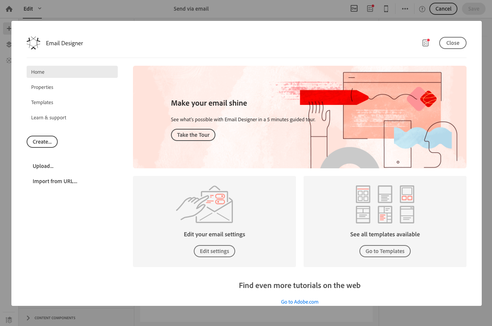

The **[!UICONTROL Properties]** tab enables you to edit the email details such as the label, the sender's address and name, or the email subject. You can also access this tab by clicking the email label on top of the screen.

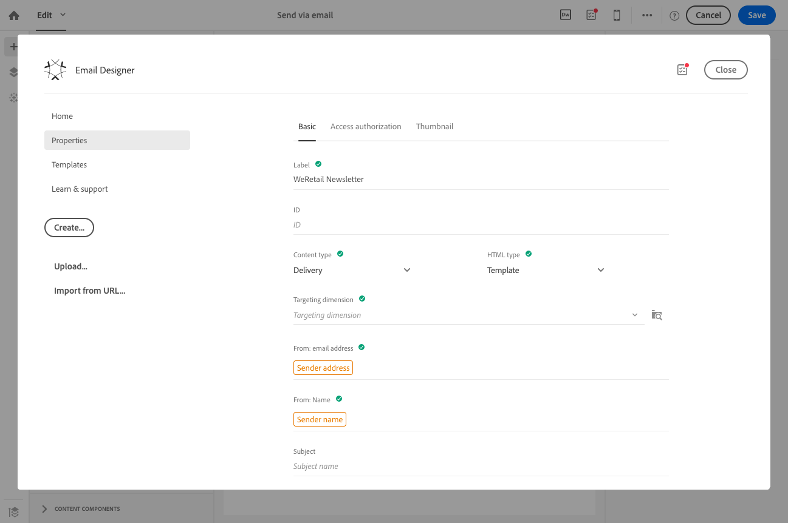

The **[!UICONTROL Templates]** tab enables you to choose from the out-of-the-box HTML contents or the templates that you already created to quickly start designing your email. See [Content templates](../../start/using/about-templates.md#content-templates).

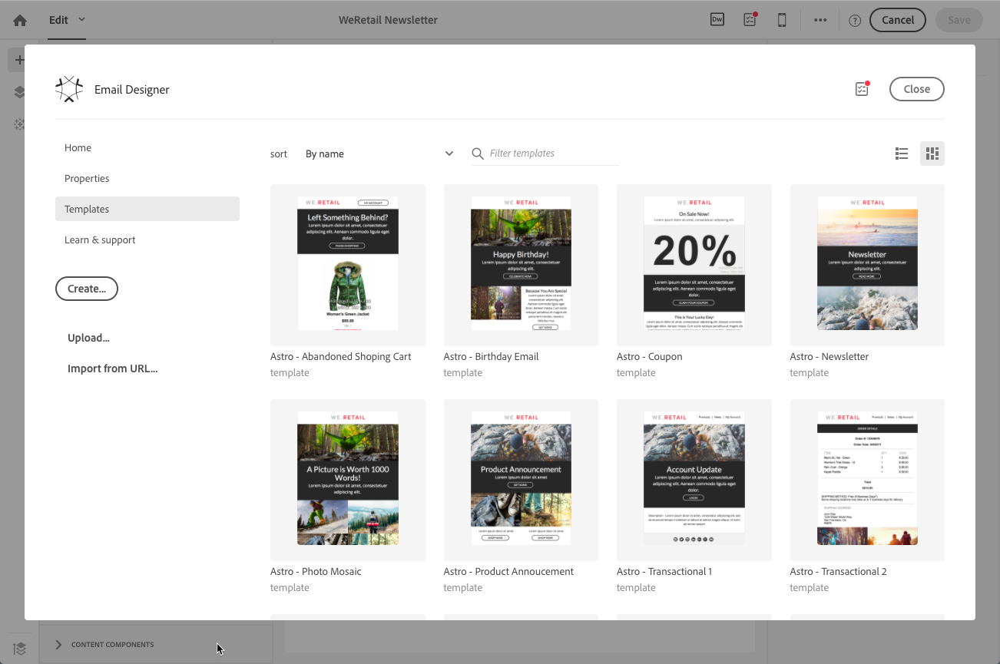

The **[!UICONTROL Learn & support]** tab gives you easy access to the related documentation and tutorials.

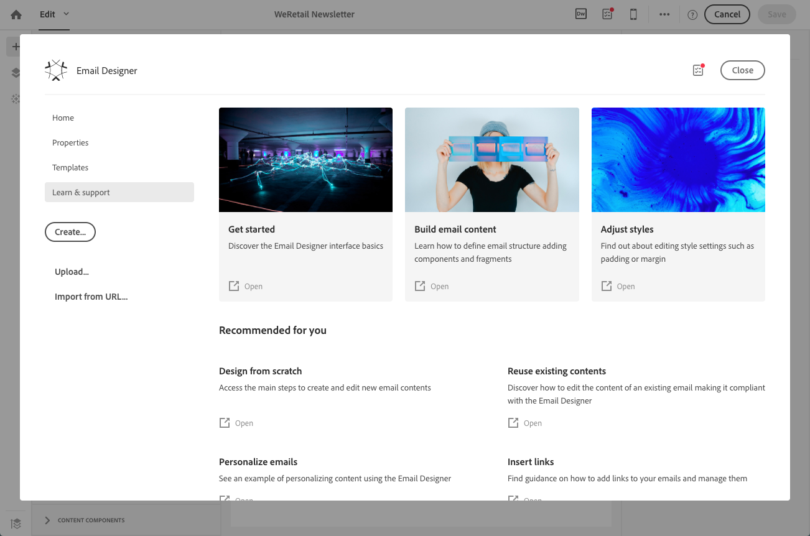

If you do not select a template, the Email Designer home page also enables you to choose how you want to start designing your content:

* Click the **[!UICONTROL Create]** button to start a new content from scratch. See [Designing an email content from scratch](../../designing/using/about-email-content-design.md#designing-an-email-content-from-scratch).
* Click the **[!UICONTROL Upload]** button to upload a file from your computer. See [Importing content from a file](../../designing/using/importing-content-from-a-file.md).
* Click the **[!UICONTROL Import from URL]** button to retrieve existing content form a URL. See [Importing content from a URL](../../designing/using/importing-content-from-a-url.md).

### Email Designer interface {#email-designer-interface}

The Email Designer provides many options that allow you to create, edit and customize every aspect of your content.

The interface is composed of several areas offering different functionalities:

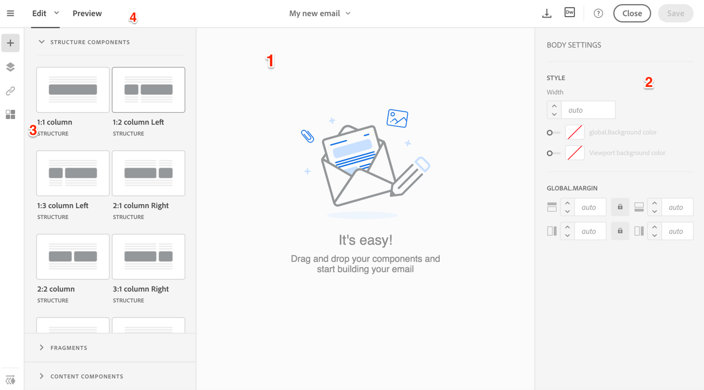

From the elements available in the **Palette** (1), drag and drop structure components and content fragments into the main **Workspace** (2). Select a component or element in the **Workspace** (2) and customize its main styling and display characteristics from the **Settings** pane (3).

Access more general options and settings from the main **Toolbar** (4).

>[!NOTE]
>
>The **Settings** pane can move to the left according to your screen resolution and display.

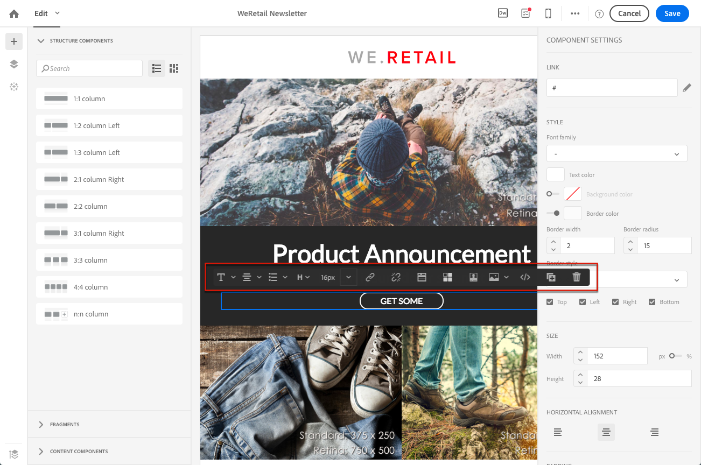

The **Contextual toolbar** of the editor interface offers various functionalities depending on the zone selected. It contains action buttons and buttons that allow you to change the style of the text. The modifications carried out always apply to the zone selected.

### General recommendations for using the Email Designer {#general-recommendations-for-using-the-email-designer}

To make proper use of the Email Designer and create the best emails as simply as possible, we recommend applying the following principles:

* Use inline styling rather than a separate CSS and CSS in the &lt;head&gt; section of the HTML. By using inline styling, you can optimize content fragment save and reuse.

  See [Adding inline styling attributes](../../designing/using/editing-email-styles.md#adding-inline-styling-attributes).

* Settle your branding easily by creating and reusing content fragments to keep consistency across your marketing campaigns.

  See [Creating a content fragment](../../designing/using/defining-the-email-structure.md#creating-a-content-fragment).

Also check the [general best practices for content design](../../designing/using/content-design-best-practices.md).

### Email Designer compatibility mode {#email-designer-compatibility-mode}

When you upload a content, it must contain specific tagging to be fully compliant and editable with the WYSIWYG editor of the Email Designer.

If all or part of the uploaded HTML is not compliant with the expected tagging, the content is then loaded in 'compatibility mode', which limits the edition possibilities through the UI.

When a content is loaded in compatibility mode, you can still perform the following modifications through the interface (unavailable actions are hidden):

* Changing the text or changing an image
* Inserting links and personalization fields
* Edit some styling options on the selected HTML block
* Defining conditional content


Other modifications such as adding new sections to your email or advanced styling must be done directly in the source code of the email via the HTML mode.

For more on converting an existing email into an Email Designer-compatible email, see [this section](../../designing/using/about-email-content-design.md#designing-an-email-using-existing-contents).

### Email Designer limitations {#email-designer-limitations}

* You cannot use personalization fields in a fragment. For more on fragments, see [this section](../../designing/using/defining-the-email-structure.md#about-fragments).
* You cannot save directly as a fragment some content of an email that you are editing within the Email Designer. You need to copy-paste the HTML corresponding to that content into a new fragment. For more on this, see [Saving content as a fragment](../../designing/using/defining-the-email-structure.md#saving-content-as-a-fragment).
* When editing styles, only the web fonts officially supported by most email clients are available.
* Styles cannot be saved as a theme for future reuse. However, the CSS style can be saved in a content template or in an email. For more on styles, see [this section](../../designing/using/editing-email-styles.md).

### Email Designer updates {#email-designer-updates}

The Email Designer is under continuous improvement. If you created an email content from scratch, from an out-of-the-box template or if you created fragments, you may get the following update message the next time you open your content:


Adobe recommends updating your content to the latest version to avoid problems such as CSS collision issues. Click **[!UICONTROL Update now]**.

If an error occurs during the content update, check your HTML and fix it before running this update again.

When it comes to fragments, please note the following:

* If you want to add a fragment to a new email or template and if you get this message, you need to update this fragment first.

* If you have multiple fragments, you have to update each fragment that you want to use in an email content.

* To avoid impact on the current email messages that are not prepared yet, you can choose not to update some fragments.

* You can still send emails where a fragment that is not updated is already used, but that fragment is not editable.

* Updating fragments used in emails that are already prepared has no impact on those emails.

## Designing an email content from scratch {#designing-an-email-content-from-scratch}

Here are the main steps to create and design an email content from scratch using the Email Designer:

1. Create an email and open its content.
1. Add structure components to shape the email. See [Editing the email structure](../../designing/using/defining-the-email-structure.md#editing-the-email-structure).
1. Insert content components and fragments in the structure components. See [Adding fragments and content components](../../designing/using/defining-the-email-structure.md#adding-fragments-and-content-components).
1. Add images and edit the text of the email. See [Inserting images](../../designing/using/inserting-images.md).
1. Personalize your email by adding personalization fields, links, and so on. See [Inserting a personalization field](../../designing/using/inserting-a-personalization-field.md), [Inserting a link](../../designing/using/inserting-a-link.md) and [Defining dynamic content in an email](../../designing/using/defining-dynamic-content-in-an-email.md).
1. Define the subject line of your email. See [Personalizing the subject line of an email](../../designing/using/personalizing-the-subject-line-of-an-email.md).
1. Preview your email.
1. Save your content, and proceed with your message after making sure that you have defined an audience and properly scheduled the sending.

You can also check out this [introduction video](https://video.tv.adobe.com/v/22771/?autoplay=true&hidetitle=true).

>[!NOTE]
>
>To avoid designing email content from scratch, you can use out-of-the-box content templates. For more on this, see [Content templates](../../start/using/about-templates.md#content-templates).

**Related topics**:

* [Creating an email](../../channels/using/creating-an-email.md)
* [Selecting an existing content](../../designing/using/selecting-an-existing-content.md)
* [Selecting an audience in a message](../../audiences/using/selecting-an-audience-in-a-message.md)
* [Scheduling messages](../../sending/using/about-scheduling-messages.md)
* [Previewing messages](../../sending/using/previewing-messages.md)
* [Email rendering](../../sending/using/email-rendering.md)

## Designing an email using existing contents {#designing-an-email-using-existing-contents}

This section explains how to convert an existing email into an Email Designer-compatible email.

By default, if you just upload any HTML (see [Importing content from a file](../../designing/using/importing-content-from-a-file.md)), the content is loaded in '[compatibility mode](../../designing/using/about-email-content-design.md#email-designer-compatibility-mode)', which limits the edition possibilities through the UI (only in-place edition, no drag-and-drop).

However, if you want to build a framework of modular templates and fragments that can be combined to reuse in multiple emails, you should consider converting your email HTML into an Email Designer template.

When designing content with the Email Designer, you have three options:

* [Building content from an out-of-the-box template](../../designing/using/about-email-content-design.md#building-content-from-an-out-of-the-box-template)
* [Using fragments and components](../../designing/using/about-email-content-design.md#using-fragments-and-components), start from scratch and recreate an HTML design
* [Converting an HTML content](../../designing/using/about-email-content-design.md#converting-an-html-content) email into a modular Email Designer content

### Building content from an out-of-the-box template {#building-content-from-an-out-of-the-box-template}

1. Create an email and open its content. For more on this, see [Creating an email](../../channels/using/creating-an-email.md).
1. Click the home icon to access the **[!UICONTROL Email Designer]** home page.
1. Click the **[!UICONTROL Templates]** tab.
1. Choose an out-of-the-box HTML template.

   The different templates present various combinations of several types of elements. For example, 'Feather' templates have margins while 'Astro' templates do not have ones. For more on this, see [Content templates](../../start/using/about-templates.md#content-templates).

1. You can combine these elements to build a number of email variants. For example, you can duplicate an email section by selecting a structure component and clicking **[!UICONTROL Duplicate]** from the contextual toolbar.
1. You can move the elements around using the blue arrow on the left to drag a structure component below or above another. For more on this, see [Editing the email structure](../../designing/using/defining-the-email-structure.md#editing-the-email-structure).
1. You can also move components around to change the organization of each structure element. For more on this, see [Adding fragments and components](../../designing/using/defining-the-email-structure.md#adding-fragments-and-content-components).
1. Modify the content of each element according to your needs: images, text, links.
1. Adapt the styling options to your content if needed. For more on this, see [Editing email styles](../../designing/using/editing-email-styles.md).

### Using fragments and components {#using-fragments-and-components}

To simply make an external content compliant with the Email Designer, Adobe recommends creating a message from scratch and copy the content from your existing email into fragments and components.

When you have a content that cannot be recreated, you can copy-paste the HTML code from the original email using the **[!UICONTROL Html]** content component. Make sure you are familiar with HTML before proceeding.

A full example is presented below.

>[!NOTE]
>
>The new content will not be the exact copy of your original email, but the steps below will guide you through the creation of a message that will be as close as possible.

Let's say that you want to use an existing newsletter that was created outside of Adobe Campaign.

You want to have the same header and footer in all the emails that you will send with Adobe Campaign. The body of the email will change according to the content that you intend to display in each newsletter.

**Prerequisites**

1. In your original email, identify the reusable sections from the sections that will be unique to each email that you will send.
1. Save all the images and assets that you want to use.
1. If you are familiar with HTML, split your original HTML content into different parts.

**Creating fragments for your reusable content**

Using the Email Designer, create a fragment for each reusable section. In this example, you will create two fragments: one for the header and one for the footer. You can then copy the relevant parts from your existing content into these fragments.

To do this, follow the steps below:

1. In Adobe Campaign, go to **[!UICONTROL Resources]** > **[!UICONTROL Content templates & fragments]** and create a fragment for your header. For more on this, see [Creating a content fragment](../../designing/using/defining-the-email-structure.md#creating-a-content-fragment).
1. Add as many structure components as you need to your fragment.

   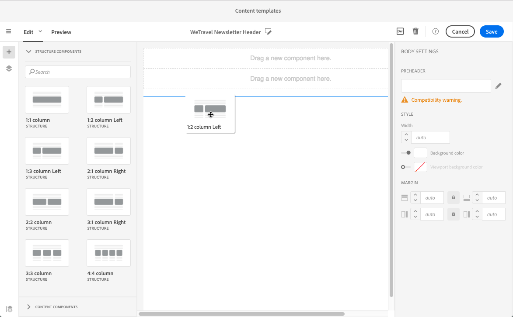

1. Insert image and text components into your structure.

   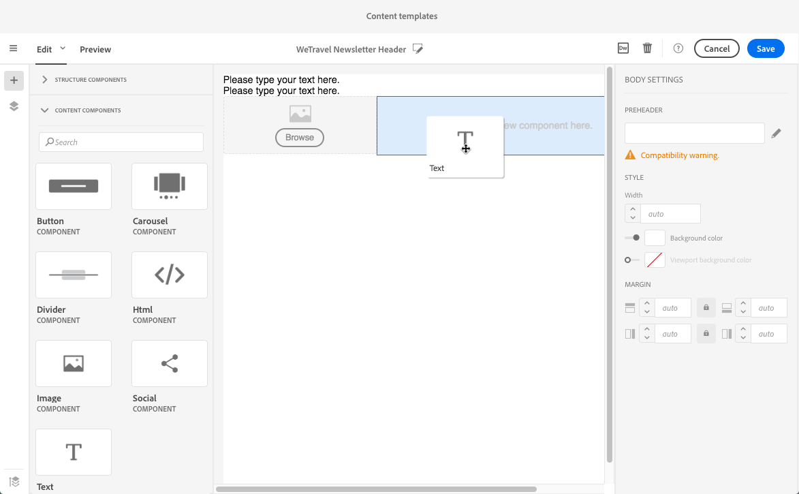

1. Upload the corresponding image, enter your text and adjust the settings.

   For more on managing style settings and inline attributes, see [Editing email styles](../../designing/using/editing-email-styles.md).

   

1. Save your fragment.
1. Proceed similarly to create your footer and save it.

   

   If you are familiar with HTML, you can copy-paste the HTML code from the original footer using the **[!UICONTROL Html]** content component. For more on this, see [About content components](../../designing/using/defining-the-email-structure.md#about-content-components).

   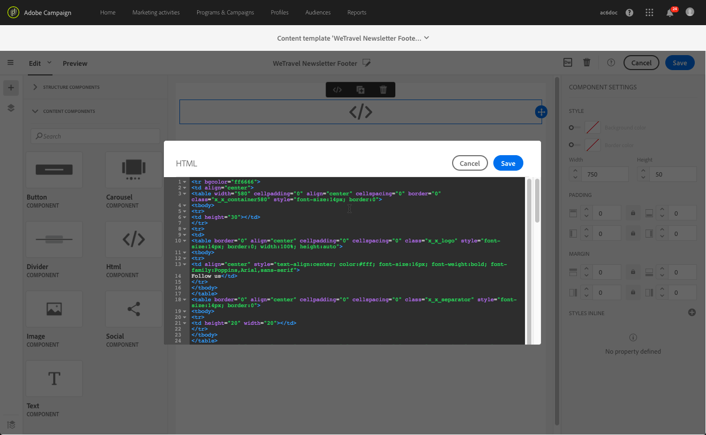

Your fragments are now ready to be used in a template.

**Inserting fragments and components into your template**

You can now create an email template with the Email Designer. Use content components to reflect the different sections of your email and adjust the settings to make them as close as possible to your original newsletter. Finally, insert the fragments that you just created.

1. Using the Email Designer, create a template. For more on this, see [Content templates](../../start/using/about-templates.md#content-templates).
1. Insert several structure components into your template - corresponding to the header, footer and body of your email. For more on adding structure components, see [Editing the email structure with the Email Designer](../../designing/using/defining-the-email-structure.md#editing-the-email-structure).
1. Insert as many content components as needed to create the body of your newsletter. This will be the editable content of your email that you will update every month.

   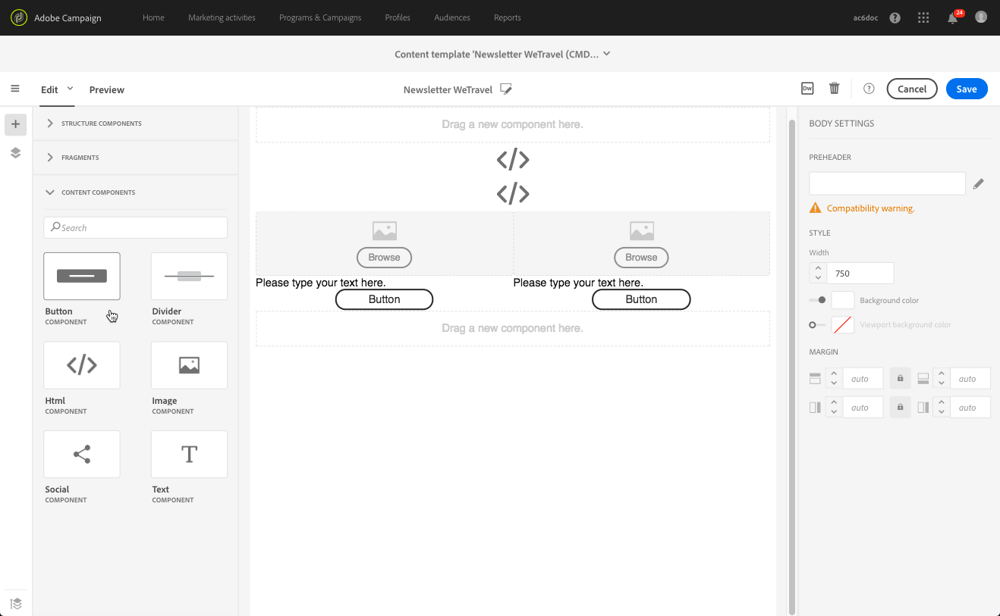

   If you are familiar with HTML code, Adobe recommends leveraging **[!UICONTROL Html]** components where you can copy-paste the more complex elements of the original email. Use other components such as **[!UICONTROL Button]**, **[!UICONTROL Image]** or **[!UICONTROL Text]** for the rest of the content. For more on this, see [About content components](../../designing/using/defining-the-email-structure.md#about-content-components).

   >[!NOTE]
   >
   >Using the **[!UICONTROL Html]** component results in creating components that are editable with limited options. Make sure you know how to handle HTML code before selecting this component.

1. Adjust the content components to match your original email as much as you can.

   

   For more on managing style settings and inline attributes, see [Editing email styles](../../designing/using/editing-email-styles.md).

1. Insert the two fragments (header and footer) that you previously created into the desired structure components.

   

1. Save your template.

You can now fully manage this template within the Email Designer to create and update the newsletter that you will send every month to your recipients.

To use it, create an email and select the content template that you just created.

**Related topic**:

* [Creating an email](../../channels/using/creating-an-email.md)
* [Introduction video to the Email Designer](https://video.tv.adobe.com/v/22771/?autoplay=true&hidetitle=true)
* [Designing an email content from scratch](../../designing/using/about-email-content-design.md#designing-an-email-content-from-scratch)

### Converting an HTML content {#converting-an-html-content}

This use case offers a quick way to convert an HTML email into Email Designer components.

>[!CAUTION]
>
>This section is for advanced users who are familiar with HTML code.

>[!NOTE]
>
>Like the compatibility mode, a HTML component is editable with limited options: you can only perform in-place edition.

Outside of the Email Designer, make sure the original HTML is divided into reusable sections.

If this is not the case, cut out the different blocks from your HTML. For example:

```
<!-- 3 COLUMN w/CTA (SCALED) -->
<table width="100%" align="center" cellspacing="0" cellpadding="0" border="0" role="presentation" style="max-width:680px;">
<tbody>
<tr>
<td class="padh10" align="center" valign="top" style="padding:0 5px 20px 5px;">
<table width="100%" cellspacing="0" cellpadding="0" border="0" role="presentation">
<tbody>
<tr>
...
</tr>
</tbody>
</table>
</td>
</tr>
</tbody>
</table>
<!-- //3 COLUMN w/CTA (SCALED) -->
```

Once you have identified all your blocks, in the Email Designer, repeat the following procedure for each section of your existing email:

1. Open the Email Designer to create an empty email content.
1. Set the body level attributes: background colors, width, etc. For more on this, see [Editing email styles](../../designing/using/editing-email-styles.md).
1. Add a structure component. For more on this, see [Editing the email structure](../../designing/using/defining-the-email-structure.md#editing-the-email-structure).
1. Add an HTML component. For more on this, see [Adding fragments and components](../../designing/using/defining-the-email-structure.md#adding-fragments-and-content-components).
1. Copy-paste your HTML into that component.
1. Switch to mobile view. For more on this, see [this section](../../designing/using/about-email-content-design.md#switching-to-mobile-view).

   The responsive view is broken, because your CSS is missing.

1. To fix this, switch to source code mode and copy-paste your style section into a new style section. For example:

   ```
   <style type="text/css">
   a {text-decoration:none;}
   body {min-width:100% !important; margin:0 auto !important; padding:0 !important;}
   img {line-height:100%; text-decoration:none; -ms-interpolation-mode:bicubic;}
   ...
   </style>
   ```

   >[!NOTE]
   >
   >Do not modify the CSS generated by the Email Designer: `<style acrite-template-css="true">` and `<style acrite-custom-styles="" type="text/css">`. Make sure you add your style after this.

1. Go back to the mobile view to check that your content is correctly displayed and save your changes.

## Switching to mobile view {#switching-to-mobile-view}

You can fine-tune the responsive design of an email by separately editing all style options for mobile display. For example, you can adapt margins and padding, use smaller or bigger font sizes, change buttons, or apply different background colors that will be specific to the mobile version of your email.

All style options are available in mobile view. The Email Designer style settings are presented in the [Editing email styles](../../designing/using/editing-email-styles.md) section.

1. Create an email and start editing the content. For more on this, see [Designing an email content from scratch](../../designing/using/about-email-content-design.md#designing-an-email-content-from-scratch).
1. To access the dedicated mobile view, select the **[!UICONTROL Switch to mobile view]** button.

   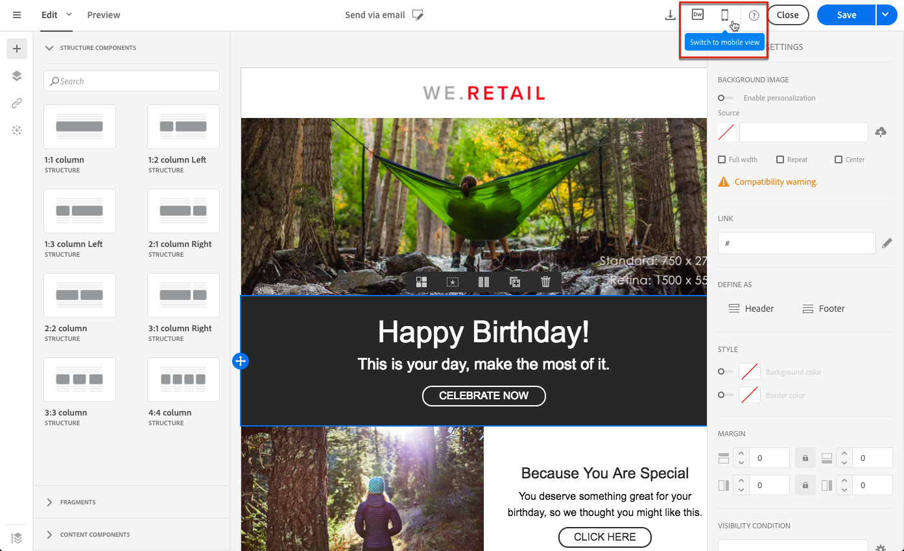

   The mobile version of the email is displayed. It contains all the components and styles that were defined in desktop view.

1. Edit independently all style settings such as background color, alignment, padding, margin, font family, text color, and so on.

   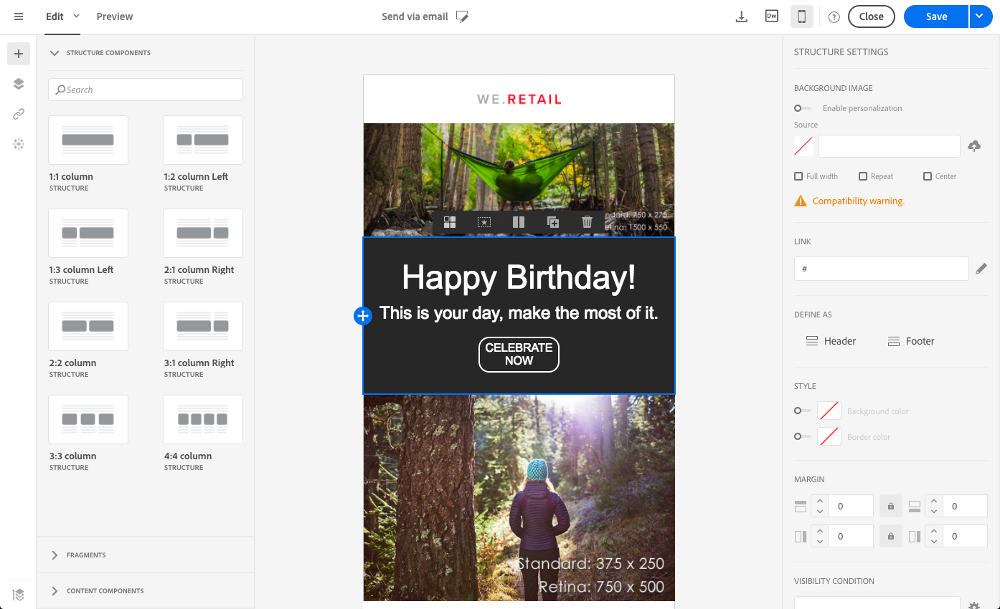

1. When editing any style setting in mobile view, the modifications are only applied to the mobile display.

   For example, reduce the size of an image, add a green background and change the padding in mobile view.

   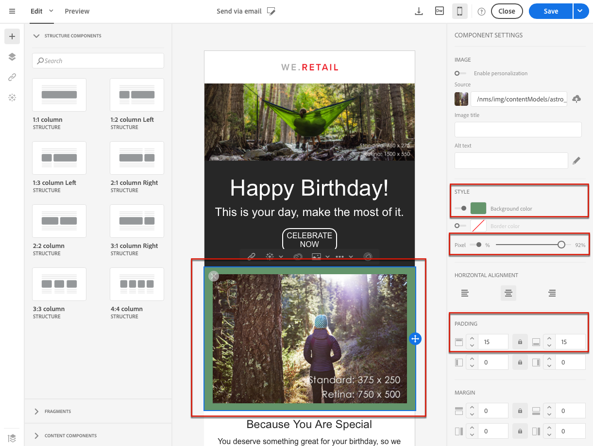

1. You can hide a component when displayed on a mobile device. To do this, select **[!UICONTROL Show only on desktop devices]** from the **[!UICONTROL Display options]**.
You can also choose to hide this component on desktop devices, which means that it will be displayed on mobile devices only. To do this, select **[!UICONTROL Show only on mobile devices]**.
For example, this option enables you to display a specific image on mobile devices and another image on desktop devices.
You can either set this option from the mobile or desktop view.

   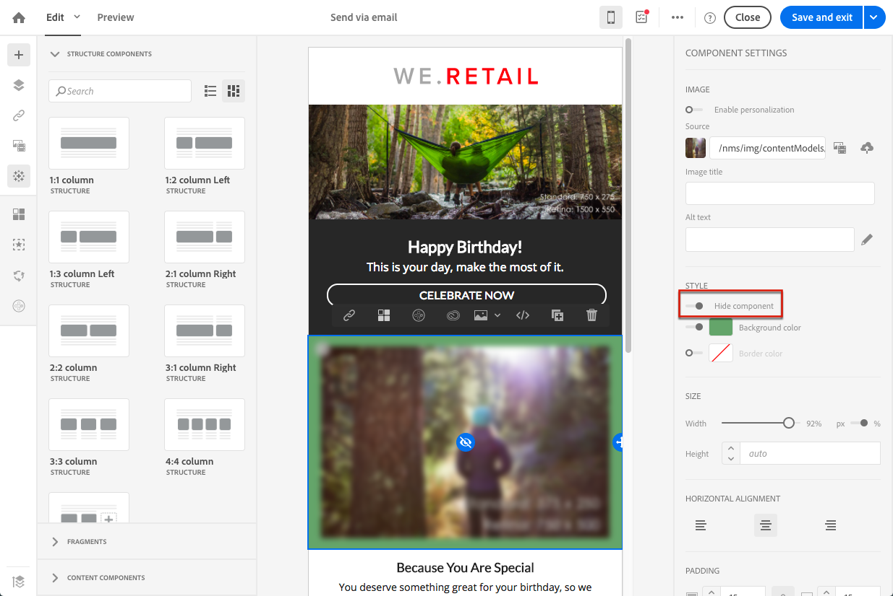

1. Click again the **[!UICONTROL Switch to mobile view]** button to go back to the standard desktop view. The style changes you just made are not reflected.

   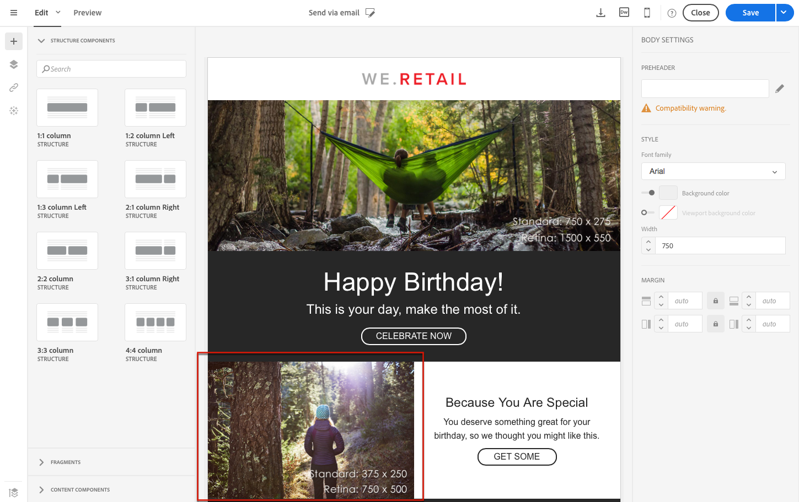

   >[!NOTE]
   >
   >The only exception is the **[!UICONTROL Style inline]** settings. Any style inline setting change is also applied to the standard desktop view.

1. Any other change to the structure or the content of the email such as text edits, uploading a new image, adding a new component, etc. is also applied to the standard view.

   For example, switch back to mobile view, edit some text and replace an image.

   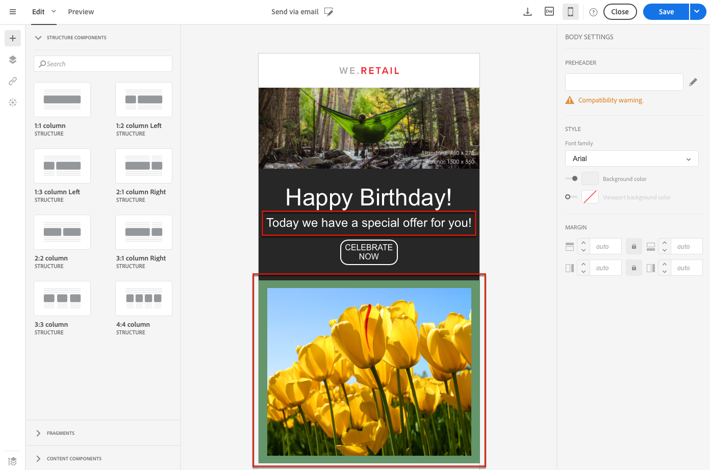

   Click again the **[!UICONTROL Switch to mobile view]** button to go back to the standard desktop view. The changes are reflected.

   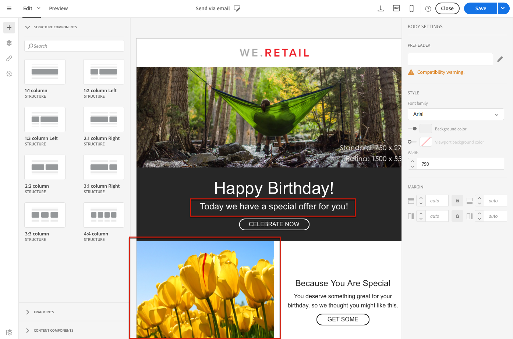

1. Removing a style in mobile view takes you back to the style that was applied in desktop mode.

   For example, in mobile view, apply a green background color to a button.

   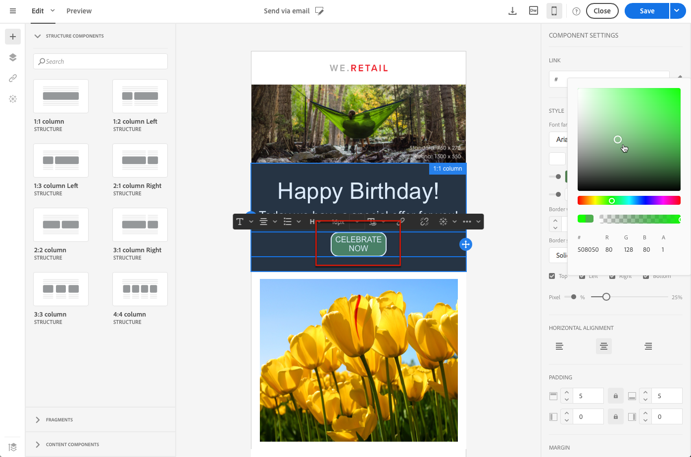

1. Switch to desktop view and apply a grey background to the same button.

   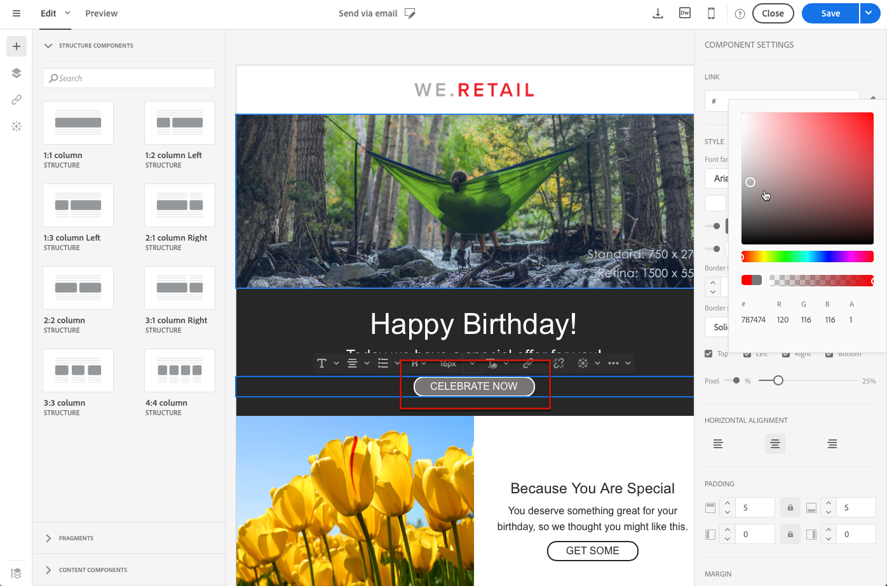

1. Switch again to mobile view, and now disable the **[!UICONTROL Background color]** setting.

   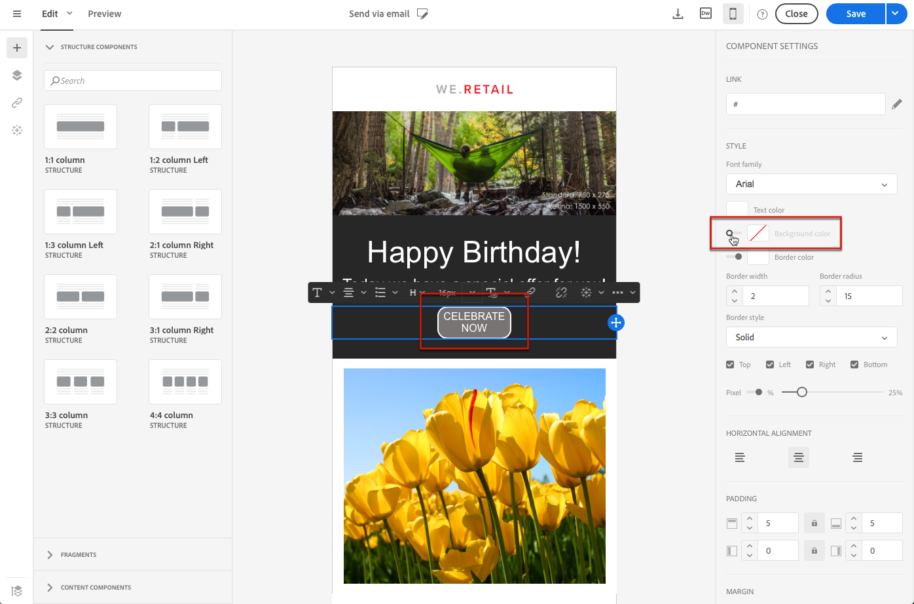

   The background color defined in desktop view is now applied: it turns grey (not blank).

   The only exception is the **[!UICONTROL Border color]** setting. When disabled in mobile view, no border is applied anymore, even if a border color is defined in desktop view.

## Plain text and HTML modes {#plain-text-and-html-modes}

### Generating a text version of the email {#generating-a-text-version-of-the-email}

By default, the **[!UICONTROL Plain text]** version of your email is automatically generated and synchronized with the **[!UICONTROL Edit]** version.

Personalization fields and content blocks added to the HTML version are also synchronized with the plain text version.

>[!NOTE]
>
>To use content blocks in plain text version, make sure they do not contain HTML code.

To have a plain text version different from the HTML version, you can disable this synchronization by clicking the **[!UICONTROL Sync with HTML]** switch from the **[!UICONTROL Plain text]** view of your email.

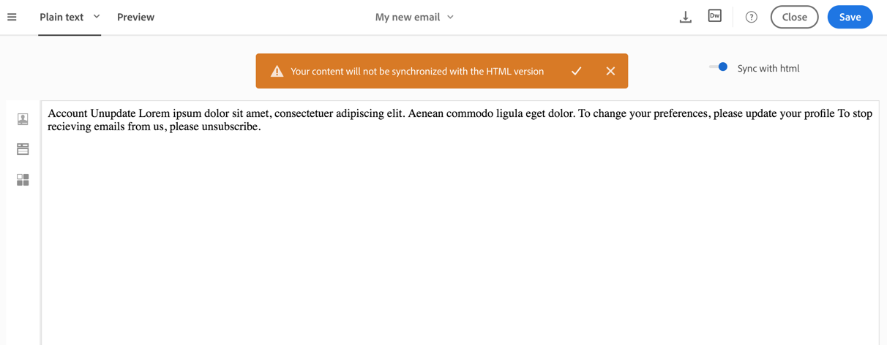

You can then edit the plain text version as desired.

>[!NOTE]
>
>If you edit the **[!UICONTROL Plain text]** version while synchronization is disabled, the next time you enable the **[!UICONTROL Sync with HTML]** option, all the changes you made in the plain text version will be replaced with the HTML version. The changes made in **[!UICONTROL Plain text]** view cannot be reflected in **[!UICONTROL HTML]** view.

### Editing an email content source in HTML {#editing-an-email-content-source-in-html}

For the most advanced users and debugging, you can view and edit the email content directly in HTML.

You have two ways to edit the HTML version of the email:

* Select **[!UICONTROL Edit]** > **[!UICONTROL HTML]** to open the HTML version of the entire email.

  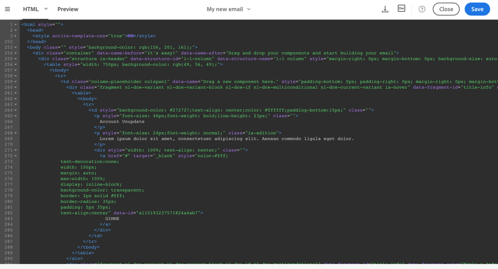

* From the WYSIWYG interface, select an element and click the **[!UICONTROL Source code]** icon.

  Only the source of the selected element is displayed. You can edit the source code if the selected element is a **[!UICONTROL HTML]** content component. Other components are in read-only mode, but can still be edited in the full HTML version of the email.

  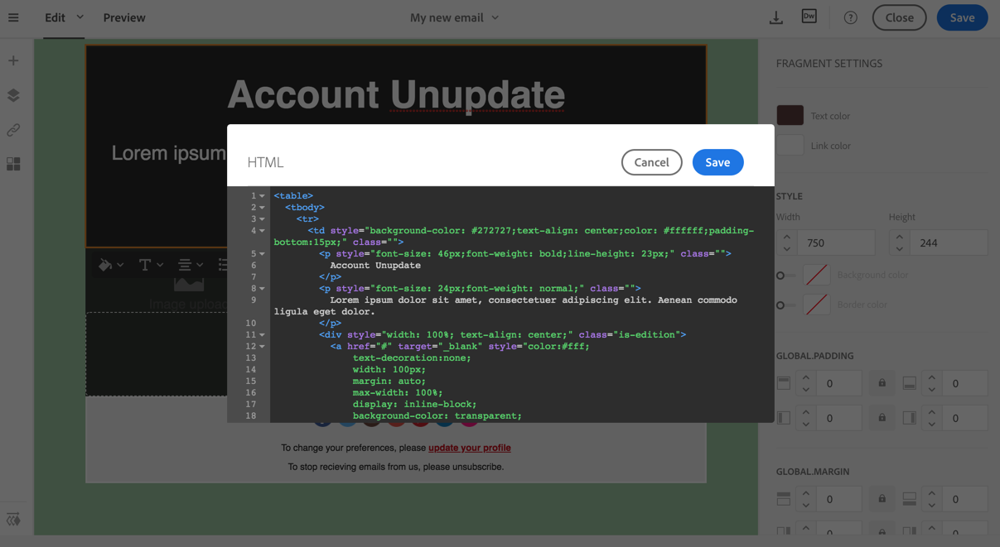

If you modify the HTML the code, the responsiveness of the email could be broken. Make sure to test it using the **[!UICONTROL Preview]** button. See [Previewing messages](../../sending/using/previewing-messages.md).

## Design through Adobe Campaign integrations {#design-through-adobe-campaign-integrations}

### Editing content in Dreamweaver {#editing-content-in-dreamweaver}

The Adobe Campaign Standard integration with Dreamweaver lets you edit an email's content in the Dreamweaver interface. You have access to the powerful interface of Dreamweaver to design and develop responsive email content.

* **Bidirectional syncing**

  Whenever an edit is made in one product, it is updated in real time in the other. If you want to change the color of text in Dreamweaver, as soon as you make that edit, the color of the text is live in Campaign. Additionally, when you select code in either Dreamweaver or Campaign, since the line numbers are the same, the selection remains between the two products, which is very useful when looking for something specific in the code.

* **Upload local images to AC through Dreamweaver**

  When creating or editing an email within Dreamweaver, you can simply select an image from your desktop or local machine. While Dreamweaver has always allowed you to do this, when Dreamweaver and Campaign are connected, the local file is immediately uploaded to the Adobe Campaign server: no need to manually upload images as content changes. Additionally, it ensures that the latest images are always live in Campaign.

* **Add Campaign personalization in Dreamweaver**

  For the email developer there is no longer a need to add text like ```[[FIRSTNAME_PLACEHOLDER]]``` nor to look up the syntax of your data model’s tables. The Campaign toolbar in Dreamweaver connects directly to your Campaign instance's data model. That means you can pull in any data you want for personalization from something like First Name to Address. If you’ve created Content Blocks within Campaign, you can also pull those directly into Dreamweaver.

This capability is detailed in the Dreamweaver Documentation accessible [here](https://helpx.adobe.com/dreamweaver/using/working-with-dreamweaver-and-campaign.html). A demonstration [video](https://helpx.adobe.com/campaign/kt/acs/using/acs-dreamweaver-integration-feature-video-use.html) is also available.

### Editing content in Experience Manager {#editing-content-in-experience-manager}

Email content can be edited in Experience Manager and then used for one or several email messages in Adobe Campaign Standard. Refer to [this document](../../integrating/using/integrating-with-experience-manager.md).

### Email design options comparison {#email-design-options-comparison}

Adobe Campaign offers several email authoring options. The table below shows the main possibilities, benefits and limitations for each of them.

<table> 
 <thead> 
  <tr> 
   <th> </th> 
   <th> Email Designer<br /> </th> 
   <th> Experience Manager<br /> </th> 
   <th> Dreamweaver<br /> </th> 
  </tr> 
 </thead> 
 <tbody> 
  <tr> 
   <td> <strong>Start blank email</strong><br /> </td> 
   <td> Supported<br /> </td> 
   <td> Supported<br /> </td> 
   <td> Supported<br /> </td> 
  </tr> 
  <tr> 
   <td> <strong>Write HTML</strong><br /> </td> 
   <td> Supported<br /> </td> 
   <td> Not supported<br /> </td> 
   <td> Supported<br /> </td> 
  </tr> 
  <tr> 
   <td> <strong>Update HTML</strong><br /> </td> 
   <td> Only inside an HTML component<br /> </td> 
   <td> Not supported<br /> </td> 
   <td> Supported<br /> </td> 
  </tr> 
  <tr> 
   <td> <strong>Basic personalization</strong><br /> </td> 
   <td> Supported<br /> </td> 
   <td> Supported<br /> </td> 
   <td> Supported<br /> </td> 
  </tr> 
  <tr> 
   <td> <strong>Advanced personalization</strong><br /> </td> 
   <td> Supported<br /> </td> 
   <td> Not supported<br /> </td> 
   <td> Not supported<br /> </td> 
  </tr> 
  <tr> 
   <td> <strong>Proof/Preview</strong><br /> </td> 
   <td> Supported<br /> </td> 
   <td> Preview in AEM<br /> Proof in Campaign<br /> </td> 
   <td> Preview and proof in Campaign<br /> </td> 
  </tr> 
  <tr> 
   <td> <strong>Product listings</strong><br /> </td> 
   <td> Supported in email transactional messages<br /> </td> 
   <td> Not supported<br /> </td> 
   <td> Not supported<br /> </td> 
  </tr> 
  <tr> 
   <td> <strong>Benefits</strong><br /> </td> 
   <td> 
     - Easy email building through drag-and-drop experience<br/>
     - Functionalities similar to legacy content editor<br/>
     - Reusable content with fragments
  </td> 
   <td> 
     - Reusing assets from website in emails<br/>
     - Leveraging the power of Experience Manager in email contents
    </td> 
   <td> 
    - Capability for a developer to directly code an email<br/>
    - Bi-directional synchronization<br/>
    - Editing offline in Dreamweaver and synchronizing later<br/>
    - Uploading images to Adobe Campaign through Dreamweaver
  </td> 
  </tr> 
  <tr> 
   <td> <strong>Limitations</strong><br /> </td> 
   <td> 
     - No conditional content within fragments<br/>
     - Using Experience Manager fragments not possible
  </td> 
   <td> 
     - Advanced personalization difficult to implement<br/>
     - Need to send tests in Adobe Campaign
  </td> 
   <td> Dynamic content not supported<br /> </td> 
  </tr> 
  <tr> 
   <td> <strong>Audience</strong><br /> </td> 
   <td> Marketers who want to keep the flexibility to use HTML components in combination with drag-and-drop features<br /> </td> 
   <td> Marketers already using Experience Manager who want to use standard email templates with little personalization<br /> </td> 
   <td> Developers who want to code email contents and integrate directly with Adobe Campaign<br /> </td> 
  </tr> 
  <tr> 
   <td> <strong>To learn more</strong><br /> </td> 
   <td> See <a href="../../designing/using/about-email-content-design.md#about-the-email-designer">About the Email Designer</a><br /> </td> 
   <td> See <a href="../../integrating/using/integrating-with-experience-manager.md">Integrating with Experience Manager</a><br /> </td> 
   <td> See <a href="https://helpx.adobe.com/dreamweaver/using/working-with-dreamweaver-and-campaign.html">Dreamweaver and Campaign</a> and watch this <a href="https://helpx.adobe.com/campaign/kt/acs/using/acs-dreamweaver-integration-feature-video-use.html">video</a><br /> </td> 
  </tr> 
 </tbody> 
</table>

