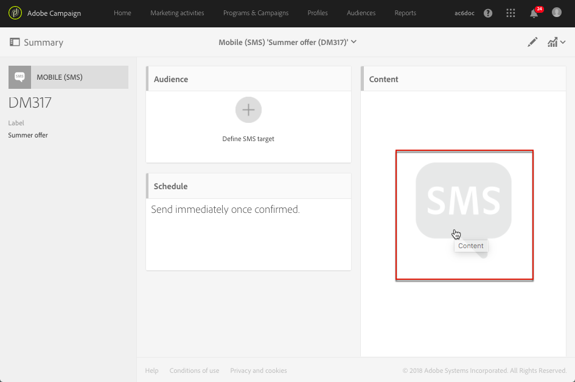

# About SMS and push content design

About SMS and push content design

Use the content editor to define, modify and personalize the content of your SMS messages and push notifications in Adobe Campaign.

This section describes the specificities of the SMS and push content editor, including the [SMS and push content editor interface](../../designing/using/sms-and-push-content-editor-interface.md).

The actions that are common to one or more marketing activities are presented in the following sections:

* For more on personalizing an SMS or push notification content, see [Inserting a personalization field](../../designing/using/inserting-a-personalization-field.md) and [Adding a content block](../../designing/using/adding-a-content-block.md).
* For more on defining conditional text in an SMS message or push notification, see [Defining dynamic text](../../designing/using/defining-dynamic-text.md).

To access the SMS and push content editor:

* Click the **Content** block in an SMS dashboard.

  

* Click the pencil next to the **Message body** field in a push notification dashboard.

  

**Related topics:**

* [Creating an SMS message](../../channels/using/creating-an-sms-message.md)
* [Creating and sending a push notification](../../channels/using/creating-and-sending-a-push-notification.md)

