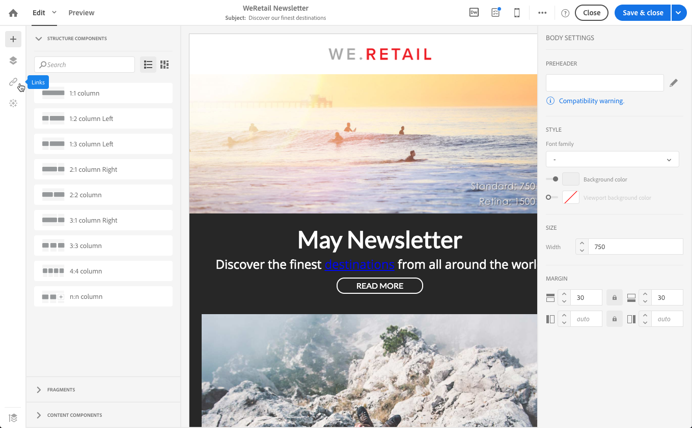

# About tracked URLs{#about-tracked-urls}

About tracked URLs

In the email content, a menu summarizes all the URLs of your content that will be tracked.

>[!NOTE]
>
>The images below show how to manage tracked URLs using the [Creative Designer](../../designing/using/about-email-content-design.md#using-the-creative-designer).

The **Links** or **Tracked URLs** icon in the action bar automatically displays the list of all the URLs included in an email content.

Tracking is activated by default.

>[!NOTE]
>
>This functionality is only available for emails and if tracking has been activated in Adobe Campaign. For more on the tracking parameters, refer to [this section](../../administration/using/configuring-email-channel.md#list-of-email-tracking-parameters).

The URL, category, label, and tracking type of each link can be modified directly from this list.

For each tracked URL, you can activate or deactivate tracking.

>[!NOTE]
>
>The URLs are detected by Adobe Campaign if they start with: "&lt;%@" "&lt;!--" "[protocol]://"

You can regroup your URLs by editing the **Category** field, depending on the URLs used in the delivery.
