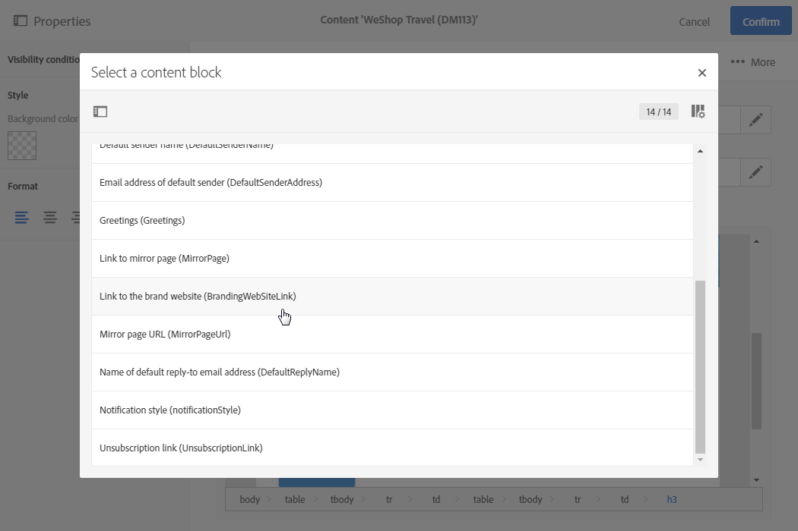
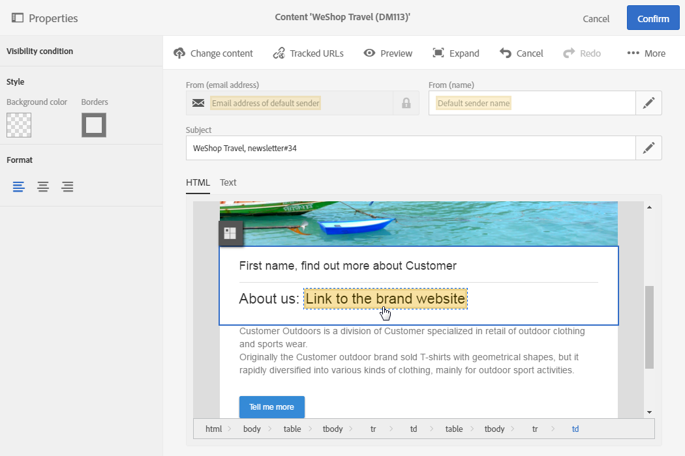

# Adding a content block{#adding-a-content-block}

Adding a content block

Adobe Campaign offers a list of pre-configured content blocks. These content blocks are dynamic, personalized and have a specific rendering. For example, you can add a greeting or a link to the mirror page.

>[!NOTE]
>
>The images below show how to insert a content block using the [content editor](../../designing/using/about-email-content-design.md#using-the-email-content-editor).

To add a content block, click inside a text block and click the **Insert content block** button in the toolbar (refer to [Email content editor toolbar](../../designing/using/about-email-content-design.md#email-content-editor-toolbar)).

Select the content block that you would like to insert. The blocks available vary depending on the context (email or landing page).

The name of the content block appears in the editor and it is highlighted in yellow. It will automatically adapt to the recipient profile when the personalization is generated.

The out-of-the-box content blocks are:

* Database URL in emails (EmailUrlBase): This content block can only be used in a **delivery**.
* Mirror page URL (MirrorPageUrl): This content block can only be used in a **delivery**.
* Link to mirror page (MirrorPage): This content block can only be used in a **delivery**.
* Greetings
* Unsubscription link (UnsubscriptionLink): This content block can only be used in a **delivery**.
* Social network sharing links (LandingPageViralLinks): This content block can only be used in a **landing page**.
* Default sender name (DefaultSenderName): This content block can only be used in a **delivery**.
* Name of default reply-to email address (DefaultReplyName): This content block can only be used in a **delivery**.
* Email address of default sender (DefaultSenderAddress): This content block can only be used in a **delivery**.
* Default error email address (DefaultErrorAddress): This content block can only be used in a **delivery**.
* Default reply-to email address (DefaultReplyAddress): This content block can only be used in a **delivery**.
* Brand name (BrandingUsualName)
* Link to the brand website (BrandingWebSiteLink)
* Brand logo (BrandingLogo)
* Notification style (notificationStyle)

## Creating custom content blocks {#creating-custom-content-blocks}

You can define new content blocks that will be inserted into a delivery or landing page.

To create a content block, follow these steps:

1. Click **Resources > Content blocks** from the advanced menu to access the list of content blocks.
1. Click the **Create** button or duplicate a pre-existing content block.

   

1. Enter the block label.
1. Select the block's **Content type**. There are three options available:

    * Shared: The content block can be used in a delivery or a landing page.
    * Delivery: The content block can only be used in a delivery.
    * Landing page: The content block can only be used in a landing page.

   

1. You can select the **Depends on format** option to define two different blocks for HTML emails and those that are in text format. Two tabs will then be displayed in the editor (HTML and Text) to define the corresponding contents.

   

1. Enter the content of the content block(s), and click the **Create** button.

   Your content block can now be used in the content editor of a delivery or a landing page.

