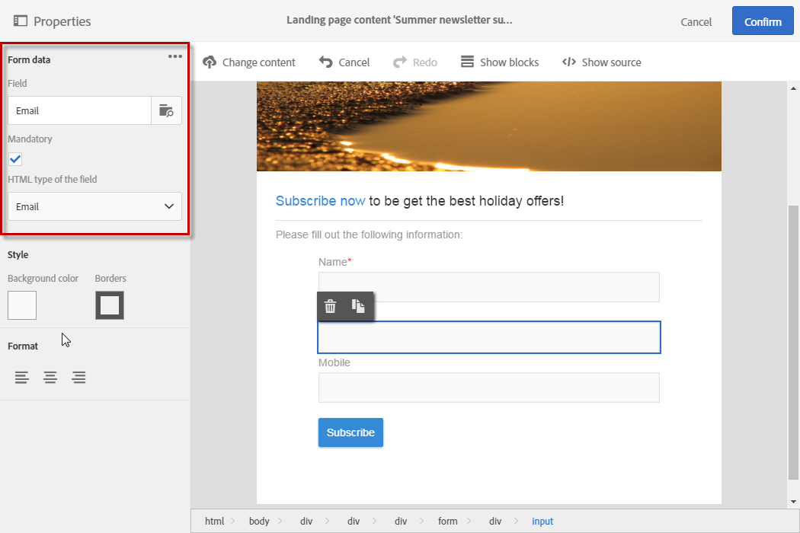

# Changing a landing page form data properties{#changing-a-landing-page-form-data-properties}

Changing a landing page form data properties

You can link database fields to input zone, radio button or checkbox type blocks. To do this, select the block and enter the **Form data** in the palette.

>[!NOTE]
>
>This option is only available for landing pages.

* The **Field** input zone lets you select a database field to link with the form field.
* The **Mandatory** option lets you only authorize the page's submission if the user has filled in the field. If a mandatory field is not filled in, an error message will appear.

