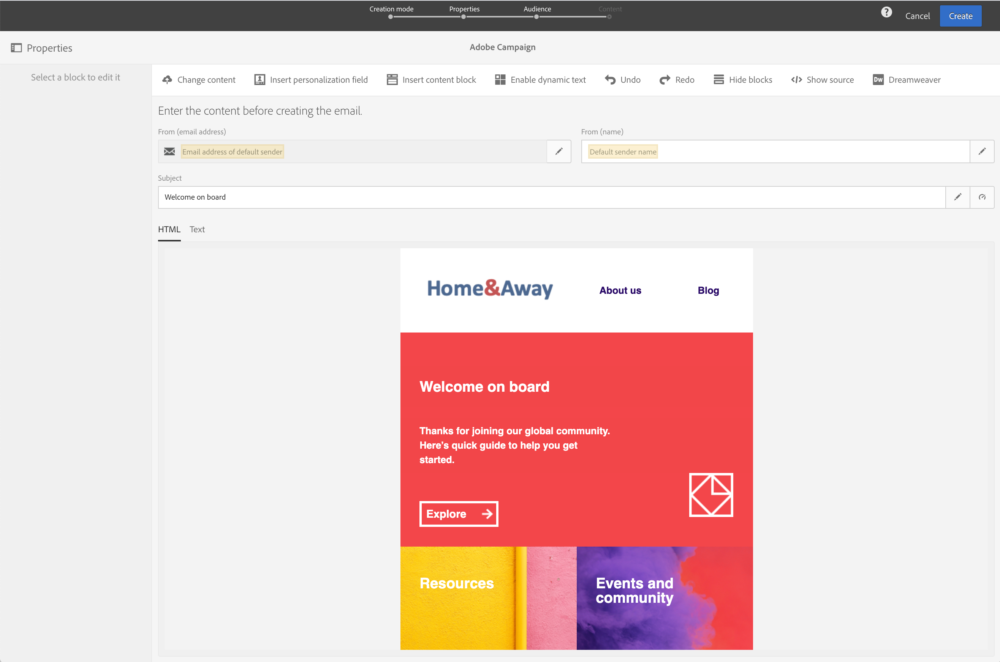
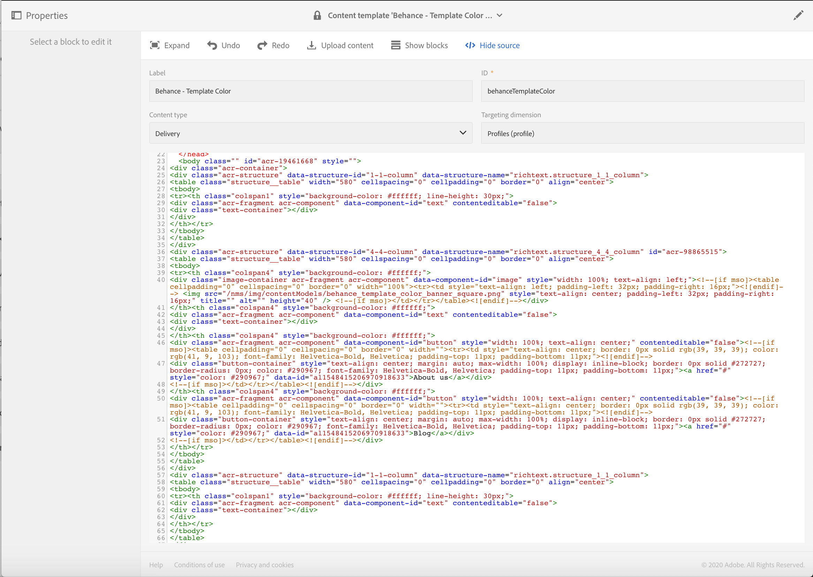
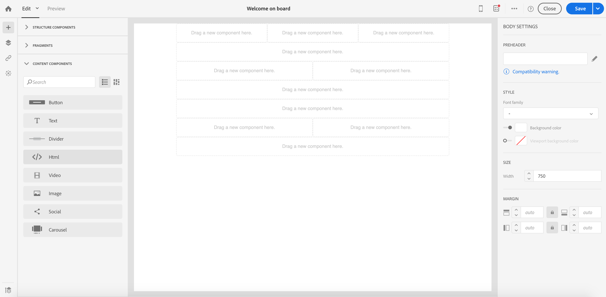
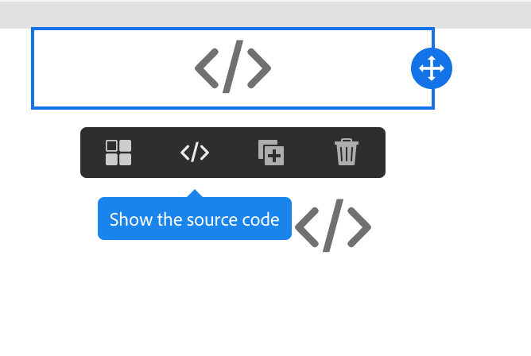

# Converting Legacy editor email content {#converting-an-html-content}

Start working with the Email Designer and build reusable templates and fragments from your email HTML created in the Legacy Editor.

This use case enables you to create an Email Designer template by using an HTML email and dividing it into HTML components in the Email Designer. 

>[!CAUTION]
>
>This section is for advanced users who are familiar with HTML code.

>[!NOTE]
>
>Like the compatibility mode, a HTML component is editable with limited options: you can only perform in-place edition.

## Preparing your email content

1. Select an HTML email. 
1. Identify sections to divide the HTML email.
1. Cut out the different blocks from your HTML. 


## Create your email structure 

1. Open the Email Designer to create an empty email content.
1. Set the body level attributes: background colors, width, etc. For more on this, see [Editing email styles](../../designing/using/styles.md).
1. Add as many structure components as you have sections. For more on this, see [Editing the email structure](../../designing/using/designing-from-scratch.md#defining-the-email-structure).

## Add HTML content

1. Add an HTML component to each structure component. For more on this, see [Adding fragments and components](../../designing/using/designing-from-scratch.md#defining-the-email-structure).
1. Copy-paste your HTML into every component.

## Manage the style of your email 

1. Switch to mobile view. For more on this, see [this section](../../designing/using/plain-text-html-modes.md#switching-to-mobile-view).

1. To fix this, switch to source code mode and copy-paste your style section into a new style section. For example:

   ```
   <style type="text/css">
   a {text-decoration:none;}
   body {min-width:100% !important; margin:0 auto !important; padding:0 !important;}
   img {line-height:100%; text-decoration:none; -ms-interpolation-mode:bicubic;}
   ...
   </style>
   ```

   >[!NOTE]
   >
   >Make sure you add your style after this in another custom style tag.
   >
   >Do not modify the CSS generated by the Email Designer:
   >
   >* `<style data-name="default" type="text/css">(##)</style>`
   >* `<style data-name="supportIOS10" type="text/css">(##)</style>`
   >* `<style data-name="mediaIOS8" type="text/css">(##)</style>`
   >* `<style data-name="media-default-max-width-500px" type="text/css">(##)</style>`
   >* `<style data-name="media-default--webkit-min-device-pixel-ratio-0" type="text/css">(##)</style>`

1. Go back to the mobile view to check that your content is correctly displayed and save your changes.

## Use Case

Let's try to convert this email, created in the legacy editor, into an Email Designer template.

## Identify the section of your email 

We can identify 11 sections in this email. 



To identify which element is which section of the HTML, you can select it and see breadcrumbs. 



### Create the email template and its structure 

1. Drag and drop structure components reflecting the layout of our email. 

We need to create 11 structure components. 



### Inserting HTML content components 

1. Insert an HTML component in each structure component. 


1. For each section, click Show source code. 



1. Insert the HTML section.

1. Click Save. 
