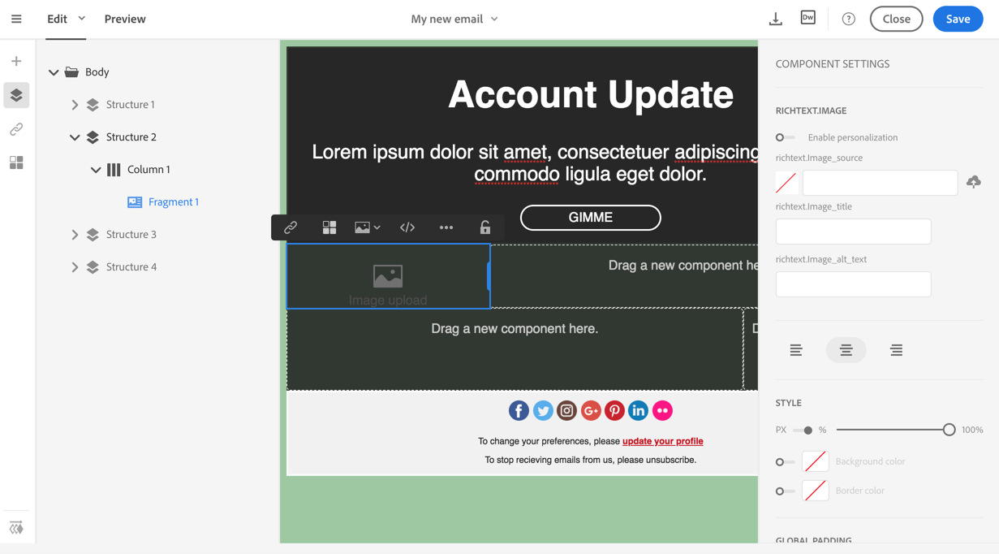

# Customizing the display and style of an element

Customizing the display and style of an element

When selecting the body of your email or a content component, several options specific to the type of content selected are displayed on the side. You can use these options to easily change the style of your email and set visibility conditions.

1. Select a part of your email. Most settings won't be available if the content you select is locked.

   You can select an element by clicking in the email or by browsing the structure tree available from the options located on the left of the screen.

   Each element offers a different set of settings.

   

1. Adjust the settings according to your needs. You can add backgrounds, change sizes, colours, and so on.

   You also have the possibility to add visibility conditions on an element through these settings.

1. Save your content.

## Defining a visibility condition

You can specify a visibility condition on an element of the email. It will only be visible if the condition is respected.

To add a visibility condition, select a block and enter the condition to be respected in the **Visibility condition** field of its settings.

This option is only available for the following elements: ADDRESS, BLOCKQUOTE, CENTER, DIR, DIV, DL, FIELDSET, FORM, H1, H2, H3, H4, H5, H6, NOSCRIPT, OL, P, PRE, UL, TR, TD.

Non-visible dynamic blocks like drop-down lists cannot be edited.

The expression editor is presented in the [Advanced expression editing](../../automating/using/editing-queries.md#about-query-editor) section.

These conditions adopt the XTK expression syntax (e.g. **context.profile.email !=''** or **context.profile.status='0'**). By default, all fields are visible.

>[!NOTE]
>
>A condition cannot be defined for a block that already contains a sub-element with a dynamic content or a block that already makes up a dynamic content.

## Adding and customizing inline styling attributes

When you select an element and display its settings on the side panel, you can customize the inline attributes and their value for that specific element.

1. Select an element in your content.
1. On the side panel, look for the **Styles Inline** settings.

   

1. Modify the values of the existing attributes, or add new ones using the **+** button. You can add any attribute and value that is CSS-compliant.

The styling is then applied to the selected element. If the child elements don't have specific styling attributes defined, the styling of the parent element is inherited.
