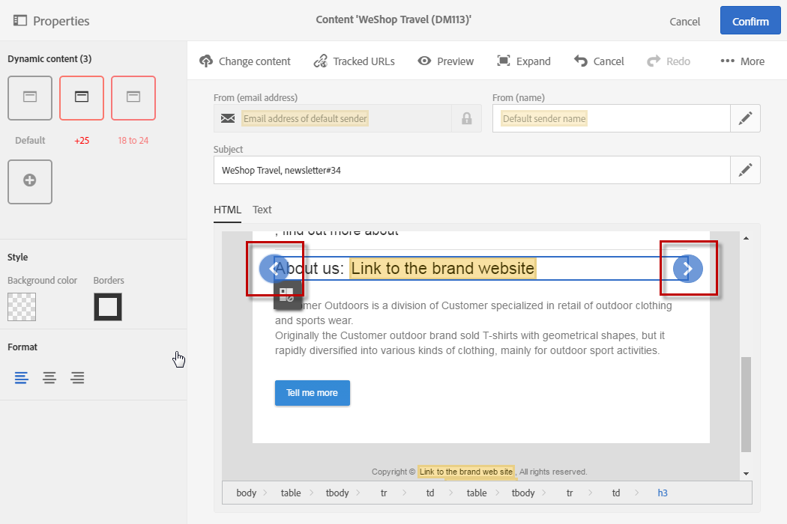
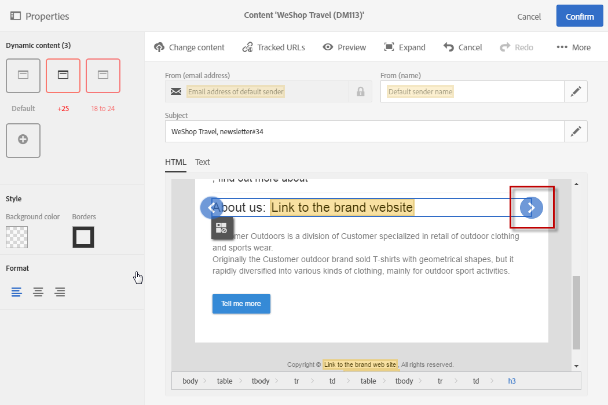
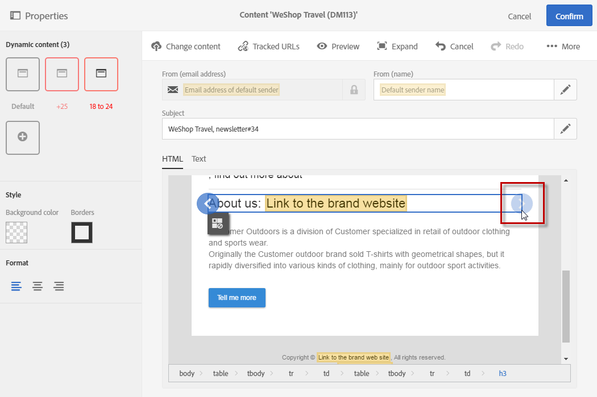
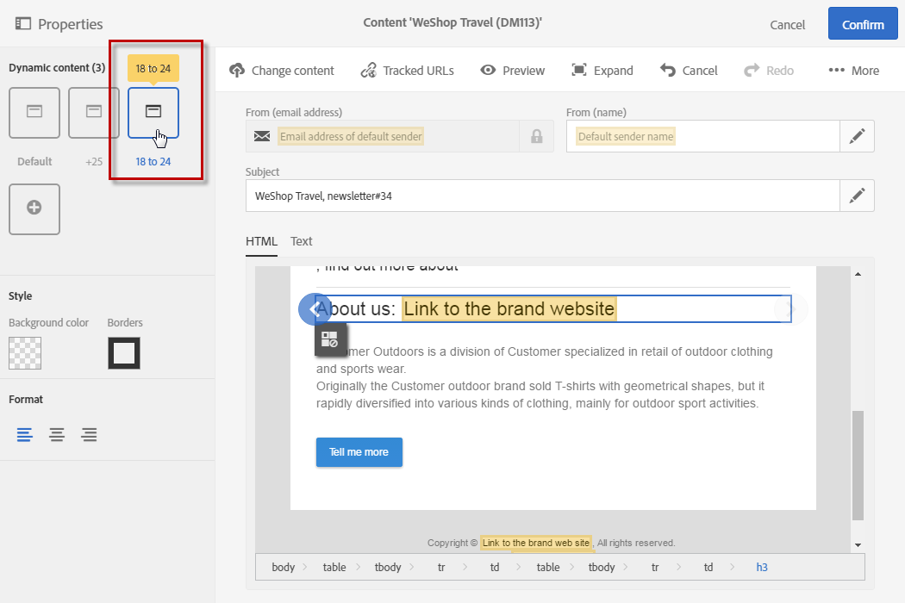
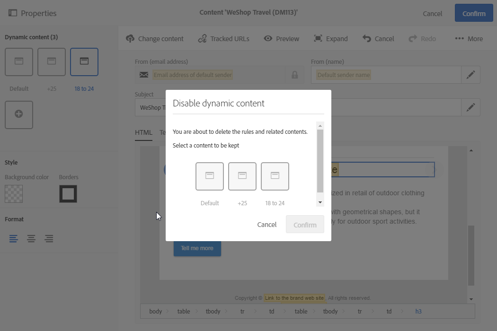

# Defining dynamic content in a landing page{#defining-dynamic-content-in-a-landing-page}

Defining dynamic content in a landing page

>[!NOTE]
>
>If you are using the [content editor](../../designing/using/about-email-content-design.md#using-the-email-content-editor) to customize your email content, you can also refer to this section.

To define dynamic content in a landing page, select a block using the breadcrumb or by directly clicking an element.

Certain blocks, such as images, cannot be directly selected. In this case, select the parent block using the breadcrumb. You can then modify all of the elements included in this parent element, including images. The condition will be applied to all child elements within the parent block.

The breadcrumb is presented in the [Managing blocks](../../designing/using/managing-landing-page-structure-and-style.md) section.

The next steps for defining dynamic content in a landing page are similar to the steps to follow for an email. See [this section](../../designing/using/defining-dynamic-content-in-an-email.md).

>[!NOTE]
>
>If a variant element is outlined in red, this means that an expression has not yet been defined.

## Previewing dynamic contents in a landing page {#previewing-dynamic-contents-in-a-landing-page}

You can navigate between the different dynamic contents of an image block or a block of text. To do this:

* Select the content block.

  Arrows appear on the right- and left-hand sides of the image.

  

* Click the right arrow to browse through the available dynamic contents.

  

  The arrows on each side dim according to whether you have reached the last or first available dynamic contents.

  

In the palette:

* The contents which have an expression entered are no longer outlined in red, they are shown in gray.
* If a label was defined for a content, that label then replaces the word "Label" and the new label name also appears whenever the content is hovered over.
* The content that is currently selected appears in blue.

To delete all the conditions applied to a block, select that block and click the **Dynamic content** icon.

A new window appears. From this window you can select the dynamic content that you would like to keep.

