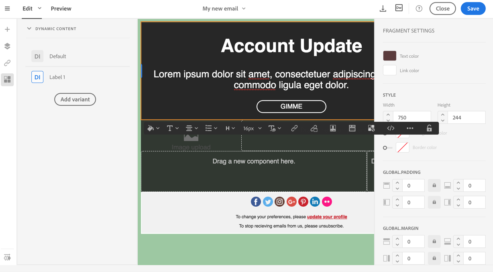

# Defining dynamic content in an email

Defining dynamic content in an email

In an email, you can define different contents which will be displayed dynamically to the user according to the conditions defined via the expression editor. For example, from the same email, you can ensure that the recipients receive a different message according to their age range.

Defining dynamic content is different from [defining visibility conditions](../../designing/using/defining-a-visibility-condition.md).

1. Select a fragment, a component or an element.
1. Select the **Dynamic content** icon from the contextual toolbar.

   The **Dynamic content** section then appears in the palette on the left.

   By default, this section contains two elements: the default variant and a new variant.

   You cannot delete the default variant. The content must always have a default variant.

1. Click the **Edit** button to define the first alternative variant or **Add a condition** to add a new content and its linked rule.
1. To define a content's display conditions, select the variant, then use the **Edit** button to open the expression editor and define a condition.

   For each content, you can specify a label and define the order of priority in which the condition will be applied. The contents will be displayed in the palette in order of priority, from top to bottom. For more on order of priority, refer to [this section](../../designing/using/defining-dynamic-content-in-an-email.md#order-of-priority). 

   

1. Once you have entered and confirmed an expression, you can make any changes you would like to the corresponding block in the editing zone.

>[!CAUTION]
>
>Once you have prepared your message and before sending it, don't forget to test it using a proof. If you do not do this, any errors may not be detected and the email may not be sent.

**Related topics:**

* [Sending proofs](../../sending/using/managing-test-profiles-and-sending-proofs.md#sending-proofs)
* [Advanced expression editing](../../automating/using/editing-queries.md#about-query-editor)

## Order of priority

In the expression editor, when you define a dynamic content, the order of priority is as follows.

>[!NOTE]
>
>The images below show how to set the order of priority when defining dynamic content in an email using the [content editor](../../designing/using/about-email-content-design.md#using-the-email-content-editor).

1. You define two different dynamic contents with **two different conditions**, for example:

   **Condition 1:** the gender of the profile is masculine,

   **Condition 2:** the profile is between 20 and 30 years old.

   

   Some profiles in your database correspond to the two conditions but only one email with one dynamic content can be sent.

1. You therefore have to define the priority for the dynamic contents. A condition with an order of priority of **1** (and therefore the corresponding dynamic content) will be sent to a profile even if another condition whose priority order is **2** or **3** is also met by this profile.

   

You can only define one order of priority per dynamic content.
