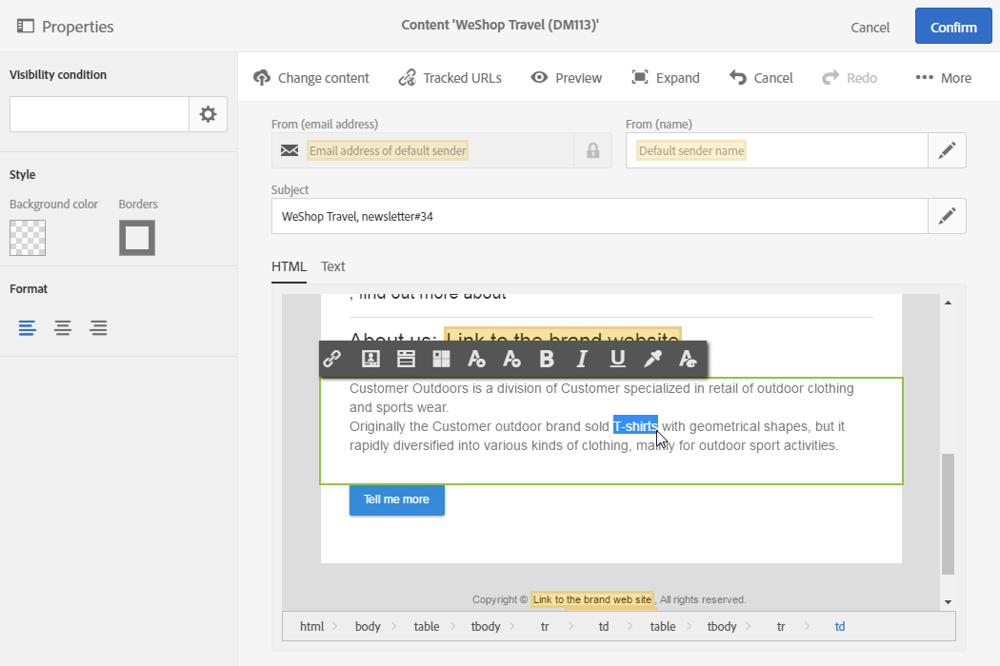
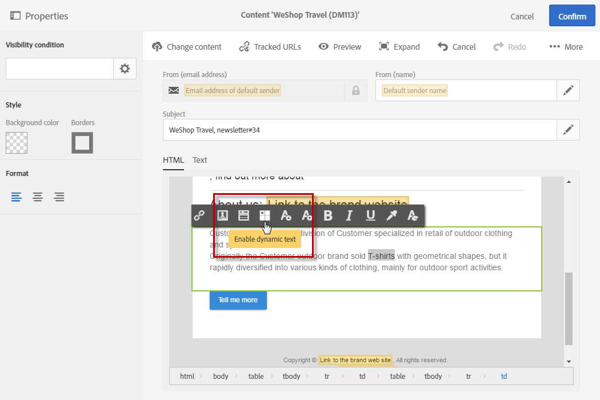
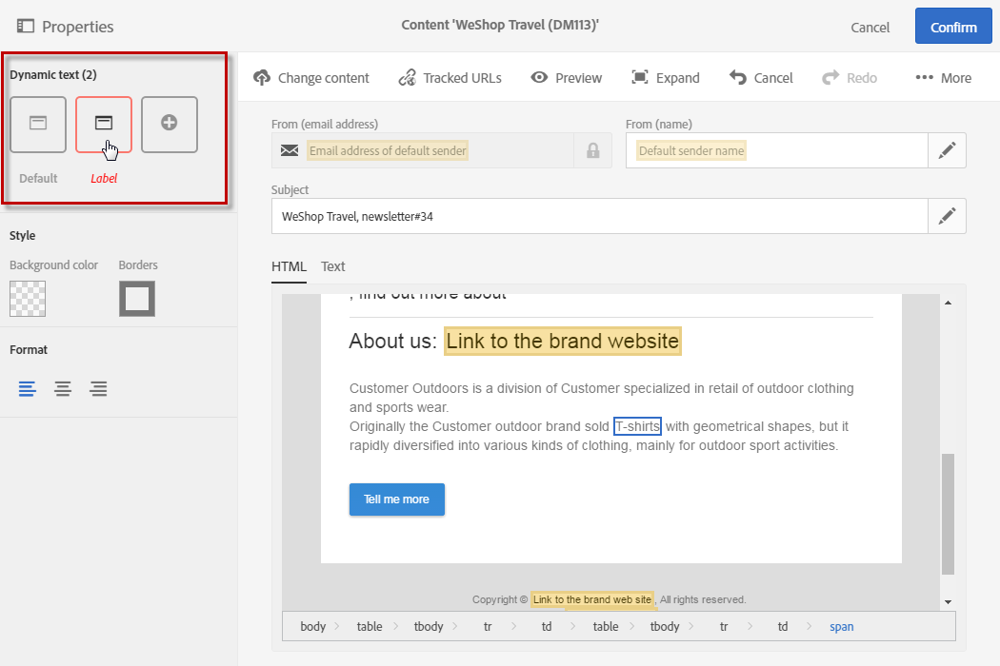
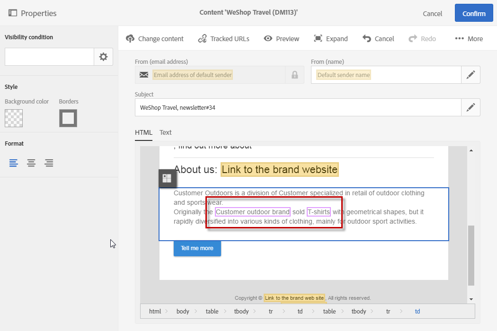

# Defining dynamic text{#defining-dynamic-text}

Defining dynamic text

Dynamic text functions in the same way as **dynamic content**. Refer to the [Definig dynamic content](../../designing/using/defining-dynamic-content-in-an-email.md) section.

>[!NOTE]
>
>For SMS and push, you can only define dynamic text. Defining dynamic text is specific to the [content editor](../../designing/using/about-email-content-design.md#using-the-email-content-editor). If you want to define dynamic text with the [Creative Designer](../../designing/using/about-email-content-design.md#using-the-creative-designer), see [Defining dynamic content in an email](../../designing/using/defining-dynamic-content-in-an-email.md).

You can define dynamic text:

* in an email subject
* in HTML mode
* in text mode

To define dynamic text:

1. Select text in the body of your message.

   

1. Click **Enable dynamic text**.

   

   The **Dynamic text** option then appears in the palette.

   It is configured in the same way as dynamic content.

   

   A purple frame appears around dynamic text in the body of the email.

   

