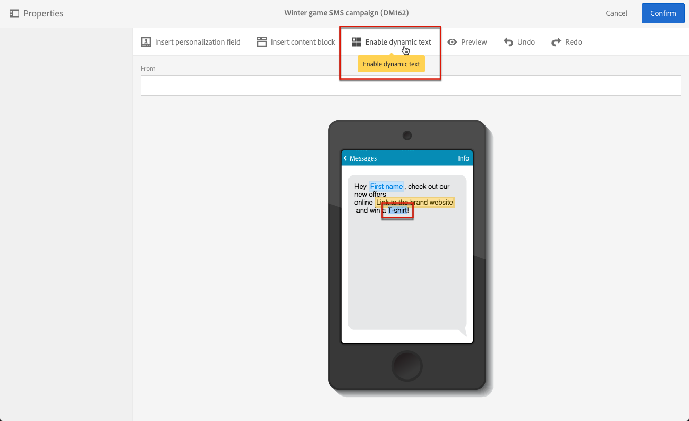

# Defining dynamic text{#defining-dynamic-text}

Defining dynamic text

Dynamic text is defined in the same way as dynamic content. Refer to the [Definig dynamic content](../../designing/using/defining-dynamic-content-in-an-email.md) section.

>[!NOTE]
>
>For SMS and push, you can only define dynamic text. You can define both dynamic content and text in a landing page. If you want to define dynamic text with the [Email Designer](../../designing/using/about-email-content-design.md#about-the-email-designer), see [Defining dynamic content in an email](../../designing/using/defining-dynamic-content-in-an-email.md).

The example below shows how to define dynamic text in an SMS message.

1. Select text in the body of your message or landing page.
1. Click **[!UICONTROL Enable dynamic text]** .

   

   The **[!UICONTROL Dynamic text]** option displays in the palette. It is configured in the same way as dynamic content.

1. Select a variant.

   

1. Define a condition for this variant.

   

Once a condition is defined for at least one variant, a purple frame is displayed around the dynamic text.

