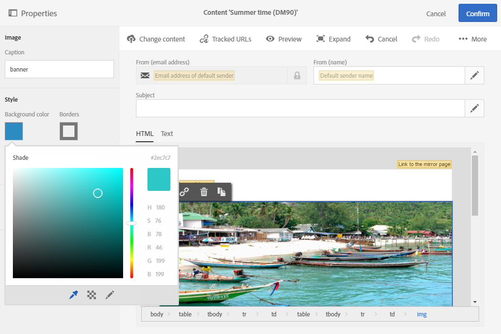
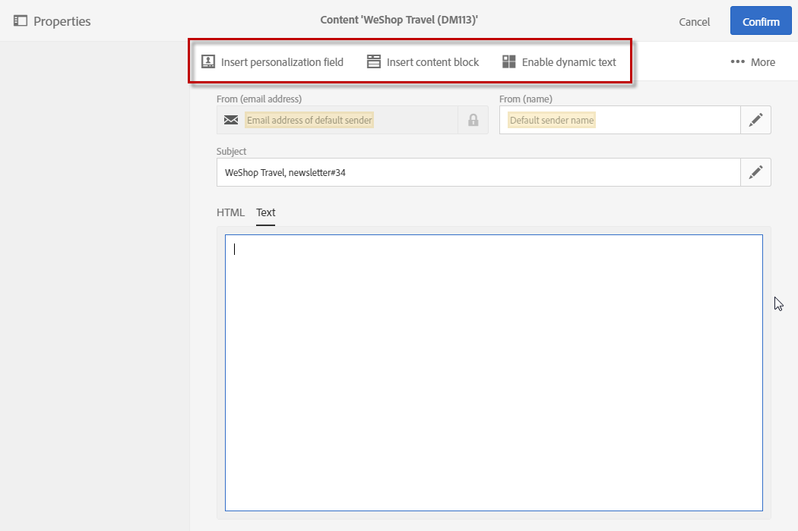

# Design content in Adobe Campaign

Design content in Adobe Campaign

In a message dashboard, the **Content** block allows you to define, modify, and personalize the message content.

The content editor allows you to easily modify content in HTML or text format in Adobe Campaign. You can access it by clicking a **Content** block in an email or landing page dashboard.

This editor allows you to insert and format page elements and link database fields with elements in an HTML page.

**Related topics:**

* [Creating an email](../../channels/using/creating-an-email.md)
* [Managing landing pages](../../channels/using/about-landing-pages.md)

## Default edition modes

The content editor lets you edit your email's content in two different formats: HTML and text format.

### HTML Mode

The HTML mode is a WYSIWYG editor where you can easily see and modify the general display of your message, as well as interact with the content, including images.

This mode makes it easy to select blocks of content to duplicate or edit them.

The HTML functionalities allow you to:

* Define a visibility condition 
* Add a border and a frame
* Edit image properties
* Add links
* Add personalization fields
* Add content blocks
* Edit the text style

### Text mode

Text mode in the editor offers the following functionalities:

* Enter text
* Add a personalization field, refer to [Inserting personalization fields](../../designing/using/adding-a-personalization-field.md)
* Add a content block, refer to [Adding a content block](../../designing/using/adding-a-content-block.md)
* Add dynamic text, refer to [Defining dynamic text](../../designing/using/defining-dynamic-content.md#defining-dynamic-text)

The editor operates in text mode in the same way as it does in HTML mode.

>[!NOTE]
>
>This editing mode is used for the **Subject** and **From** fields, and for the **Text** tab in the email content.

## Editing content in Dreamweaver

The Adobe Campaign Standard integration with Dreamweaver lets you edit the email's content in the Dreamweaver interface. You will now have access to the powerful interface of Dreamweaver to design and develop responsive email content.

This feature is detailed in the Dreamweaver Documentation accessible [here](https://helpx.adobe.com/dreamweaver/using/working-with-dreamweaver-and-campaign.html). A demonstration [video](https://docs.campaign.adobe.com/doc/standard/en/Videos/ACS_Dreamweaver.mp4) is also available.

## Editing content in Experience Manager

Email content can be edited in Experience Manager and then used for one or several email deliveries in Campaign. Refer to [this document](../../integrating/using/integrating-with-experience-manager.md).
