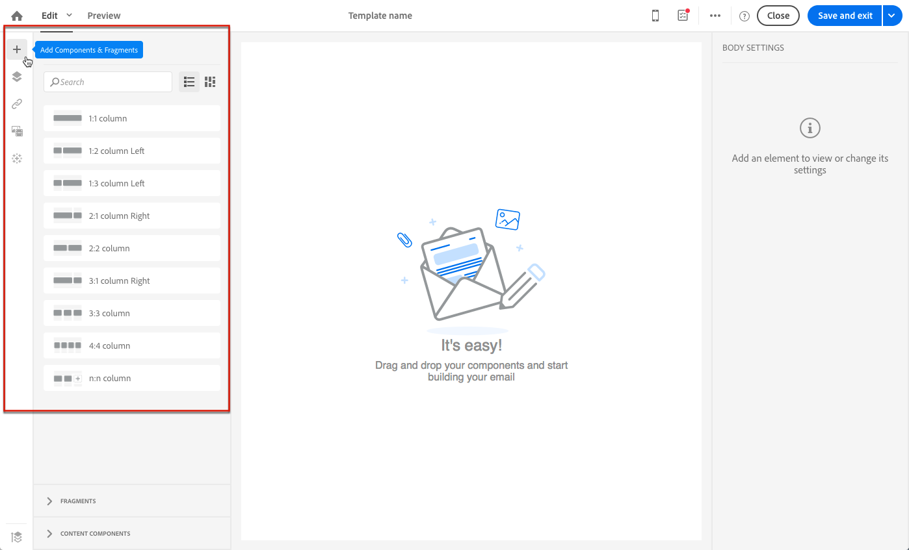
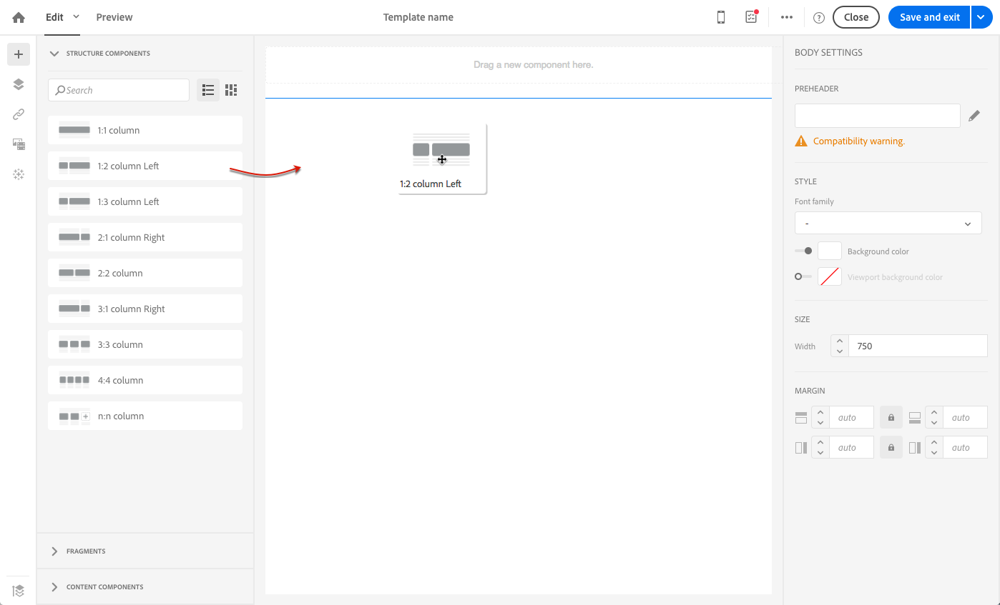
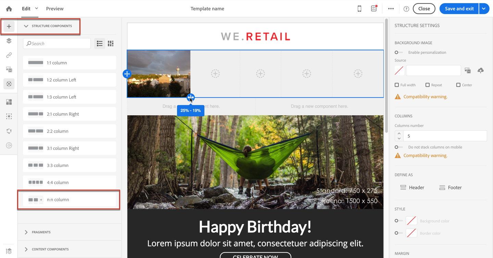
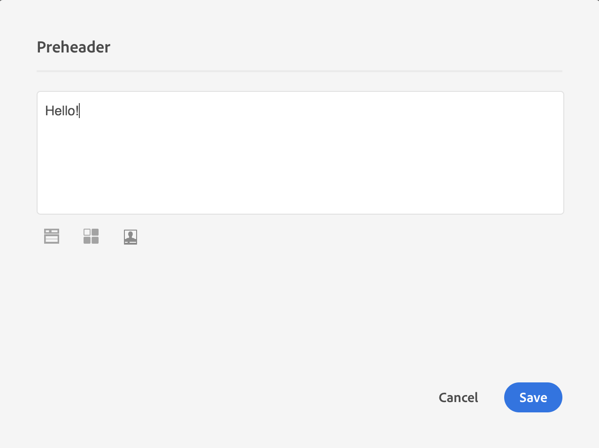
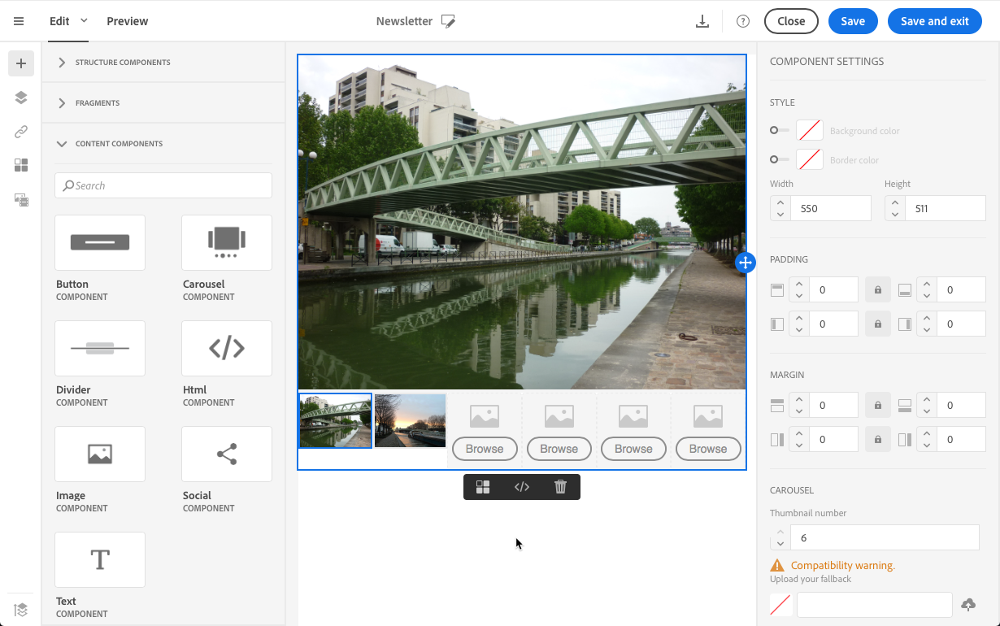
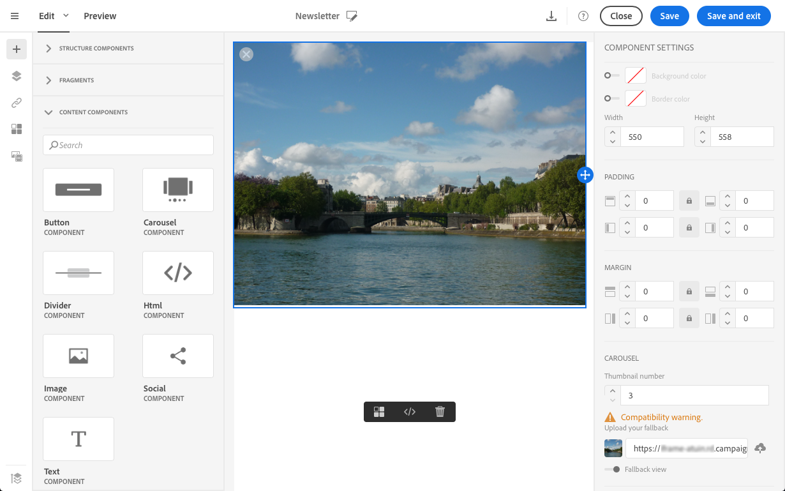

# Designing emails from scratch {#designing-an-email-content-from-scratch}

Learn how to master email content edition. With Email Designer, you can create emails and templates starting with or without your own predefined content. 

Here are the main steps to create and design an email content from scratch using the Email Designer:

1. Create an email and open its content.
1. Add structure components to shape the email. See [Editing the email structure](#defining-the-email-structure).
1. Insert content components and fragments in the structure components. See [Adding fragments and content components](#defining-the-email-structure).
1. Add images and edit the text of the email. See [Inserting images](../../designing/using/images.md#inserting-images).
1. Personalize your email by adding personalization fields, links, and so on. See [Inserting a personalization field](../../designing/using/personalization.md#inserting-a-personalization-field), [Inserting a link](../../designing/using/links.md#inserting-a-link) and [Defining dynamic content in an email](../../designing/using/personalization.md#defining-dynamic-content-in-an-email).
1. Define the subject line of your email. See [Personalizing the subject line of an email](../../designing/using/subject-line.md#defining-the-subject-line-of-an-email).
1. Preview your email.
1. Save your content, and proceed with your message after making sure that you have defined an audience and properly scheduled the sending.

You can also check out this [introduction video](https://video.tv.adobe.com/v/22771/?autoplay=true&hidetitle=true).

>[!NOTE]
>
>To avoid designing email content from scratch, you can use out-of-the-box content templates. For more on this, see [Content templates](../../designing/using/using-reusable-content.md#content-templates).

## Defining Email Structure {#defining-the-email-structure}

>[!CONTEXTUALHELP]
>id="ac_structure_components"
>title="About Structure components"
>abstract="Structure components define the layout of the email."

>[!CONTEXTUALHELP]
>id="ac_edition_columns"
>title="Defining email columns"
>abstract="The Email Designer allows you to easily define the layout of your email by defining column structure."

The Email Designer allows you to easily define the structure of your email. By adding and moving structural elements with simple drag-and-drop actions, you can design the shape of your email within seconds.

To edit the structure of an email:

1. Open an existing content or create a new email content.
1. Access the **[!UICONTROL Structure components]** by selecting the **+** icon on the left.

   

1. Drag and drop the structure components that you need to shape your email.

   

   A blue line materializes the exact location of the structure components before you drop it. You can drop it above, between or below any other component, but not inside.

   >[!NOTE]
   >
   >Note that stack of columns are not compatible with all email programs. When not supported, columns will not be stacked.
   >
   >Once placed in the email, you cannot move nor remove your components unless there is already a content component or a fragment placed inside.

1. Several structure components composed of one or more columns are available.

   Select the **[!UICONTROL n:n column]** component to define the number of columns of your choice (between 3 and 10). You can also define the width of each column by moving the arrows at the bottom of each column.

   

   >[!NOTE]
   >
   >Each column size cannot be under 10% of the total width of the structure component. You cannot remove a column that is not empty.

Once the structure is defined, you are able to add content fragments and components to your email.

## Using a preheader {#preheader}

>[!CONTEXTUALHELP]
>id="ac_edition_preheader"
>title="Using a preheader"
>abstract="The preheader lets your configure a short summary text that will delivers a higher open rate for your email."

A preheader is a short summary text that follows the subject line when viewing an email from your inbox. The preheader delivers an higher open rate.

Select the **[!UICONTROL Preheader]** edit box and complete the content.

You can add a **[!UICONTROL Content block]**, a **[!UICONTROL Dynamic content]** or a **[!UICONTROL Personalization fields]** in the preheader content.

>[!NOTE]
>
>Note that preheader is not compatible with all email programs. When not supported, preheader will not display.

## Using content components {#about-content-components}

>[!CONTEXTUALHELP]
>id="ac_content_components"
>title="About Content components"
>abstract="Content components are empty content placeholders that you can edit to create an email."

Content components are raw, empty components that you can edit once placed in an email.

You can add as many content components as you want in a structure component. You can also move them inside the structure component or to another structure component.

Here is the list of the available components in the Email Designer:

### **[!UICONTROL Button]**

  If you need to use multiple buttons, rather than editing each button from scratch, you can duplicate the **[!UICONTROL Button]** component using the contextual toolbar.

  You can also save buttons into fragments that can be reused. For more on this, see [Creating a content fragment](../../designing/using/using-reusable-content.md#creating-a-content-fragment) and [Saving content as a fragment](../../designing/using/using-reusable-content.md#saving-content-as-a-fragment).

Select **[!UICONTROL Fallback view]** to display the fallback image in the Email Designer.

### **[!UICONTROL Text]**

    Use this component to insert text in your email. You can adjust the color, style and size of your text in **[!UICONTROL Component Settings]**.

### **[!UICONTROL Divider]**

    Use this component to insert a dividing line in your email. You can select the color, style and size of the breaking line in **[!UICONTROL Component Settings]**.

### **[!UICONTROL Html]**

  Use this component to copy-paste the different parts of your existing HTML. This enables you to create free modular HTML components.

  >[!NOTE]
  >
  >A free HTML component is editable with limited options. If all styles are not inlined, make sure to add the proper CSS in the **head** section of the HTML code, otherwise the email will not be responsive. Use the **[!UICONTROL Preview]** button to test the responsiveness of your content (see [Previewing messages](../../sending/using/previewing-messages.md)).

  To simply make an external content compliant with the Email Designer, Adobe recommends creating a message from scratch and copy the content from your existing email into fragments and components.

  When you have a content that cannot be recreated, you can copy-paste the HTML code from the original email using the **[!UICONTROL Html]** content component. Make sure you are familiar with HTML before proceeding.

  <!-- A full example is presented below. -->

  >[!NOTE]
  >
  >The new content will not be the exact copy of your original email, but the steps below will guide you through the creation of a message that will be as close as possible.

    **Before copying your content**

    1. In your original email, identify the reusable sections from the sections that will be unique to each email that you will send.
    1. Save all the images and assets that you want to use.
    1. If you are familiar with HTML, split your original HTML content into different parts.

### Video {#video-settings}

>[!CONTEXTUALHELP]
>id="ac_edition_video"
>title="Video settings"
>abstract="Use this component to insert a video in your email. Note that videos do not work on all email clients. We advise to set a fallback image."
>additional-url="https://www.emailonacid.com/blog/article/email-development/a_how_to_guide_to_embedding_html5_video_in_email/" text="Additional info"

Insert the video component into a structure component of your email and enter the video link in the **[!UICONTROL Component Settings]**.

>[!NOTE]
>
>Note that video is not compatible with all email programs. When not supported, fallback will display.

### Image

Use this component to insert an image in your email. 
  
Insert the image component into a structure component and click browse to upload an image file from your computer.

### **[!UICONTROL Social]**

Use this component to insert links to social media pages in your email. You can select which links you want to display and the size of their icon in **[!UICONTROL Component Settings]**.

### Carousel {#carousel-settings}

>[!CONTEXTUALHELP]
>id="ac_edition_carousel"
>title="Carousel settings"
>abstract="Learn how to insert and configure a carousel into your content.Note that carousel do not work on all email client and fallback image will be displayed in case it’s not supported."

1. Drag and drop the **[!UICONTROL Carousel]** component inside a structure component.
1. Browse to select images from your computer.

    

1. From the **[!UICONTROL Settings]** pane, set the number of thumbnails that you want in the carousel.
1. Select a fallback image from your computer.

    

The carousel component is not compatible with all email programs. Upload a fallback to display an image instead when the carousel is not supported in the email.

>[!NOTE]
>
>The carousel component is compatible with the following email platforms: Apple Mail 7, Apple Mail 8, Outlook 2011 for Mac, Outlook 2016 for Mac, Mozilla Thunderbird, iPad and iPad mini iOS, iPhone iOS, Android, AOL (Chrome, Firefox and Safari).

**Related topics**:

- [Creating an email](../../channels/using/creating-an-email.md)
- [Selecting an audience in a message](../../audiences/using/selecting-an-audience-in-a-message.md)
- [Scheduling messages](../../sending/using/about-scheduling-messages.md)
- [Previewing messages](../../sending/using/previewing-messages.md)
- [Email rendering](../../sending/using/email-rendering.md)
