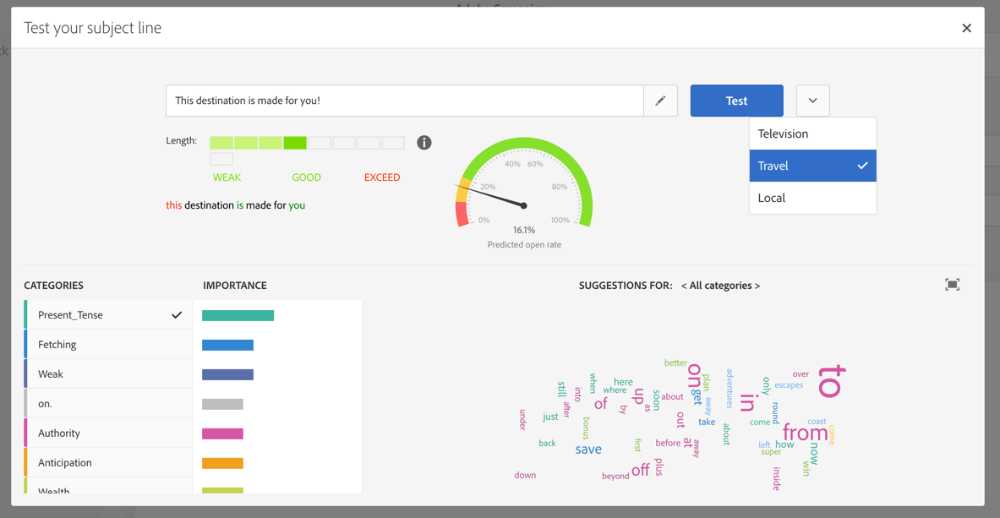

# Editing email content {#editing-email-content}

Learn how to master email content edition. With Email Designer, you can create emails and templates starting with or without your own predefined content. 

## Defining the subject line of an email{#defining-the-subject-line-of-an-email}

The message subject is mandatory to prepare and send the message.

>[!NOTE]
>
>If the subject line is empty, a warning is displayed in the message dashboard and in the Email Designer.

To configure the email subject, go the **[!UICONTROL Properties]** tab of the Email Designer home page (accessible through the home icon) and fill in the **[!UICONTROL Subject]** section.


You can also add personalization fields, content blocks and dynamic content to the subject line by clicking the corresponding icons.

**Related topics:**

* [Inserting a personalization field](../../designing/using/inserting-a-personalization-field.md)
* [Adding a content block](../../designing/using/adding-a-content-block.md)
* [Defining dynamic content in an email](../../designing/using/defining-dynamic-content-in-an-email.md)

### Predictive subject line {#predictive-subject-line}

When editing an email, you can try out different subject lines and get an estimation of its open rate before you send it.

This feature is disabled by default. It is enabled when the first model is imported. A model is the result of training data sets specific to a given industry. Models allow the system to predict the open rate of the email when a new subject line is submitted.

>[!NOTE]
>
>This feature is available for email messages and for databases that contain English contents only. The trained model will be inconsistent and will lead to erroneous results if your instance contains emails in other languages. The option that allows you to test a subject is only visible if a model is already available on your instance.

### Testing a subject {#testing-a-subject}

To test your subject line:

1. Create or open your email.
1. Open the content and enter the subject of the email in the corresponding input field.
1. Click the **[!UICONTROL Test subject]** button to access the **[!UICONTROL Test your subject line]** window. You can still edit the subject from this window.
1. Select the correct model to be taken into account for the open rate prediction. Several models are available, each corresponding to a specific industry.
1. Click **[!UICONTROL Test]**.

Your subject is then analyzed.

>[!NOTE]
>
>If the subject line is too short, it cannot be analyzed and an error message is displayed.

Several indicators are calculated and a set of tools are displayed to help you:

* **Predicted open rate**: This chart gives you an idea of the open rate you can expect for the email with its current subject.
* **Subject length**: This indicator lets you see if the current length of the subject is correct or whether it would need to be longer or shorter.
* **Colored words**: When testing the subject, words highlighted in green are the words that contribute the most to increasing the open rate prediction. Words highlighted in red are the words that contribute the least to increasing the open rate prediction. If you add or remove words in the subject, highlighted words will change.
* **Categories and word suggestions**: Towards the lower part of the window, a number of relevant categories for the selected model are displayed. These categories are sorted by order of importance and they allow you to see whether your subject contains words that are associated with it via a check symbol. Each category contains a set of suggested words that could be used in your subject to make it more relevant and increase the open rate. These words are the words that are used the most often in a given category.

>[!NOTE]
>
>Personalization fields and punctuation marks are stripped from the subject analysis. In the case of dynamic/conditional text, all variants are considered as one subject line.



### Importing models {#importing-models}

By default, there is no model running on your Adobe Campaign server. There are two ways to get a model and activate the feature:

* You can train a local model from the data of your previous email messages:

    * If you are already using Adobe Campaign, the local model will be automatically trained on the messages that you have already sent.
    * If you are new to Adobe Campaign, you can extract a CSV file from your previous system/ESP that contains 4 columns: date, subject, sent, opens. To do that, go to **[!UICONTROL Administration]** > **[!UICONTROL Channels]** > **[!UICONTROL Email]** > **[!UICONTROL Subject Line Import]** and follow the instructions provided on the successive screens. When the subject upload is complete, import a local model as described below. The local model is automatically trained with the data you uploaded.
    * If you are new to Adobe Campaign and cannot get a CSV file as described above, you can use a pre-trained model or wait until you have enough delivery data in your system to train a local model. The system will automatically determine whether your current data set contains enough data to recognize patterns and to train the model.

      >[!NOTE]
      >
      >There is no defined number of subject lines needed to train your own model. To be able to train it, the subject lines need to be varied and to have no duplicates. If there is not enough data to process, the system will not be able to train the model. You can only have one trained model on your instance.

  To train a local model, download the subjectLineTraining.xml from [here](https://support.neolane.net/webApp/downloadCenter?__userConfig=psaDownloadCenter) and use the [package import](../../automating/using/managing-packages.md) feature to upload it to your Adobe Campaign instance. A technical workflow will automatically do the training for you.

  The first time you want to train a model, an administrator can force the **[!UICONTROL SubjectLine Training workflow]** to start from the **[!UICONTROL Administration]** > **[!UICONTROL Application settings]** > **[!UICONTROL Workflows]** menu.

  Once a model has been uploaded and trained, the feature is automatically activated and a new option appears next to the subject line field of your messages.

  Then, the technical workflow will automatically continue to train your model every week.

* You can import pre-trained models that are specific to certain industries (medical, etc.) using the [package import](../../automating/using/managing-packages.md) feature. These models are available [here](https://support.neolane.net/webApp/downloadCenter?__userConfig=psaDownloadCenter) and cannot be trained.

  Once a model has been uploaded, the feature is automatically activated and a new option appears next to the subject line field of your messages.

>[!NOTE]
>
>Importing and generating trained models can only be performed by an administrator.

The models that are available for use are:

* Cosmetic industry: subjectInsightCosmetic.xml
* Supermarket industry: subjectInsightSupermarket.xml
* Medical industry: subjectInsightMedical.xml
* Model to train: subjectlineTraining.xml.

## Designing an email content from scratch {#designing-an-email-content-from-scratch}

Here are the main steps to create and design an email content from scratch using the Email Designer:

1. Create an email and open its content.
1. Add structure components to shape the email. See [Editing the email structure](../../designing/using/defining-the-email-structure.md#editing-the-email-structure).
1. Insert content components and fragments in the structure components. See [Adding fragments and content components](../../designing/using/defining-the-email-structure.md#adding-fragments-and-content-components).
1. Add images and edit the text of the email. See [Inserting images](../../designing/using/inserting-images.md).
1. Personalize your email by adding personalization fields, links, and so on. See [Inserting a personalization field](../../designing/using/inserting-a-personalization-field.md), [Inserting a link](../../designing/using/inserting-a-link.md) and [Defining dynamic content in an email](../../designing/using/defining-dynamic-content-in-an-email.md).
1. Define the subject line of your email. See [Personalizing the subject line of an email](../../designing/using/personalizing-the-subject-line-of-an-email.md).
1. Preview your email.
1. Save your content, and proceed with your message after making sure that you have defined an audience and properly scheduled the sending.

You can also check out this [introduction video](https://video.tv.adobe.com/v/22771/?autoplay=true&hidetitle=true).

>[!NOTE]
>
>To avoid designing email content from scratch, you can use out-of-the-box content templates. For more on this, see [Content templates](../../start/using/about-templates.md#content-templates).

## Designing using templates {#designing-templates}

### Content templates {#content-templates}

You can manage HTML contents that will be offered in the **[!UICONTROL Templates]** tab of the [Email Designer](../../designing/using/about-email-content-design.md#about-the-email-designer) home page. The different templates present various combinations of several types of elements. For example, 'Feather' templates have margins while 'Astro' templates do not have ones. For more on this, see [Content templates](../../start/using/about-templates.md#content-templates).


To learn how to build an email from an out-of-the-box-template, see [Email Designer](../../designing/using/quick-start.md#building-content-from-an-out-of-the-box-template).

### Creating a template with fragments and components {#template-fragments-components}

You can now create an email template with the Email Designer. Use content components to reflect the different sections of your email and adjust the settings to make them as close as possible to your original newsletter. Finally, insert the fragments that you just created.

1. Using the Email Designer, create a template. For more on this, see [Content templates](../../start/using/about-templates.md#content-templates).
1. Insert several structure components into your template - corresponding to the header, footer and body of your email. For more on adding structure components, see [Editing the email structure with the Email Designer](../../designing/using/defining-the-email-structure.md#editing-the-email-structure).
1. Insert as many content components as needed to create the body of your newsletter. This will be the editable content of your email that you will update every month.

   

   If you are familiar with HTML code, Adobe recommends leveraging **[!UICONTROL Html]** components where you can copy-paste the more complex elements of the original email. Use other components such as **[!UICONTROL Button]**, **[!UICONTROL Image]** or **[!UICONTROL Text]** for the rest of the content. For more on this, see [About content components](../../designing/using/defining-the-email-structure.md#about-content-components).

   >[!NOTE]
   >
   >Using the **[!UICONTROL Html]** component results in creating components that are editable with limited options. Make sure you know how to handle HTML code before selecting this component.

1. Adjust the content components to match your original email as much as you can.

   

   For more on managing style settings and inline attributes, see [Editing email styles](../../designing/using/editing-email-styles.md).

1. Insert the two fragments (header and footer) that you previously created into the desired structure components.

   

1. Save your template.

You can now fully manage this template within the Email Designer to create and update the newsletter that you will send every month to your recipients.

To use it, create an email and select the content template that you just created.

- Save as templates

## Editing the email structure {#editing-the-email-structure}

The Email Designer allows you to easily define the structure of your email. By adding and moving structural elements with simple drag-and-drop actions, you can design the shape of your email within seconds.

### Defining Email Structure {#defining-the-email-structure}

To edit the structure of an email:

1. Open an existing content or create a new email content.
1. Access the **[!UICONTROL Structure components]** by selecting the **+** icon on the left.

   

1. Drag and drop the structure components that you need to shape your email.

   

   A blue line materializes the exact location of the structure components before you drop it. You can drop it above, between or below any other component, but not inside.

   >[!NOTE]
   >
   >Once placed in the email, you cannot move nor remove your components unless there is already a content component or a fragment placed inside.

1. Several structure components composed of one or more columns are available.

   Select the **[!UICONTROL n:n column]** component to define the number of columns of your choice (between 3 and 10). You can also define the width of each column by moving the arrows at the bottom of each column.

   

   >[!NOTE]
   >
   >Each column size cannot be under 10% of the total width of the structure component. You cannot remove a column that is not empty.

Once the structure is defined, you are able to add content fragments and components to your email.

### About content components {#about-content-components}

Content components are raw, empty components that you can edit once placed in an email.

You can add as many content components as you want in a structure component. You can also move them inside the structure component or to another structure component.

Here is the list of the available components in the Email Designer:

* **[!UICONTROL Button]**

  If you need to use multiple buttons, rather than editing each button from scratch, you can duplicate the **[!UICONTROL Button]** component using the contextual toolbar.

  You can also save buttons into fragments that can be reused. For more on this, see [Creating a content fragment](../../designing/using/defining-the-email-structure.md#creating-a-content-fragment) and [Saving content as a fragment](../../designing/using/defining-the-email-structure.md#saving-content-as-a-fragment).

* **[!UICONTROL Carousel]**

  For more on this, see [Using the carousel component](../../designing/using/defining-the-email-structure.md#using-the-carousel-component).

* **[!UICONTROL Divider]** 
* **[!UICONTROL Html]**

  Use this component to copy-past the different parts of your existing HTML. This enables you to create free modular HTML components.

  >[!NOTE]
  >
  >A free HTML component is editable with limited options. If all styles are not inlined, make sure to add the proper CSS in the **head** section of the HTML code, otherwise the email will not be responsive. Use the **[!UICONTROL Preview]** button to test the responsiveness of your content (see [Previewing messages](../../sending/using/previewing-messages.md)).

* **[!UICONTROL Image]** 
* **[!UICONTROL Social]** 
* **[!UICONTROL Text]**

#### Using the HTML component {#using-html-component}

To simply make an external content compliant with the Email Designer, Adobe recommends creating a message from scratch and copy the content from your existing email into fragments and components.

When you have a content that cannot be recreated, you can copy-paste the HTML code from the original email using the **[!UICONTROL Html]** content component. Make sure you are familiar with HTML before proceeding.

<!-- A full example is presented below. -->

>[!NOTE]
>
>The new content will not be the exact copy of your original email, but the steps below will guide you through the creation of a message that will be as close as possible.

**Before copying your content**

1. In your original email, identify the reusable sections from the sections that will be unique to each email that you will send.
1. Save all the images and assets that you want to use.
1. If you are familiar with HTML, split your original HTML content into different parts.

#### Using the carousel component {#using-the-carousel-component}

1. Drag and drop the **[!UICONTROL Carousel]** component inside a structure component.
1. Browse to select images from your computer.

   

1. From the **[!UICONTROL Settings]** pane, set the number of thumbnails that you want in the carousel.
1. Select a fallback image from your computer.

   

   The carousel component is not compatible with all email programs. Upload a fallback to display an image instead when the carousel is not supported in the email.

   >[!NOTE]
   >
   >The carousel component is compatible with the following email platforms: Apple Mail 7, Apple Mail 8, Outlook 2011 for Mac, Outlook 2016 for Mac, Mozilla Thunderbird, iPad and iPad mini iOS, iPhone iOS, Android, AOL (Chrome, Firefox and Safari).

1. Select **[!UICONTROL Fallback view]** to display the fallback image in the Email Designer.

### About fragments {#about-fragments}

A fragment is a reusable component that can be referenced in one or more emails.
They can be found in the interface under **Resources** > **Content fragments and templates**. 

To make the best use of fragments in the Email Designer:

* Create your own fragments. See [Creating a content fragment](../../designing/using/defining-the-email-structure.md#creating-a-content-fragment) and [Saving content as a fragment](../../designing/using/defining-the-email-structure.md#saving-content-as-a-fragment).
* Use them as many times as needed in your emails. See [Inserting elements into an email](../../designing/using/defining-the-email-structure.md#inserting-elements-into-an-email).
* When you edit a fragment, the changes are synchronized: they are automatically propagated to all emails (provided they have not been prepared or sent yet) containing that fragment.

When added to an email, fragments are locked by default. If you want to modify a fragment for a specific email, you can break the synchronization with the original fragment by unlocking it in the email where it is used. The changes will not be synchronized anymore.

To unlock a fragment inside an email, select it and click the lock icon from the contextual toolbar.


That fragment becomes a standalone component that is not linked anymore to the original fragment. It can then be edited as any other content component. See [About content components](../../designing/using/defining-the-email-structure.md#about-content-components).

#### Inserting fragments into an email {#inserting-elements-into-an-email}

To define the content of your email, you can add content elements in the structure components you have placed beforehand. See [Editing the email structure](../../designing/using/defining-the-email-structure.md#editing-the-email-structure).

1. Access the content elements by selecting the **+** icon on the left. Select [Fragments](../../designing/using/defining-the-email-structure.md#about-fragments) or [Content components](../../designing/using/defining-the-email-structure.md#about-content-components).
1. If you already know the label or part of the label of the fragment you want to add, you can search for it.

   

1. Drag and drop a fragment or content component from the palette to a structure component of the email.

   

   Once an element is added to the email, it can be moved inside the structure component or to another structure component in the email.

   

1. Edit the element to match the exact needs of this email. You can add text, links, images, and so on.

   >[!NOTE]
   >
   >Fragments are locked by default when added to an email. You can break the synchronization with the original fragment if you want to modify the fragment for a specific email, or make your change directly in the fragment. See [About fragments](../../designing/using/defining-the-email-structure.md#about-fragments).

1. Repeat this procedure for all elements you need to add to your email.
1. Save your email.

Now that your email structure is populated, you can edit the style of each content element. See [Editing an element](../../designing/using/editing-email-styles.md#editing-an-element).

>[!NOTE]
>
>If a fragment is modified, the changes are automatically propagated in the emails where it is used. For more on this, see [About fragments](../../designing/using/defining-the-email-structure.md#about-fragments).

#### Creating a content fragment {#creating-a-content-fragment}

You can create your own content fragments to use them as needed in one or more emails.

1. Go to **[!UICONTROL Resources]** > **[!UICONTROL Content templates & fragments]** and click **[!UICONTROL Create]**.
1. Click the email label to access the **[!UICONTROL Properties]** tab of the Email Designer.
1. Specify a recognizable label and select the following parameters to find the fragment later in new emails:

    * Because fragments are only compatible with emails, select **[!UICONTROL Delivery]** from the **[!UICONTROL Content type]** drop-down list.
    * Select **[!UICONTROL Fragment]** from the **[!UICONTROL HTML type]** drop-down list to be able to use this content as a fragment in your emails.

   

1. If needed, you can set an image that will be used as a thumbnail for the fragment. Select it from the **[!UICONTROL Thumbnail]** tab of the template properties.

   

   This thumbnail will be displayed next to the fragment's label when editing an email.

1. Save your changes to return to the main workspace.
1. Add a structure component and a content component that you can customize as needed.
1. Once edited, save your fragment.

The fragment can now be used in any email built with the Email Designer. It appears under the **[!UICONTROL Fragments]** section of the Palette.

>[!NOTE]
>
>You cannot insert personalization fields inside a fragment unless it is used in an email. To do this, you need to unlock this fragment. See [About fragments](../../designing/using/defining-the-email-structure.md#about-fragments).

#### Saving content as a fragment {#saving-content-as-a-fragment}

When editing an email with the Email Designer, you can directly save part of that email as a fragment.

>[!CAUTION]
>
>You cannot save as fragment a structure containing personalization fields, dynamic content or another fragment.

1. When editing an email in the Email Designer, select **[!UICONTROL Save as fragment]** from the main toolbar.

   

1. From the workspace, select the structures that will compose the fragment.

    

    >[!NOTE]
    >
    >You can only select structures that are adjacent to each other.

1. Click **[!UICONTROL Create]**.

1. Add a label and a description if needed, then click **[!UICONTROL Save]**.

    

1. To find the fragment that you just created, go to **[!UICONTROL Resources]** > **[!UICONTROL Content templates & fragments]**.

    

1. To use your new fragment, open any email content and select it from the fragment list.


**Related topics**:

* [Creating an email](../../channels/using/creating-an-email.md)
* [Selecting an existing content](../../designing/using/selecting-an-existing-content.md)
* [Selecting an audience in a message](../../audiences/using/selecting-an-audience-in-a-message.md)
* [Scheduling messages](../../sending/using/about-scheduling-messages.md)
* [Previewing messages](../../sending/using/previewing-messages.md)
* [Email rendering](../../sending/using/email-rendering.md)

## Designing using existing content {#designing-using-existing-content}

### Importing {#importing}

#### Importing content from a file {#importing-content-from-a-file}

From the Email Designer home page, click the **[!UICONTROL Upload]** button to upload a file from your computer, then confirm.

There are no constraints on the zip file structure. However, referencing HTML files has to be relative and respect the tree structure of the zip folder.

The following formats are supported for import:

* An HTML file with an incorporated style sheet
* A .zip folder containing the HTML file, the style sheet (.CSS) and the images

>[!NOTE]
>
>For email content, we recommend that you import single HTML files with an incorporated style sheet.

#### Importing content from a URL {#importing-content-from-a-url}

Before importing content from a URL, make sure it follows the requirements below:

* The content needs to be publicly available via this URL.
* For security reasons, only URLs beginning with **[!UICONTROL https]** are allowed.
* Make sure that all resources (images, CSS) are set in absolute links and in HTTPS. Otherwise, after sending the email, the mirror page would be displayed without its resources. Here is an example of an absolute link definition:

  ```
  <a href="https://www.mywebsite.com/images/myimage.png">
  ```

>[!NOTE]
>
>Loading content from a URL is available for the email channel only.

To retrieve existing content form a URL, follow the steps below:

1. From the Email Designer home page, select the **[!UICONTROL Import from URL]** button.

   

1. Define the URL from which the content will be retrieved.
1. Click **[!UICONTROL Confirm]**.

**Related topic:**

[Importing content from a URL](https://helpx.adobe.com/campaign/kt/acs/using/acs-email-designer-tutorial.html#Workingwithexistingcontent) video

#### Retrieving content from a URL automatically at preparation time {#retrieving-content-from-a-url-automatically-at-preparation-time}

Importing content from a URL during message preparation enables you to retrieve the latest HTML content each time the email is prepared. This way, the content of recurring emails is always up-to-date at the time of their sending. This feature also enables you to create a message scheduled at a specific date, even if the content is not ready yet.

To retrieve content at preparation time, follow the steps below:

1. Select the **[!UICONTROL Content imported during preparation]** option.

   

1. The URL content displays in the editor as read-only.

   >[!CAUTION]
   >
   >At this step, the HTML display in the content editor should not be taken into account. It will be retrieved at the preparation phase.

1. To preview the URL content that has been retrieved, open the message once it is created then click the **[!UICONTROL Preview]** button.

It is possible to personalize the remote URL from which the content will be retrieved. To do this, follow the steps below:

1. Click the email label on top of the screen to acces the Email Designer **[!UICONTROL Properties]** tab.
1. Find the **[!UICONTROL Remote URL]** field.

   

1. Insert the desired personalization field, content block or dynamic text.

   The **[!UICONTROL Current date - YYYYMMDD]** content block, for example, enables you to insert the date of the day.

   >[!NOTE]
   >
   >The available personalization fields are linked to **Delivery** attributes only (email creation date, status, campaign label...).

#### Compatibility mode {#compatibility-mode}

When you upload a content, it must contain specific tagging to be fully compliant and editable with the WYSIWYG editor of the Email Designer.

If all or part of the uploaded HTML is not compliant with the expected tagging, the content is then loaded in 'compatibility mode', which limits the edition possibilities through the UI.

When a content is loaded in compatibility mode, you can still perform the following modifications through the interface (unavailable actions are hidden):

* Changing the text or changing an image
* Inserting links and personalization fields
* Edit some styling options on the selected HTML block
* Defining conditional content


Other modifications such as adding new sections to your email or advanced styling must be done directly in the source code of the email via the HTML mode.

For more on converting an existing email into an Email Designer-compatible email, see [this section](../../designing/using/about-email-content-design.md#designing-an-email-using-existing-contents).

<!-- ### 1.5.2. Using fragments and components {#using-fragments-and-components}

To simply make an external content compliant with the Email Designer, Adobe recommends creating a message from scratch and copy the content from your existing email into fragments and components.

When you have a content that cannot be recreated, you can copy-paste the HTML code from the original email using the **[!UICONTROL Html]** content component. Make sure you are familiar with HTML before proceeding.

A full example is presented below. 

>[!NOTE]
>
>The new content will not be the exact copy of your original email, but the steps below will guide you through the creation of a message that will be as close as possible.

Let's say that you want to use an existing newsletter that was created outside of Adobe Campaign.

You want to have the same header and footer in all the emails that you will send with Adobe Campaign. The body of the email will change according to the content that you intend to display in each newsletter.

**Prerequisites**

1. In your original email, identify the reusable sections from the sections that will be unique to each email that you will send.
1. Save all the images and assets that you want to use.
1. If you are familiar with HTML, split your original HTML content into different parts.

<!-- **Creating fragments for your reusable content**

Using the Email Designer, create a fragment for each reusable section. In this example, you will create two fragments: one for the header and one for the footer. You can then copy the relevant parts from your existing content into these fragments.

To do this, follow the steps below:

1. In Adobe Campaign, go to **[!UICONTROL Resources]** > **[!UICONTROL Content templates & fragments]** and create a fragment for your header. For more on this, see [Creating a content fragment](../../designing/using/defining-the-email-structure.md#creating-a-content-fragment).
1. Add as many structure components as you need to your fragment.

   

1. Insert image and text components into your structure.

   

1. Upload the corresponding image, enter your text and adjust the settings.

   For more on managing style settings and inline attributes, see [Editing email styles](../../designing/using/editing-email-styles.md).

   

1. Save your fragment.
1. Proceed similarly to create your footer and save it.

   

   If you are familiar with HTML, you can copy-paste the HTML code from the original footer using the **[!UICONTROL Html]** content component. For more on this, see [About content components](../../designing/using/defining-the-email-structure.md#about-content-components).

   

Your fragments are now ready to be used in a template. 

**Inserting fragments and components into your template**

You can now create an email template with the Email Designer. Use content components to reflect the different sections of your email and adjust the settings to make them as close as possible to your original newsletter. Finally, insert the fragments that you just created.

1. Using the Email Designer, create a template. For more on this, see [Content templates](../../start/using/about-templates.md#content-templates).
1. Insert several structure components into your template - corresponding to the header, footer and body of your email. For more on adding structure components, see [Editing the email structure with the Email Designer](../../designing/using/defining-the-email-structure.md#editing-the-email-structure).
1. Insert as many content components as needed to create the body of your newsletter. This will be the editable content of your email that you will update every month.

   

   If you are familiar with HTML code, Adobe recommends leveraging **[!UICONTROL Html]** components where you can copy-paste the more complex elements of the original email. Use other components such as **[!UICONTROL Button]**, **[!UICONTROL Image]** or **[!UICONTROL Text]** for the rest of the content. For more on this, see [About content components](../../designing/using/defining-the-email-structure.md#about-content-components).

   >[!NOTE]
   >
   >Using the **[!UICONTROL Html]** component results in creating components that are editable with limited options. Make sure you know how to handle HTML code before selecting this component.

1. Adjust the content components to match your original email as much as you can.

   

   For more on managing style settings and inline attributes, see [Editing email styles](../../designing/using/editing-email-styles.md).

1. Insert the two fragments (header and footer) that you previously created into the desired structure components.

   

1. Save your template.

You can now fully manage this template within the Email Designer to create and update the newsletter that you will send every month to your recipients.

To use it, create an email and select the content template that you just created. -->

**Related topic**:

* [Creating an email](../../channels/using/creating-an-email.md)
* [Introduction video to the Email Designer](https://video.tv.adobe.com/v/22771/?autoplay=true&hidetitle=true)
* [Designing an email content from scratch](../../designing/using/about-email-content-design.md#designing-an-email-content-from-scratch)

### Converting an HTML content {#converting-an-html-content}

If you want to build a framework of modular templates and fragments that can be combined to reuse in multiple emails, you should consider converting your email HTML into an Email Designer template.

This use case offers a quick way to convert an HTML email into Email Designer components.

>[!CAUTION]
>
>This section is for advanced users who are familiar with HTML code.

>[!NOTE]
>
>Like the compatibility mode, a HTML component is editable with limited options: you can only perform in-place edition.

Outside of the Email Designer, make sure the original HTML is divided into reusable sections.

If this is not the case, cut out the different blocks from your HTML. For example:

```
<!-- 3 COLUMN w/CTA (SCALED) -->
<table width="100%" align="center" cellspacing="0" cellpadding="0" border="0" role="presentation" style="max-width:680px;">
<tbody>
<tr>
<td class="padh10" align="center" valign="top" style="padding:0 5px 20px 5px;">
<table width="100%" cellspacing="0" cellpadding="0" border="0" role="presentation">
<tbody>
<tr>
...
</tr>
</tbody>
</table>
</td>
</tr>
</tbody>
</table>
<!-- //3 COLUMN w/CTA (SCALED) -->
```

Once you have identified all your blocks, in the Email Designer, repeat the following procedure for each section of your existing email:

1. Open the Email Designer to create an empty email content.
1. Set the body level attributes: background colors, width, etc. For more on this, see [Editing email styles](../../designing/using/editing-email-styles.md).
1. Add a structure component. For more on this, see [Editing the email structure](../../designing/using/defining-the-email-structure.md#editing-the-email-structure).
1. Add an HTML component. For more on this, see [Adding fragments and components](../../designing/using/defining-the-email-structure.md#adding-fragments-and-content-components).
1. Copy-paste your HTML into that component.
1. Switch to mobile view. For more on this, see [this section](../../designing/using/about-email-content-design.md#switching-to-mobile-view).

   The responsive view is broken, because your CSS is missing.

1. To fix this, switch to source code mode and copy-paste your style section into a new style section. For example:

   ```
   <style type="text/css">
   a {text-decoration:none;}
   body {min-width:100% !important; margin:0 auto !important; padding:0 !important;}
   img {line-height:100%; text-decoration:none; -ms-interpolation-mode:bicubic;}
   ...
   </style>
   ```

   >[!NOTE]
   >
   >Do not modify the CSS generated by the Email Designer: `<style acrite-template-css="true">` and `<style acrite-custom-styles="" type="text/css">`. Make sure you add your style after this.

1. Go back to the mobile view to check that your content is correctly displayed and save your changes.

## Design through Adobe Campaign integrations {#design-through-adobe-campaign-integrations}

### Editing content in Dreamweaver {#editing-content-in-dreamweaver}

The Adobe Campaign Standard integration with Dreamweaver lets you edit an email's content in the Dreamweaver interface. You have access to the powerful interface of Dreamweaver to design and develop responsive email content.

* **Bidirectional syncing**

  Whenever an edit is made in one product, it is updated in real time in the other. If you want to change the color of text in Dreamweaver, as soon as you make that edit, the color of the text is live in Campaign. Additionally, when you select code in either Dreamweaver or Campaign, since the line numbers are the same, the selection remains between the two products, which is very useful when looking for something specific in the code.

* **Upload local images to AC through Dreamweaver**

  When creating or editing an email within Dreamweaver, you can simply select an image from your desktop or local machine. While Dreamweaver has always allowed you to do this, when Dreamweaver and Campaign are connected, the local file is immediately uploaded to the Adobe Campaign server: no need to manually upload images as content changes. Additionally, it ensures that the latest images are always live in Campaign.

* **Add Campaign personalization in Dreamweaver**

  For the email developer there is no longer a need to add text like [[FIRSTNAME_PLACEHOLDER]] nor to look up the syntax of your data model’s tables. The Campaign toolbar in Dreamweaver connects directly to your Campaign instance's data model. That means you can pull in any data you want for personalization from something like First Name to Address. If you’ve created Content Blocks within Campaign, you can also pull those directly into Dreamweaver.

This capability is detailed in the Dreamweaver Documentation accessible [here](https://helpx.adobe.com/dreamweaver/using/working-with-dreamweaver-and-campaign.html). A demonstration [video](https://helpx.adobe.com/campaign/kt/acs/using/acs-dreamweaver-integration-feature-video-use.html) is also available.

### Editing content in Experience Manager {#editing-content-in-experience-manager}

Email content can be edited in Experience Manager and then used for one or several email messages in Adobe Campaign Standard. Refer to [this document](../../integrating/using/integrating-with-experience-manager.md).

### Email design options comparison {#email-design-options-comparison}

Adobe Campaign offers several email authoring options. The table below shows the main possibilities, benefits and limitations for each of them.

<table> 
 <thead> 
  <tr> 
   <th> </th> 
   <th> Email Designer<br /> </th> 
   <th> Experience Manager<br /> </th> 
   <th> Dreamweaver<br /> </th> 
  </tr> 
 </thead> 
 <tbody> 
  <tr> 
   <td> <strong>Start blank email</strong><br /> </td> 
   <td> Supported<br /> </td> 
   <td> Supported<br /> </td> 
   <td> Supported<br /> </td> 
  </tr> 
  <tr> 
   <td> <strong>Write HTML</strong><br /> </td> 
   <td> Supported<br /> </td> 
   <td> Not supported<br /> </td> 
   <td> Supported<br /> </td> 
  </tr> 
  <tr> 
   <td> <strong>Update HTML</strong><br /> </td> 
   <td> Only inside an HTML component<br /> </td> 
   <td> Not supported<br /> </td> 
   <td> Supported<br /> </td> 
  </tr> 
  <tr> 
   <td> <strong>Basic personalization</strong><br /> </td> 
   <td> Supported<br /> </td> 
   <td> Supported<br /> </td> 
   <td> Supported<br /> </td> 
  </tr> 
  <tr> 
   <td> <strong>Advanced personalization</strong><br /> </td> 
   <td> Supported<br /> </td> 
   <td> Not supported<br /> </td> 
   <td> Not supported<br /> </td> 
  </tr> 
  <tr> 
   <td> <strong>Proof/Preview</strong><br /> </td> 
   <td> Supported<br /> </td> 
   <td> Preview in AEM<br /> Proof in Campaign<br /> </td> 
   <td> Preview and proof in Campaign<br /> </td> 
  </tr> 
  <tr> 
   <td> <strong>Product listings</strong><br /> </td> 
   <td> Supported in email transactional messages<br /> </td> 
   <td> Not supported<br /> </td> 
   <td> Not supported<br /> </td> 
  </tr> 
  <tr> 
   <td> <strong>Benefits</strong><br /> </td> 
   <td> 
     - Easy email building through drag-and-drop experience<br/>
     - Functionalities similar to legacy content editor<br/>
     - Reusable content with fragments
  </td> 
   <td> 
     - Reusing assets from website in emails<br/>
     - Leveraging the power of Experience Manager in email contents
    </td> 
   <td> 
    - Capability for a developer to directly code an email<br/>
    - Bi-directional synchronization<br/>
    - Editing offline in Dreamweaver and synchronizing later<br/>
    - Uploading images to Adobe Campaign through Dreamweaver
  </td> 
  </tr> 
  <tr> 
   <td> <strong>Limitations</strong><br /> </td> 
   <td> 
     - No conditional content within fragments<br/>
     - Using Experience Manager fragments not possible
  </td> 
   <td> 
     - Advanced personalization difficult to implement<br/>
     - Need to send tests in Adobe Campaign
  </td> 
   <td> Dynamic content not supported<br /> </td> 
  </tr> 
  <tr> 
   <td> <strong>Audience</strong><br /> </td> 
   <td> Marketers who want to keep the flexibility to use HTML components in combination with drag-and-drop features<br /> </td> 
   <td> Marketers already using Experience Manager who want to use standard email templates with little personalization<br /> </td> 
   <td> Developers who want to code email contents and integrate directly with Adobe Campaign<br /> </td> 
  </tr> 
  <tr> 
   <td> <strong>To learn more</strong><br /> </td> 
   <td> See <a href="../../designing/using/about-email-content-design.md#about-the-email-designer">About the Email Designer</a><br /> </td> 
   <td> See <a href="../../integrating/using/integrating-with-experience-manager.md">Integrating with Experience Manager</a><br /> </td> 
   <td> See <a href="https://helpx.adobe.com/dreamweaver/using/working-with-dreamweaver-and-campaign.html">Dreamweaver and Campaign</a> and watch this <a href="https://helpx.adobe.com/campaign/kt/acs/using/acs-dreamweaver-integration-feature-video-use.html">video</a><br /> </td> 
  </tr> 
 </tbody> 
</table>
