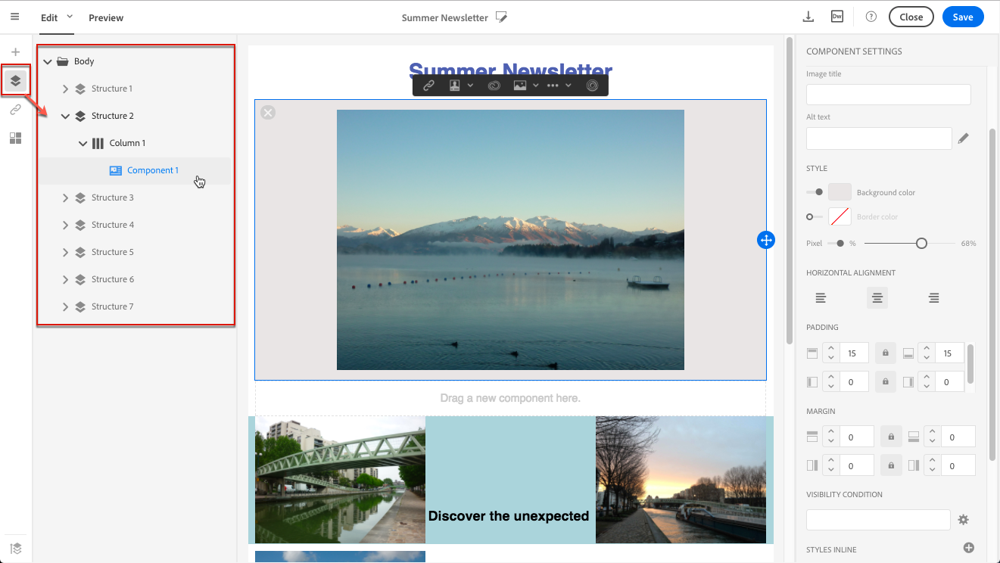
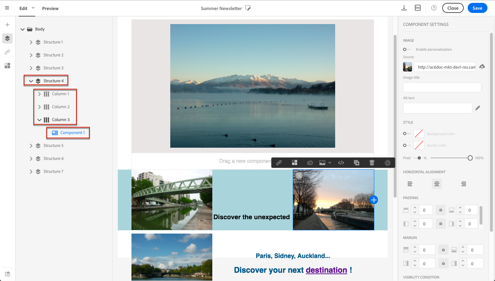
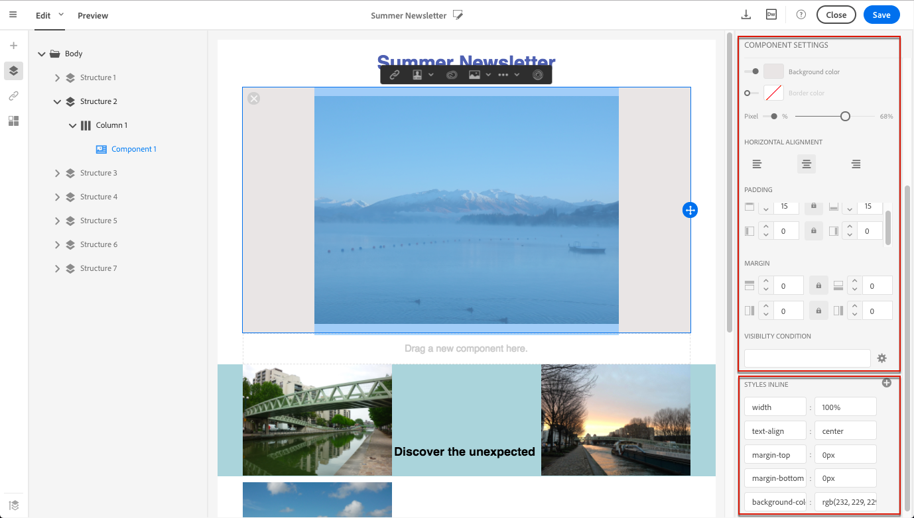
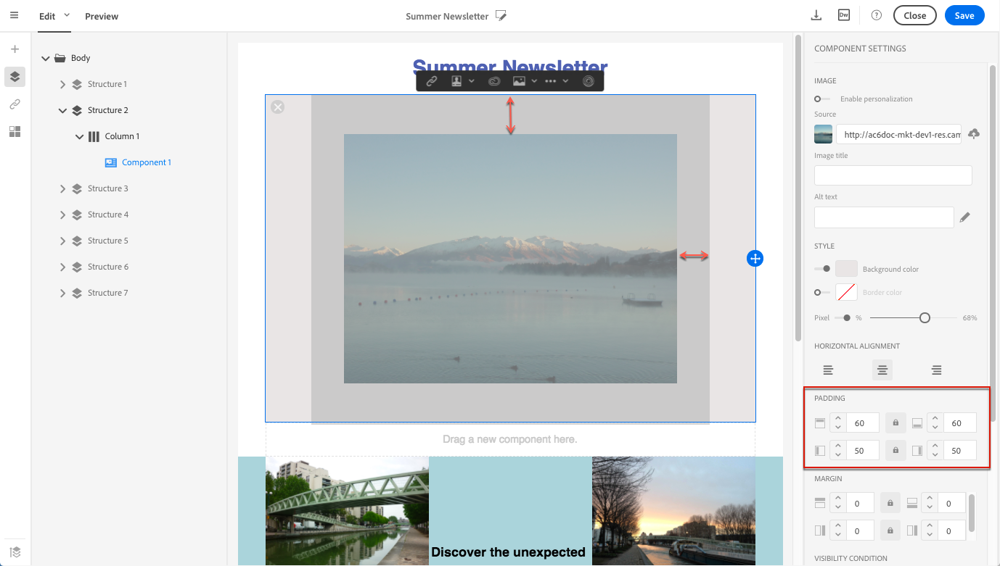
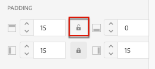
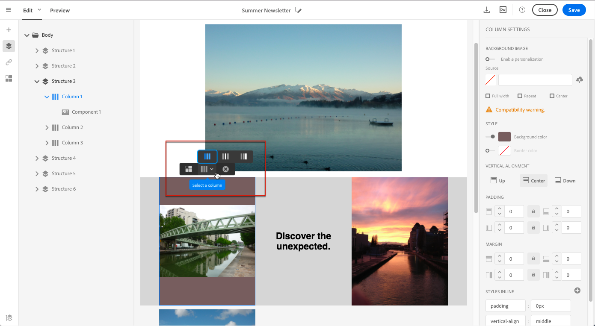
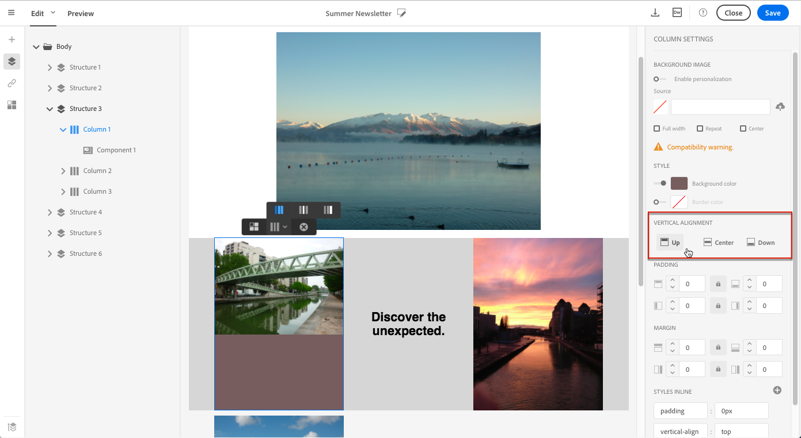
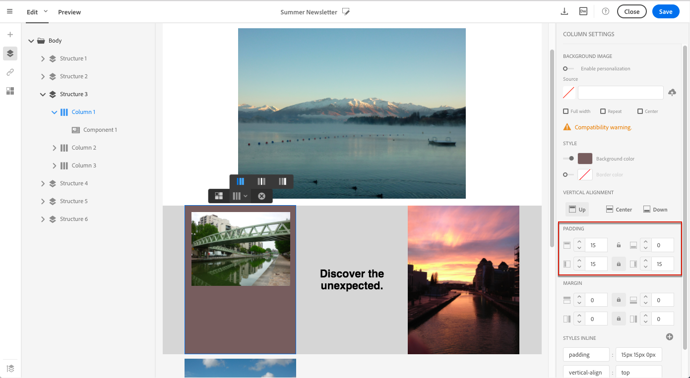
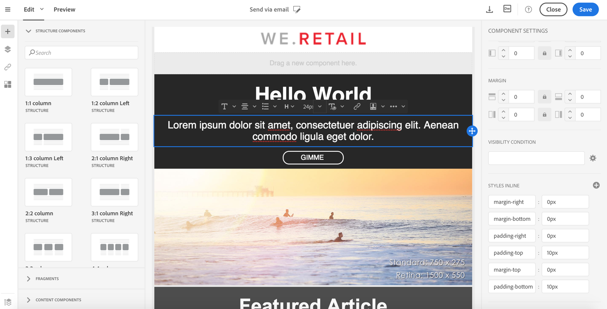

# Editing email styles{#editing-email-styles}

Editing email styles

## Editing an element with the Creative Designer {#editing-an-element-with-the-creative-designer}

In the Creative Designer, when selecting an element, several options specific to the type of content selected are displayed in the **Settings** pane. You can use these options to easily change the style of your email.

### Selecting an element {#selecting-an-element}

To select an element in the Creative Designer interface, you can either:

* click directly in the email,
* or browse the structure tree available from the options located in the left **Palette**.

Browsing the structure tree enables you to make a more accurate selection. You can select either:

* the whole structure component,
* one of the columns that compose the structure component,
* or only a component that is located inside a column.

To select a column, you can also do the following:

1. Select a structure component (directly in the email or using the structure tree available from the left **Palette**).
1. From the **contextual toolbar**, click **Select a column** to choose the desired column.

See an example in [this section](../../designing/using/editing-email-styles.md#example--adjusting-vertical-alignment-and-padding).

### Adjusting style settings {#adjusting-style-settings}

1. Select an element in your email. For more on this, see [this section](../../designing/using/editing-email-styles.md#selecting-an-element).
1. Adjust the settings according to your needs. Each selected element offers a different set of settings.

   You can insert backgrounds, change sizes, modify horizontal or vertical alignment, manage colors, add [padding or margin](../../designing/using/editing-email-styles.md#about-padding-and-margin), and so on.

   To do this, use the options displayed in the **Settings** pane or [add inline styling attributes](../../designing/using/editing-email-styles.md#adding-inline-styling-attributes-in-the-creative-designer).

   

1. Save your content.

### About padding and margin {#about-padding-and-margin}

The Creative Designer interface allows you to quickly adjust padding and margin settings.

**Padding**: this setting enables you to manage the space that is located inside an element's border.

**Margin**: this setting enables you to manage the space between the element's border and the next element.

>[!NOTE]
>
>Before adjusting **Padding** and **Margin**, make sure that you select the relevant element (structure component, column or content component) that you want to act upon. Depending on your selection, the result will not be the same.

For both **Padding** and **Margin**, click the lock icon to break synchronization between top and bottom or right and left parameters. This enables you to adjust each parameter separately.

### Example: adjusting vertical alignment and padding {#example-adjusting-vertical-alignment-and-padding}

You want to adjust padding and vertical alignment inside a structure component composed of three columns. To do this, follow the steps below:

1. Select the structure component directly in the email or using the structure tree available from the left **Palette**.
1. From the **contextual toolbar**, click **Select a column** and choose the one that you want to edit. You can also select it from the structure tree.

   

   The editable parameters for that column are displayed in the **Settings** pane on the right.

1. Under **Vertical alignment**, select **Up**.

   

   The content component displays on top of the column.

1. Under **Padding**, define the top padding inside the column. Click the lock icon to break synchronization with the bottom padding.

   Define the left and right padding for that column.

   

1. Proceed similarly to adjust the other columns' alignment and padding.

   

1. Save your changes.

## Adding inline styling attributes in the Creative Designer {#adding-inline-styling-attributes-in-the-creative-designer}

In the Creative Designer interface, when you select an element and display its settings on the side panel, you can customize the inline attributes and their value for that specific element.

1. Select an element in your content.
1. On the side panel, look for the **Styles Inline** settings.

   

1. Modify the values of the existing attributes, or add new ones using the **+** button. You can add any attribute and value that is CSS-compliant.

The styling is then applied to the selected element. If the child elements do not have specific styling attributes defined, the styling of the parent element is inherited.

## Managing email style with the content editor {#managing-email-style-with-the-content-editor}

Customizing the style of an email within the content editor is similar to editing this element in a landing page. See [Managing landing page structure and style](../../designing/using/managing-landing-page-structure-and-style.md).
