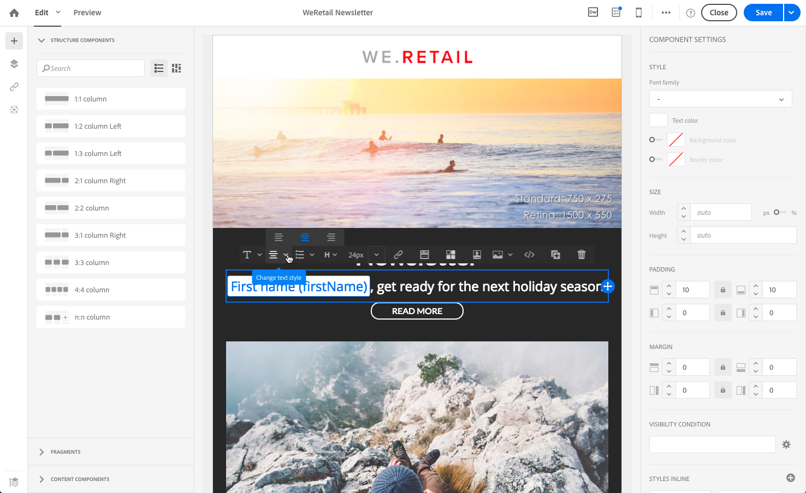

# Editing email styles{#editing-email-styles}

## Editing an element {#editing-an-element}

In the Email Designer, when selecting an element, several options specific to the type of content selected are displayed in the **[!UICONTROL Settings]** pane. You can use these options to easily change the style of your email.

### Selecting an element {#selecting-an-element}

To select an element in the Email Designer interface, you can either:

* click directly in the email,
* or browse the structure tree available from the options located in the left **Palette**.

Browsing the structure tree enables you to make a more accurate selection. You can select either:

* the whole structure component,
* one of the columns that compose the structure component,
* or only a component that is located inside a column.

To select a column, you can also do the following:

1. Select a structure component (directly in the email or using the structure tree available from the left **Palette**).
1. From the **contextual toolbar**, click **[!UICONTROL Select a column]** to choose the desired column.

See an example in [this section](../../designing/using/styles.md#example--adjusting-vertical-alignment-and-padding).

### Adjusting style settings {#adjusting-style-settings}

1. Select an element in your email. For more on this, see [Selecting an element](../../designing/using/styles.md#selecting-an-element).
1. Adjust the settings according to your needs. Each selected element offers a different set of settings.

   You can insert backgrounds, change sizes, modify horizontal or vertical alignment, manage colors, add [padding or margin](../../designing/using/styles.md#selecting-an-element), and so on.

   To do this, use the options displayed in the **[!UICONTROL Settings]** pane or [add inline styling attributes](../../designing/using/styles.md#adding-inline-styling-attributes).

   

1. Save your content.

### About padding and margin {#about-padding-and-margin}

The Email Designer interface allows you to quickly adjust padding and margin settings.

**[!UICONTROL Padding]**: this setting enables you to manage the space that is located inside an element's border.

For example:

* Use padding to set margins on the left and right sides of an image.
* Use top and bottom padding to add more spacing to a **[!UICONTROL Text]** or a **[!UICONTROL Divider]** component.
* To set borders between columns inside a structure element, define padding for each column.

**[!UICONTROL Margin]**: this setting enables you to manage the space between the element's border and the next element.

>[!NOTE]
>
>Depending on your selection (structure component, column or content component), the result will not be the same. Adobe recommends setting the **[!UICONTROL Padding]** and **[!UICONTROL Margin]** parameters at the column level.

For both **[!UICONTROL Padding]** and **[!UICONTROL Margin]**, click the lock icon to break synchronization between top and bottom or right and left parameters. This enables you to adjust each parameter separately.

### About alignment {#about-alignment}

* **Text alignment**: place the cursor of your mouse on some text and use the contextual toolbar to align it.

  

* **Horizontal alignment** can be applied to text, images and buttons - currently not to the **[!UICONTROL Divider]** and **[!UICONTROL Social]** components.

  

* To set **vertical alignment**, select a column inside a structure component and choose an option from the Settings pane.

  

### About backgrounds {#about-backgrounds}

When it comes to setting backgrounds with the Email Designer, Adobe recommends the following:

1. Apply a background color to the body of your email if required by your design.
1. In most cases, set background colors at the column level.
1. Try not to use background colors on image or text components as they are difficult to manage.

Below are the available background settings that you can use.

* Set a **[!UICONTROL Background color]** for the whole email. Make sure you select the body settings in the navigation tree accessible from the left Palette.

  

* Set the same background color for all structure components by selecting **[!UICONTROL Viewport background color]**. This option enables you to select a different setting from the background color.

  

* Set a different background color for each structure component. Select a structure in the navigation tree accessible from the left Palette to apply a specific background color only to that structure.

  

  Make sure you do not set a viewport background color as it may hide the structure background colors.

* Set a **[!UICONTROL Background image]** for the content of a structure component.

  

  >[!NOTE]
  >
  >Some email programs do not support background images. Make sure you select an appropriate fallback background color in case the image cannot be displayed.

* Set a background color at the column level.

  

  >[!NOTE]
  >
  >This is the most common use case. Adobe recommends setting background colors at the column level as this allows for more flexibility when editing the whole email content.

  You can also set a background image at the column level, but this is rarely used.

### Example: adjusting vertical alignment and padding {#example--adjusting-vertical-alignment-and-padding}

You want to adjust padding and vertical alignment inside a structure component composed of three columns. To do this, follow the steps below:

1. Select the structure component directly in the email or using the structure tree available from the left **Palette**.
1. From the **contextual toolbar**, click **[!UICONTROL Select a column]** and choose the one that you want to edit. You can also select it from the structure tree.

   

   The editable parameters for that column are displayed in the **[!UICONTROL Settings]** pane on the right.

1. Under **[!UICONTROL Vertical alignment]**, select **[!UICONTROL Up]**.

   

   The content component displays on top of the column.

1. Under **[!UICONTROL Padding]**, define the top padding inside the column. Click the lock icon to break synchronization with the bottom padding.

   Define the left and right padding for that column.

   

1. Proceed similarly to adjust the other columns' alignment and padding.

   

1. Save your changes.

## Adding inline styling attributes {#adding-inline-styling-attributes}

In the Email Designer interface, when you select an element and display its settings on the side panel, you can customize the inline attributes and their value for that specific element.

1. Select an element in your content.
1. On the side panel, look for the **[!UICONTROL Styles Inline]** settings.

   

1. Modify the values of the existing attributes, or add new ones using the **+** button. You can add any attribute and value that is CSS-compliant.

The styling is then applied to the selected element. If the child elements do not have specific styling attributes defined, the styling of the parent element is inherited.
