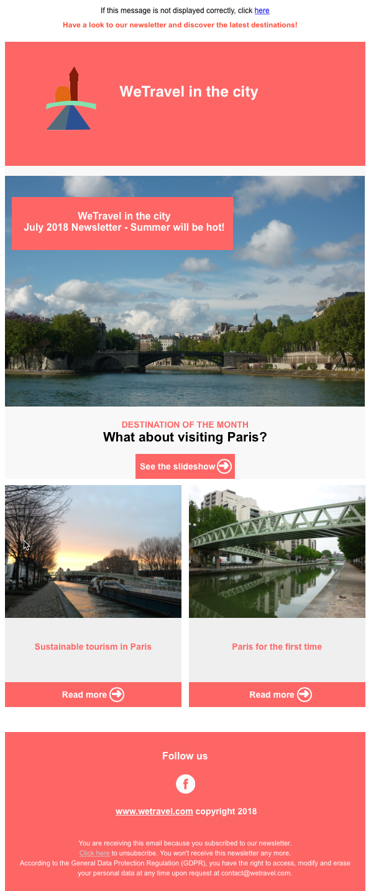
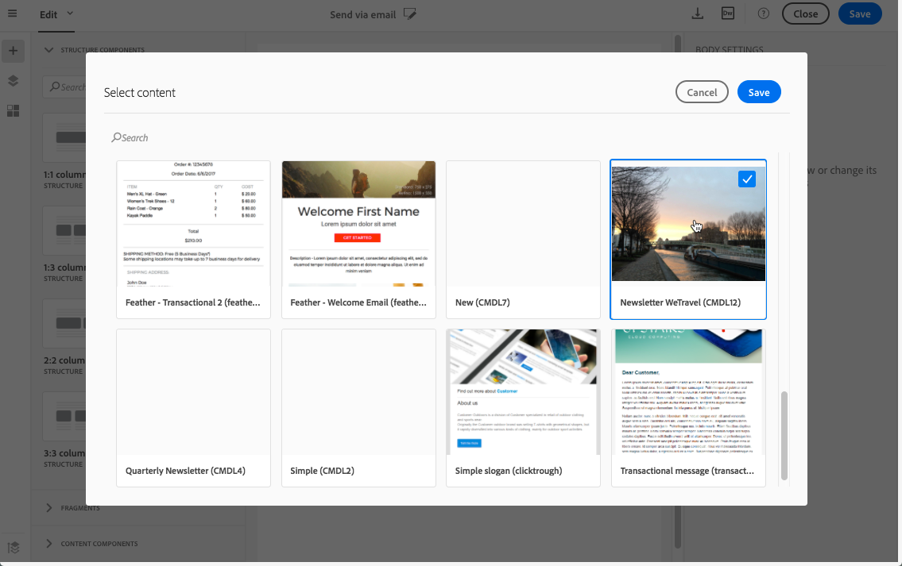

# Editing existing contents with the Creative Designer{#editing-existing-contents-with-the-creative-designer}

Editing existing contents with the Creative Designer

To fully leverage the edition possibilities of the [Creative Designer](../../designing/using/about-email-content-design.md#using-the-creative-designer), your uploaded HTML must contain specific tagging that makes it compliant with the WYSIWYG editor.

If all or part of the HTML does not have this tagging, the content is then loaded in ' [compatibility mode](../../designing/using/about-email-content-design.md#about-the-creative-designer-compatibility-mode)'.

>[!NOTE]
>
>Because they do not contain the specific tagging, the default content templates in Adobe Campaign are presently not fully supported by the Creative Designer.

To make an Adobe Campaign template or an existing external content fully editable within the Creative Designer, you have two options:

* Create a delivery with the Creative Designer and copy the content from your existing email into fragments and components. See [Using fragments and components to create contents supported by the Creative Designer](../../designing/using/editing-existing-contents-with-the-creative-designer.md#using-fragments-and-components-to-create-contents-supported-by-the-creative-designer).
* Upload your existing HTML into the Creative Designer and tag it using the specific attributes provided by Adobe. See [HTML tagging to ensure compatibility with the Creative Designer](../../designing/using/editing-existing-contents-with-the-creative-designer.md#html-tagging-to-ensure-compatibility-with-the-creative-designer).

>[!NOTE]
>
>Adobe recommends the first option which is faster and does not require any specific technical skills. The second option is reserved for more advanced users.

You can also create a delivery with the Creative Designer, copy-paste the HTML code from your original email using **Html** content components and adjust them according to your needs. For more on this, see [About content components](../../designing/using/defining-the-email-structure.md#about-content-components).

However, like the compatibility mode, a HTML component is editable with limited options. If you create an email using **Html** content components, you will not be able to use all the editing functionalities of the Creative Designer.

## Using fragments and components to create contents supported by the Creative Designer {#using-fragments-and-components-to-create-contents-supported-by-the-creative-designer}

To simply make an external content compliant with the Creative Designer, Adobe recommends creating a delivery from scratch and copy the content from your existing email into fragments and components.

A full example is presented below.

>[!NOTE]
>
>The new content will not be the exact copy of your original email, but the steps below will guide you through the creation of a delivery that will be as close as possible.

Let's say that you want to use an existing newsletter that was created outside of Adobe Campaign:



You want to have the same header and footer in all the emails that you will send with Adobe Campaign. The body of the email will change according to the content that you intend to display in each newsletter.

### Prerequisites {#prerequisites}

1. In your original email, identify the reusable sections from the sections that will be unique to each email that you will send.
1. Save all the images and assets that you want to use.
1. If you are familiar with HTML, split your original HTML content into different parts.

### Creating fragments for your reusable content {#creating-fragments-for-your-reusable-content}

Using the Creative Designer, create a fragment for each reusable section. In this example, you will create two fragments: one for the header and one for the footer. You can then copy the relevant parts from your existing content into these fragments.

To do this, follow the steps below:

1. In Adobe Campaign, go to **Resources** > **Content templates & fragments** and create a fragment for your header. For more on this, see [Creating a content fragment](../../designing/using/defining-the-email-structure.md#creating-a-content-fragment).
1. Add as many structure components as you need to your fragment.

   

1. Insert image and text components into your structure.

   

1. Upload the corresponding image, enter your text and adjust the settings.

   For more on managing style settings and inline attributes, see [Editing email styles](../../designing/using/editing-email-styles.md).

   

1. Save your fragment.
1. Proceed similarly to create your footer and save it.

   

   If you are familiar with HTML, you can copy-paste the HTML code from the original footer using the **Html** content component. For more on this, see [About content components](../../designing/using/defining-the-email-structure.md#about-content-components).

   

Your fragments are now ready to be used in a template.

### Inserting fragments and components into your template {#inserting-fragments-and-components-into-your-template}

You can now create an email template with the Creative Designer. Use content components to reflect the different sections of your email and adjust the settings to make them as close as possible to your original newsletter. Finally, insert the fragments that you just created.

1. Using the Creative Designer, create a template. For more on this, see [Content templates](../../start/using/about-templates.md#content-templates).
1. Insert several structure components into your template - corresponding to the header, footer and body of your email. For more on adding structure components, see [Editing the email structure with the Creative Designer](../../designing/using/defining-the-email-structure.md#editing-the-email-structure-with-the-creative-designer).
1. Insert as many content components as needed to create the body of your newsletter. This will be the editable content of your email that you will update every month.

   

   If you are familiar with HTML code, Adobe recommends leveraging **Html** components where you can copy-paste the more complex elements of the original email. Use other components such as **Button**, **Image** or **Text** for the rest of the content. For more on this, see [About content components](../../designing/using/defining-the-email-structure.md#about-content-components).

   >[!NOTE]
   >
   >Using the **Html** component results in creating components that are editable with limited options. Make sure you know how to handle HTML code before selecting this component.

1. Adjust the content components to match your original email as much as you can.

   

   For more on managing style settings and inline attributes, see [Editing email styles](../../designing/using/editing-email-styles.md).

1. Insert the [two fragments](../../designing/using/editing-existing-contents-with-the-creative-designer.md#creating-fragments-for-your-reusable-content) (header and footer) that you previously created into the desired structure components.

   

1. Save your template.

You can now fully manage this template within the Creative Designer to create and update the newsletter that you will send every month to your recipients.

To use it, create an email and select the content template that you just created.



**Related topic**:

[Creating an email](../../channels/using/creating-an-email.md)

## HTML tagging to ensure compatibility with the Creative Designer {#html-tagging-to-ensure-compatibility-with-the-creative-designer}

The [Creative Designer](../../designing/using/about-email-content-design.md#using-the-creative-designer) uses specific tagging. Standard HTML contents uploaded to Adobe Campaign must match the expected tagging to be fully compatible and editable.

This section lists the specific hierarchy and attributes needed to make a template or another content compliant with the Creative Designer.

### DOM hierarchy {#dom-hierarchy}

Use the following DOM hierarchy:

```

<HTML>
│
└─ <BODY>
  |
  └─ <DIV> Main container [1]
    |
    └─ <DIV> Structure [2]
      |
      └─ <TABLE> Structure table [3]
        |
        └─ <TBODY>
          |
          └─ <TR>
            |
            └─ <TH> Structure column [4]
              |
              └─ <DIV> Fragment/component container [5]
                |
                └─ <DIV> Fragment/component content wrapper [6]
                  |
                  └─ <DIV> Fragment/component content [7]
```

### CSS class names {#css-class-names}

Use the following CSS class names within the DOM hierarchy described above:

* **container** - on the main **&lt;div&gt;** node [1]: defines the first container element of the content.
* **structure** - on a **&lt;div&gt;** node [2]: defines a node as a **structure** container.
* **structure__table** - on a **&lt;table&gt;** node [3]: defines a node as a **table structure** wrapper.
* **colspan1** / **colspan2** / **colspan3** / **colspan4** - on a **&lt;th&gt;** node [4]: defines the number of columns that will compose a **structure**.
* **fragment** - on a **&lt;div&gt;** node [5]: defines a node as a **fragment**.
* **component** - on a **&lt;div&gt;** node [5]: defines a node as a **component**.
* **button-container** - on a **&lt;div&gt;** node [6]: button component wrapper class name.
* **text-container** - on a **&lt;div&gt;** node [6]: text component wrapper class name.
* **image-container** - on a **&lt;div&gt;** node [6]: image component wrapper class name.
* **divider-container** - on a **&lt;div&gt;** node [6]: divider component wrapper class name.

### Data attributes {#data-attributes}

Use the following data attributes within the DOM hierarchy described above:

* **data-structure-id** - on a **structure &lt;div&gt;** node [2]: defines the ID of the **structure** corresponding to its column arrangement.

  Possible values: **1-1-column** | **1-2-column** | **1-3-column** | **2-1-column** | **2-2-column** | **3-1-column** | **3-3-column** | **4-4-column**

* **data-structure-name** - on a **structure &lt;div&gt;** node [2]: defines the name of the structure. It is namespaced with **richtext**.

  Example: **richtext.structure_1_1_column**

* **data-component-id** - on a **component &lt;div&gt;** node [5]: defines the ID of a **component**.

  Possible values: **button** | **image** | **text** | **divider** | **social** | **carousel**

* **data-component-name** - on a **component &lt;div&gt;** node [5]: defines the name of the component. It is namespaced with **richtext**.

  Example: **richtext.component_button**

### Other attributes {#other-attributes}

* **contenteditable** - on a **component wrapper &lt;div&gt;** node [6]: allows to make the component editable (for text type components).

  Possible values: **true** | **false**

  >[!NOTE]
  >
  >The **component** container node ([5]) should have the **contenteditable="false"** attribute.

### DOM example {#dom-example}

```

<html>
  <head></head>
  <body>
    <divclass="container">
      <divclass="structure"data-structure-id="1-1-column"data-structure-name="richtext.structure_1_1_column">
        <tableclass="structure__table"align="center">
          <tbody>
            <tr>
              <thclass="colspan1" >
                <divclass="fragment component"data-component-id="button"data-component-name="richtext.component_button"contenteditable="false">
                  <divcontenteditable="true"class="button-container">
                    <ahref="#">Button</a>
                  </div>
                </div>
              </th>
            </tr>
          </tbody>
        </table>
      </div>
    </div>
  </body>
</html>

```

