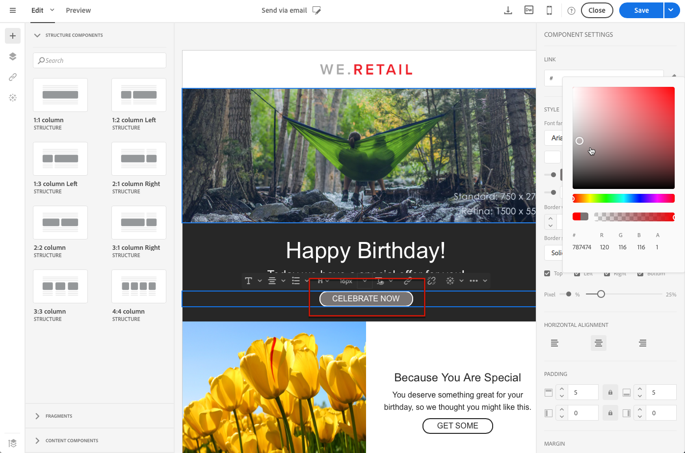
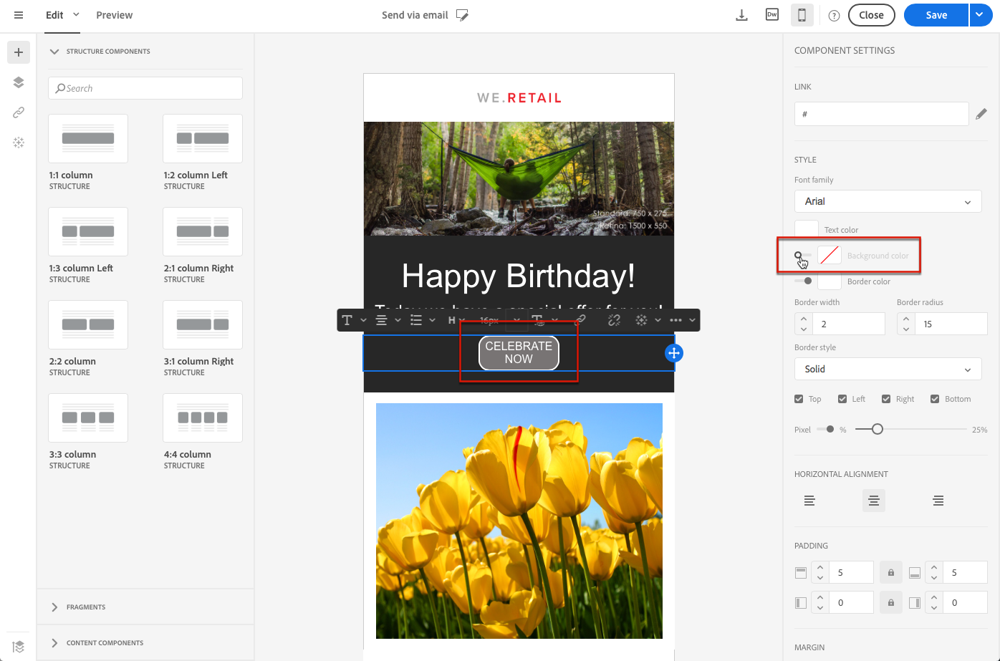

## Quick Start: Design and personalize an email 

You can create an email, add components and personalize their content to send a delivery quickly. 

### Add a structure component

Structure components will define the layout of your email. 

1.	Create an email. 
1.	Close homepage. 
1.	In Structure components, drag and drop components for the layout you want to use. 
Note: You can select different content layouts that will add up in your email. 

### Add a content component image
1.	In Content Components, drag and drop image into one of your structure components. 
1.	Click Browse.
1.	Select your image file from your computer. 

### Add a content component text with personalization 
1.	In Content Components, drag and drop text into one of your structure components. 
1.	Click on the component and enter your text. 
1.	To add a personalization field, click Insert personalization field in the toolbar. 
1.	Select the field you need, such as First Name. 

### Add a content component button

1.	In Content Components, drag and drop button into one of your structure components. 
1.	Click on the component. 
1.	Click link. 
1.	 Enter a url and a label 
1.	Click Save.
1.	Save your email. 

## Quick Start: Importing and editing an HTML email

When you upload a content, it must contain specific tagging to be fully compliant and editable with the WYSIWYG editor of the Email Designer.

If all or part of the uploaded HTML is not compliant with the expected tagging, the content is then loaded in 'compatibility mode', which limits the edition possibilities through the UI.

When a content is loaded in compatibility mode, you can still perform the following modifications through the interface (unavailable actions are hidden):

* Changing the text or changing an image
* Inserting links and personalization fields
* Edit some styling options on the selected HTML block
* Defining conditional content


Other modifications such as adding new sections to your email or advanced styling must be done directly in the source code of the email via the HTML mode.

For more on converting an existing email into an Email Designer-compatible email, see [this section](../../designing/using/using-existing-content.md).


## Quick Start:  Converting an HTML content {#converting-an-html-content}

This use case offers a quick way to convert an HTML email into Email Designer components.

>[!CAUTION]
>
>This section is for advanced users who are familiar with HTML code.

>[!NOTE]
>
>Like the compatibility mode, a HTML component is editable with limited options: you can only perform in-place edition.

Outside of the Email Designer, make sure the original HTML is divided into reusable sections.

If this is not the case, cut out the different blocks from your HTML. For example:

```
<!-- 3 COLUMN w/CTA (SCALED) -->
<table width="100%" align="center" cellspacing="0" cellpadding="0" border="0" role="presentation" style="max-width:680px;">
<tbody>
<tr>
<td class="padh10" align="center" valign="top" style="padding:0 5px 20px 5px;">
<table width="100%" cellspacing="0" cellpadding="0" border="0" role="presentation">
<tbody>
<tr>
...
</tr>
</tbody>
</table>
</td>
</tr>
</tbody>
</table>
<!-- //3 COLUMN w/CTA (SCALED) -->
```

Once you have identified all your blocks, in the Email Designer, repeat the following procedure for each section of your existing email:

1. Open the Email Designer to create an empty email content.
1. Set the body level attributes: background colors, width, etc. For more on this, see [Editing email styles](../../designing/using/editing-email-styles.md).
1. Add a structure component. For more on this, see [Editing the email structure](../../designing/using/defining-the-email-structure.md#editing-the-email-structure).
1. Add an HTML component. For more on this, see [Adding fragments and components](../../designing/using/designing-from-scratch.md#editing-the-email-structure).
1. Copy-paste your HTML into that component.
1. Switch to mobile view. For more on this, see [this section](../../designing/using/styles.md#switching-to-mobile-view).

   The responsive view is broken, because your CSS is missing.

1. To fix this, switch to source code mode and copy-paste your style section into a new style section. For example:

   ```
   <style type="text/css">
   a {text-decoration:none;}
   body {min-width:100% !important; margin:0 auto !important; padding:0 !important;}
   img {line-height:100%; text-decoration:none; -ms-interpolation-mode:bicubic;}
   ...
   </style>
   ```

   >[!NOTE]
   >
   >Do not modify the CSS generated by the Email Designer: `<style acrite-template-css="true">` and `<style acrite-custom-styles="" type="text/css">`. Make sure you add your style after this.

1. Go back to the mobile view to check that your content is correctly displayed and save your changes.

## Switching to mobile view {#switching-to-mobile-view}

You can fine-tune the responsive design of an email by separately editing all style options for mobile display. For example, you can adapt margins and padding, use smaller or bigger font sizes, change buttons, or apply different background colors that will be specific to the mobile version of your email.

All style options are available in mobile view. The Email Designer style settings are presented in the [Editing email styles](../../designing/using/editing-email-styles.md) section.

1. Create an email and start editing the content. For more on this, see [Designing an email content from scratch](../../designing/using/designing-from-scratch.md#designing-an-email-content-from-scratch).
1. To access the dedicated mobile view, select the **[!UICONTROL Switch to mobile view]** button.

   

   The mobile version of the email is displayed. It contains all the components and styles that were defined in desktop view.

1. Edit independently all style settings such as background color, alignment, padding, margin, font family, text color, and so on.

   

1. When editing any style setting in mobile view, the modifications are only applied to the mobile display.

   For example, reduce the size of an image, add a green background and change the padding in mobile view.

   

1. You can hide a component when displayed on a mobile device. To do this, select **[!UICONTROL Show only on desktop devices]** from the **[!UICONTROL Display options]**.
You can also choose to hide this component on desktop devices, which means that it will be displayed on mobile devices only. To do this, select **[!UICONTROL Show only on mobile devices]**.
For example, this option enables you to display a specific image on mobile devices and another image on desktop devices.
You can either set this option from the mobile or desktop view.

   

1. Click again the **[!UICONTROL Switch to mobile view]** button to go back to the standard desktop view. The style changes you just made are not reflected.

   

   >[!NOTE]
   >
   >The only exception is the **[!UICONTROL Style inline]** settings. Any style inline setting change is also applied to the standard desktop view.

1. Any other change to the structure or the content of the email such as text edits, uploading a new image, adding a new component, etc. is also applied to the standard view.

   For example, switch back to mobile view, edit some text and replace an image.

   

   Click again the **[!UICONTROL Switch to mobile view]** button to go back to the standard desktop view. The changes are reflected.

   

1. Removing a style in mobile view takes you back to the style that was applied in desktop mode.

   For example, in mobile view, apply a green background color to a button.

   

1. Switch to desktop view and apply a grey background to the same button.

   

1. Switch again to mobile view, and now disable the **[!UICONTROL Background color]** setting.

   

   The background color defined in desktop view is now applied: it turns grey (not blank).

   The only exception is the **[!UICONTROL Border color]** setting. When disabled in mobile view, no border is applied anymore, even if a border color is defined in desktop view.
