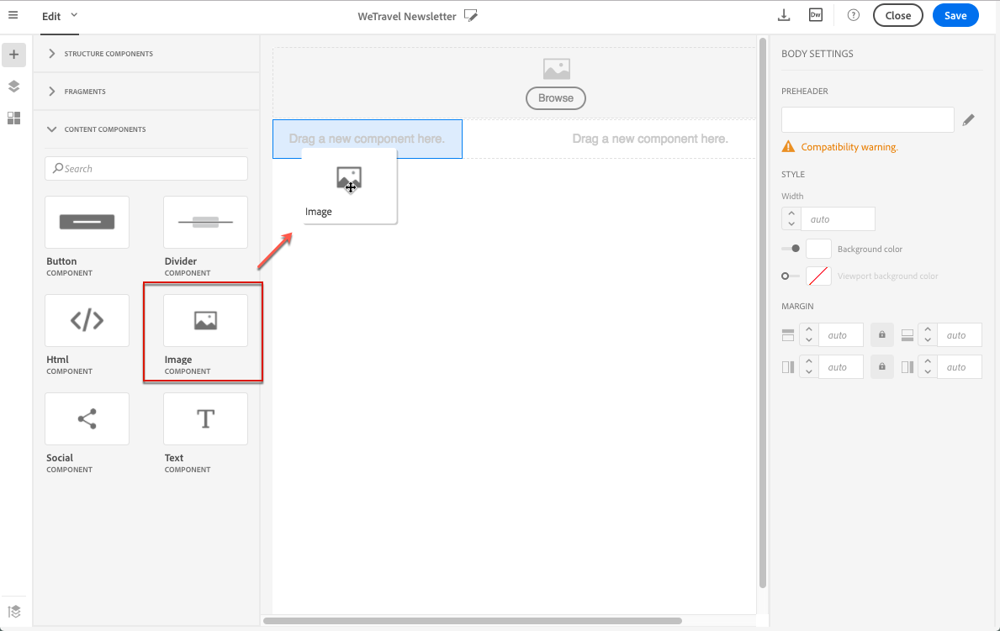
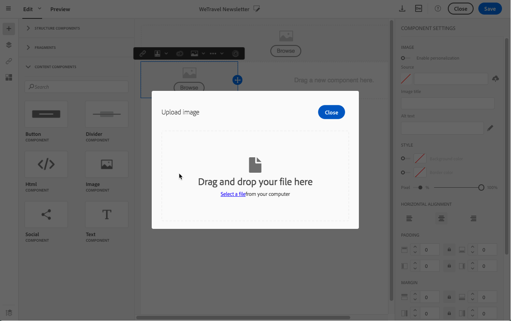
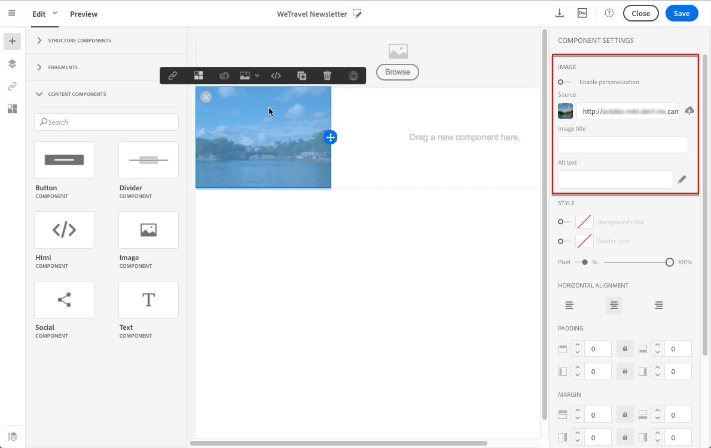
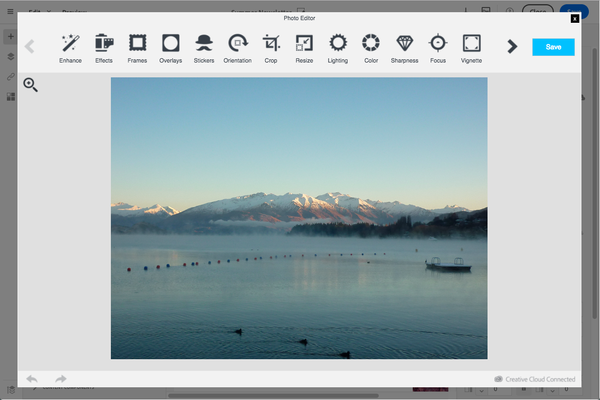

# Working with images {#images} 

## Inserting images{#inserting-images}

You can insert images in your emails and landing pages.

The following types of images are available, depending on your configuration:

* Local images
* Images shared from Adobe Experience Cloud - refer to [Working with Campaign and Assets Core Service](../../integrating/using/working-with-campaign-and-assets-core-service.md) / Assets On Demand
* Dynamic images from Adobe Target - refer to [Working with Campaign and Target](../../integrating/using/about-campaign-target-integration.md)

>[!CAUTION]
>
>If you choose to add an image directly by editing the HTML version of the email, you must not call up **external files in a &lt;script&gt; tag** of the HTML page. These files will not be imported onto the Adobe Campaign server.

### Inserting images in an email {#inserting-images-in-an-email}

1. Add a structure component. For more on this, see [Editing the email structure](../../designing/using/designing-from-scratch.md#defining-the-email-structure).
1. Inside this structure component, add an **[!UICONTROL Image]** content component.

   

1. Click **[!UICONTROL Browse]**. Drag and drop an image or click to select a file from your computer.

   

1. Select the content component that you just added.
1. Check the image properties and adjust them if needed.

   

## Setting up image properties{#setting-up-image-properties}

When you select a block that contains an image, the following properties are offered in the palette:

* **Enable personalization** allows you to customize the image source. See [Personalizing an image source](../../designing/using/personalization.md#personalizing-an-image-source).
* **Image Title** lets you define a title for the image.
* **Alt text** (email) or **Caption** (landing page) lets you define the caption linked to the image (corresponds to the **alt** HTML attribute).
* When editing an email, **Style** lets you specify the image size, background, and border.
* When editing a landing page, **Dimensions** lets you specify the image size in pixels.

The editor allows you to work with **all image types** whose formats are compatible with browsers. To be compatible with the editor, the **"Flash" type animations** have to be inserted in an HTML page as follows:

```

<object type="application/x-shockwave-flash" data="http://www.mydomain.com/flash/your_animation.swf" width="200" height="400">
 <param name="movie" value="http://www.mydomain.com/flash/your_animation.swf" />
 <param name="quality" value="high" />
 <param name="play" value="true"/>
 <param name="loop" value="true"/> 
</object>

```

<!--
## Modifying images with the Adobe Creative SDK{#modifying-images-with-the-adobe-creative-sdk}

You can edit images and use a complete set of features powered by the Adobe Creative SDK to enhance your images directly in the content editor when editing emails or landing pages.

The image editor offers a powerful, full-featured image editing UI component that allows you to edit images and apply effects and frames, original high-quality stickers, beautiful overlays, fun features like tilt shift and color splash, pro-level adjustments and more.

To modify an image with the Adobe Creative SDK:

1. Select the image.
1. In the toolbar, click the Creative Cloud icon.

   

1. Select the tool you want to use through the icons on the top of the window to modify the image.

   

1. Click **[!UICONTROL Save]** when modifications are done. The updated image is saved on Adobe Campaign server and ready to be used.

>[!NOTE]
>
>Tools offered in the image editor cannot be customized.
-->