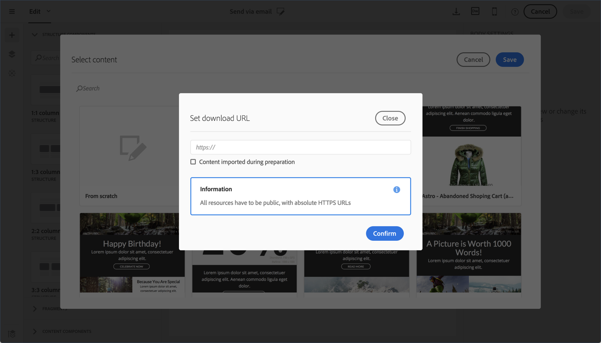
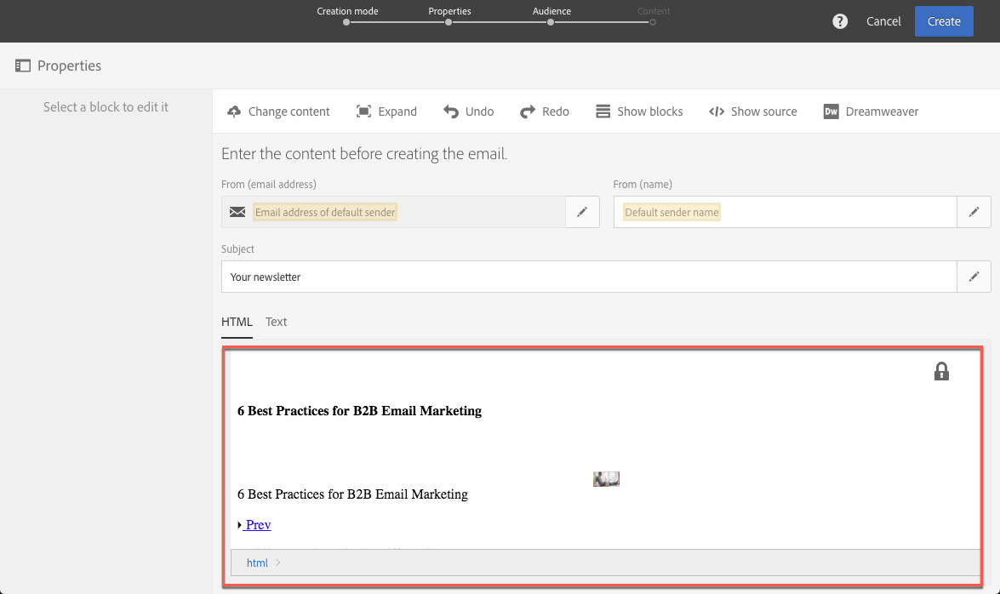
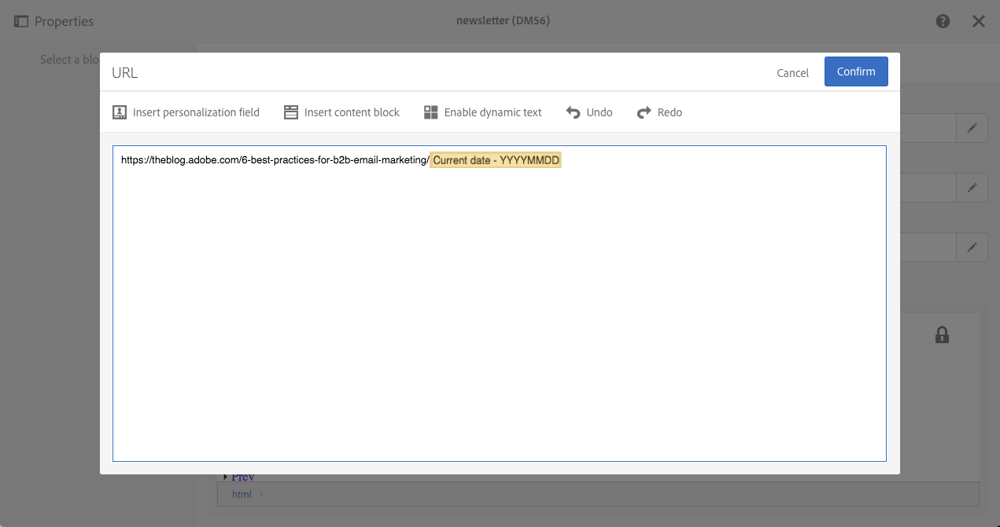

# Importing content from a URL{#importing-content-from-a-url}

Importing content from a URL

Before importing content from a URL, make sure it follows the requirements below:

* The content needs to be publicly available via this URL.
* For security reasons, only URLs beginning with **https** are allowed.
* Make sure that all resources (images, CSS) are set in absolute links and in HTTPS. Otherwise, after sending the email, the mirror page would be displayed without its resources. Here is an example of an absolute link definition:

  ```
  <a href="https://www.mywebsite.com/images/myimage.png">
  ```

>[!NOTE]
>
>Loading content from a URL is available for the email channel only.

To retrieve existing content form a URL, follow the steps below:

1. Click the **Change content** icon, then select the **From URL** element.

   

1. Define the URL from which the content will be retrieved, then click **Confirm**.

   

## Retrieving content from a URL automatically at preparation time {#retrieving-content-from-a-url-automatically-at-preparation-time}

Importing content from a URL during message preparation enables you to retrieve the latest HTML content each time the email is prepared. This way, the content of recurring emails is always up-to-date at the time of their sending. This feature also enables you to create a message scheduled at a specific date, even if the content is not ready yet.

To retrieve content at preparation time, follow the steps below:

1. Select the **Content imported during preparation** option.

   

1. The URL content displays in the editor.

   

   >[!CAUTION]
   >
   >At this step, the HTML display in the content editor should not be taken into account. It will be retrieved at the preparation phase.

1. To preview the URL content that has been retrieved, open the message once it is created then click the **Preview** button.

It is possible to personalize the remote URL from which the content will be retrieved. To do this, follow the steps below:

1. Click the **Email properties** button, then edit the **Remote URL** field.

   

1. Insert the desired personalization field, content block or dynamic text then click **Save**.

   The **Current date - YYYYMMDD** content block, for example, enables you to insert the date of the day.

   >[!NOTE]
   >
   >The available personalization fields are linked to **Delivery** attributes only (email creation date, status, campaign label...).

   

