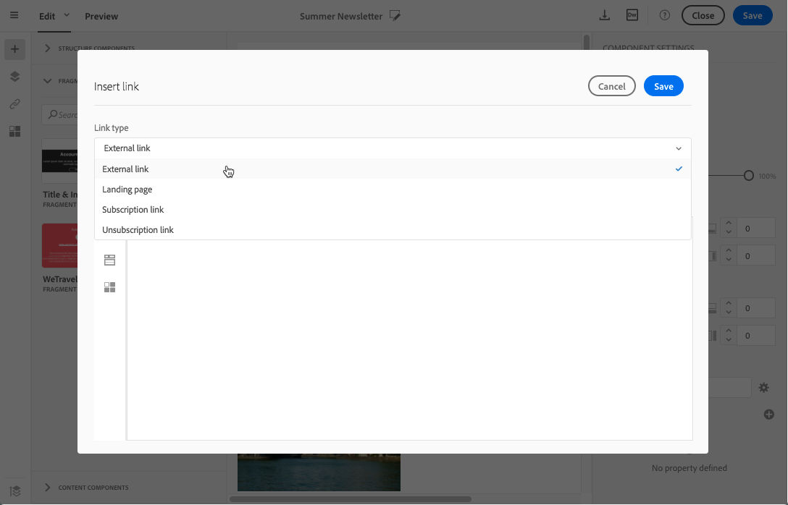
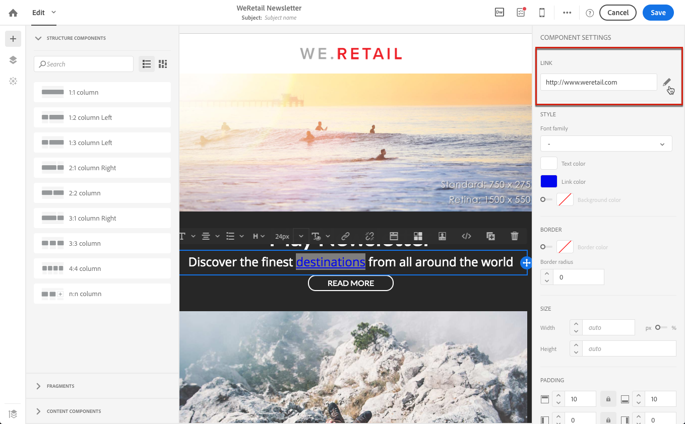
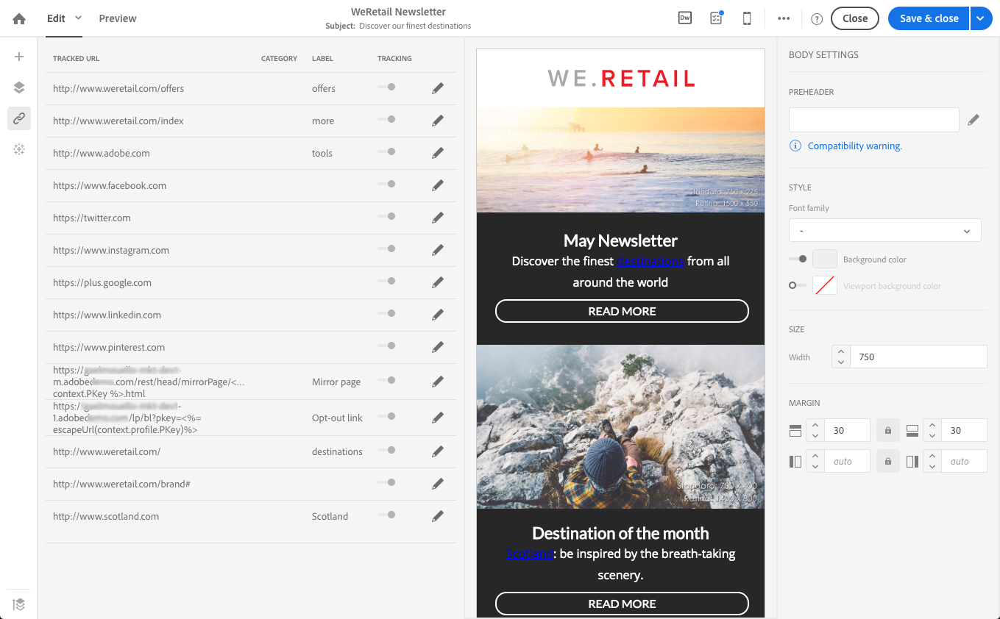

<!--# Inserting a link{#inserting-a-link}

The editor allows you to personalize an email or landing page by inserting links into the HTML content elements.

You can insert a link into any page element: image, word, group of words, block of text, etc.

>[!NOTE]
>
>The images below show how to insert a link using the [Email Designer](../../designing/using/about-email-content-design.md#about-the-email-designer) in an email.

1. Select an element and click **[!UICONTROL Insert link]** from the contextual toolbar.

   

1. Choose the type of link you want to create:

    * **External link**: insert a link to an external URL.

      You can define personalization for your URLs. See [Personalizing URLs](../../designing/using/personalizing-urls.md).
    
    * **Landing page**: give access to an Adobe Campaign landing page.
    * **Subscription link**: insert a link to subscribe to an Adobe Campaign service.
    * **Unsubscription link**: insert a link to unsubscribe from an Adobe Campaign service.
    * **Link that defines an action**: define an action when an element in the landing page is clicked.

      >[!NOTE]
      >
      >This type of link is only available for landing pages.

1. You can modify the text displayed to the recipient.
1. You can set the browser behavior when the user clicks the link (for example, open a new window).

   >[!NOTE]
   >
   >Defining the browser behavior only apply to landing pages.

1. Save your changes.

Once the link is created, you can still modify it from the Settings pane. Click the pencil icon to edit its parameters.

When editing an email with the [Email Designer](../../designing/using/about-email-content-design.md#about-the-email-designer), you can easily access and modify the links that you created from the table listing all the URLs included in the email. This list enables you to have a centralized view and to locate each URL in the email content. To access it, see [About tracked URLs](../../designing/using/about-tracked-urls.md).

>[!NOTE]
>
>Personalized URLs such as **Mirror page URL** or **Unsubscription** link cannot be modified from this list. All other links are editable.

