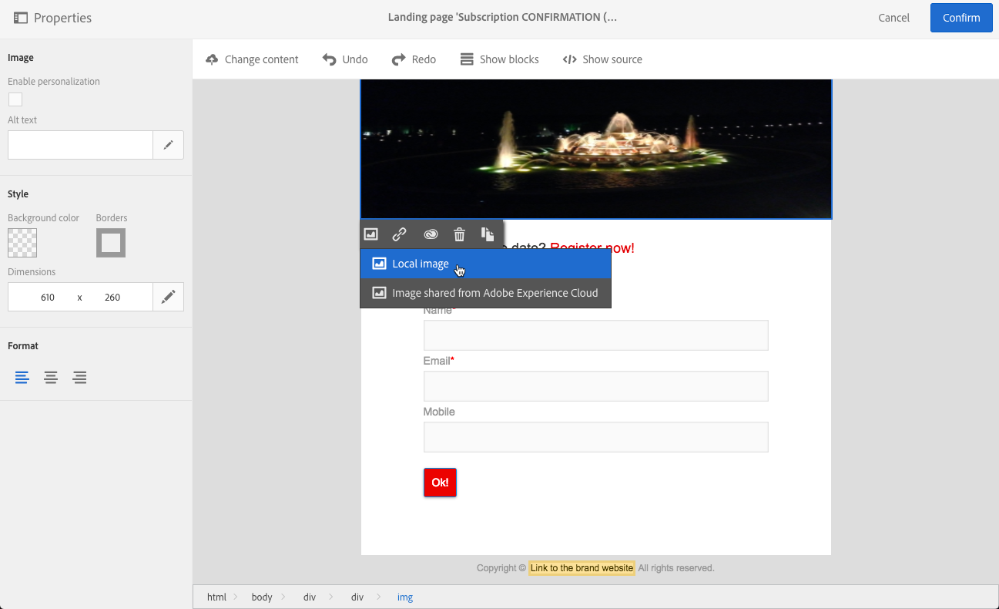
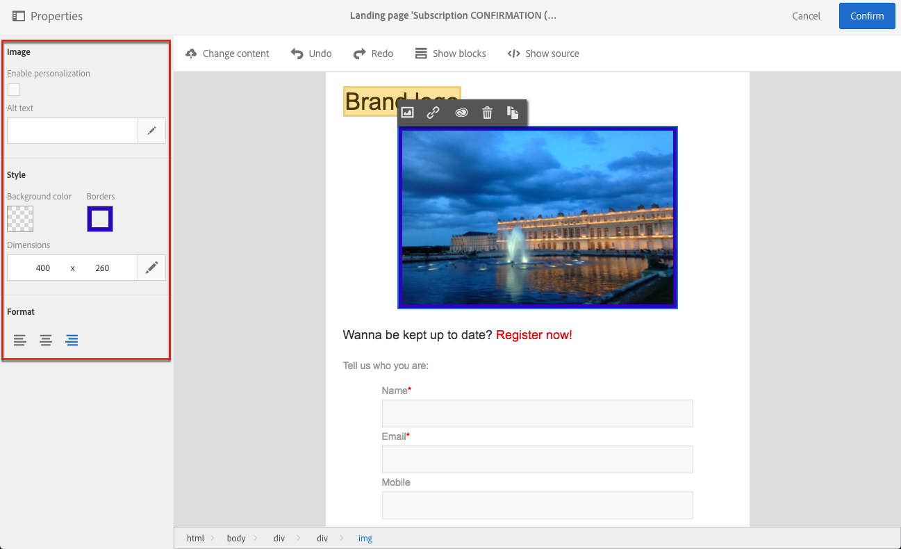

# Inserting images{#inserting-images}

Inserting images

You can insert images in your emails and landing pages.

The following types of images are available, depending on your configuration:

* Local images
* Images shared from Adobe Experience Cloud - refer to [Working with Campaign and Assets Core Service](../../integrating/using/working-with-campaign-and-assets-core-service.md) / Assets On Demand
* Dynamic images from Adobe Target - refer to [Working with Campaign and Target](../../integrating/using/about-campaign-target-integration.md)

If enabled, you can modify images with the Adobe Creative SDK. See [Modifying images with the Adobe Creative SDK](../../designing/using/modifying-images-with-the-adobe-creative-sdk.md).

>[!CAUTION]
>
>If you choose to add an image directly by editing the HTML version of the email, you must not call up **external files in a &lt;script&gt; tag** of the HTML page. These files will not be imported onto the Adobe Campaign server.

## Inserting images in an email {#inserting-images-in-an-email}

1. Add a structure component. For more on this, see [Editing the email structure](../../designing/using/defining-the-email-structure.md#editing-the-email-structure).
1. Inside this structure component, add an **Image** content component.

   

1. Click **Browse**. Drag and drop an image or click to select a file from your computer.

   

1. Select the content component that you just added.
1. Check the image properties and adjust them if needed.

   

## Inserting images in a landing page {#inserting-images-in-a-landing-page}

1. In a landing page content, select a block containing an image.
1. Select the **Insert** button.

   

1. Choose **Local image** from the contextual toolbar.

   

1. Select a file.

   

1. Adjust the image properties as needed.

   

