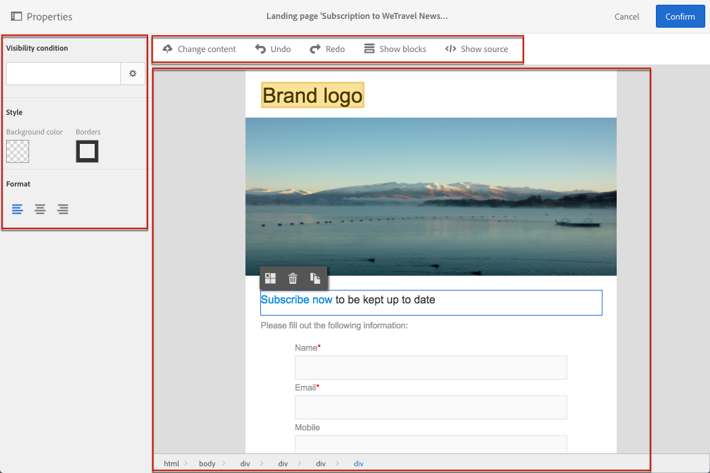
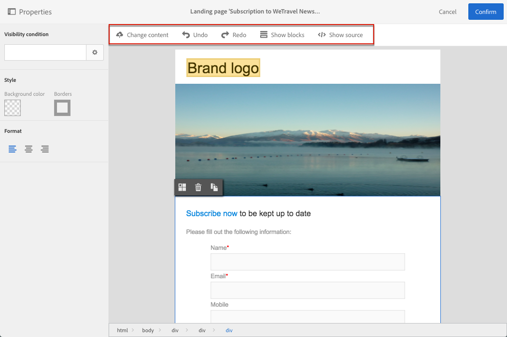

# Landing page content editor interface{#landing-page-content-editor-interface}

Landing page content editor interface

The content editor is organized into three different sections. These sections allow you to view and edit the content.

1. The **palette** on the left-hand side of the screen allows you to modify the general options linked to a selected block. The options that can be modified are: background color, border, text alignment, visibility condition, etc. See [Inserting a personalization field](../../designing/using/inserting-a-personalization-field.md).
1. The **action bar** contains the general options for the page. You can select a template and change the display mode. See [Landing page editor action bar](../../designing/using/landing-page-content-editor-interface.md#landing-page-editor-action-bar).
1. The main **editing zone** allows you to directly interact with the content using the contextual toolbar: insert a link into an image, change the font, delete a field, etc. See [Landing page editor toolbar](../../designing/using/landing-page-content-editor-interface.md#landing-page-editor-toolbar).

## Landing page editor action bar {#landing-page-editor-action-bar}

The action bar contains different buttons that allow you to interact with the content that is being created.

<table> 
 <thead> 
  <tr> 
   <th> Icon  </th> 
   <th> Button name  </th> 
   <th> Channel  </th> 
   <th> Description  </th> 
  </tr> 
 </thead> 
 <tbody> 
  <tr> 
   <td>    </td> 
   <td> <strong>Change content</strong>  </td> 
   <td> Landing page and email  </td> 
   <td> Allows you to select out-of-the-box content or import your own HTML content. Refer to <a href="../../designing/using/selecting-an-existing-content.md">Loading an existing content</a>.  </td> 
  </tr> 
  <tr> 
   <td>    </td> 
   <td> <strong>Undo</strong>  </td> 
   <td> All  </td> 
   <td> Cancels the last action carried out.  </td> 
  </tr> 
  <tr> 
   <td>    </td> 
   <td> <strong>Redo</strong>  </td> 
   <td> All  </td> 
   <td> Redoes the last action that you canceled.  </td> 
  </tr> 
  <tr> 
   <td>    </td> 
   <td> <strong>Show blocks</strong>  </td> 
   <td> Landing page and email  </td> 
   <td> Allows you to show the boxes around the content blocks (corresponds to the <strong>&lt;div&gt;</strong> HTML tag).  </td> 
  </tr> 
  <tr> 
   <td>    </td> 
   <td> <strong>Show source</strong>  </td> 
   <td> Landing page and email  </td> 
   <td> Allows you to show the HTML source code of the page.  </td> 
  </tr> 
 </tbody> 
</table>

## Landing page editor toolbar {#landing-page-editor-toolbar}

The contextual landing page editor toolbar is the same that is used in the email content editor. It is described in [this section](../../designing/using/about-email-content-design.md#email-content-editor-toolbar).
