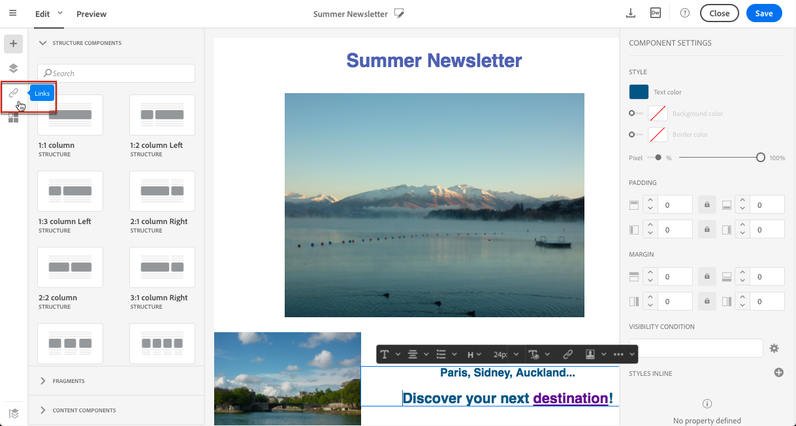
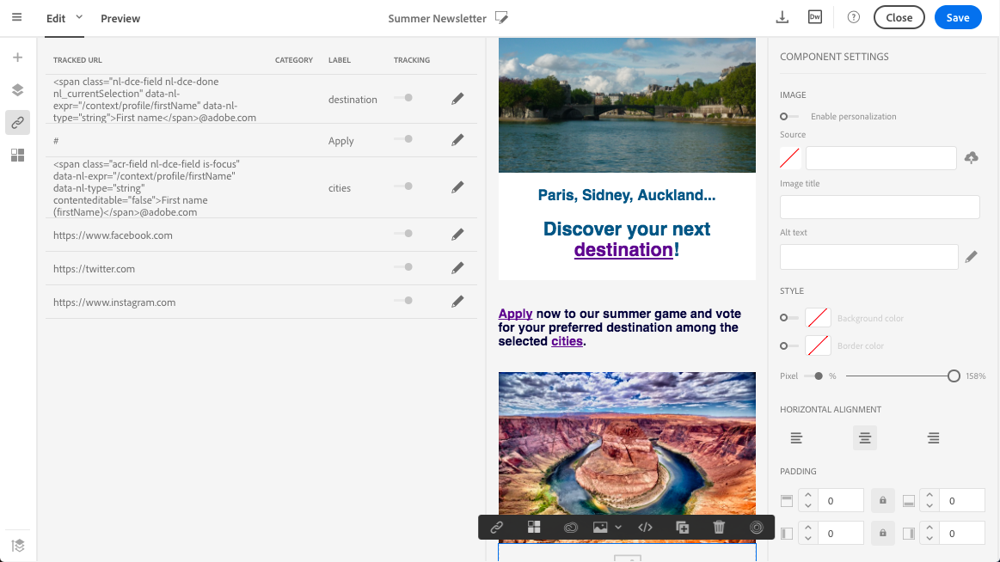
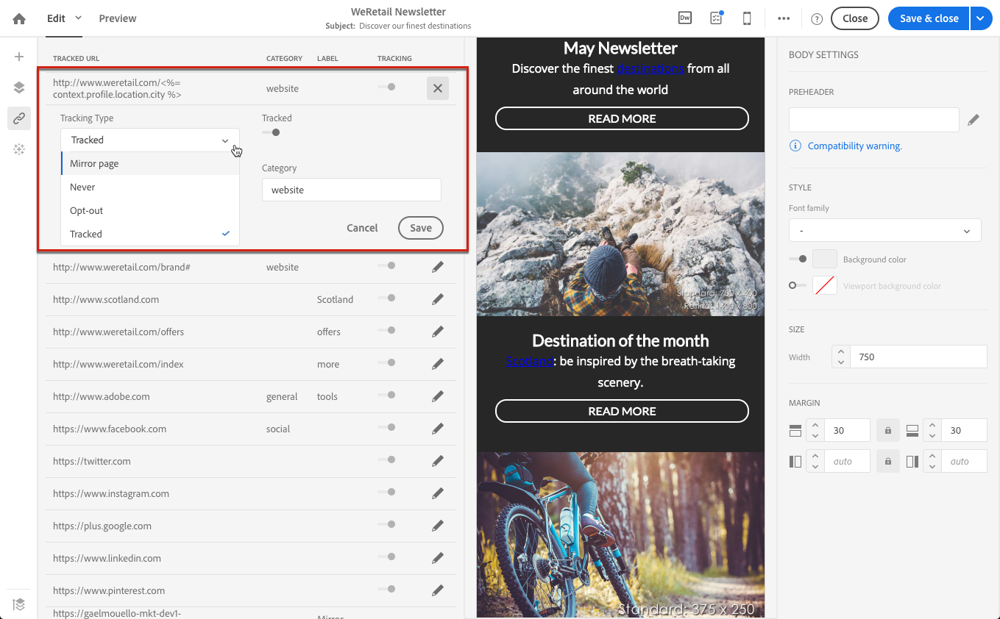
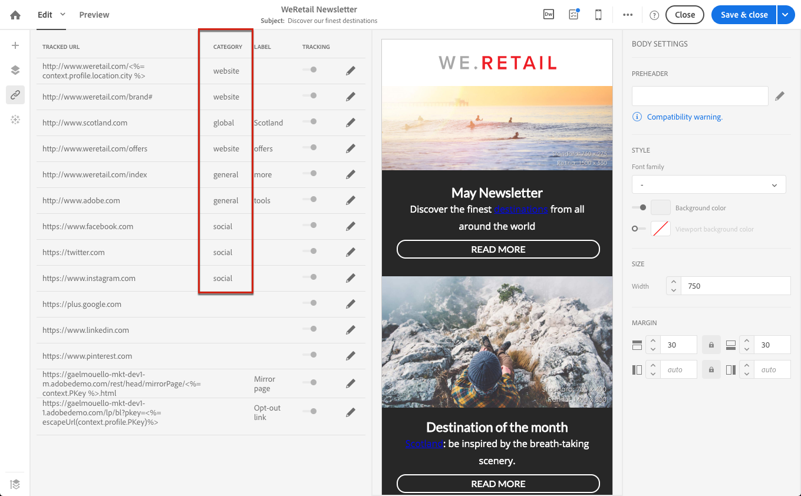
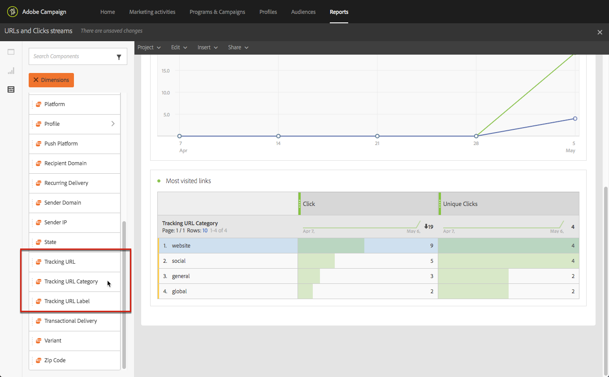

# Adding links {#links}

## Inserting a link {#inserting-a-link}

The editor allows you to personalize an email or landing page by inserting links into the HTML content elements.

You can insert a link into any page element: image, word, group of words, block of text, etc.

>[!NOTE]
>
>The images below show how to insert a link using the [Email Designer](../../designing/using/designing-content-in-adobe-campaign.md) in an email.

1. Select an element and click **[!UICONTROL Insert link]** from the contextual toolbar.

   

1. Choose the type of link you want to create:

    * **External link**: insert a link to an external URL.

      You can define personalization for your URLs. See [Personalizing URLs](../../designing/using/using-reusable-content.md#creating-a-content-fragment).
    
    * **Landing page**: give access to an Adobe Campaign landing page.
    * **Subscription link**: insert a link to subscribe to an Adobe Campaign service.
    * **Unsubscription link**: insert a link to unsubscribe from an Adobe Campaign service.
    * **Link that defines an action**: define an action when an element in the landing page is clicked.

      >[!NOTE]
      >
      >This type of link is only available for landing pages.

1. You can modify the text displayed to the recipient.
1. You can set the browser behavior when the user clicks the link (for example, open a new window).

   >[!NOTE]
   >
   >Defining the browser behavior only apply to landing pages.

1. Save your changes.

Once the link is created, you can still modify it from the Settings pane. Click the pencil icon to edit its parameters.

When editing an email with the [Email Designer](../../designing/using/designing-content-in-adobe-campaign.md), you can easily access and modify the links that you created from the table listing all the URLs included in the email. This list enables you to have a centralized view and to locate each URL in the email content. To access it, see [About tracked URLs](#about-tracked-urls).

>[!NOTE]
>
>Personalized URLs such as **Mirror page URL** or **Unsubscription** link cannot be modified from this list. All other links are editable.

**Related topics**:

* [Inserting a personalization field](../../designing/using/personalization.md#inserting-a-personalization-field)
* [Adding content blocks](../../designing/using/personalization.md#adding-a-content-block)
* [Defining dynamic content](../../designing/using/personalization.md#defining-dynamic-content-in-an-email)

## About tracked URLs {#about-tracked-urls}

Adobe Campaign enables you to track the behavior of your recipients when they click a URL included in an email. For more on tracking, see [this section](../../sending/using/tracking-messages.md#about-tracking).

The **[!UICONTROL Links]** icon in the action bar automatically displays the list of all the URLs of your content that will be tracked.

>[!NOTE]
>
>Tracking is activated by default. This functionality is only available for emails, if tracking has been activated in Adobe Campaign. For more on the tracking parameters, refer to [this section](../../administration/using/configuring-email-channel.md#tracking-parameters).

The URL, category, label, and tracking type of each link can be modified from this list. To edit a link, click the corresponding pencil icon.

For each tracked URL, you can set tracking mode to one of these values:

* **Tracked**: activates tracking on this URL.
* **Mirror page**: considers this URL is a mirror page URL.
* **Never**: never activates tracking of this URL. This information is saved: if the URL appears again in a future message, its tracking is automatically deactivated.
* **Opt-out**: considers this URL as an opt-out or unsubscription URL.

You can also deactivate or activate tracking for each URL.

>[!NOTE]
>
>By default in Adobe Campaign, all content URLs are tracked except **Mirror page URL** and **Unsubscription** link.

You can regroup your URLs by editing the **[!UICONTROL Category]** field, depending on the URLs used in the message. These categories can be displayed reports, as for example in [URLs and click streams](../../reporting/using/urls-and-click-streams.md).

When building a report, from the **[!UICONTROL Components]** tab, select **[!UICONTROL Dimension]** and scroll down the list to access the tracking components. For example, drag and drop **[!UICONTROL Tracking URL Category]** into the workspace to display results according to the tracking category of each clicked URL.

For more on building customized reports, see [this section](../../reporting/using/about-dynamic-reports.md).
