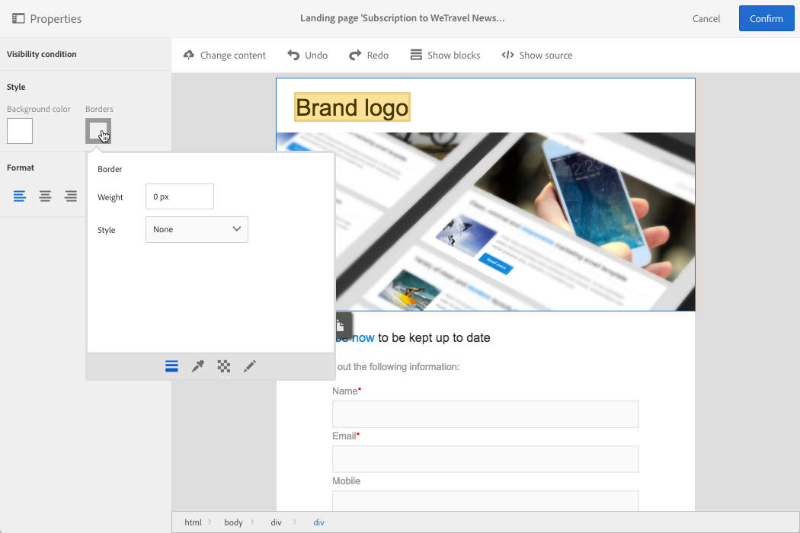

# Managing landing page structure and style

Managing landing page structure and style

## Managing blocks in the content editor

The different HTML content elements are displayed in the landing page as blocks, corresponding to the ****

**** tag.

Select a block to interact with it. It will then be surrounded by a blue box.

If a block is selected, the parent objects of the corresponding HTML element will show in a breadcrumb located at the bottom of the editing zone.

When the mouse hovers over one of the breadcrumb elements, the element concerned is highlighted. You can therefore navigate easily between the different blocks and select exactly the HTML element you would like to modify.

Use the options from the palette and the contextual toolbar to modify, delete, or duplicate the block.

For the blocks containing text, click again in the block to enable text editing mode. The frame around the block turns green. You can then select or enter text. Use the options from the palette and the contextual toolbar to add a link or modify the text formatting.

The parameters defined for an element in a block (links, personalization fields, content blocks, etc.) can be modified at any time from the palette.

 

## Adding a border and a background in the content editor

You can also define a **background color** by selecting a color from the chart. This color is applied to the selected block.

You can add a **border** to the selected block.

 

## Changing the text style in the content editor

To change the style of the text, you have to click inside a text block.

To change the text alignment, select one of the following three icons in the palette on the left:

* **Align left**: aligns the text to the left of the selected block (adds style="text-align: left;"). 
* **Center**: centers the text in the block selected (adds style="text-align: center;"). 
* **Align right**: aligns the text to the right of the selected block (adds style="text-align: right;").

You can also use the toolbar to change the font attributes: adapt the font size, make the text bold or italic, underline or change the color of the text. Refer to [this section](../../designing/using/about-email-content-design.md#email-content-editor-toolbar).
