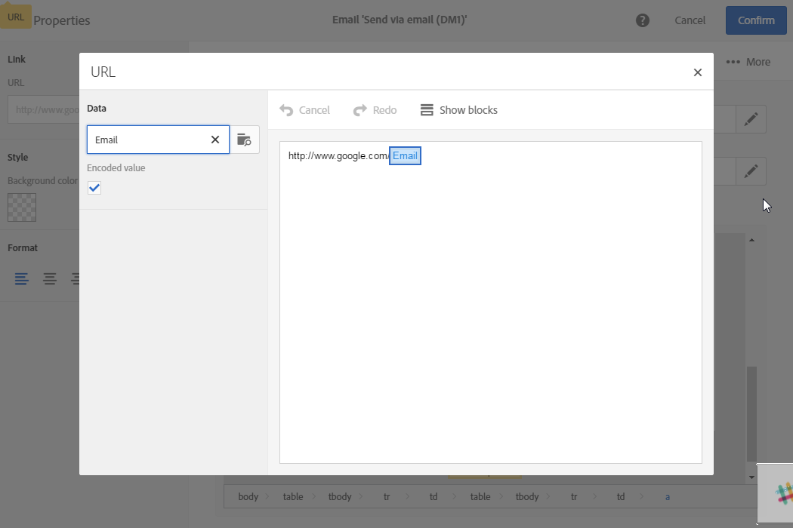

# Managing links

Managing links

You can insert a link into any page element: image, word, group of words, block of text, etc.

There are several types of links:

* Link to an external URL: allows you to add a link to a URL. You can define personalization for your URLs, as detailed in [this section](../../designing/using/managing-links.md#personalizing-urls).
* Link that defines an action: allows you to define an action when an element in the landing page is clicked.

  >[!NOTE]
  >
  >This type of link is only available for landing pages.

* Link to a landing page: allows you to access an Adobe Campaign landing page.
* Subscription link: allows you to insert a link to subscribe to an Adobe Campaign service.
* Unsubscription link: allows you to insert a link to unsubscribe from an Adobe Campaign service.

## Adding a link

1. Select the element then use the corresponding button in the toolbar. Refer to [Toolbar](../../designing/using/content-editor-interface.md#toolbar).

   

1. Enter the link parameters:

   

    * Label
    * Link target: URL, action, landing page, or service

## Personalizing URLs

Adobe Campaign allows you to personalize one or several URLs in your delivery by adding personalization fields, content blocks, or dynamic content to them. To do this:

* Insert an external URL and specify its parameters.
* Click the **URL** button to access the personalization options.

  

* Add the personalization fields, content blocks, and dynamic contents that you want to use.

  

* Confirm your changes.

>[!NOTE]
>
>Personalizing URLs cannot be applied to the domain name, nor to the URL extension. An error message will be displayed during delivery analysis if personalization is incorrect.

To change a personalized URL, select it and use the **URL** button in the palette on the left-hand side.

The **Encoded value** option is checked by default. It allows for special characters to be encoded if they are present in the personalization field's value. We advise you to leave this option unchecked to avoid incorrect URL encoding.

 

## Inserting tracking links

The content editor allows you to personalize your email by inserting links into the HTML content elements.

The following types of links are available:

* Link to an external URL
* Link to a landing page
* Subscription link
* Unsubscription link

>[!NOTE]
>
>The creation and configuration of these links are detailed in the section.

The **Tracked URLs** icon in the action bar automatically displays the list of all the URLs included in the content.

Tracking is activated by default.

>[!NOTE]
>
>This functionality is only available if tracking has been activated in Adobe Campaign.

The list of tracked URLs is divided into two zones:

* HTML, for the tracked URLs in the HTML content.
* Text, for the tracked URLs in the text content.

The label and the category of each URL can be modified directly from the list.

For each tracked URL you can activate or deactivate tracking.

>[!NOTE]
>
>The URLs are detected by Adobe Campaign if they start with: "&lt;%@" "&lt;!--" "[protocol]://"

You can regroup your URLs by editing the **Category** field, depending on the URLs used in the delivery. 

