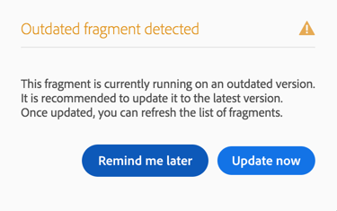

# Using the Email Designer {#email-designer}

## Email Designer overview {#about-the-email-designer}

The Email Designer allows you to create email content and email content templates. It is compatible with simple emails, transactional emails, A/B test emails, multilingual emails, and recurring emails.

To get started with the Email Designer, watch this [set of videos](https://helpx.adobe.com/campaign/kt/acs/using/acs-email-designer-tutorial.html#GettingStarted) that explain the general functionality of the Email Designer and how to design an email from scratch or using templates.

### Email Designer home page {#email-designer-home-page}

When [creating an email](../../channels/using/creating-an-email.md), the **[!UICONTROL Email Designer]** home page automatically displays upon selecting the email content.

The **[!UICONTROL Properties]** tab enables you to edit the email details such as the label, the sender's address and name, or the email subject. You can also access this tab by clicking the email label on top of the screen.

The **[!UICONTROL Templates]** tab enables you to choose from the out-of-the-box HTML contents or the templates that you already created to quickly start designing your email. See [Content templates](../../start/using/using-reusable-content.md#content-templates).

The **[!UICONTROL Learn & support]** tab gives you easy access to the related documentation and tutorials.

If you do not select a template, the Email Designer home page also enables you to choose how you want to start designing your content:

* Click the **[!UICONTROL Create]** button to start a new content from scratch. See [Designing an email content from scratch](../../designing/using/designing-from-scratch.md#designing-an-email-content-from-scratch).
* Click the **[!UICONTROL Upload]** button to upload a file from your computer. See [Importing content from a file](../../designing/using/using-existing-content.md#importing-content-from-a-file).
* Click the **[!UICONTROL Import from URL]** button to retrieve existing content form a URL. See [Importing content from a URL](../../designing/using/using-existing-content.md#importing-content-from-a-url).

### Email Designer interface {#email-designer-interface}

The Email Designer provides many options that allow you to create, edit and customize every aspect of your content.

The interface is composed of several areas offering different functionalities:

From the elements available in the **Palette** (1), drag and drop structure components and content fragments into the main **Workspace** (2). Select a component or element in the **Workspace** (2) and customize its main styling and display characteristics from the **Settings** pane (3).

Access more general options and settings from the main **Toolbar** (4).

>[!NOTE]
>
>The **Settings** pane can move to the left according to your screen resolution and display.

The **Contextual toolbar** of the editor interface offers various functionalities depending on the zone selected. It contains action buttons and buttons that allow you to change the style of the text. The modifications carried out always apply to the zone selected.

### Terminology {#terminology}

**Templates**: Templates are structures of email you can build and reuse for several deliveries. 

**Fragments**: A fragment is a reusable component that can be referenced in one or more emails.

**Structure components**: Structural elements defining the layout of the email 

**Content components**: Content components are raw, empty components that you can edit once placed in an email.

### General recommendations for using the Email Designer {#general-recommendations-for-using-the-email-designer}

To make proper use of the Email Designer and create the best emails as simply as possible, we recommend applying the following principles:

* Use inline styling rather than a separate CSS and CSS in the &lt;head&gt; section of the HTML. By using inline styling, you can optimize content fragment save and reuse.

  See [Adding inline styling attributes](../../designing/using/styles.md#adding-inline-styling-attributes).

* Settle your branding easily by creating and reusing content fragments to keep consistency across your marketing campaigns.

  See [Creating a content fragment](../../designing/using/designing-from-scratch.md#creating-a-content-fragment).

### Content design best practices {#content-design-best-practices}

To ensure the editor's optimal operation, we recommend observing the following guidelines:

* SCSS style sheets are not supported. Use regular CSS if you import ZIP files containing your HTML content.
* When editing **email content**:

  Preview your messages before sending them. Adobe Campaign offers a way to test email rendering using Litmus. For more on this, see [Email rendering](../../sending/using/email-rendering.md).

More design and general best practices regarding messages are presented in the following Adobe Campaign step-by-step guide: [Delivery best practices with Adobe Campaign](https://docs.campaign.adobe.com/doc/standard/getting_started/en/ACS_DeliveryBestPractices.html ).

### Email Designer limitations {#email-designer-limitations}

* You cannot use personalization fields in a fragment. For more on fragments, see [this section](../../designing/using/designing-from-scratch.md#about-fragments).
<!--* You cannot save directly as a fragment some content of an email that you are editing within the Email Designer. You need to copy-paste the HTML corresponding to that content into a new fragment. For more on this, see [Saving content as a fragment](../../designing/using/designing-from-scratch.md#saving-content-as-a-fragment).-->
* When editing styles, only the web fonts officially supported by most email clients are available.
* Styles cannot be saved as a theme for future reuse. However, the CSS style can be saved in a content template or in an email. For more on styles, see [this section](../../designing/using/styles.md).

### Email Designer updates {#email-designer-updates}

The Email Designer is under continuous improvement. If you created an email content from scratch, from an out-of-the-box template or if you created fragments, you may get the following update message the next time you open your content:

Adobe recommends updating your content to the latest version to avoid problems such as CSS collision issues. Click **[!UICONTROL Update now]**.

If an error occurs during the content update, check your HTML and fix it before running this update again.

When it comes to fragments, please note the following:

* If you want to add a fragment to a new email or template and if you get this message, you need to update this fragment first.

* If you have multiple fragments, you have to update each fragment that you want to use in an email content.

* To avoid impact on the current email messages that are not prepared yet, you can choose not to update some fragments.

* You can still send emails where a fragment that is not updated is already used, but that fragment is not editable.

* Updating fragments used in emails that are already prepared has no impact on those emails.

## Plain text and HTML modes {#plain-text-and-html-modes}

### Generating a text version of the email {#generating-a-text-version-of-the-email}

By default, the **[!UICONTROL Plain text]** version of your email is automatically generated and synchronized with the **[!UICONTROL Edit]** version.

Personalization fields and content blocks added to the HTML version are also synchronized with the plain text version.

>[!NOTE]
>
>To use content blocks in plain text version, make sure they do not contain HTML code.

To have a plain text version different from the HTML version, you can disable this synchronization by clicking the **[!UICONTROL Sync with HTML]** switch from the **[!UICONTROL Plain text]** view of your email.

You can then edit the plain text version as desired.

>[!NOTE]
>
>If you edit the **[!UICONTROL Plain text]** version while synchronization is disabled, the next time you enable the **[!UICONTROL Sync with HTML]** option, all the changes you made in the plain text version will be replaced with the HTML version. The changes made in **[!UICONTROL Plain text]** view cannot be reflected in **[!UICONTROL HTML]** view.

### Editing an email content source in HTML {#editing-an-email-content-source-in-html}

For the most advanced users and debugging, you can view and edit the email content directly in HTML.

You have two ways to edit the HTML version of the email:

* Select **[!UICONTROL Edit]** > **[!UICONTROL HTML]** to open the HTML version of the entire email.

  

* From the WYSIWYG interface, select an element and click the **[!UICONTROL Source code]** icon.

  Only the source of the selected element is displayed. You can edit the source code if the selected element is a **[!UICONTROL HTML]** content component. Other components are in read-only mode, but can still be edited in the full HTML version of the email.

  

If you modify the HTML the code, the responsiveness of the email could be broken. Make sure to test it using the **[!UICONTROL Preview]** button. See [Previewing messages](../../sending/using/previewing-messages.md).

