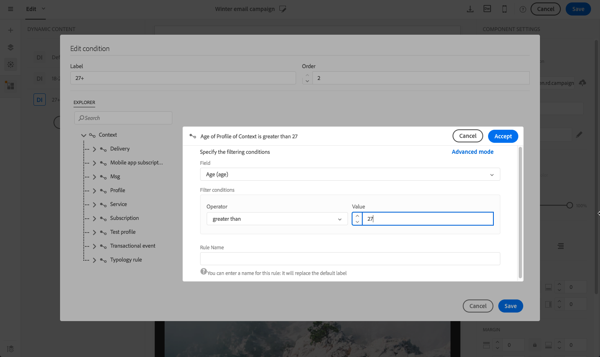

# Personalizing email content {#personalization}

The content and display of messages delivered by Adobe Campaign can be personalized in several different ways. These ways can be combined according to criteria depending on the profiles. In general, Adobe Campaign allows you to:

* Insert dynamic personalization fields. See [Inserting a personalization field](#inserting-a-personalization-field).
* Insert predefined personalization blocks. See [Adding a content block](#adding-a-content-block).
* Personalize the sender of an email. See [Personalizing the sender](#personalizing-the-sender).
* Personalize the subject of an email. See [Personalizing the subject line of an email](../../designing/using/subject-line.md#subject-line).
* Create conditional content. See [Defining dynamic content in an email](#defining-dynamic-content-in-an-email).

## Personalizing the sender {#personalizing-the-sender}

To define the name of the sender which will appear in the header of messages sent, go the **[!UICONTROL Properties]** tab of the Email Designer home page (accessible through the home icon). For more on this, see [Defining the sender of an email](../../designing/using/subject-line.md#email-sender).

  You can change the sender name by clicking the **Sender name** block. The field then becomes editable and you can enter the name you would like to use.

  This field can be personalized. To do this, you can add personalization fields, content blocks and dynamic content by clicking the icons below the sender name.

>[!NOTE]
>
>The header parameters must not be empty. The sender's address is mandatory to allow an email to be sent (RFC standard). Adobe Campaign checks the syntax of email addresses entered.

## Personalizing URLs{#personalizing-urls}

Adobe Campaign allows you to personalize one or several URLs in your message by adding personalization fields, content blocks, or dynamic content to them. To do this:

1. Insert an external URL and specify its parameters. See [Inserting a link](../../designing/using/links.md#inserting-a-link).
1. If not displayed, click the pencil next to the selected URL in the Settings pane to access the personalization options.
1. Add the personalization fields, content blocks, and dynamic contents that you want to use.

   

1. Save your changes.

>[!NOTE]
>
>Personalizing URLs cannot be applied to the domain name, nor to the URL extension. An error message will be displayed during message analysis if personalization is incorrect. When selecting a content block, you are not allowed to select elements such as **Link to mirror page**. This type of blocks is forbidden inside a link.

## Inserting a personalization field{#inserting-a-personalization-field}

Adobe Campaign allows you to insert a field from the database into your page such as the profile's first name.

>[!NOTE]
>
>The images below show how to insert a personalization field using the [Email Designer](../../designing/using/designing-content-in-adobe-campaign.md) for an email.

To add a personalization field to the content:

1. Click inside a text block, click the **[!UICONTROL Personalize]** icon from the contextual toolbar and select **[!UICONTROL Insert personalization field]**. For more on the Email Designer interface, see [this section](../../designing/using/designing-content-in-adobe-campaign.md#email-designer-interface).

   

1. Select the field that you would like to insert into your page content.

   

1. Click **[!UICONTROL Confirm]**.

The field name appears in the editor and it is highlighted.

Once personalization is generated (when previewing and preparing the email for example), this field will be replaced by the value corresponding to the targeted profile.

>[!NOTE]
>
>If the email is created from a workflow, the additional data computed in the workflow is also available in the personalization fields. For more information about adding additional data from a workflow, refer to the [Enriching data](../../automating/using/targeting-data.md#enriching-data) section.

## Adding a content block{#adding-a-content-block}

Adobe Campaign offers a list of pre-configured content blocks. These content blocks are dynamic, personalized and have a specific rendering. For example, you can add a greeting or a link to the mirror page.

>[!NOTE]
>
>The images below show how to insert a content block using the [Email Designer](../../designing/using/designing-content-in-adobe-campaign.md) for an email.

To add a content block:

1. Click inside a text block, click the **[!UICONTROL Personalize]** icon from the contextual toolbar and select **[!UICONTROL Insert content block]**. For more on the Email Designer interface, see [this section](../../designing/using/designing-content-in-adobe-campaign.md#email-designer-interface).

   

1. Select the content block that you would like to insert. The blocks available vary depending on the context (email or landing page).

   

1. Click **[!UICONTROL Save]**.

The name of the content block appears in the editor and it is highlighted in yellow. It will automatically adapt to the profile when the personalization is generated.

The out-of-the-box content blocks are:

The out-of-the-box content blocks are:

* **[!UICONTROL Database URL in emails (EmailUrlBase)]**: This content block can only be used in a **delivery**.
* **[!UICONTROL Mirror page URL (MirrorPageUrl)]**: This content block can only be used in a **delivery**.
* **[!UICONTROL Link to mirror page (MirrorPage)]**: This content block can only be used in a **delivery**.
* **[!UICONTROL Greetings (Greetings)]** 
* **[!UICONTROL Unsubscription link (UnsubscriptionLink)]**: This content block can only be used in a **delivery**.
* **[!UICONTROL Social network sharing links (LandingPageViralLinks)]**: This content block can only be used in a **landing page**.
* **[!UICONTROL Default sender name (DefaultSenderName)]**: This content block can only be used in a **delivery**.
* **[!UICONTROL Name of default reply-to email address (DefaultReplyName)]**: This content block can only be used in a **delivery**.
* **[!UICONTROL Email address of default sender (DefaultSenderAddress)]**: This content block can only be used in a **delivery**.
* **[!UICONTROL Default error email address (DefaultErrorAddress)]**: This content block can only be used in a **delivery**.
* **[!UICONTROL Default reply-to email address (DefaultReplyAddress)]**: This content block can only be used in a **delivery**.
* **[!UICONTROL Brand name (BrandingUsualName)]** 
* **[!UICONTROL Link to the brand website (BrandingWebSiteLink)]** 
* **[!UICONTROL Brand logo (BrandingLogo)]** 
* **[!UICONTROL Notification style (notificationStyle)]**

### Creating custom content blocks {#creating-custom-content-blocks}

You can define new content blocks that will be inserted into a message or landing page.

To create a content block, follow these steps:

1. Click **[!UICONTROL Resources > Content blocks]** from the advanced menu to access the list of content blocks.
1. Click the **[!UICONTROL Create]** button or duplicate a pre-existing content block.

   

1. Enter a label.
1. Select the block's **[!UICONTROL Content type]**. There are three options available:

    * **[!UICONTROL Shared]**: The content block can be used in a delivery or a landing page.
    * **[!UICONTROL Delivery]**: The content block can only be used in a delivery.
    * **[!UICONTROL Landing page]**: The content block can only be used in a landing page.

   

1. You can select a **[!UICONTROL Targeting dimension]**. For more on this, see [About targeting dimension](#about-targeting-dimension).

   

1. You can select the **[!UICONTROL Depends on format]** option to define two different blocks: one for HTML emails, and one for emails in text format. Two tabs will then be displayed in the editor (HTML and Text) to define the corresponding contents.

   

1. Enter the content of the content block(s), and click the **[!UICONTROL Create]** button.

Your content block can now be used in the content editor of a message or a landing page.

>[!CAUTION]
>
>When editing the content of a block, make sure there are no extra white spaces between the beginning and the end of your *if* statements. In HTML the white spaces are displayed on screen and they will therefore impact your content layout.

### About targeting dimension {#about-targeting-dimension}

The targeting dimension enables you to define in which type of message you can use the content block. This is to prevent using inappropriate blocks in a message, which may lead to errors.

Indeed, when editing a message, you can only select content blocks with a targeting dimension that is compatible with that message's targeting dimension.

For example, the **[!UICONTROL Unsubscription link]** block's targeting dimension is **[!UICONTROL Profiles]** because it contains personalization fields specific to the **[!UICONTROL Profiles]** resource. Therefore, you cannot use an **[!UICONTROL Unsubscription link]** block in an [event transactional message](../../channels/using/event-transactional-messages.md), because the targeting dimension of that type of message is **[!UICONTROL Real-time events]**. However, you can use the **Unsubscription link** block in a [profile transactional message](../../channels/using/profile-transactional-messages.md), because the targeting dimension of that type of message is **Profiles**. Finally, the **[!UICONTROL Link to mirror page]** block does not have a targeting dimension, so you can use it in any message.

If you leave this field empty, the content block will be compatible with all messages, no matter what the targeting dimension is. If you set a targeting dimension, that block will only be compatible with messages that have the same targeting dimension.

For more on this, refer to [Targeting dimensions and resources](../../automating/using/query.md#targeting-dimensions-and-resources).

**Related topics:**

* [Inserting a personalization field](#inserting-a-personalization-field)
* [Adding a content block](#adding-a-content-block)
* [Defining dynamic content in an email](#defining-dynamic-content-in-an-email)

## Personalizing an image source{#personalizing-an-image-source}

Adobe Campaign allows you to personalize one or several images in your message according to a particular criterion or to use tracking. This is done by inserting personalization fields, content blocks, or dynamic content into the image source. To do this:

1. Insert an image into the content of your message, or select an image that is already present.
1. In the image properties palette, check the **[!UICONTROL Enable personalization]** option.

   

   The **[!UICONTROL Source]** field is displayed and the image selected is shown as **personalized** in the editor.

1. Click the pencil next to the **[!UICONTROL Source]** field button to access the personalization options.
1. After having added the image source, add the personalization fields, content blocks, and dynamic contents that you like.

   

   >[!NOTE]
   >
   >The domain name (http://mydomain.com) cannot be personalized, it has to be entered manually. The rest of the URL can be personalized. For example: http://mydomain.com/`[Gender]`.jpg

1. Confirm your changes.

## Conditional content {#conditional-content}

### Defining a visibility condition{#defining-a-visibility-condition}

You can specify a visibility condition on any element. It will only be visible if the condition is respected.

To add a visibility condition, select a block and enter the condition to be respected in the **[!UICONTROL Visibility condition]** field of its settings.

This option is only available for the following elements: ADDRESS, BLOCKQUOTE, CENTER, DIR, DIV, DL, FIELDSET, FORM, H1, H2, H3, H4, H5, H6, NOSCRIPT, OL, P, PRE, UL, TR, TD.

The expression editor is presented in the [Advanced expression editing](../../automating/using/editing-queries.md#about-query-editor) section.

These conditions adopt the XTK expression syntax (e.g. **context.profile.email !=''** or **context.profile.status='0'**). By default, all fields are visible.

>[!NOTE]
>
>A condition cannot be defined for a block that already contains a sub-element with a dynamic content or a block that already makes up a dynamic content. Non-visible dynamic blocks like drop-down lists cannot be edited.

### Defining dynamic content in an email{#defining-dynamic-content-in-an-email}

In an email, you can define different contents which will be displayed dynamically to the recipients according to the conditions defined via the expression editor. For example, from the same email, you can ensure that each profile receives a different message according to their age range.

Defining dynamic content is different from [defining visibility conditions](#defining-a-visibility-condition).

1. Select a fragment, a component or an element. In this example, select an image.
1. Click the **[!UICONTROL Dynamic content]** icon from the contextual toolbar.

   

   The **[!UICONTROL Dynamic content]** section appears in the palette on the left.

   

   By default, this section contains two elements: the default variant and a new variant.

   >[!NOTE]
   >
   >The content must always have a default variant. You cannot delete it.

1. Click the **[!UICONTROL Edit]** button to define the display conditions for the first alternative variant.

   

1. Specify a label and select the fields that you want to set as conditions. For example, from the **[!UICONTROL General]** node, select the **[!UICONTROL Age]** field

   

1. Set the filtering conditions. For example, you want a different content to be displayed to people aged between 18 and 25 years old.

   

1. Once all the conditions are set, define the order of priority in which the condition will be applied and save your changes.

   

   The contents will be displayed in the palette in order of priority, from top to bottom. For more on priorities, refer to [this section](#defining-dynamic-content-in-an-email).

1. Upload a new image for the variant you just defined.

   

   The recipients aged between 18 and 25 years old will see the new image.

   

1. Click **[!UICONTROL Add a condition]** to add a new content and its linked rule.

   

   For example, you can add a different image to be displayed to people aged between 26 and 35 years old.

1. Proceed similarly for any other element of your email that you want to be displayed dynamically. It can be text, button, fragment, etc. Save your changes.

>[!CAUTION]
>
>Once you have prepared your message and before sending it, test it using a proof. If you do not do this, some errors may not be detected and the email may not be sent.

**Related topics:**

* [Sending proofs](../../sending/using/sending-proofs.md)
* [Advanced expression editing](../../automating/using/editing-queries.md#about-query-editor)

### Order of priority {#order-of-priority}

In the expression editor, when you define a dynamic content, the order of priority is as follows.

1. You define two different dynamic contents with **two different conditions**, for example:

   **Condition 1:** the gender of the profile is masculine,

   **Condition 2:** the profile is between 20 and 30 years old.

   

   Some profiles in your database correspond to the two conditions but only one email with one dynamic content can be sent.

1. You therefore have to define the priority for the dynamic contents. A condition with an order of priority of **1** (and therefore the corresponding dynamic content) will be sent to a profile even if another condition whose priority order is **2** or **3** is also met by this profile.

   

You can only define one order of priority per dynamic content.

## Example: Email personalization{#example-email-personalization}

In this example, a member of the marketing service team has created an email to inform some of his clients that there is a special offer just for them. The team member decided to personalize the email according to the clients' respective ages. Clients aged between 18 and 27 years old will receive an email containing a different image and slogan to those that the clients older than 27 will receive.

The email is created as follows:

* Dynamic contents are applied to the image and these dynamic contents are configured according to age range.

  

  Adding and configuring dynamic content is detailed in the [Defining dynamic content in an email](#defining-dynamic-content-in-an-email) section.

* Personalization fields and dynamic contents are applied to the text. Depending on the age range of the profile, the email starts with either the profile's first name, or the profile's title and last name.

  

  Adding and configuring the personalization fields is detailed in the [Inserting a personalization field](#inserting-a-personalization-field) section.

### Configuring images {#configuring-images}

In this example, the dynamic contents applied to the images are configured as follows:

**To target 18-27-year-old:**

1. Select the dynamic content in the **[!UICONTROL Properties]** palette and click the **[!UICONTROL Edit]** button.

   

1. Edit the label then select the **[!UICONTROL Age]** field from the **[!UICONTROL Profile]** node.

   

1. Select the **Greater than or equal to** operator then enter **18** to create the **older than 18** expression.

   

1. Add a new **[!UICONTROL Age]** condition.

   Select the **Less than or equal to** operator followed by 27 in the value field to create the **younger than 27** expression.

   

1. Confirm your changes.

**To target profiles aged 27 and above:**

1. Select the dynamic content from the palette and edit it.
1. Edit the label then select the **[!UICONTROL Age]** field from the **[!UICONTROL Profile]** node.
1. Add the **Greater than** operator followed by 27 in the value field to create the **older than 27** expression.

   

1. Confirm your changes.

Your dynamic contents are correctly configured.

### Configuring text {#configuring-text}

In this example, the dynamic contents applied to the texts are configured as follows:

**To target profiles aged between 18-27:**

1. Select the structure component you want and add a dynamic content.
1. Edit the dynamic content and configure the targeting expressions. Refer to [Configuring images](#configuring-images).
1. In the structure component, at the desired position, click the **[!UICONTROL Personalize]** icon from the contextual toolbar and select **[!UICONTROL Insert personalization field]**.

   

1. In the list that appears, select the **[!UICONTROL First name]** field and confirm.

   

1. Your personalization field is then perfectly inserted into the dynamic content selected.

**To target profiles aged 27 and above:**

1. Select the structure component you want and add a dynamic content.
1. Edit the dynamic content and configure the targeting expressions. Refer to [Configuring images](#configuring-images).
1. In the structure component, at the desired position, click the **[!UICONTROL Personalize]** icon from the contextual toolbar and select **[!UICONTROL Insert personalization field]**.
1. Select **[!UICONTROL Title]** from the drop-down list.
1. Proceed similarly to add the **[!UICONTROL Last name]** field.

   

Your personalization fields should now be perfectly inserted into the chosen dynamic content.

### Previewing emails {#previewing-emails}

Previewing allows you to check that the personalization fields and the dynamic contents are configured correctly before sending the **[!UICONTROL Proofs]**. During the preview, you can select different test profiles corresponding to the email targets.

Without test profiles, the email that appears by default is:

The email does not have personalization fields in the slogan, and the default image is used.

The first test profile corresponds to a client aged between 18 and 27. By selecting this profile, the following email appears:

The personalization field that corresponds to the 18-27-year-old expression, specifically the profile's first name, is configured correctly and the image has also changed according to the profile.

The second profile corresponds to a client aged over 27 and generates the following email:

The image has changed thanks to the dynamic content, and the slogan that appears is the more formal slogan defined for this targeted public.

**Related topics:**

* [Creating audiences](../../audiences/using/creating-audiences.md)
* [Preparing the send](../../sending/using/preparing-the-send.md)

