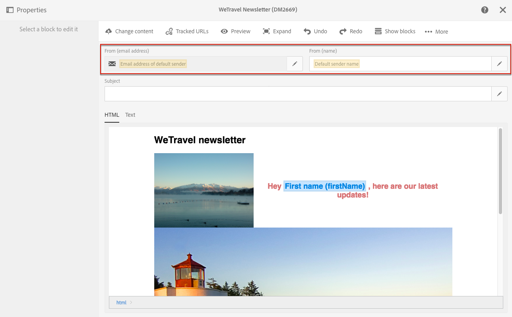

# Personalizing the sender{#personalizing-the-sender}

Personalizing the sender

## Email sender {#email-sender}

To define the name of the sender which will appear in the header of messages sent:

* In the [Creative Designer](../../designing/using/about-email-content-design.md#using-the-creative-designer), click the **Email properties** icon next to the email's label.

  

* In the [content editor](../../designing/using/about-email-content-design.md#using-the-email-content-editor), go to the upper part of the screen.

  

The **From (name)** field allows you to enter the sender name. By default, the **Default sender name** is automatically entered in the field. Adobe Campaign refers to the email channel configuration (from the advanced menu **Administration > Channels > Email > Email accounts** via the Adobe Campaign logo) to designate this sender.

You can change the sender name by clicking the pencil that appears to its right. The field then becomes editable and you can enter the name you would like to use.

This field can be personalized. (To do this, you must use personalization fields, inserted via the **Sender** button, to the right of the input field.) Inserting and using the personalization fields is detailed in the [Inserting a personalization field](../../designing/using/inserting-a-personalization-field.md) section.

The **From (email address)** field cannot be edited from the **Content** block. You can change it by editing the properties of the email from its dashboard. For more on this, refer to [List of email advanced parameters](../../administration/using/configuring-email-channel.md#list-of-email-advanced-parameters).

>[!NOTE]
>
>The header parameters must not be empty. The sender's address is mandatory to allow an email to be sent (RFC standard). Adobe Campaign checks the syntax of email addresses entered.

## SMS sender {#sms-sender}

You can personalize the name of the SMS sender. For more on this, refer to the [SMS configuration](../../administration/using/configuring-sms-channel.md#configuring-sms-properties) section.
