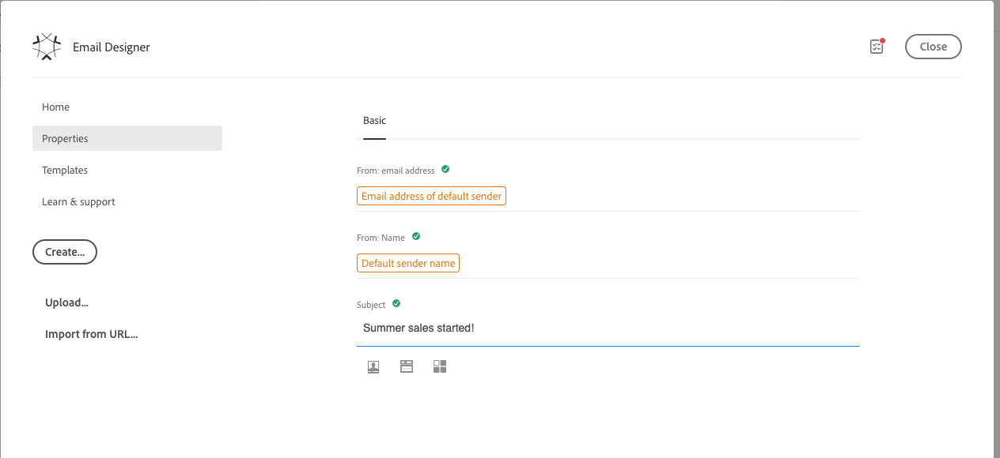
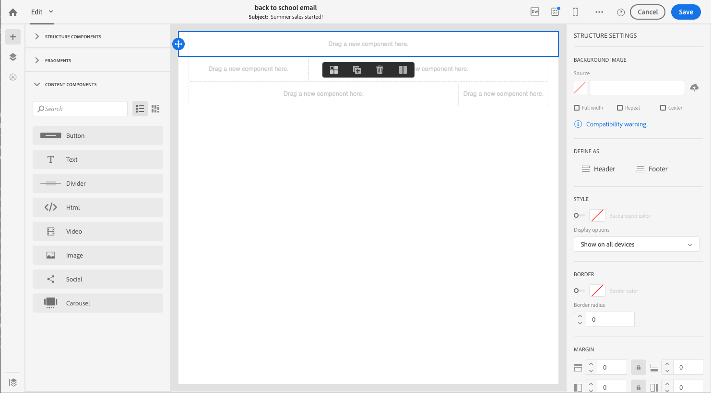
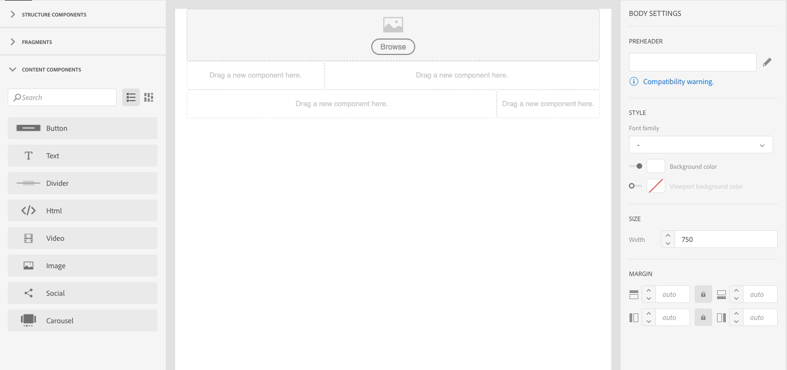
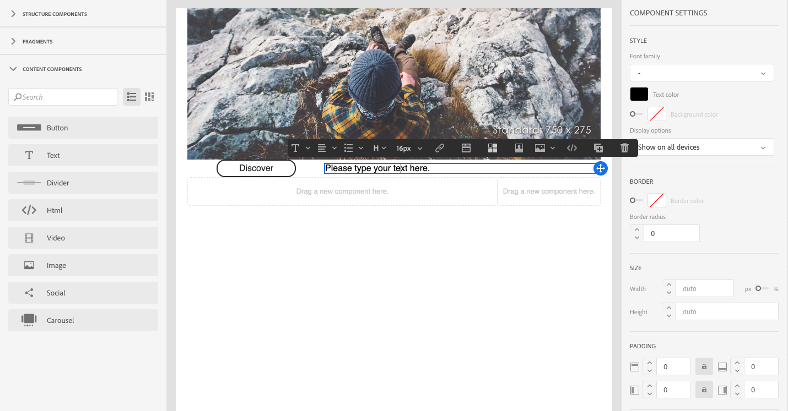
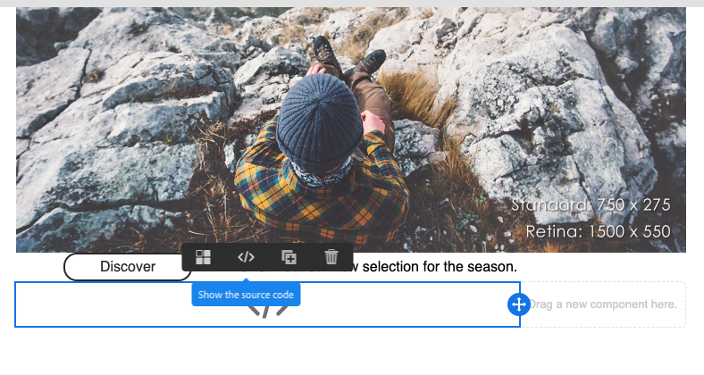
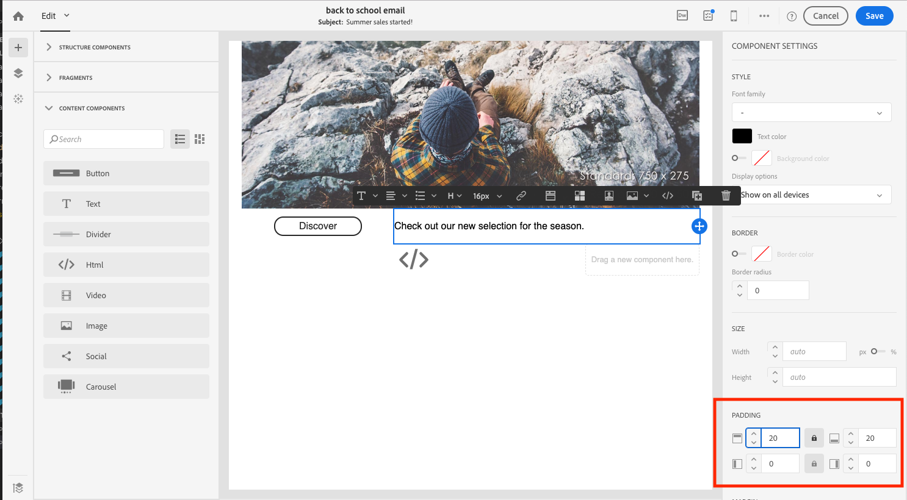

# Get started with the email designer {#quick-start}

The Email Designer provides four ways to create emails.

You can create an email [starting fresh in the Email Designer](#without-existing-content):

* You can create an email from a blank canvas by easily adding structure and content components and personalize their content to send a delivery quickly. You can also fully manage style elements. For more information, [get started quickly](#from-scratch-email) or see the [complete documentation](../../designing/using/designing-from-scratch.md#designing-an-email-content-from-scratch).

* You can create an email from an out-of-the-box templates by selecting a template and building your new email content from here. [Learn more](#building-content-from-an-out-of-the-box-template)

You can also create an email [with existing content](#with-existing-content):

* You can convert an existing HTML content (created externally or in the legacy editor). [Learn more](#converting-an-html-content)
* You can import an existing HTML content straight away in compatibility mode. [Learn more](#compatibility-mode)

| Without content   | With content   |
|---|---|
| Creating an email from scratch  | Converting an existing HTML content  |
| Building content from an out-of-the-box template  | Importing an existing HTML  |

## Designing emails with the editor {#without-existing-content}

### Creating an email from scratch {#from-scratch-email}

You can create an email easily, add components and personalize their content to send a delivery quickly. You can adapt the styling options to your content if needed. For more on managing style settings and inline attributes, see [Editing email styles](../../designing/using/styles.md).

### Adding a subject line {#add-a-subject-line}

Subject lines are mandatory when sending an email. For more information, see [Defining the subject line of an email](../../designing/using/subject-line.md).

1. Create an email.
1. Close homepage.
1. Go the **[!UICONTROL Properties]** tab of the Email Designer home page (accessible through the home icon) and fill in the **[!UICONTROL Subject]** section.



### Adding structure components {#add-structure-components}

Structure components will define the layout of your email. For more information, see [Defining the structure of an email](../../designing/using/designing-from-scratch.md#defining-the-email-structure).

In Structure components, drag and drop components for the layout you want to use.

>[!NOTE]
>
>You can select different content layouts that will add up in your email.



### Adding content components {#add-content-components}

You can add several content components to your email such as image, text and buttons. For more information, see [Content components](../../designing/using/designing-from-scratch.md#about-content-components).

* **Image**

1. In **Content Components**, drag and drop image into one of your structure components.
1. Click **Browse**.
1. Select your image file from your computer.



* **Text with personalization**

1. In **Content Components**, drag and drop text into one of your structure components.
1. Click on the component and enter your text. 
1. To add a personalization field, click **Insert personalization field** in the toolbar.
1. Select the field you need, such as First Name.



* **HTML**

1. In **Content Components**, drag and drop HTML into one of your structure components.
1. Click **Show the source code**.
1. Enter your HTML content.
1. Click **Save**.



If you are familiar with HTML, you can copy-paste the HTML code from the original footer using the **[!UICONTROL Html]** content component. For more on this, see [About content components](../../designing/using/designing-from-scratch.md#about-content-components).


### Styling your email component

You can adjust your email styling, for example by changing the padding of a component. For more on managing style settings and inline attributes, see [Editing email styles](../../designing/using/styles.md). 

1. Click on your **Text component**. 
1. On the right, in the palette, go to **Padding**.
1. Click the lock icon to break synchronization between top and bottom or right and left parameters. 
1. Adjust **Padding** as you need. 
1. Click **Save**. 



You can now save and send your email.

### Building content from an out-of-the-box template {#building-content-from-an-out-of-the-box-template}

You can build an email from out-of-the-box templates such as customer welcome messages, newsletters and reengagement emails and personalize them.

1. Create an email and open its content. For more on this, see [Creating an email](../../channels/using/creating-an-email.md).
1. Click the home icon to access the **[!UICONTROL Email Designer]** home page.
1. Click the **[!UICONTROL Templates]** tab.
1. Choose an out-of-the-box HTML template.
    The different templates present various combinations of several types of elements. For example, 'Feather' templates have margins while 'Astro' templates do not have ones. For more on this, see [Content templates](../../designing/using/using-reusable-content.md#content-templates).
1. Go the **[!UICONTROL Properties]** tab of the Email Designer home page (accessible through the home icon) and fill in the **[!UICONTROL Subject]** section.
1. You can combine these elements to build a number of email variants. For example, you can duplicate an email section by selecting a structure component and clicking **[!UICONTROL Duplicate]** from the contextual toolbar.
1. You can move the elements around using the blue arrow on the left to drag a structure component below or above another. For more on this, see [Editing the email structure](../../designing/using/designing-from-scratch.md#defining-the-email-structure).
1. You can also move components around to change the organization of each structure element. For more on this, see [Adding fragments and components](../../designing/using/designing-from-scratch.md#defining-the-email-structure).
1. Modify the content of each element according to your needs: images, text, links.
1. Adapt the styling options to your content if needed. For more on this, see [Editing email styles](../../designing/using/styles.md).

## Using an existing email content {#with-existing-content}

If you want to build a framework of modular templates and fragments that can be combined to reuse in multiple emails, you should consider converting your email HTML into an Email Designer template.

### Converting an HTML content {#converting-an-html-content}

This use case offers a quick way to convert an HTML email into Email Designer components.

>[!CAUTION]
>
>This section is for users who are familiar with HTML code.

>[!NOTE]
>
>Like the compatibility mode, a HTML component is editable with limited options: you can only perform in-place edition.

Outside of the Email Designer, make sure the original HTML is divided into reusable sections.

1. Open the Email Designer to create an empty email content.
1. Set the body level attributes: background colors, width, etc. For more on this, see [Editing email styles](../../designing/using/styles.md).

If this is not the case, cut out the different blocks from your HTML. For example, here is a clearly identified section:

```
<!-- 3 COLUMN w/CTA (SCALED) -->
<table width="100%" align="center" cellspacing="0" cellpadding="0" border="0" role="presentation" style="max-width:680px;">
<tbody>
<tr>
<td class="padh10" align="center" valign="top" style="padding:0 5px 20px 5px;">
<table width="100%" cellspacing="0" cellpadding="0" border="0" role="presentation">
<tbody>
<tr>
...
</tr>
</tbody>
</table>
</td>
</tr>
</tbody>
</table>
<!-- //3 COLUMN w/CTA (SCALED) -->
```

Once you have identified all your blocks, in the Email Designer, repeat the following procedure for each section of your existing email:

1. Add a structure component. For more on this, see [Editing the email structure](../../designing/using/designing-from-scratch.md#defining-the-email-structure).
1. Add an HTML component. For more on this, see [Adding fragments and components](../../designing/using/designing-from-scratch.md#defining-the-email-structure).
1. Copy-paste your HTML into that component.
1. Switch to mobile view. For more on this, see [this section](../../designing/using/plain-text-html-modes.md#switching-to-mobile-view).

   The responsive view is broken, because your CSS is missing.

1. To fix this, switch to source code mode and copy-paste your style section into a new style section. For example:

   ```
   <style type="text/css">
   a {text-decoration:none;}
   body {min-width:100% !important; margin:0 auto !important; padding:0 !important;}
   img {line-height:100%; text-decoration:none; -ms-interpolation-mode:bicubic;}
   ...
   </style>
   ```

   >[!NOTE]
   >
   >Make sure you add your style after this in another custom style tag.
   >
   >Do not modify the CSS generated by the Email Designer:
   >
   >* `<style data-name="default" type="text/css">(##)</style>`
   >* `<style data-name="supportIOS10" type="text/css">(##)</style>`
   >* `<style data-name="mediaIOS8" type="text/css">(##)</style>`
   >* `<style data-name="media-default-max-width-500px" type="text/css">(##)</style>`
   >* `<style data-name="media-default--webkit-min-device-pixel-ratio-0" type="text/css">(##)</style>`

1. Go back to the mobile view to check that your content is correctly displayed and save your changes.

### Importing and editing an HTML email {#compatibility-mode}

When you upload a content, it must contain specific tagging to be fully compliant and editable with the WYSIWYG editor of the Email Designer.

If all or part of the uploaded HTML is not compliant with the expected tagging, the content is then loaded in 'compatibility mode', which limits the edition possibilities through the UI.

When a content is loaded in compatibility mode, you can still perform the following modifications through the interface (unavailable actions are hidden):

* Changing the text or changing an image
* Inserting links and personalization fields
* Edit some styling options on the selected HTML block
* Defining conditional content


Other modifications such as adding new sections to your email or advanced styling must be done directly in the source code of the email via the HTML mode.
Though the compatibility mode does not allow you to use drag and drop, it guarantees the same set of features as the legacy editor.

For more on converting an existing email into an Email Designer-compatible email, see [this section](../../designing/using/using-existing-content.md).
