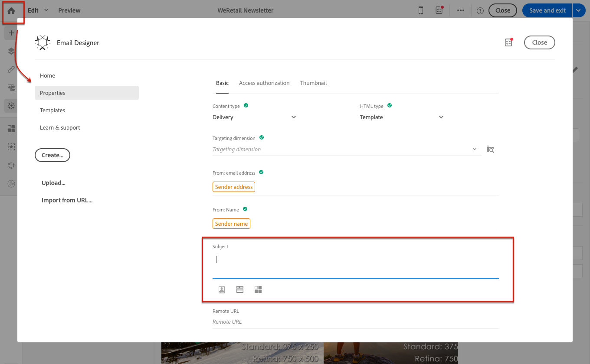
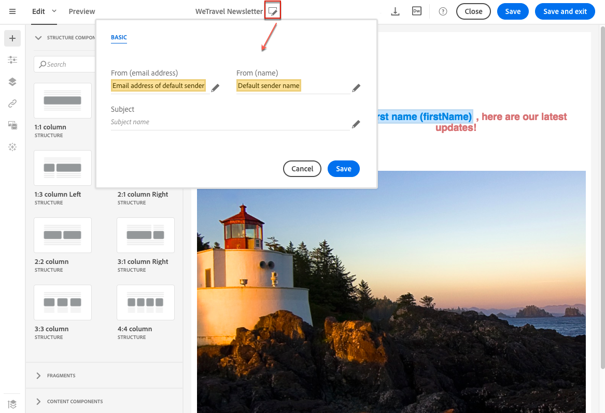

# Defining the subject line and the sender of an email{#defining-the-subject-line-of-an-email}

The message subject is mandatory to prepare and send the message.

>[!NOTE]
>
>If the subject line is empty, a warning is displayed in the message dashboard and in the Email Designer.

To configure the email subject, go the **[!UICONTROL Properties]** tab of the Email Designer home page (accessible through the home icon) and fill in the **[!UICONTROL Subject]** section.

**To define the subject line of an email**:

1. Create an email.
1. Close homepage.
1. Go the **[!UICONTROL Properties]** tab of the Email Designer home page (accessible through the home icon) and fill in the **[!UICONTROL Subject]** section.

You can also add personalization fields, content blocks and dynamic content to the subject line by clicking the corresponding icons.

**Related topics:**

* [Inserting a personalization field](../../designing/using/personalization.md#inserting-a-personalization-field)
* [Adding a content block](../../designing/using/personalization.md#adding-a-content-block)
* [Defining dynamic content in an email](../../designing/using/personalization.md#defining-dynamic-content-in-an-email)

## Predictive subject line {#predictive-subject-line}

When editing an email, you can try out different subject lines and get an estimation of its open rate before you send it.

This feature is disabled by default. It is enabled when the first model is imported. A model is the result of training data sets specific to a given industry. Models allow the system to predict the open rate of the email when a new subject line is submitted.

>[!NOTE]
>
>This feature is available for email messages and for databases that contain English contents only. The trained model will be inconsistent and will lead to erroneous results if your instance contains emails in other languages. The option that allows you to test a subject is only visible if a model is already available on your instance.

**Related Topic** 

* [Testing a subject line](../../sending/using/testing-subject-line-email.md)

## Email sender {#email-sender}

To define the name of the sender which will appear in the header of messages sent, go the **[!UICONTROL Properties]** tab of the Email Designer home page (accessible through the home icon).

* The **[!UICONTROL From: name]** field allows you to enter the sender name. By default, the default **Sender name** block is automatically entered in the field. Adobe Campaign refers to the email channel configuration (from the advanced menu **[!UICONTROL Administration > Channels > Email > Email accounts]** via the Adobe Campaign logo) to designate this sender.

  You can change the sender name by clicking the **Sender name** block. The field then becomes editable and you can enter the name you would like to use.

  This field can be personalized. To do this, you can add personalization fields, content blocks and dynamic content by clicking the icons below the sender name.

* The **[!UICONTROL From: email address]** field cannot be edited from this section. You can change it by editing the properties of the email from its dashboard. For more on this, see [List of email advanced parameters](../../administration/using/configuring-email-channel.md#advanced-parameters).

>[!NOTE]
>
>The header parameters must not be empty. The sender's address is mandatory to allow an email to be sent (RFC standard). Adobe Campaign checks the syntax of email addresses entered.

**Related topics:**

* [Inserting a personalization field](../../designing/using/personalization.md#inserting-a-personalization-field)
* [Adding a content block](../../designing/using/personalization.md#adding-a-content-block)
* [Defining dynamic content in an email](../../designing/using/personalization.md#defining-dynamic-content-in-an-email)