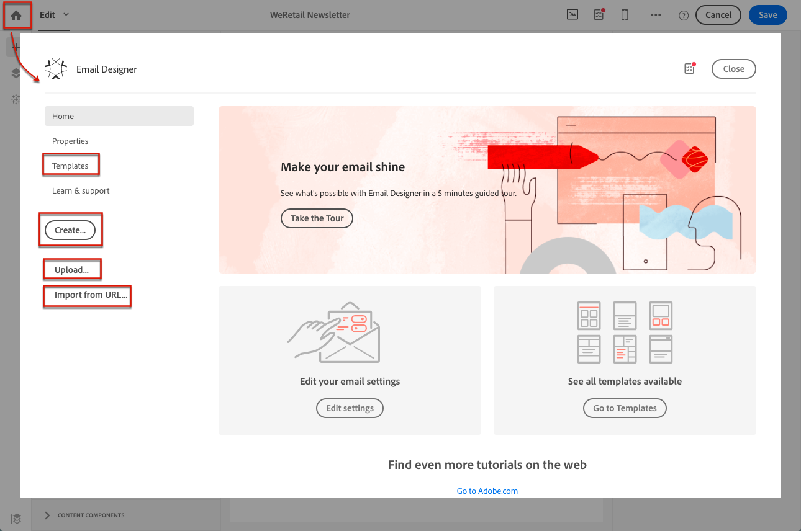
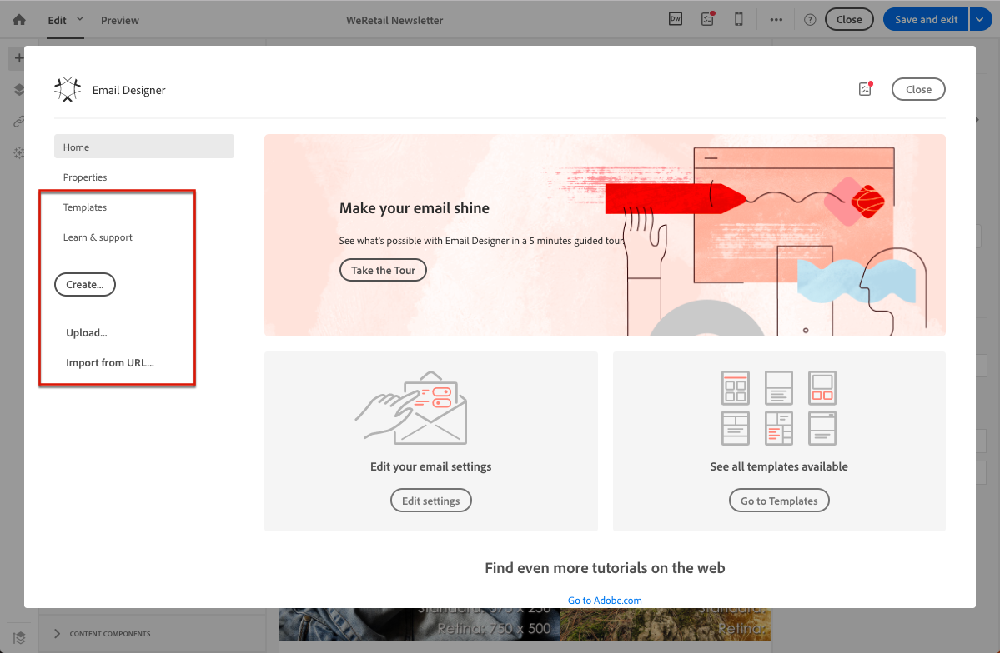
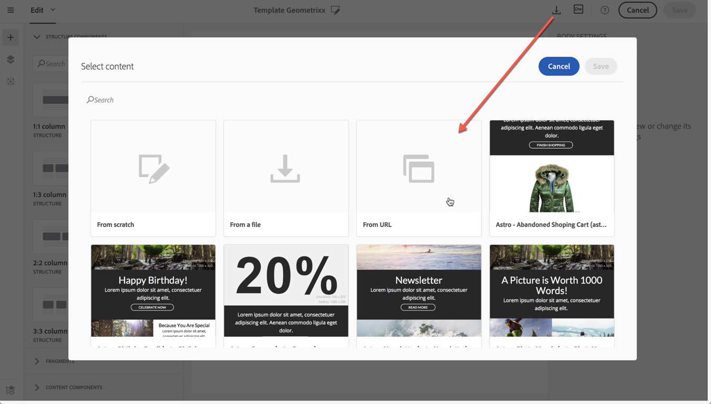
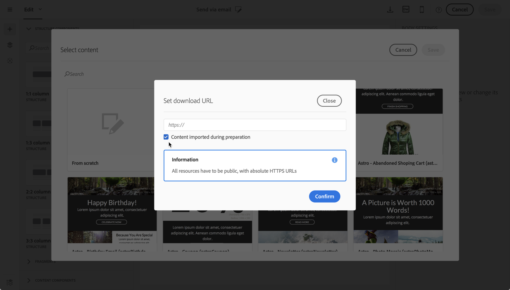
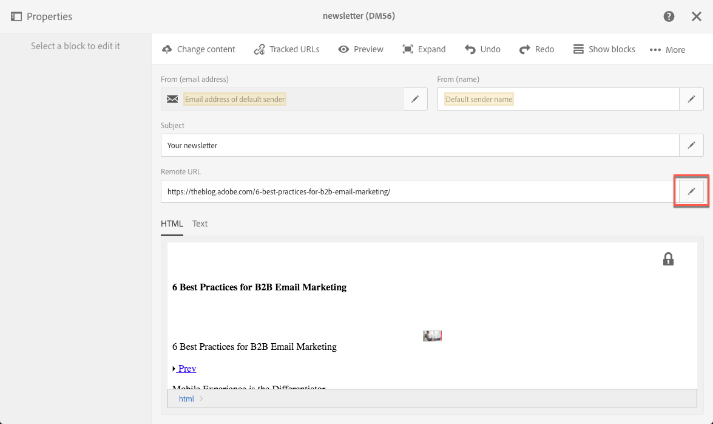
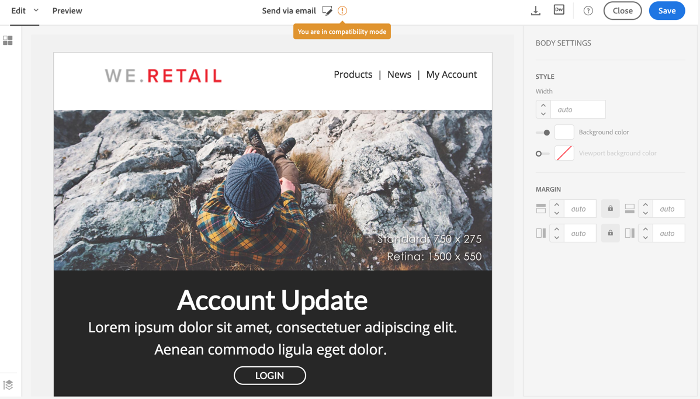

# Designing using existing content {#designing-using-existing-content}

## Selecting an existing content{#selecting-an-existing-content}

Adobe Campaign comes with a set of predefined contents to help you get started. You can use one of these or, if the content of the message you need to send is being prepared outside of Adobe Campaign, you can import it from your computer or a URL.

When creating an email or a landing page, you can choose to load an existing content from another source.

>[!NOTE]
>
>The images below show how to load an existing content using the [Email Designer](../../designing/using/overview.md).

1. After creating the email or landing page, open its content.
1. Click the home icon to access the **[!UICONTROL Email Designer]** home page.

   

1. Select the source of the content you want to load:

    * [Content templates](../../start/using/about-templates.md#content-templates): click the **[!UICONTROL Templates]** tab.
    * [Content from scratch](../../designing/using/designing-from-scratch.md#designing-an-email-content-from-scratch), to start fresh: click the **[!UICONTROL Create]** button.
    * [Content from your computer as a ZIP or HTML file](../../designing/using/using-existing-content.md#importing-content-from-a-file): click the **[!UICONTROL Upload]** button.
    * [Content from an existing URL](../../designing/using/importing-content-from-a-url.md) (only for emails): click the **[!UICONTROL Import from URL]** button.

   

1. Load the content. The selected content replaces the current content.

   Once imported, the content can be edited and personalized.

   >[!NOTE]
   >
   >The [Email Designer](../../designing/using/overview.md) uses specific tagging. Standard HTML content uploaded to Campaign have to match the expected tagging to be fully compatible and editable from the Email Designer. If not matching, your content is uploaded in [compatibility mode](../../designing/using/using-existing-content.md#compatibility-mode). To make existing contents compatible, see [this section](../../designing/using/editing-existing-contents-with-the-email-designer.md).

**Related topics:**

* [Creating an email](../../channels/using/creating-an-email.md)
* [Managing landing pages](../../channels/using/about-landing-pages.md)

## Editing existing contents with the Email Designer{#editing-existing-contents-with-the-email-designer}

To fully leverage the edition possibilities of the [Email Designer](../../designing/using/overview.md), your uploaded HTML must contain specific tagging that makes it compliant with the WYSIWYG editor.

If all or part of the HTML does not have this tagging, the content is then loaded in ' [compatibility mode](../../designing/using/using-existing-content.md#compatibility-mode)'.

To make an existing external content fully editable within the Email Designer, see the [Designing an email using existing contents](../../designing/using/using-existing-content.md) section.

## Importing {#importing}

### Importing content from a file {#importing-content-from-a-file}

From the Email Designer home page, click the **[!UICONTROL Upload]** button to upload a file from your computer, then confirm.

There are no constraints on the zip file structure. However, referencing HTML files has to be relative and respect the tree structure of the zip folder.

The following formats are supported for import:

* An HTML file with an incorporated style sheet
* A .zip folder containing the HTML file, the style sheet (.CSS) and the images

>[!NOTE]
>
>For email content, we recommend that you import single HTML files with an incorporated style sheet.

#### Importing content from a URL {#importing-content-from-a-url}

Before importing content from a URL, make sure it follows the requirements below:

* The content needs to be publicly available via this URL.
* For security reasons, only URLs beginning with **[!UICONTROL https]** are allowed.
* Make sure that all resources (images, CSS) are set in absolute links and in HTTPS. Otherwise, after sending the email, the mirror page would be displayed without its resources. Here is an example of an absolute link definition:

  ```
  <a href="https://www.mywebsite.com/images/myimage.png">
  ```

>[!NOTE]
>
>Loading content from a URL is available for the email channel only.

To retrieve existing content form a URL, follow the steps below:

1. From the Email Designer home page, select the **[!UICONTROL Import from URL]** button.

   

1. Define the URL from which the content will be retrieved.
1. Click **[!UICONTROL Confirm]**.

**Related topic:**

[Importing content from a URL](https://helpx.adobe.com/campaign/kt/acs/using/acs-email-designer-tutorial.html#Workingwithexistingcontent) video

### Retrieving content from a URL automatically at preparation time {#retrieving-content-from-a-url-automatically-at-preparation-time}

Importing content from a URL during message preparation enables you to retrieve the latest HTML content each time the email is prepared. This way, the content of recurring emails is always up-to-date at the time of their sending. This feature also enables you to create a message scheduled at a specific date, even if the content is not ready yet.

To retrieve content at preparation time, follow the steps below:

1. Select the **[!UICONTROL Content imported during preparation]** option.

   

1. The URL content displays in the editor as read-only.

   >[!CAUTION]
   >
   >At this step, the HTML display in the content editor should not be taken into account. It will be retrieved at the preparation phase.

1. To preview the URL content that has been retrieved, open the message once it is created then click the **[!UICONTROL Preview]** button.

It is possible to personalize the remote URL from which the content will be retrieved. To do this, follow the steps below:

1. Click the email label on top of the screen to acces the Email Designer **[!UICONTROL Properties]** tab.
1. Find the **[!UICONTROL Remote URL]** field.

   

1. Insert the desired personalization field, content block or dynamic text.

   The **[!UICONTROL Current date - YYYYMMDD]** content block, for example, enables you to insert the date of the day.

   >[!NOTE]
   >
   >The available personalization fields are linked to **Delivery** attributes only (email creation date, status, campaign label...).

### Compatibility mode {#compatibility-mode}

When you upload a content, it must contain specific tagging to be fully compliant and editable with the WYSIWYG editor of the Email Designer.

If all or part of the uploaded HTML is not compliant with the expected tagging, the content is then loaded in 'compatibility mode', which limits the edition possibilities through the UI.

When a content is loaded in compatibility mode, you can still perform the following modifications through the interface (unavailable actions are hidden):

* Changing the text or changing an image
* Inserting links and personalization fields
* Edit some styling options on the selected HTML block
* Defining conditional content



Other modifications such as adding new sections to your email or advanced styling must be done directly in the source code of the email via the HTML mode.

For more on converting an existing email into an Email Designer-compatible email, see [this section](../../designing/using/using-existing-content.md).

**Related topic**:

* [Creating an email](../../channels/using/creating-an-email.md)
* [Introduction video to the Email Designer](https://video.tv.adobe.com/v/22771/?autoplay=true&hidetitle=true)
* [Designing an email content from scratch](../../designing/using/designing-from-scratch.md#designing-an-email-content-from-scratch)

## Converting an HTML content {#converting-an-html-content}

If you want to build a framework of modular templates and fragments that can be combined to reuse in multiple emails, you should consider converting your email HTML into an Email Designer template.

This use case offers a quick way to convert an HTML email into Email Designer components.

>[!CAUTION]
>
>This section is for advanced users who are familiar with HTML code.

>[!NOTE]
>
>Like the compatibility mode, a HTML component is editable with limited options: you can only perform in-place edition.

Outside of the Email Designer, make sure the original HTML is divided into reusable sections.

If this is not the case, cut out the different blocks from your HTML. For example:

```
<!-- 3 COLUMN w/CTA (SCALED) -->
<table width="100%" align="center" cellspacing="0" cellpadding="0" border="0" role="presentation" style="max-width:680px;">
<tbody>
<tr>
<td class="padh10" align="center" valign="top" style="padding:0 5px 20px 5px;">
<table width="100%" cellspacing="0" cellpadding="0" border="0" role="presentation">
<tbody>
<tr>
...
</tr>
</tbody>
</table>
</td>
</tr>
</tbody>
</table>
<!-- //3 COLUMN w/CTA (SCALED) -->
```

Once you have identified all your blocks, in the Email Designer, repeat the following procedure for each section of your existing email:

1. Open the Email Designer to create an empty email content.
1. Set the body level attributes: background colors, width, etc. For more on this, see [Editing email styles](../../designing/using/editing-email-styles.md).
1. Add a structure component. For more on this, see [Editing the email structure](../../designing/using/designing-from-scratch.md#defining-the-email-structure).
1. Add an HTML component. For more on this, see [Adding fragments and components](../../designing/using/designing-from-scratch.md#editing-the-email-structure).
1. Copy-paste your HTML into that component.
1. Switch to mobile view. For more on this, see [this section](../../designing/using/styles.md#switching-to-mobile-view).

   The responsive view is broken, because your CSS is missing.

1. To fix this, switch to source code mode and copy-paste your style section into a new style section. For example:

   ```
   <style type="text/css">
   a {text-decoration:none;}
   body {min-width:100% !important; margin:0 auto !important; padding:0 !important;}
   img {line-height:100%; text-decoration:none; -ms-interpolation-mode:bicubic;}
   ...
   </style>
   ```

   >[!NOTE]
   >
   >Do not modify the CSS generated by the Email Designer: `<style acrite-template-css="true">` and `<style acrite-custom-styles="" type="text/css">`. Make sure you add your style after this.

1. Go back to the mobile view to check that your content is correctly displayed and save your changes.
