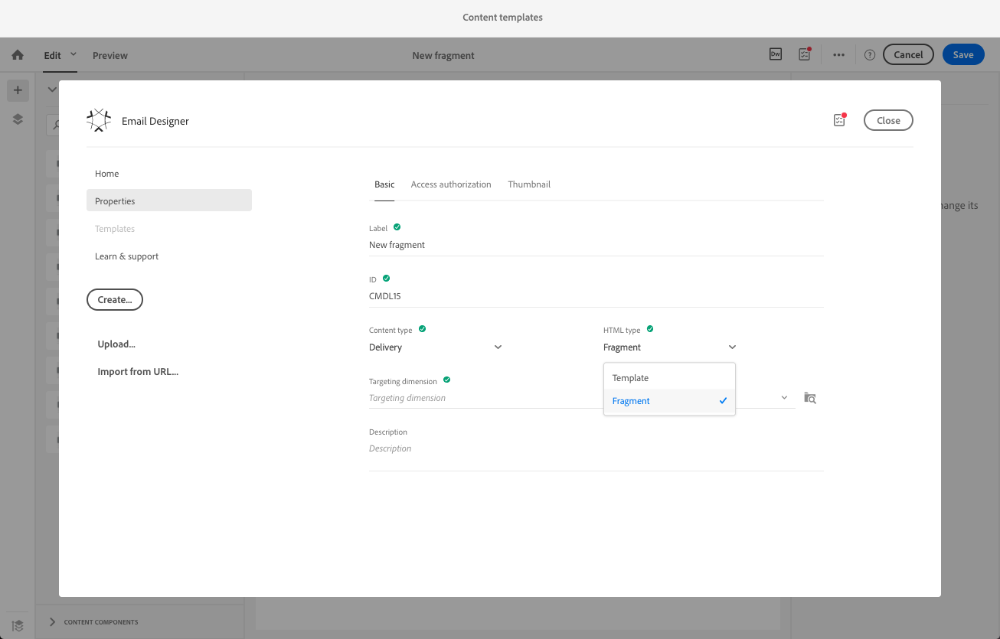

# Creating and using reusable content {#using-reusable-content}

Learn how to master email content edition. With Email Designer, you can create templates and fragments with your own predefined content and reuse them for following deliveries.

## Designing emails using templates {#designing-templates}

>[!NOTE]
>
> In Adobe Campaign Standard, you can create different types of templates that are accessible from the **Resources** > **Templates** menu. The templates used in the Email Designer are Content templates. For more information, see [About templates](../../start/using/marketing-activity-templates.md).

### About content templates {#content-templates}

You can manage HTML contents that are offered in the **[!UICONTROL Templates]** tab of the [Email Designer](../../designing/using/designing-content-in-adobe-campaign.md) home page.

The out-of-the-box email content templates include eighteen mobile-optimized layouts and four best-in-class responsive templates designed by Behance artists. They correspond to the most current usages such as customer welcome messages, newsletters and reengagement emails, among others. They can easily be customized with your brands' content to ease the process of designing emails from scratch.

The HTML content templates are accessible from the **[!UICONTROL Resources]** > **[!UICONTROL Content templates & fragments]** screen of the [Advanced menu](../../start/using/interface-description.md#advanced-menu). From there, you can manage landing page content templates, email content templates and also fragments.

The out-of-the-box content templates are read-only. To edit one of them, you must first duplicate the desired template.

You can create new templates or fragments, and define your own contents. For more on this, see [Creating a content template](#creating-a-content-template) and [Creating a content fragment](#creating-a-content-fragment).

When editing content with the Email Designer, you can also create content templates by saving your content as fragment or template. For more on this, see [Saving content as template](#saving-content-as-template) and [Saving content as fragment](../../designing/using/using-reusable-content.md#saving-content-as-a-fragment).

**Related topics:**

* Learn how to personalize content templates [in this video](https://docs.adobe.com/content/help/en/campaign-learn/campaign-standard-tutorials/designing-content/email-designer/email-content-templates.html).
* For more information on editing content, see [About email content design](../../designing/using/designing-content-in-adobe-campaign.md).

### Creating a content template {#creating-a-content-template}

You can create your own content templates to use them as many times as needed.

The following example shows how to create an email content template.

1. Go to **[!UICONTROL Resources]** > **[!UICONTROL Content templates & fragments]** and click **[!UICONTROL Create]**.
1. Click the email label to access the **[!UICONTROL Properties]** tab of the Email Designer.
1. Specify a recognizable label and select the following parameters to be able to use this template in emails:

    * Select **[!UICONTROL Shared]** or **[!UICONTROL Delivery]** from the **[!UICONTROL Content type]** drop-down list.
    * Select **[!UICONTROL Template]** from the **[!UICONTROL HTML type]** drop-down list.

   

1. If needed, you can set an image that will be used as a thumbnail for the template. Select it from the **[!UICONTROL Thumbnail]** tab of the template properties.

   

   This thumbnail will be displayed in the **[!UICONTROL Templates]** tab of the [Email Designer](../../designing/using/designing-content-in-adobe-campaign.md) home page.

1. Close the **[!UICONTROL Properties]** tab to return to the main workspace.
1. Add structure components and content components that you can customize as needed.
    >[!NOTE]
    >
    > You cannot insert personalization fields or conditional content inside a content template.
1. Once edited, save your template.

This template can now be used in any email built with the Email Designer. Select it from the **[!UICONTROL Templates]** tab of the [Email Designer](../../designing/using/designing-content-in-adobe-campaign.md) home page.

### Saving content as template {#saving-content-as-template}

When editing an email with the Email Designer, you can directly save the content of that email as a template.

<!--[!CAUTION]
>
>You cannot save as template a structure containing personalization fields or dynamic content.-->

1. Select **[!UICONTROL Save as template]** from the Email Designer main toolbar.

   

1. Add a label and a description if needed, then click **[!UICONTROL Save]**.

    

1. To find the template that you just created, go to **[!UICONTROL Resources]** > **[!UICONTROL Content templates & fragments]**.

1. To use your new template, select it from the **[!UICONTROL Templates]** tab of the [Email Designer](../../designing/using/designing-content-in-adobe-campaign.md) home page.

    

### Creating a template with fragments and components {#template-fragments-components}

You can now create an email template with the Email Designer. Use content components to reflect the different sections of your email and adjust the settings to make them as close as possible to your original newsletter. Finally, insert the fragments that you just created.

1. Using the Email Designer, create a template. For more on this, see [Content templates](#content-templates).
1. Insert several structure components into your template - corresponding to the header, footer and body of your email. For more on adding structure components, see [Editing the email structure with the Email Designer](../../designing/using/designing-from-scratch.md#defining-the-email-structure).
1. Insert as many content components as needed to create the body of your newsletter. This will be the editable content of your email that you will update every month.

   

   If you are familiar with HTML code, Adobe recommends leveraging **[!UICONTROL Html]** components where you can copy-paste the more complex elements of the original email. Use other components such as **[!UICONTROL Button]**, **[!UICONTROL Image]** or **[!UICONTROL Text]** for the rest of the content. For more on this, see [About content components](../../designing/using/designing-from-scratch.md#about-content-components).

   >[!NOTE]
   >
   >Using the **[!UICONTROL Html]** component results in creating components that are editable with limited options. Make sure you know how to handle HTML code before selecting this component.

1. Adjust the content components to match your original email as much as you can.

   

   For more on managing style settings and inline attributes, see [Editing email styles](../../designing/using/styles.md).

1. Insert the two fragments (header and footer) that you previously created into the desired structure components.

   

1. Save your template.

You can now fully manage this template within the Email Designer to create and update the newsletter that you will send every month to your recipients.

To use it, create an email and select the content template that you just created.

**Related topic**:

* [Creating an email](../../channels/using/creating-an-email.md)
* [Introduction video to the Email Designer](https://video.tv.adobe.com/v/22771/?autoplay=true&hidetitle=true)
* [Designing an email content from scratch](../../designing/using/designing-from-scratch.md#designing-an-email-content-from-scratch)

## About fragments {#about-fragments}

>[!CONTEXTUALHELP]
>id="ac_fragments"
>title="About Fragments"
>abstract="A fragment is a reusable content block that can be referenced in one or more emails."

A fragment is a reusable component that can be referenced in one or more emails.
They can be found in the interface under **Resources** > **Content fragments and templates**. 

To make the best use of fragments in the Email Designer:

* Create your own fragments. See [Creating a content fragment](#creating-a-content-fragment) and [Saving content as a fragment](#saving-content-as-a-fragment).
* Use them as many times as needed in your emails. See [Inserting elements into an email](#inserting-elements-into-an-email).
* When you edit a fragment, the changes are synchronized: they are automatically propagated to all emails (provided they have not been prepared or sent yet) containing that fragment.

When added to an email, fragments are locked by default. If you want to modify a fragment for a specific email, you can break the synchronization with the original fragment by unlocking it in the email where it is used. The changes will not be synchronized anymore.

To unlock a fragment inside an email, select it and click the lock icon from the contextual toolbar.

That fragment becomes a standalone component that is not linked anymore to the original fragment. It can then be edited as any other content component. See [About content components](../../designing/using/designing-from-scratch.md#about-content-components).

### Inserting fragments into an email {#inserting-elements-into-an-email}

To define the content of your email, you can add content elements in the structure components you have placed beforehand. See [Editing the email structure](../../designing/using/designing-from-scratch.md#defining-the-email-structure).

1. Access the content elements by selecting the **+** icon on the left. Select [Fragments](#about-fragments) or [Content components](../../designing/using/designing-from-scratch.md#about-content-components).
1. If you already know the label or part of the label of the fragment you want to add, you can search for it.

   

1. Drag and drop a fragment or content component from the palette to a structure component of the email.

   

   Once an element is added to the email, it can be moved inside the structure component or to another structure component in the email.

   

1. Edit the element to match the exact needs of this email. You can add text, links, images, and so on.

   >[!NOTE]
   >
   >Fragments are locked by default when added to an email. You can break the synchronization with the original fragment if you want to modify the fragment for a specific email, or make your change directly in the fragment. See [About fragments](#about-fragments).

1. Repeat this procedure for all elements you need to add to your email.
1. Save your email.

Now that your email structure is populated, you can edit the style of each content element. See [Editing an element](../../designing/using/styles.md).

>[!NOTE]
>
>If a fragment is modified, the changes are automatically propagated in the emails where it is used. For more on this, see [About fragments](#about-fragments).

### Creating a content fragment {#creating-a-content-fragment}

You can create your own content fragments to use them as needed in one or more emails.

1. Go to **[!UICONTROL Resources]** > **[!UICONTROL Content templates & fragments]** and click **[!UICONTROL Create]**.
1. Click the email label to access the **[!UICONTROL Properties]** tab of the Email Designer.
1. Specify a recognizable label and select the following parameters to find the fragment when editing email content:

    * Because fragments are only compatible with emails, select **[!UICONTROL Delivery]** from the **[!UICONTROL Content type]** drop-down list.
    * Select **[!UICONTROL Fragment]** from the **[!UICONTROL HTML type]** drop-down list to be able to use this content as a fragment.

   

1. If needed, you can set an image that will be used as a thumbnail for the fragment. Select it from the **[!UICONTROL Thumbnail]** tab of the template properties.

   

    This thumbnail will be displayed next to the fragment's label when editing an email.

1. Close the **[!UICONTROL Properties]** tab to return to the main workspace.
1. Add structure components and content components that you can customize as needed.

    >[!CAUTION]
    >
    >Fragments cannot include personalization fields, dynamic content or another fragment.
    >
    >Avoid saving as a fragment content with empty structure components. Once the >fragment is inserted, they will not be editable.
    >
    >The [mobile view](../../designing/using/plain-text-html-modes.md#switching-to-mobile-view) is not available in fragments.

1. Once edited, save your fragment.

This fragment can now be used in any email built with the Email Designer. It appears under the **[!UICONTROL Fragments]** section of the Palette.

>[!NOTE]
>
>You cannot insert personalization fields inside a fragment unless it is used in an email and unlocked. See [About fragments](#about-fragments).

### Saving content as a fragment {#saving-content-as-a-fragment}

When editing an email with the Email Designer, you can directly save part of that email as a fragment.

* You cannot save as fragment a structure containing personalization fields, dynamic content or another fragment.
* You can only select structures that are adjacent to each other.
<!-- - You cannot select an empty structure.-->

1. When editing an email in the Email Designer, select **[!UICONTROL Save as fragment]** from the main toolbar.

   

1. From the workspace, select the structures that will compose the fragment.

    

    >[!NOTE]
    >
    >Make sure you select structures that are adjacent to each other and that do not include personalization fields, dynamic content or another fragment.
    <!--You cannot select an empty structure.-->

1. Click **[!UICONTROL Create]**.

1. Add a label and a description if needed, then click **[!UICONTROL Save]**.

    

1. To find the fragment that you just created, go to **[!UICONTROL Resources]** > **[!UICONTROL Content templates & fragments]**.

    

1. To use the new fragment, open any email content and select it from the fragment list.

>[!NOTE]
>The [mobile view](../../designing/using/plain-text-html-modes.md#switching-to-mobile-view) is not available in fragments. If you want to edit an email mobile view, do it before saving your content as a fragment.

<!--You need to copy-paste the HTML corresponding to the section that you want to save into a new fragment.

>[!NOTE]
>
>To do this, you need to be familiar with HTML code.

To save as a fragment some email content that you created, follow the steps below.

1. When editing an email in the Email Designer, select **[!UICONTROL Edit]** > **[!UICONTROL HTML]** to open the HTML version of that email.
1. Select and copy the HTML corresponding to the part that you want to save.
1. Go to **[!UICONTROL Resources]** > **[!UICONTROL Content templates & fragments]** and click **[!UICONTROL Create]**.
1. Click the email label to access the **[!UICONTROL Properties]** tab of the Email Designer and select **[!UICONTROL Fragment]** from the **[!UICONTROL HTML type]** drop-down list.
1. Select **[!UICONTROL Edit]** > **[!UICONTROL HTML]** to open the HTML version of the fragment.
1. Paste the HTML that you copied where appropriate.
1. Switch back to the **[!UICONTROL Edit]** view to check the result and save the new fragment.-->

## Creating reusable headers and footers using fragments {#header-footer-fragments}

Using the Email Designer, create a fragment for each reusable section. In this example, you will create two fragments: one for the header and one for the footer. You can then copy the relevant parts from your existing content into these fragments.

To do this, follow the steps below:

1. In Adobe Campaign, go to **[!UICONTROL Resources]** > **[!UICONTROL Content templates & fragments]** and create a fragment for your header. For more on this, see [Creating a content fragment](#creating-a-content-fragment).
1. Add as many structure components as you need to your fragment.

   

1. Insert image and text components into your structure.

   

1. Upload the corresponding image, enter your text and adjust the settings.

   

1. Save your fragment.
1. Proceed similarly to create your footer and save it.

   

Your fragments are now ready to be used in a template.
