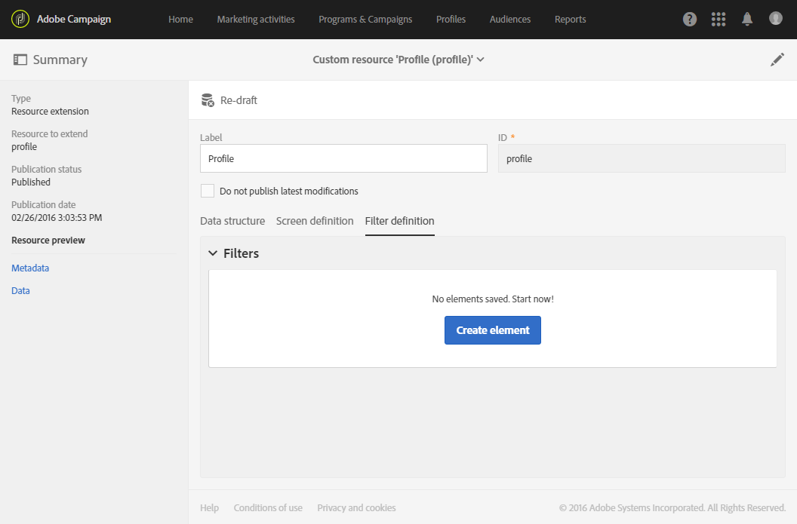
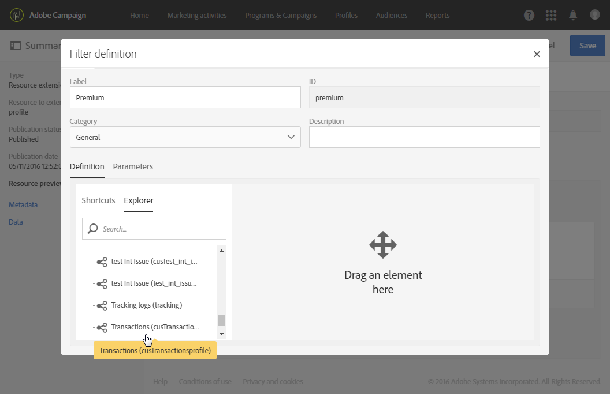
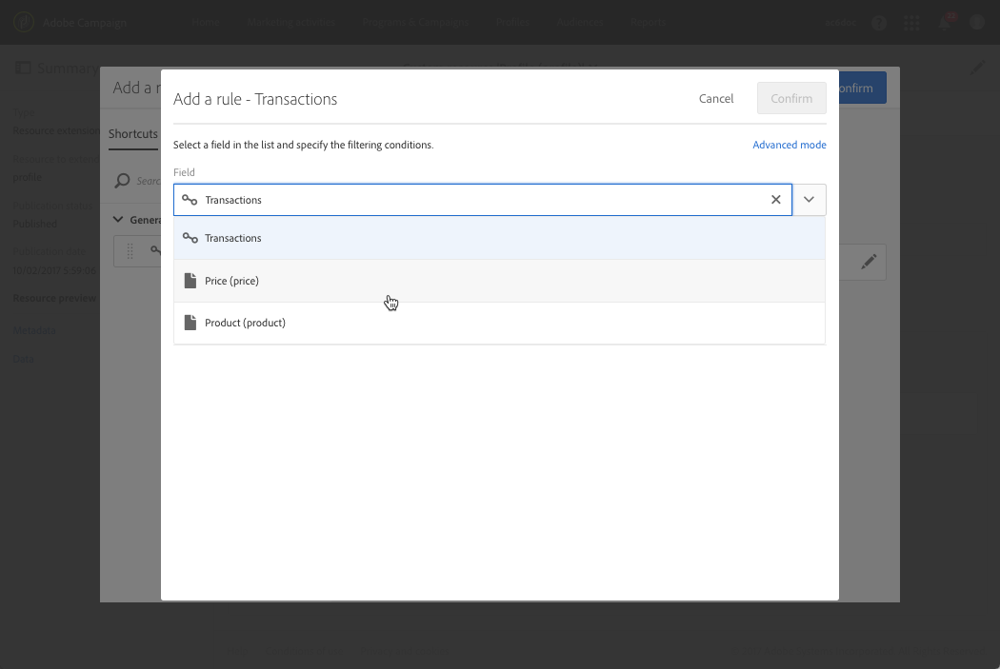
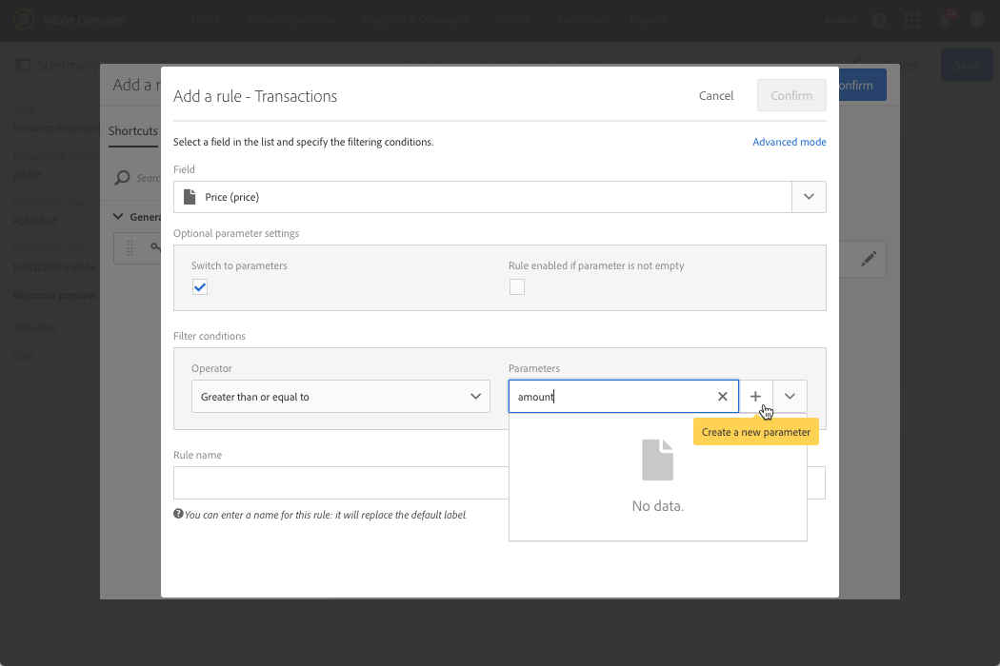
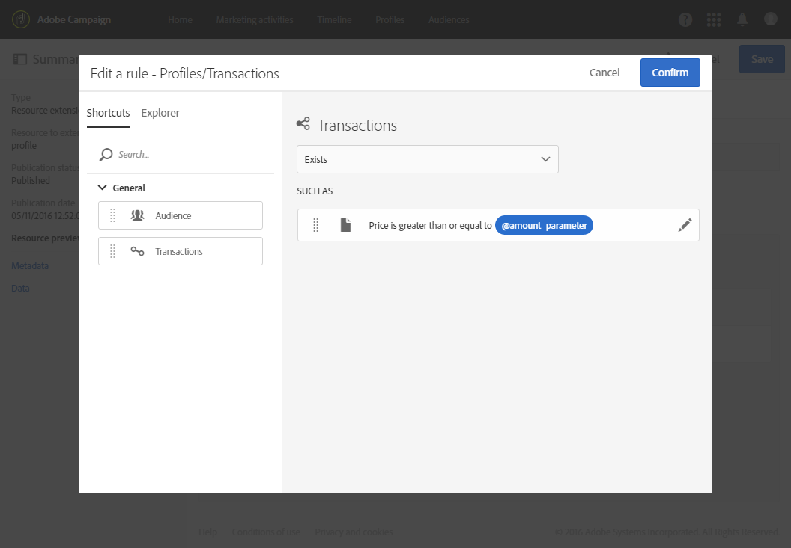
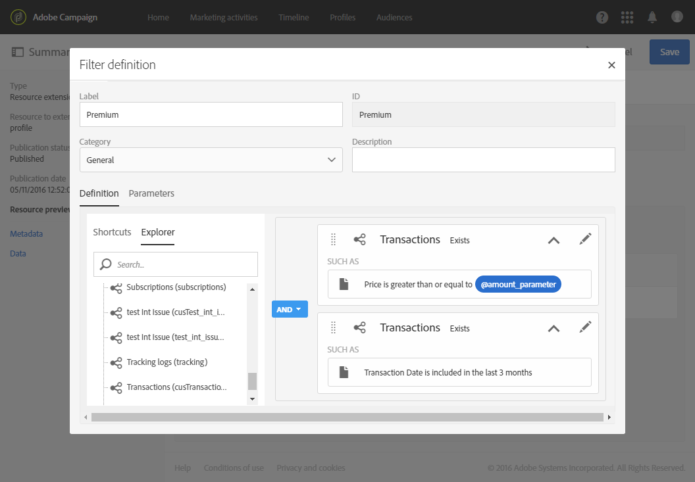
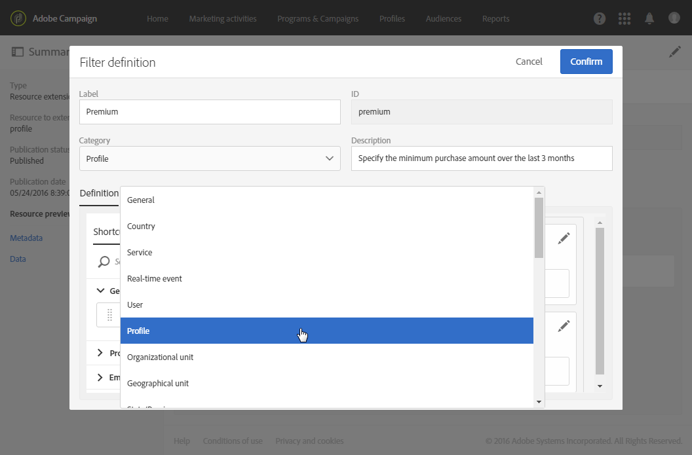
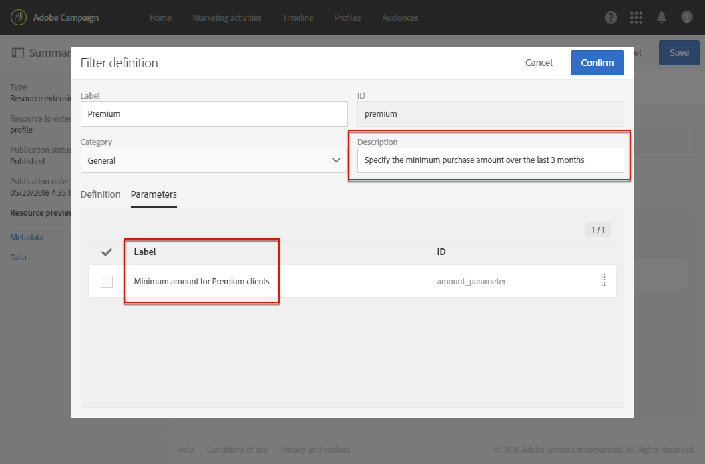
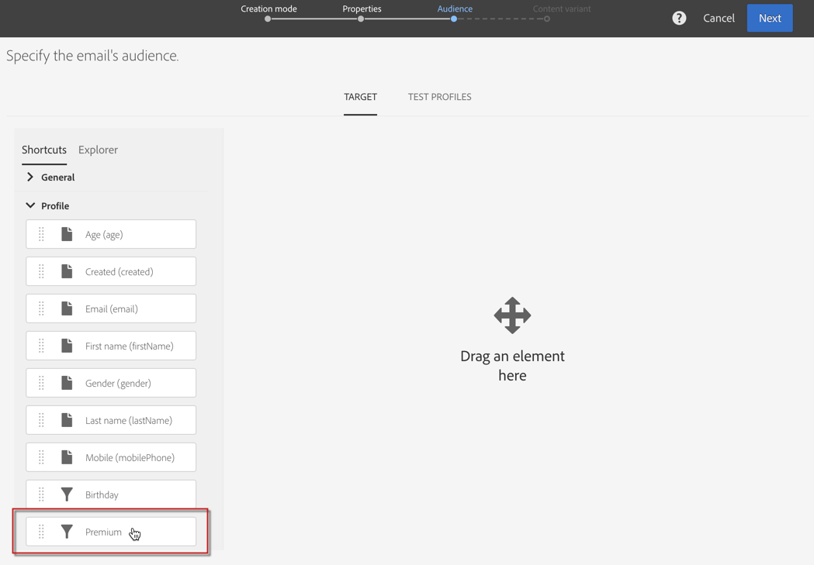
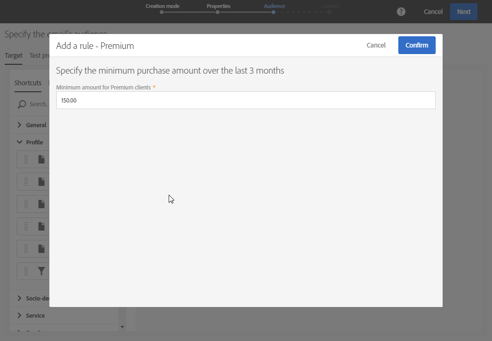

# Configuring filter definition{#configuring-filter-definition}

In the **[!UICONTROL Filter definition]** tab, you can create advanced filters that users can directly access when creating complex queries, such as when defining an audience.

This step is not mandatory as you will still be able to populate your resource and access its data through workflows, audiences and REST API.

These filters are used in the query editor in the form of pre-configured rules. They allow you to limit the number of steps necessary to get the desired configuration, which can be particularly beneficial for repetitive segmentations.

For example, you can create a filter enabling to select all transactions greater than a certain amount within the last three months.

To do this, you need to extend the **[!UICONTROL Profiles]** resource and define a filter linking to a transaction table (that you have previously created) with a rule indicating that the transaction price must be greater than or equal to a given parameter and that the transaction date must fall within a range corresponding to the last three months.

1. Make sure you create and publish a transaction table. See [Creating or extending the resource](../../developing/using/creating-or-extending-the-resource.md).

   >[!NOTE]
   >
   >This procedure uses the example of a custom transaction table. For your case, adjust it to your business needs.

1. Before defining a filter related to the transaction table in the **[!UICONTROL Profiles]** resource, make sure you define the link to this table and publish your changes. See [Defining links with other resources](../../developing/using/configuring-the-resource-s-data-structure.md#defining-links-with-other-resources) and [Updating the database structure](../../developing/using/updating-the-database-structure.md).
1. In the **[!UICONTROL Definition]** tab of your new filter's definition screen, select the transaction table.

   

1. In the **[!UICONTROL Add a rule - Profiles/Transactions]** window, drag and drop the transaction table into the workspace. In the next window that is displayed, select the field that you want to use.

   

1. In the **[!UICONTROL Optional parameter settings]** of the **[!UICONTROL Add a rule - Transactions]** window, check the **[!UICONTROL Switch to parameters]** box.

   In the **[!UICONTROL Filter conditions]**, select the **[!UICONTROL Greater than or equal to]** operator. In the **[!UICONTROL Parameters]** field, enter a name and click the plus sign to create the new parameter.

   

1. Confirm your changes. This definition corresponds to a configurable field that the user must fill in later to execute the query.

   

1. Combine this rule with another rule specifying that the transaction date must fall within a range corresponding to the last three months.

   

1. Choose the category in which your filter will be displayed.

   

1. In the **[!UICONTROL Parameters]** tab of the filter definition screen, modify the description and the label to clearly indicate the subject of your filter to the users. This information will appear in the query editor.

   

   If you define multiple configurable fields, you can modify the order in which they appear in the interface.

1. Save your changes and publish the resources. For more on this, refer to the [Updating the database structure](../../developing/using/updating-the-database-structure.md) section.

Once the **[!UICONTROL Profiles]** resource extension is published, the users will see this filter under the shortcuts tab in the [query editor](../../automating/using/editing-queries.md) interface.

This will allow the user to easily define their audience when creating an email to send to all of the clients that spent more than a certain amount over the last three months.

Rather than configuring it themselves, they simply have to enter the desired amount in the dialog box that appears.

Once a filter is configured, you can use it from Campaign Standard APIs using this syntax:

`GET https://mc.adobe.io/<ORGANIZATION>/campaign/profileAndServicesExt/<resourceName>/by<customFilterName>?<customFilterparam>=<customFilterValue>`
  
For more on this, refer to the [Campaign Standard APIs documentation](../../api/using/filtering.md#custom-filters).
