# Configuring the resource's data structure{#configuring-the-resource-s-data-structure}

After creating a new custom resource, you must configure the data structure.

When editing the resource, in the **[!UICONTROL Data structure]** tab, you can add:

* [Fields](#adding-fields-to-a-resource)
* [Identification keys](#defining-identification-keys)
* [Indexes](#defining-indexes)
* [Links](#defining-links-with-other-resources)
* [Sending logs](#defining-sending-logs-extension)

## Adding fields to a resource {#adding-fields-to-a-resource}

You can add new fields to a resource to store data that are not part of the out of the box data model.

1. Use the **[!UICONTROL Create element]** button to create a field.
1. Specify a label, an ID, a field type, and define the maximum length authorized for this field.

   The **[!UICONTROL ID]** field is mandatory and must be unique for each field added.

   >[!NOTE]
   >
   >If you leave the **[!UICONTROL Label]** field empty, it will automatically be completed from the ID.
   >We recommend using 30 characters maximum.

   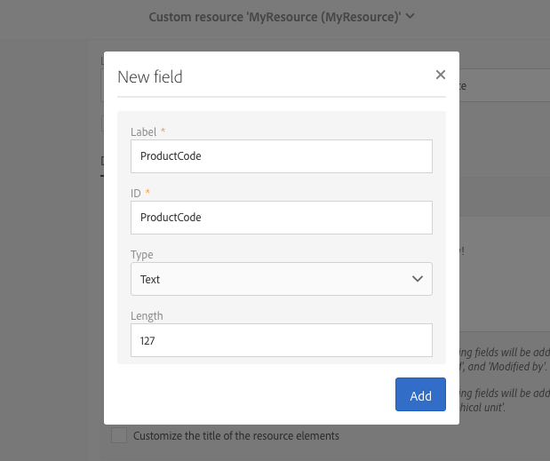

1. To modify one of the fields, check the **[!UICONTROL Edit Properties]** button.

   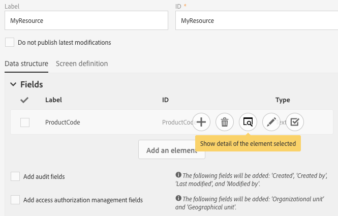

1. In the **[!UICONTROL Field definition]** screen, you can define a category that will be used for the audience and targeting, or even add a description.

   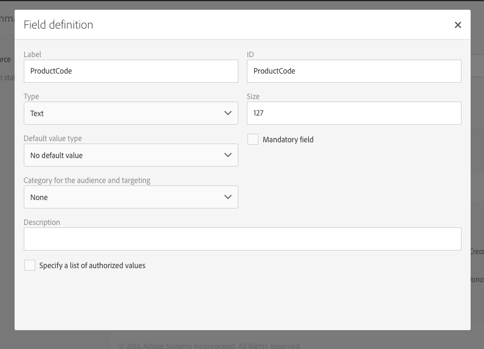

1. Check the **[!UICONTROL Specify a list of authorized values]** option if you need to define values that will be offered to the user (enumeration values).

   Then, click **[!UICONTROL Create element]** and specify a **[!UICONTROL Label]** and **[!UICONTROL Value]**. Add as many values as needed.

1. Once you have added your fields, check the **[!UICONTROL Add audit fields]** box to include fields detailing the creation date, the user that created the resource, the date, and the author of the last modification.
1. Check the **[!UICONTROL Add access authorization management fields]** box to include the fields stating who has access rights to that particular resource.

   These fields appear in the data and metadata that can be displayed once the database update has been carried out. For more on this, refer to the [Updating the database structure](../../developing/using/updating-the-database-structure.md) section.

1. Check the **[!UICONTROL Add automatic ID]** field to automatically generate an ID. Please note that existing entities will remain empty.
1. To modify the way in which the name of the resource elements will appear in the lists and creation steps, check the **[!UICONTROL Personalize the resource title]** box. Select a field from those you created for this resource.

   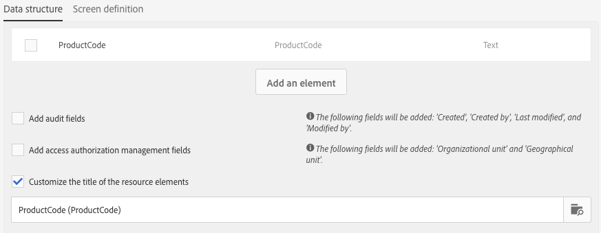

The fields of your resource are now defined.

## Defining identification keys {#defining-identification-keys}

Each resource must have at least one unique key. For example, you can specify a key so that two products cannot have the same ID in a purchase table.

1. Specify it in the **[!UICONTROL Automatic primary key]** section the size for the storage if you would like to have a technical key automatically and incrementally generated.

   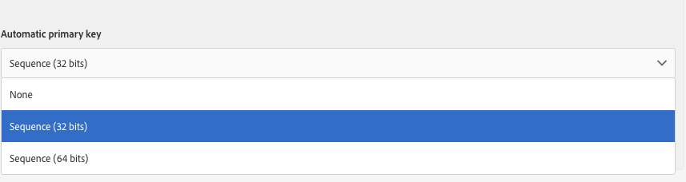

1. Use the **[!UICONTROL Create element]** button to create a key.

   The **[!UICONTROL Label]** and **[!UICONTROL ID]** fields are completed by default but you can edit them.

   >[!NOTE]
   >
   >We recommend using 30 characters maximum.

1. To define the elements making up this key, click **[!UICONTROL Create element]** and select the fields that you created for this resource.

   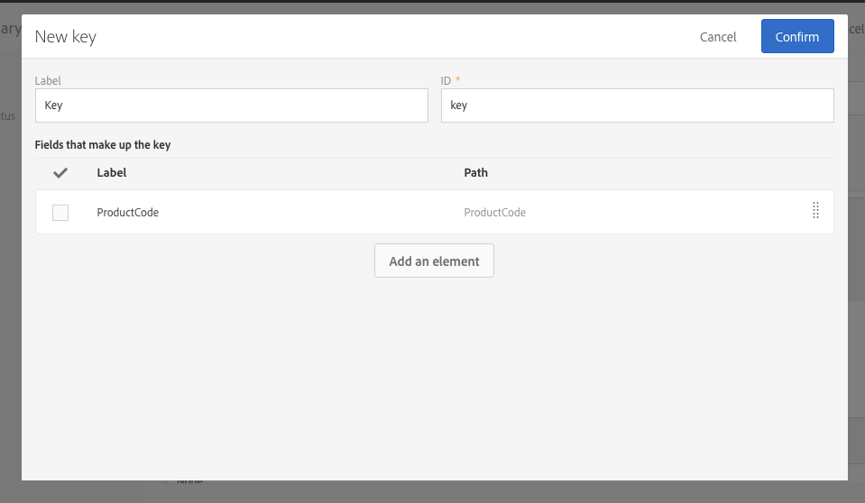

   Created keys are displayed in the **[!UICONTROL Custom keys]** section.

Your identification keys for the resource are now created.

## Defining indexes {#defining-indexes}

An index can reference one or several resource fields. Indexes allow the database to sort records in order to recover them more easily. They optimize the performances of SQL queries.

Defining indexes is recommended but not mandatory.

1. Use the **[!UICONTROL Create element]** button to create an index.

   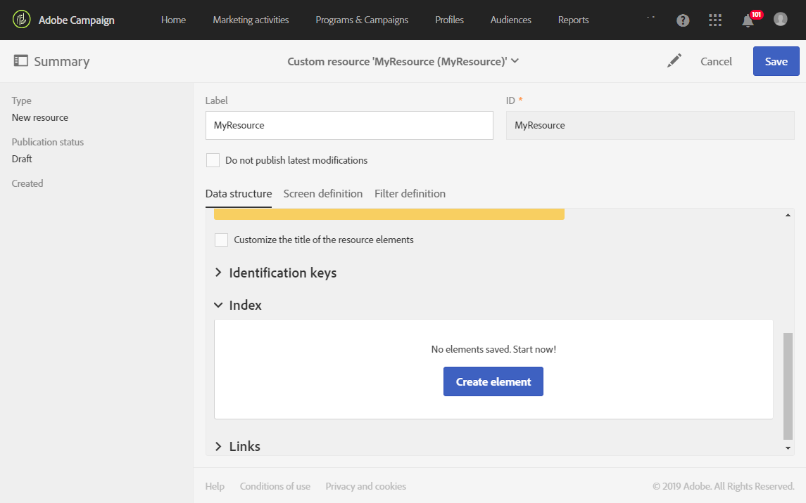

1. The **[!UICONTROL Label]** and **[!UICONTROL ID]** fields are completed by default, but you can edit them.

   >[!NOTE]
   >
   >We recommend using 30 characters maximum.

1. To define the elements making up this index, select the fields from those that you created for this resource.

   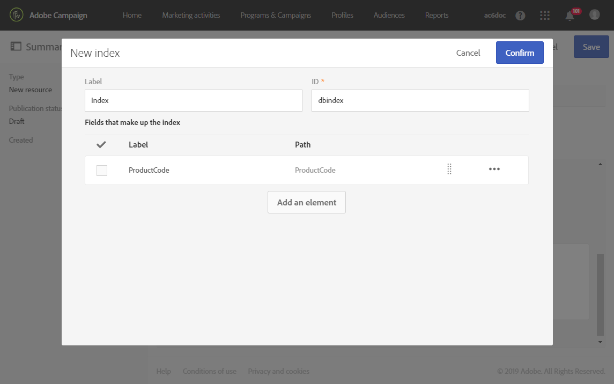

1. Click **[!UICONTROL Confirm]**.

The indexes that were created appear in the list in the **[!UICONTROL Index]** section.

## Defining links with other resources {#defining-links-with-other-resources}

A link details the association that one table has with other tables.

1. Use the **[!UICONTROL Create element]** button to create a link to a target resource.
1. Click **[!UICONTROL Select a target resource]**.

   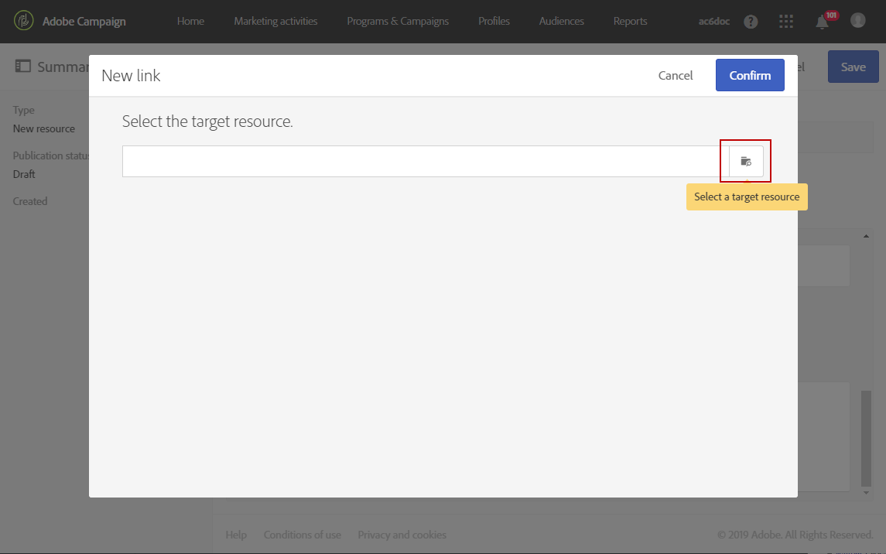

1. Resources are shown in alphabetical order and can be filtered by name. Their technical name is displayed in brackets.

   Select an element from the list and click **[!UICONTROL Confirm]**.

   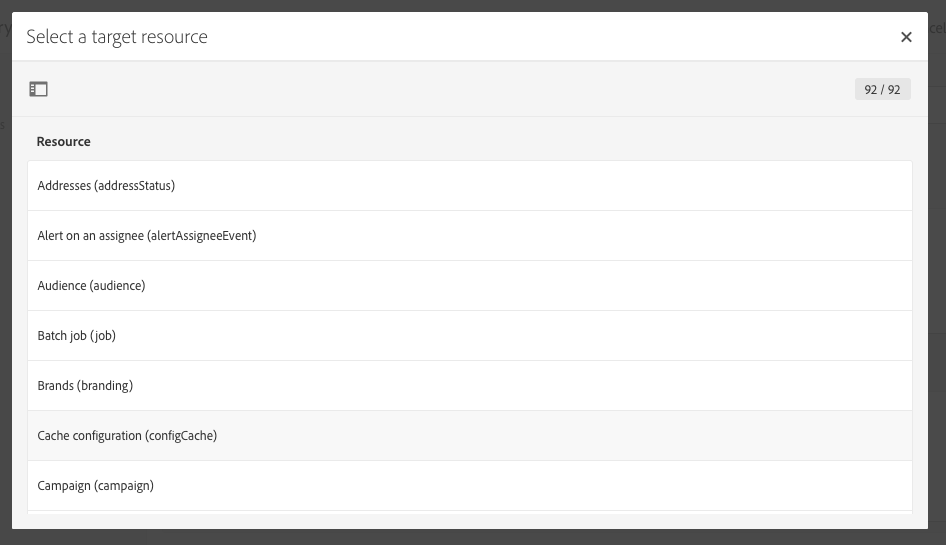

1. Select the **[!UICONTROL Link type]** according to cardinality. Depending on the cardinality type selected, the behavior if the records are deleted or duplicated may vary.

   The various link types are as follows:

    * **[!UICONTROL 1 cardinality simple link]**: one occurrence of the source table can have at most one corresponding occurrence of the target table.
    * **[!UICONTROL N cardinality collection link]**: one occurrence of the source table can have several corresponding occurrences of the target table, but one occurrence of the target table can have at most one corresponding occurrence of the source table.
    * **[!UICONTROL 0 or 1 cardinality simple link]**: one occurrence of the source table can have at most one corresponding occurrence of the target table or none. Note that this kind of **[!UICONTROL Link type]** can cause performance issue.

   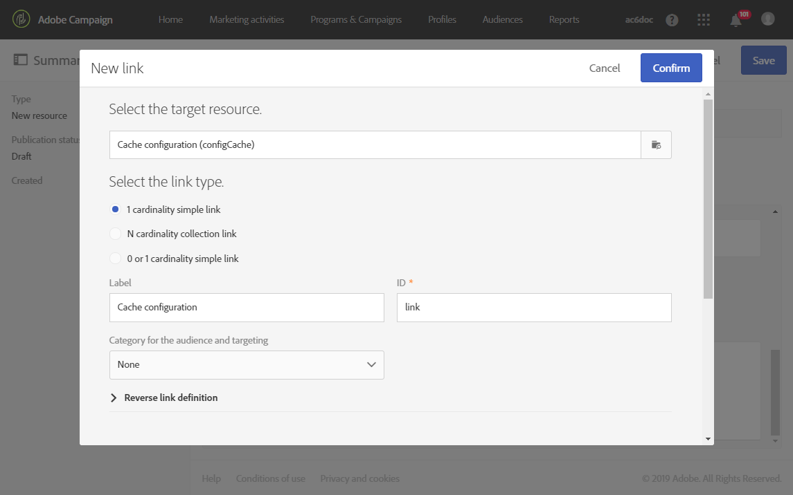

1. In the **[!UICONTROL New link]** screen, the **[!UICONTROL Label]** and **[!UICONTROL ID]** fields are completed by default, but you can edit them.

   >[!NOTE]
   >
   >We recommend using 30 characters maximum.
   
   >[!CAUTION]
   >
   >It is not possible to rename a link after creation. To rename a link, you must delete it and create it again.

1. The **[!UICONTROL Category for the audience and targeting]** list allows you to assign this link to a category making it more visible in the query editor tool.
1. If needed, the **[!UICONTROL Reverse link definition]** section allows you to display the label and ID of the resource in the targeted resource.
1. Define the behavior of the records referenced by the link in the **[!UICONTROL Behavior if deleted/duplicated]** section.

   By default, the target record will be deleted once it is no longer referenced by the link.

   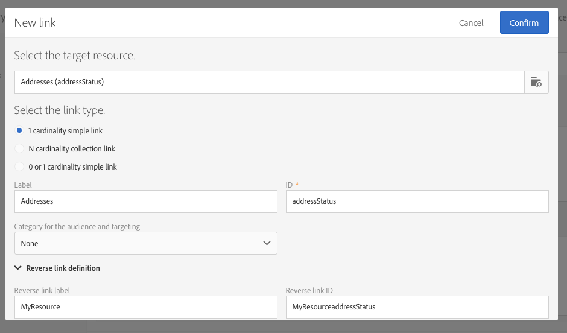

1. In the **[!UICONTROL Join definition]** section, the default **[!UICONTROL Use the primary keys to make the join]** option is selected but you can choose between two options:

    * **[!UICONTROL Use the primary key to make the join]**: This join definition allows you to use the profiles primary key to reconcile with the purchases' primary key.
    * **[!UICONTROL Define specific join conditions]**: This join definition allows you to manually select the fields that will join both resources. Please note that if data are not correctly configured, the **Purchase** record will not be visible.

   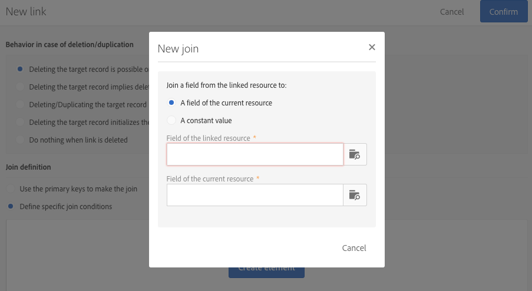

The links created are displayed in the list in the **[!UICONTROL Links]** section.

**Example: Link a created resource with the 'Profiles' resource**

In this example, we want to link a new resource **Purchase** with the **Profiles** custom resource:

1. Create your new **Purchase** resource.
1. To link it with the **Profiles** custom resource, unfold the **[!UICONTROL Links]** section in the **[!UICONTROL Data structure]** tab and click **[!UICONTROL Create element]**.
1. Select the target resource, here **[!UICONTROL Profiles (profile)]**.
1. In this example, keep the default **[!UICONTROL 1 cardinality simple link]** Link type selected.

   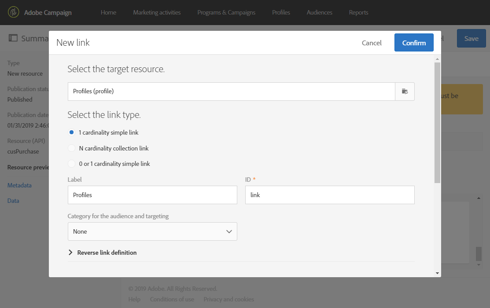

1. Choose a join definition, here keep the default **[!UICONTROL Use the primary key to make the join]**.

   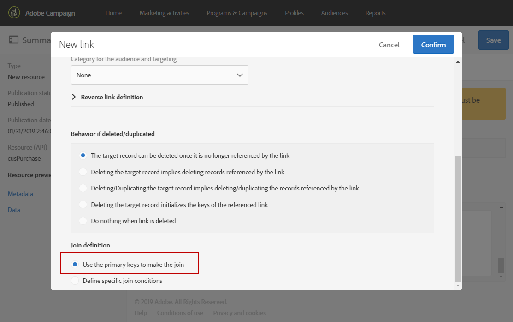

1. If needed, you can define a detail screen to be able to edit **Purchase** and link it to a profile.

   Unfold the **[!UICONTROL Detail screen configuration]** section and check the **[!UICONTROL Define a detail screen]** to configure the screen that corresponds to each element of the resource. If you do not check this box, the detail view of elements of this resource will not be accessible.

1. Click **[!UICONTROL Create element]**.
1. Select your linked resource and click **[!UICONTROL Add]**.

   Your new resource will then be available in the advanced menu by selecting **[!UICONTROL Client data]** > **[!UICONTROL Purchase]**.

   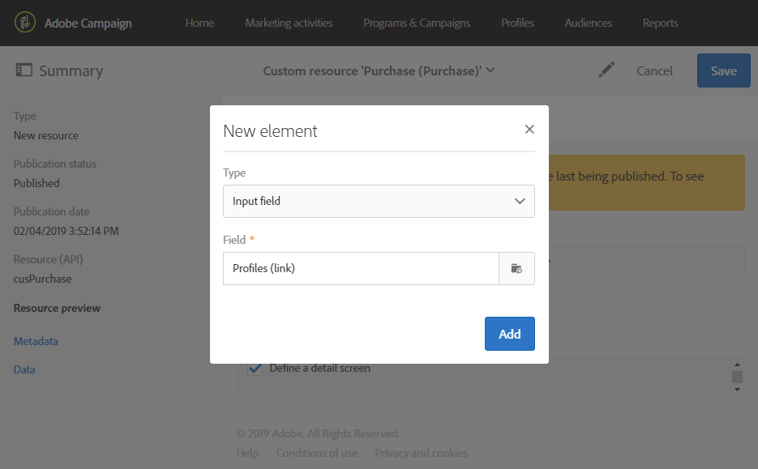

1. Once your configuration is done, click **[!UICONTROL Confirm]**.

   You can now publish your new resource.

By adding this link, a **Purchase** tab is added to the profiles detail screen from the **[!UICONTROL Profiles & audiences]** > **[!UICONTROL Profiles]** menu. Please note that this is specific to the **[!UICONTROL Profile]** resource.

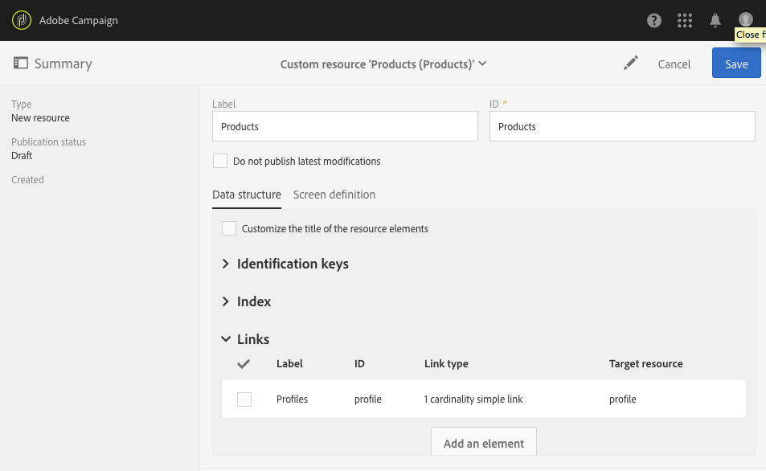

## Defining sending logs extension {#defining-sending-logs-extension}

The sending log extension allows you:

* to extend dynamic report capabilities by **adding profile custom fields**
* to extend the sending logs data with **segment code and profile data**

**Extend with a segment code**

The user can extend the logs with the segment code coming from the workflow engine.

The segment code must be defined into the workflow.

To activate this extension, check the option **[!UICONTROL Add segment code]**.

For more information on segment code, refer to the [Segmentation](../../automating/using/segmentation.md) section.

**Extend with a profile field**

>[!NOTE]
>
>The administrator should have extended the Profile resource with a custom field.

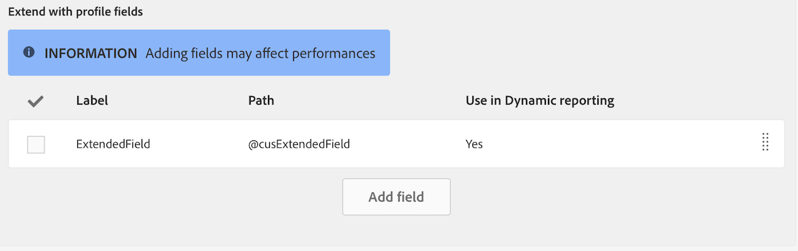

Click **[!UICONTROL Add field]** and select any custom field from the profile resource.

In order to generate a new sub-dimension linked to the Profile dimension, check the **[!UICONTROL Add this field in Dynamic reporting as a new dimension]** option.

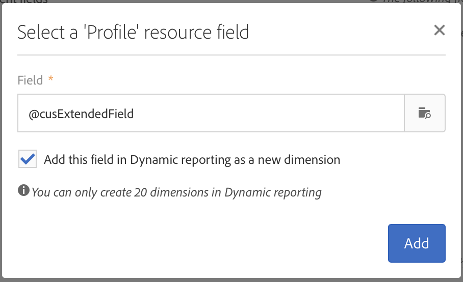

From Dynamic Reporting, you can drag and drop the custom field dimension into a freeform table.

For more information on Dynamic Reporting, refer to the [List of components](../../reporting/using/list-of-components-.md).

>[!CAUTION]
>
>The number of fields sent to Dynamic Reporting is limited to 20.

## Editing resource properties {#editing-resource-properties}

In the custom resource screen, the **[!UICONTROL Summary]** pane indicates the status of the newly created resource. You can manage its access and its general properties.

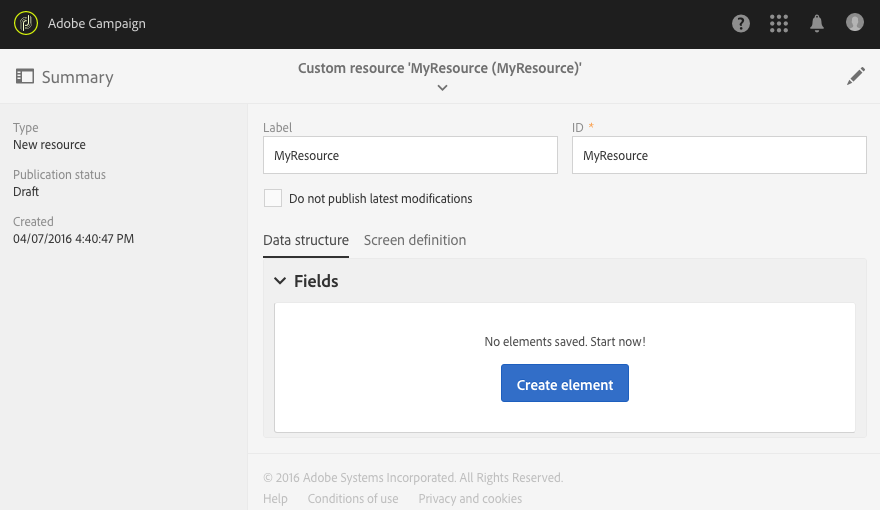

1. Click the **[!UICONTROL Edit properties]** button to add a description.

   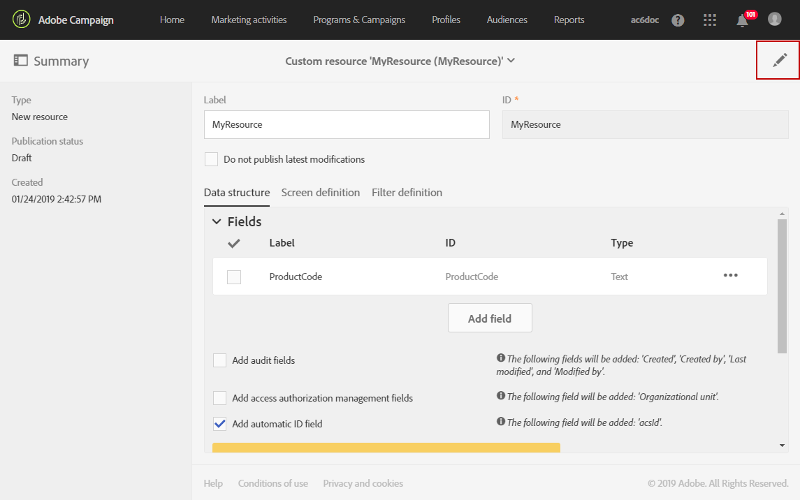

1. If needed, modify the label and ID of the resource.

   >[!NOTE]
   >
   >We recommend using 30 characters maximum.

1. If you need to restrict the access to this resource to certain organizational units, specify them here. Only users from authorized units will be able to work with this resource in the application.
1. Save the modifications.

Your modifications are saved. You need to publish the resource again to apply them.

## Generating a unique ID for profiles and custom resources {#generating-a-unique-id-for-profiles-and-custom-resources}

By default, profiles and custom resources have no business ID when they are created. You can enable an option that generates automatically a unique ID when elements are created. This ID can be used to:

* Identify exported records easily in an external tool.
* Reconcile records when importing updated data processed in another application.

It can be enabled for profiles and custom resources only.

1. Create an extension to the profiles resource or create a new resource.
1. In the data structure definition, check the **[!UICONTROL Add automatic ID field]** option, under the **[!UICONTROL Fields]** section.
1. Save and publish the modification made to the resource. If you want this mechanism to apply for elements created via the API, check the option to extend the API.

The **[!UICONTROL ACS ID]** field is now available and automatically populated when new elements are created manually, from the API, or inserted from an import workflow. The ACS ID field is a UUID field and is indexed.

When exporting profiles or custom resources, you can now add the **[!UICONTROL ACS ID]** column if it has been enabled for that resource. You can reuse this ID in your external tools to identify records.

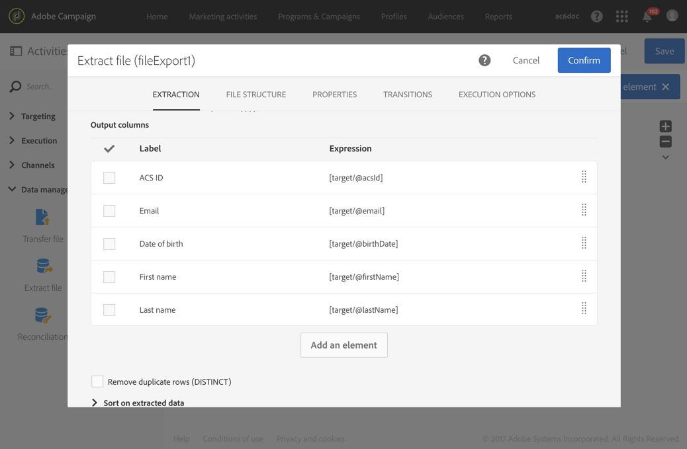

When re-importing data that have been processed/updated in another application (for example a CRM), you can reconcile it easily with this unique ID.

>[!NOTE]
>
>The **[!UICONTROL ACS ID]** field is not updated for profiles or elements created before activating the option. Only new records will have an ACS ID. This field is in read-only mode. You cannot modify it.

