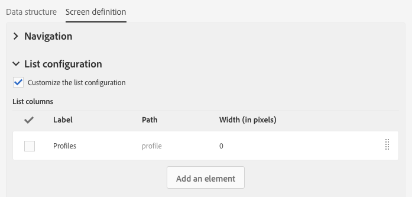
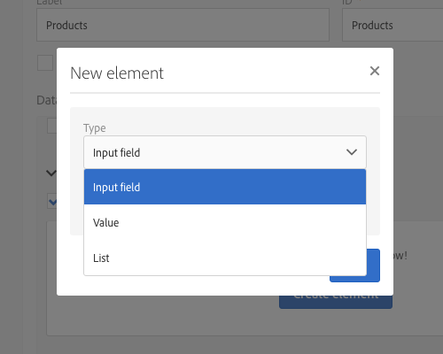
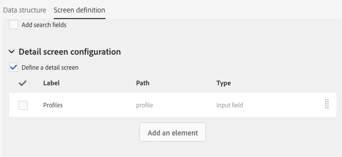
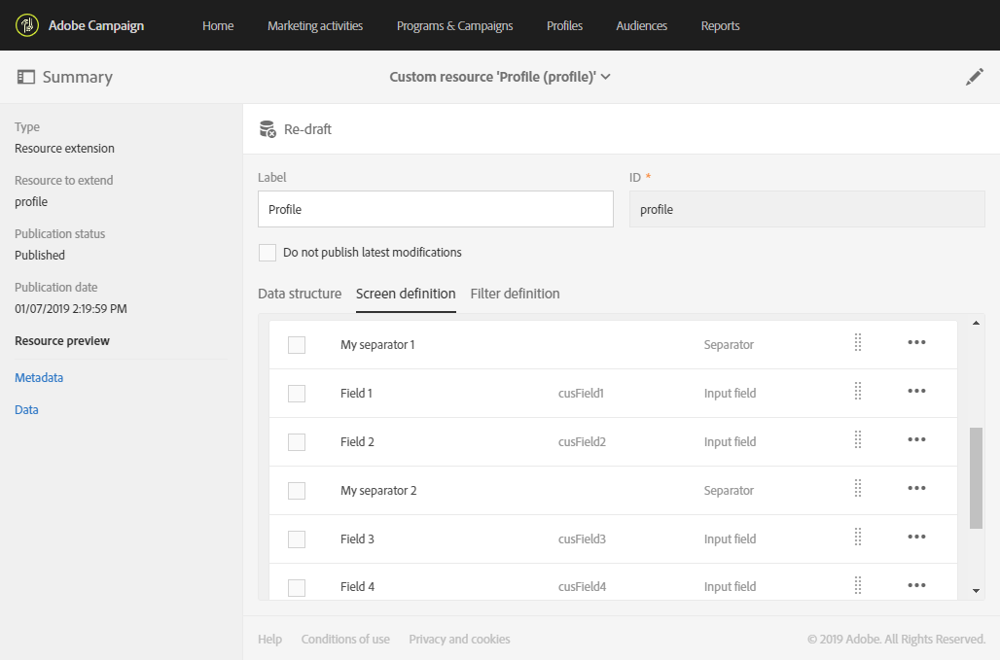
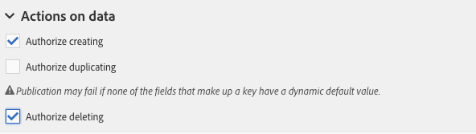

# Configuring the screen definition{#configuring-the-screen-definition}

When creating a resource or when adding new fields to an existing resource, you can define how you want them to appear in the interface.

This step is not mandatory as you will still be able to populate your resource and access its data through workflows, audiences and REST API.

In the **[!UICONTROL Screen definition]** tab, you can:

* Add access to the custom resource in the navigation pane
* Personalize the way in which the list of elements that make up the resource is presented
* Define the way the detail view of each element of the resource is displayed

## Enabling access from the navigation menu {#enabling-access-from-the-navigation-menu}

If you want your resource to have a dedicated screen, you can make it available from the navigation menu.

1. From the **[!UICONTROL Screen definition]** tab of the resource, unfold the **[!UICONTROL Navigation]** section.
1. Check the **[!UICONTROL Add an entry in the 'Client data' section]** box to allow access to this resource from the navigation pane. 

   

The resource will appear as a sub-entry within the **[!UICONTROL Client data]** section.

## Defining the default list configuration {#defining-the-default-list-configuration}

The **[!UICONTROL List configuration]** section of the screen definition lets you define the columns and information that will be displayed by default in the overview of a resource.

1. Check the **[!UICONTROL Customize the list configuration]** box to define the way the columns of the resource are displayed.
1. Use the **[!UICONTROL Create element]** button to select a field from those that you have created.
1. The field created is displayed in the list. You can edit its label and its width.

   

1. In the **[!UICONTROL Simple search]** section, check the **[!UICONTROL Specify the fields to be taken into account in the search]** to define which fields will be included in the search.

   >[!IMPORTANT]
   >
   >This configuration replaces the fields used in the default search.

1. In the **[!UICONTROL Advanced filtering]** section, check the **[!UICONTROL Add search fields]** box to add additional fields beyond the simple search field. For example, if you select the "date" field from the fields that you have created, the user will be able to perform a search that only refers to the date.
1. You can modify the order of the fields for the two search types.
1. For an advanced search, you can add fields that link to a linked resource. These filters appear in the **[!UICONTROL Search]** menu of the generated screen.

The overview screen of the resource is now defined.

## Defining the detail screen configuration {#defining-the-detail-screen-configuration}

The **[!UICONTROL Detail screen configuration]** section of the screen definition lets you define the columns and information that will be displayed in the detail screen of each element of the resource.

1. Unfold the **[!UICONTROL Detail screen configuration]** section and check the **[!UICONTROL Define a detail screen]** to configure the screen that corresponds to each element of the resource. If you do not check this box, the detail view of elements of this resource will not be accessible.
1. You can add all of the fields from your custom resource in one click. To do this, click the  icon or use the **[!UICONTROL Add an element]** button.
1. Select an element from those created for this resource and specify a field type:

    * **[!UICONTROL Input field]**: is an editable field.
    * **[!UICONTROL Value]**: is a read-only field.
    * **[!UICONTROL List]**: is a table.
    * **[!UICONTROL Separator]**: splits your elements into categories.

   

1. The element added is displayed in the list. You can edit its label.

   

1. Add as many **[!UICONTROL Separator]** as needed to split your elements into different categories.

   This allows you to display separator to better organize your windows.

   

The detail screen of the resource is now configured.

## Actions on data section {#actions-on-data-section}

These settings allow you to display a control bar in the custom resource screen. There are three options available:

* **[!UICONTROL Authorize creating]**: this option allows you to activate creating elements of the resource. The user can therefore add additional records.

  >[!NOTE]
  >
  >You must first activate the detail screen linked to the resource to make this option available.

* **[!UICONTROL Authorize duplicating]**: this option allows you to activate duplicating records linked to the custom resource.
* **[!UICONTROL Authorize deleting]**: this option allows you to activate deleting records linked to the custom resource.
