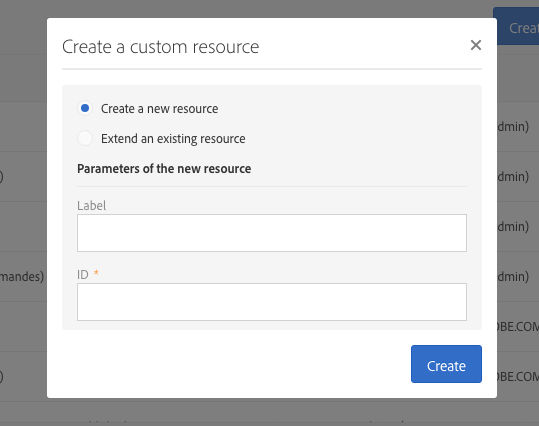
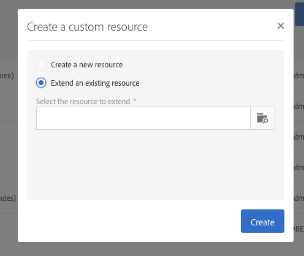

# Creating or extending the resource{#creating-or-extending-the-resource}

Administrators can create a new resource from scratch or create an extension of an existing resource if you need work on data that are not part of the built-in data model.

Only the following built-in resources can be extended:

* **[!UICONTROL Campaign (campaign)]** 
* **[!UICONTROL Deliveries (delivery)]** 
* **[!UICONTROL Landing page (Landingpage)]** 
* **[!UICONTROL Profiles (profile)]** 
* **[!UICONTROL Program (program)]** 
* **[!UICONTROL Service (service)]** 
* **[!UICONTROL Subscriptions to an application (appSubscriptionRcp)]** 
* **[!UICONTROL Test profiles (seedMember)]** 
* **[!UICONTROL Workflow (workflow)]**

To create or extend a resource:

1. From **[!UICONTROL Administration]** > **[!UICONTROL Development]** > **[!UICONTROL Custom Resources]**, click the **[!UICONTROL Create]** button.
1. Choose the action you want to perform:

    * **[!UICONTROL Create a new resource]**: Enter the **[!UICONTROL Label]** and **[!UICONTROL ID]** fields. The **[!UICONTROL ID]** field is mandatory. If you leave the Label field empty, it will automatically be completed from the ID.
    
      

      >[!NOTE]
      >
      >Use 30 characters maximum.

    * **[!UICONTROL Extend an existing resource]**: Select the resource you want to extend.
    
      

1. Click **[!UICONTROL Create]** to create the resource, which will then take on the **[!UICONTROL Draft]** status in case of new resource or the **[!UICONTROL Editing]** status in case of extension.

The new resource is created and can now be configured. For more on resource configuration, refer to [Configuring the resource's data structure](../../developing/using/configuring-the-resource-s-data-structure.md).
