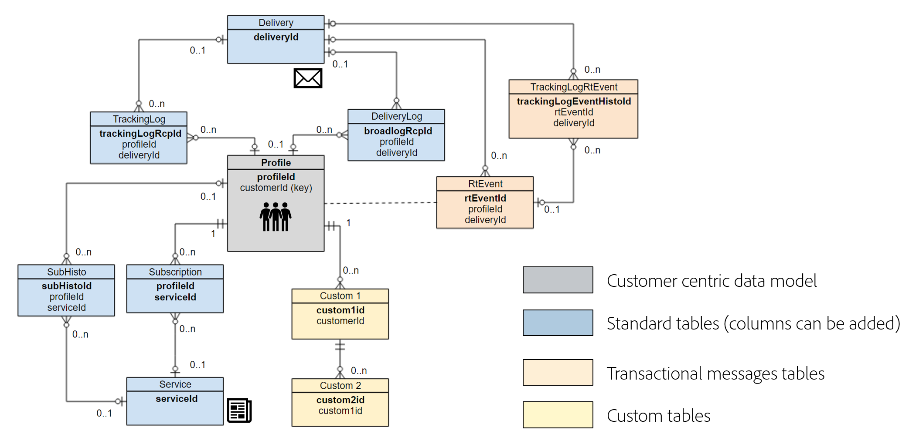

# Data model best practices{#data-model-best-practices}

This document outlines key recommendations while designing your Adobe Campaign data model.

>[!NOTE]
>
>To create and modify resources in order to extend the Adobe Campaign pre-defined data model, refer to [this section](../../developing/using/key-steps-to-add-a-resource.md).
>
>You can find a data model representation of the out-of-the-box resources [here](../../developing/using/datamodel-introduction.md).

## Overview {#overview}

Adobe Campaign system is extremely flexible and can be extended beyond the initial implementation. However, while possibilities are infinite, it is critical to make wise decisions and build strong foundations to start designing your data model.

This document provides common use cases and best practices to learn how to architect properly you Adobe Campaign tool.

## Data model architecture {#data-model-architecture}

Adobe Campaign Standard is a powerful cross-channel campaign management system that can help you align your online and offline strategies to create personalized customer experiences.

### Customer-centric approach {#customer-centric-approach}

While most email service providers are communicating to customers via a list-centric approach, Adobe Campaign relies on a relational database in order to leverage a broader view of the customers and their attributes.

This customer-centric approach is shown on the chart below. The **Profile** resource in grey represents the main customer table around which everything is being built:

The Adobe Campaign default data model is presented in this [section](../../developing/using/datamodel-introduction.md).

<!--You can find a datamodel representation for the out-of-the-box resources [here](../../developing/using/datamodel-introduction.md).-->

<!--### What is a customer? {#customer-definition}

If you have customer data in more than one system, you need to determine which solution will allow you to identify records as one person. This work might require rules, eventually a match and merge processes to determine the master record. This master record should be the one sent to Adobe Campaign.

While some of this data cleansing might be performed in Adobe Campaign, the recommendation is to run these processes outside and only import clean data in Adobe Campaign. You should keep Campaign as a marketing solution more than a data cleansing tool.

Be able to provide a master customer record which will be sent to Adobe Campaign.-->

### Data for Adobe Campaign {#data-for-campaign}

What data should be sent to Adobe Campaign? It is critical to determine the data required for your marketing activities.

>[!NOTE]
>
>Adobe Campaign is not a data warehouse. Therefore, do not try to import all possible customers and their associated information into Adobe Campaign.

To make the decision whether an attribute would be needed or not in Adobe Campaign, determine whether it would fall under one of these categories:
* Attribute used for **segmentation**
* Attribute used for **data management processes** (aggregate calculation for example)
* Attribute used for **personalization**
* Attribute used for **reporting** (reports can be created based on custom profile data)

If not falling into any of these, you are most likely not going to need this attribute in Adobe Campaign.

### Data types {#data-types}

To ensure good architecture and performance of your system, follow the best practices below to set up data in Adobe Campaign:
* The length for a string field should always be defined with the column. By default, the maximum length in Adobe Campaign is 255 characters, but Adobe recommends keeping the field shorter if you already know that the size will not exceed a shorter length.
* It is acceptable to have a field shorter in Adobe Campaign than it is in the source system if you are certain that the size in the source system was overestimated and would not be reached. This could mean a shorter string or smaller integer in Adobe Campaign.

## Configuring data structure {#configuring-data-structure}

This section outlines best practices when [configuring a resource's data structure](../../developing/using/configuring-the-resource-s-data-structure.md).

### Identifiers {#identifiers}

Adobe Campaign resources have three identifiers, and it is possible to add an additional identifier.

The following table describe these identifiers and their purpose.

>[!NOTE]
>
>The display name is the name of the field displayed to the user via the Adobe Campaign user interface. The technical name is the actual field name in the resource definition (and the table column name).

| Display name | Technical name | Description | Best practices |
|--- |--- |--- |--- |
|  | PKey | <ul><li>The PKey is the physical primary key of an Adobe Campaign table.</li><li>This identifier is usually unique to a specific Adobe Campaign instance.</li><li>In Adobe Campaign Standard, this value is not visible to the end user (except in URLs).</li></ul> | <ul><li>Via the [API system](../../api/using/about-campaign-standard-apis.md), it is possible to retrieve a PKey value (which is a generated/hashed value, not the physical key).</li><li>It is not recommended to use it for anything else than retrieving, updating, or deleting records via API.</li></ul> |
| ID | name or internalName | <ul><li>This information is a unique identifier of a record in a table. This value can be manually updated.</li><li>This identifier keeps its value when deployed in a different instance of Adobe Campaign. It must have a different name than the generated value to be exportable via a package.</li><li>This is not the actual primary key of the table.</li></ul> | <ul><li>Do not use special characters such as space “ “, semi-column “:” or hyphen “-“.</li><li>All these characters would be replaced by an underscore “_” (allowed character). For example, “abc-def” and “abc:def” would be stored as “abc_def” and overwrite each other.</li></ul> |
| Label | label | <ul><li>The label is the business identifier of an object or record in Adobe Campaign.</li><li>This object allows spaces and special characters.</li><li>It does not guarantee the uniqueness of a record.</li></ul>| <ul><li>It is recommended to determine a structure for your object labels.</li><li>This is the most user-friendly solution to identify a record or object for an Adobe Campaign user.</li></ul> |
| ACS ID |  acsId | <ul><li>An additional identifier can be generated: the [ACS ID](../../developing/using/configuring-the-resource-s-data-structure.md#generating-a-unique-id-for-profiles-and-custom-resources).</li><li>As the PKey cannot be used in the Adobe Campaign user interface, this is a solution to obtain a unique value generated during the insertion of a profile record.</li><li>The value can only be automatically generated if the option is enabled in the resource before a record gets inserted into Adobe Campaign.</li></ul> | <ul><li>This UUID can be used as a reconciliation key.</li><li>An auto-generated ACS ID cannot be used as a reference in a workflow or in a package definition.</li><li>This value is specific to an Adobe Campaign instance.</li></ul> |

### Identification keys {#keys}

Each resource created in Adobe Campaign must have at least one unique [identification key](../../developing/using/configuring-the-resource-s-data-structure.md#defining-identification-keys).

<!--Most organizations are importing records from external systems. While the physical key of a resource lies behind the PKey attribute, it is possible to determine a custom key in addition.

This custom key is the actual record primary key in the external system feeding Adobe Campaign.

When an out-of-the-box resource has both an internal auto-generated and an internal custom key, the internal key will be set as a unique index in the physical database table.-->

When creating a custom resource, you have two options:

* A combination of auto-generated key and internal custom key. This option is interesting if your system key is a composite key or not an integer. Integers will provide higher performances in big tables and joining with other tables.
* Using the primary key as the external system primary key. This solution is usually preferred as it simplifies the approach to import and export data, with a consistent key between different systems.

Identification keys should not be used as a reference in workflows.

<!--For more on defining identification keys, see [this section](../../developing/using/configuring-the-resource-s-data-structure.md#defining-identification-keys).-->

### Indexes {#indexes}

Adobe Campaign automatically adds an [index](../../developing/using/configuring-the-resource-s-data-structure.md#defining-indexes) to all primary and internal keys defined in a resource.

* Adobe recommends defining additional indexes as it may improve performance.
* However, do not add too many indexes as they use space on the database. Numerous indexes may also have a negative performance impact.
* Carefully select the indexes that need to be defined.

<!--For more on defining indexes, see [this section](../../developing/using/configuring-the-resource-s-data-structure.md#defining-indexes).

When you are performing an initial import with very high volumes of data insert in Adobe Campaign database, it is recommended to run that import without custom indexes at first. It will allow to accelerate the insertion process. Once you’ve completed this important import, it is possible to enable the index(es).-->

### Links {#links}

Defining links with other resources is presented in [this section](../../developing/using/configuring-the-resource-s-data-structure.md#defining-links-with-other-resources).

* While it is possible to join any table in a workflow, Adobe recommends defining common links between resources directly in the data structure definition.
* Link should be defined in alignment with the actual data in your tables. A wrong definition could impact data retrieved via links, for example unexpectedly duplicating records.
* Name your link consistently with the resource name: the link name should help understand what the distant table is.
* Do not name a link with “id” as a suffix. For example, name it “transaction” rather than “transactionId”.

<!--For more on defining links with other resources, see [this section](../../developing/using/configuring-the-resource-s-data-structure.md#defining-links-with-other-resources).-->

## Performance {#performance}

In order to ensure better performance at any time, follow the best practices below.

### General recommendations {#general-recommendations}

* Avoid using operations like “CONTAINS” in queries. If you know what is expected and want to be filtered for, apply the same condition with an “EQUAL TO” or other specific filter operators.
* Avoid joining with non-indexed fields while building data in workflows.
* Try and make sure the processes like import and export happen off business hours.
* Make sure there is a schedule for all the daily activities and stick to the schedule.
* If one or few of the daily processes fail and if it is mandatory to run it on that same day, make sure there are no conflicting processes running when the manual process is kicked off as this could affect the system performance.
* Make sure none of the daily campaign is run during the import process or when any manual process is executed.
* Use one or several reference tables rather than duplicating a field in every row. When using key/value pairs, it is preferred to choose a numerical key.
* A short string remains acceptable. In case references tables are already in place in an external system, reusing the same will facilitate the data integration with Adobe Campaign.

### One-to-many relationships {#one-to-many-relationships}

* Data design impacts usability and functionality. If you design your data model with lots of one-to-many relationships, it makes it more difficult for users to construct meaningful logic in the application. One-to-many filter logic can be difficult for non-technical marketers to correctly construct and understand.
* It is good to have all the essential fields in one table because it makes it easier for users to build queries. Sometimes it is also good for performance to duplicate some fields across tables if it can avoid a join. 
* Certain built-in functionalities will not be able to reference one-to-many relationships, for example, Offer Weighting formula and Deliveries.

### Large tables {#large-tables}

Below are a few best practices that should be followed when designing your data model using large tables and complex joins.

* Reduce the number of columns, particularly by identifying those that are unused.
* Optimize the data model relations by avoiding complex joins, such as joins on several conditions and/or several columns.
* For join keys, always use numeric data rather than character strings.
* Reduce as much as you can the depth of log retention. If your need deeper history, you can aggregate computation and/or handle custom log tables to store larger history.