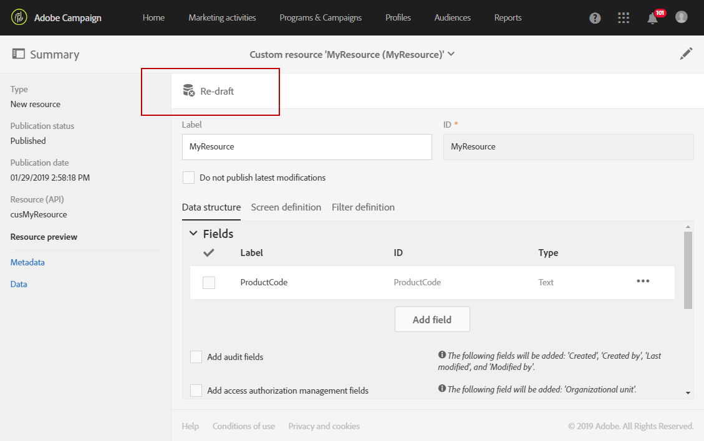
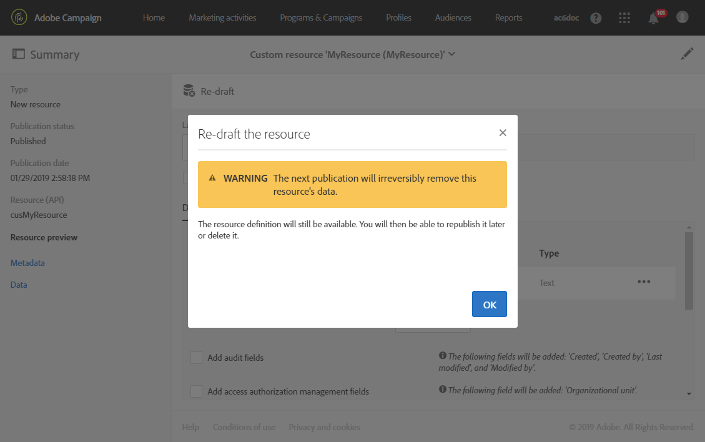
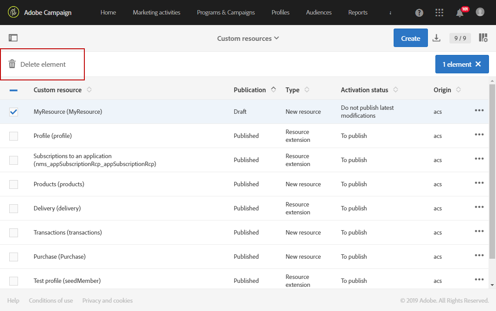

# Deleting a resource{#deleting-a-resource}

To delete a resource, the resource in question must be a **[!UICONTROL Draft]** . The resource is in **[!UICONTROL Draft]** status if:

* It has just been created and has not yet been published.
* If it has already been published, the resource has to be re-drafted.

>[!CAUTION]
>
>Re-drafting and deleting a custom resource are sensitive operations which can impact other resources. These actions must be performed by an expert user only.

To re-draft a published resource:

1. Select the resource you want to re-draft.
1. Click the **[!UICONTROL Re-draft]** button in the action bar.

   

1. Click **[!UICONTROL Ok]** .

   >[!CAUTION]
   >
   >This action is definitive: the resource's database table and its data will be permanently deleted when the modification is published, which can result in broken links from other custom resources. Only the resource definition will remain available.

   

1. Publish the resource. For more detailed steps, refer to [Publishing a custom resource](../../developing/using/updating-the-database-structure.md#publishing-a-custom-resource).

   The resource then goes into **Draft** mode and its activation status is **[!UICONTROL Inactive]** .

1. In **[!UICONTROL List]** mode, check the resource to delete then click the  **[!UICONTROL Delete element]** icon.

   

Your resource is deleted from the data model.

>[!NOTE]
>
>If a field of a custom resource used on an event is modified or deleted, the corresponding event will automatically be unpublished. See [Configuring Transactional messaging](../../administration/using/configuring-transactional-messaging.md).

