# Extending the profile resource with a new field{#extending-the-profile-resource-with-a-new-field}

## About extending profiles {#about-extending-profiles}

This use case details how to extend a profile and a test profile with a dedicated field.

Here, we want to update our profiles with the new field using a landing page then target profiles with a newsletter specific to their interests.

To do so, follow the steps below:

* [Step 1: Extend the profile resource](#step-1--extend-the-profile-resource)
* [Step 2: Extend the test profile](#step-2--extend-the-test-profile)
* [Step 3: Publish your custom resource](#step-3--publish-your-custom-resource)
* [Step 4: Update and target profiles with a workflow](#step-4--update-and-target-profiles-with-a-workflow)

The following field will then be added to our profiles and can be targeted in a delivery:

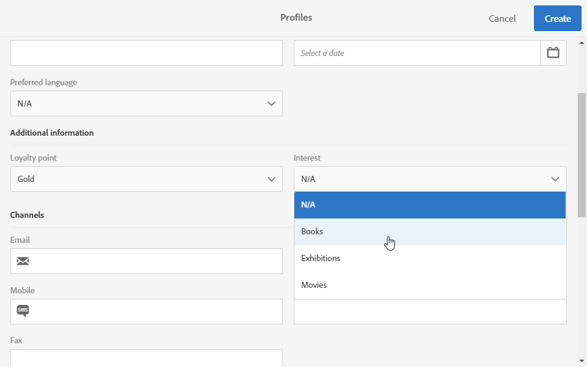

Related topics:

* [About custom resources](../../developing/using/data-model-concepts.md)
* [Managing profiles](../../audiences/using/about-profiles.md)
* [Managing test profiles](../../audiences/using/managing-test-profiles.md)

## Step 1: Extend the profile resource {#step-1--extend-the-profile-resource}

To create the new **Interest** field for our profiles, you first need to extend the out-of-the-box **[!UICONTROL Profiles (profile)]** resource.

1. From the advanced menu, via the Adobe Campaign logo, select **[!UICONTROL Administration]** > **[!UICONTROL Development]**, then **[!UICONTROL Custom resources]**.
1. If you have not extended the **[!UICONTROL Profiles]** resource yet, click **[!UICONTROL Create]**.
1. Choose the **[!UICONTROL Extend an existing resource]** option.
1. Select the **[!UICONTROL Profile (profile)]** resource.
1. Click **[!UICONTROL Create]**.

   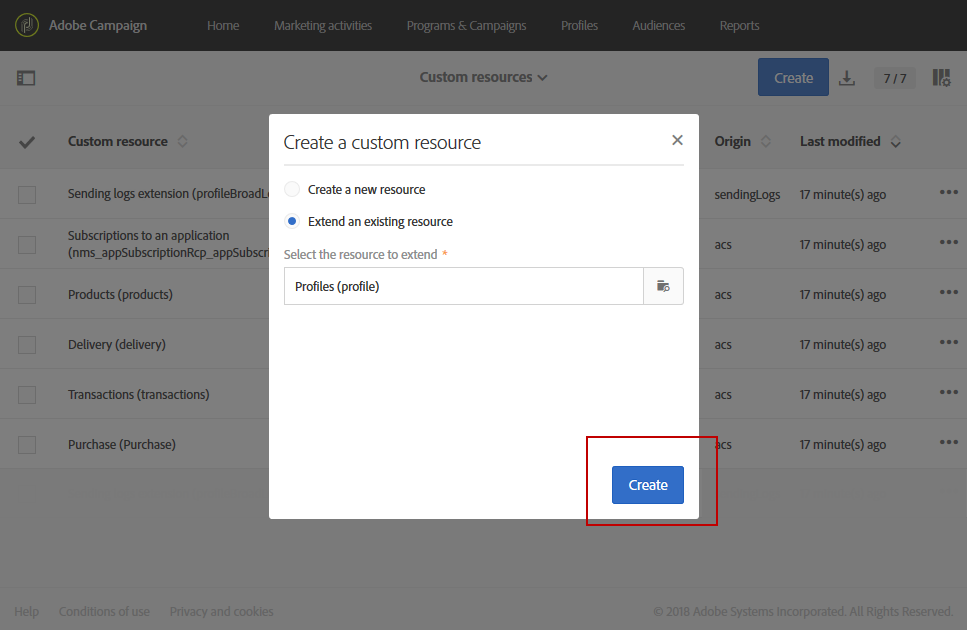

1. In the **[!UICONTROL Fields]** category of the **[!UICONTROL Data structure]** tab, click **[!UICONTROL Create element]**.

   >[!NOTE]
   >
   >Note that if you already extended the **[!UICONTROL Profile]** resource for previous purposes, you can start at this step by clicking **[!UICONTROL Add field]**.

   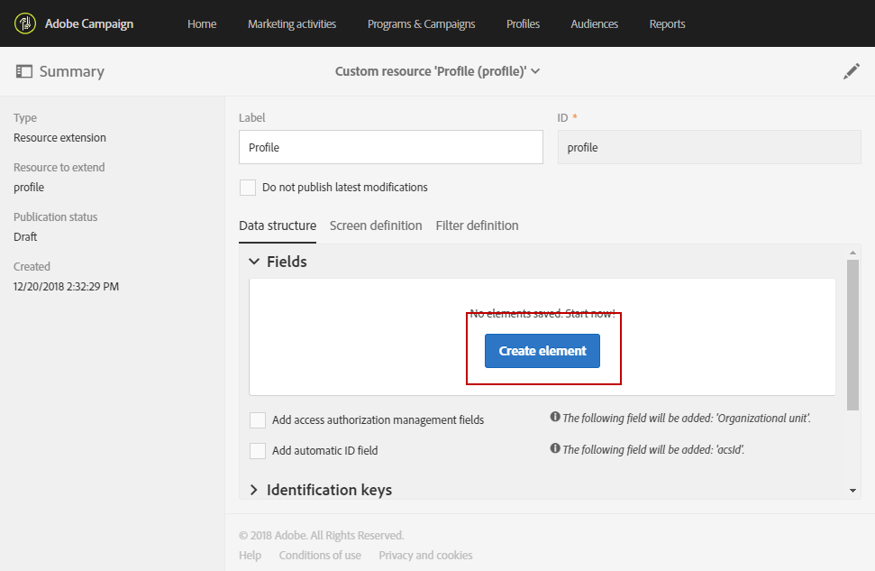

1. Add a **[!UICONTROL Label]** and an **[!UICONTROL ID]**. Select the **[!UICONTROL Text]** type and click **[!UICONTROL Add]**.

   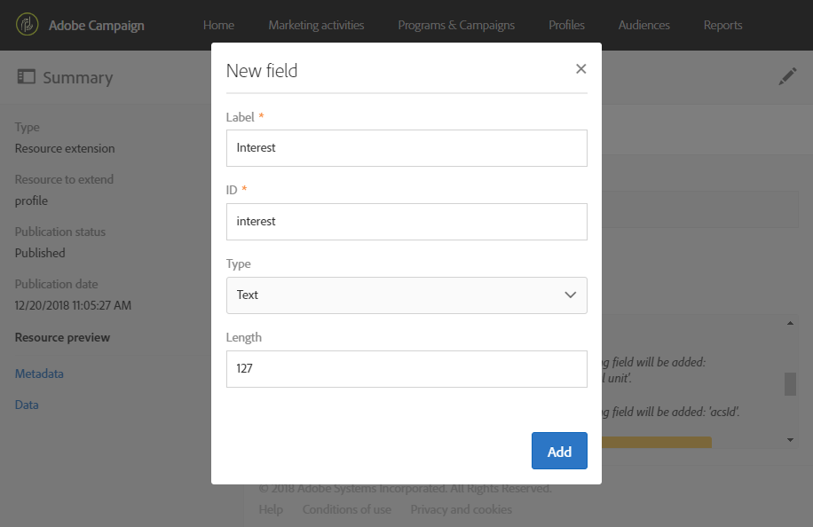

1. To configure your field, in the **[!UICONTROL Data structure]** tab under the **[!UICONTROL Fields]** drop-down, click  then  from your previously created field.
1. In this example we want to add specific values, to do so click **[!UICONTROL Specify a list of authorized values]**.

   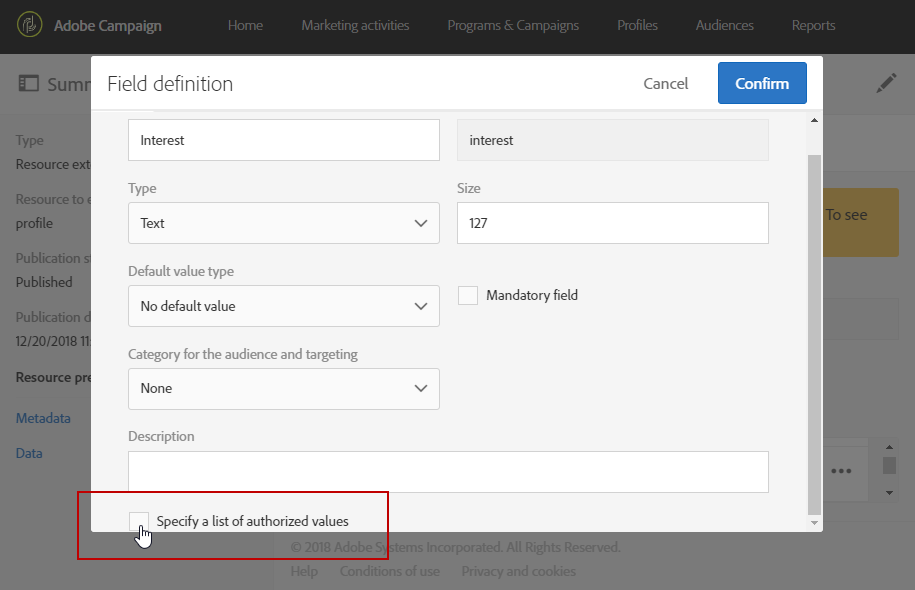

1. Click **[!UICONTROL Add an element]** then add as many value as needed by adding a **[!UICONTROL Label]** and an **[!UICONTROL ID]** and clicking **[!UICONTROL Add]**.

   Here, we will create the Books, Exhibitions, Movies and N/A values for profiles to choose between these options.

   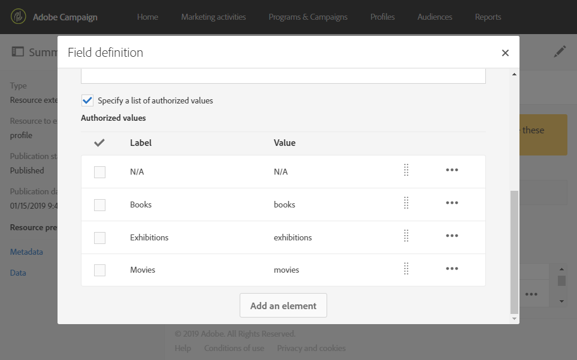

1. To add this field in the **[!UICONTROL Profile]** screen, click the **[!UICONTROL Screen definition]** tab.
1. In the **[!UICONTROL Detail screen configuration]** drop-down, click **[!UICONTROL Add a personalized fields section]** and click **[!UICONTROL Create element]**.

   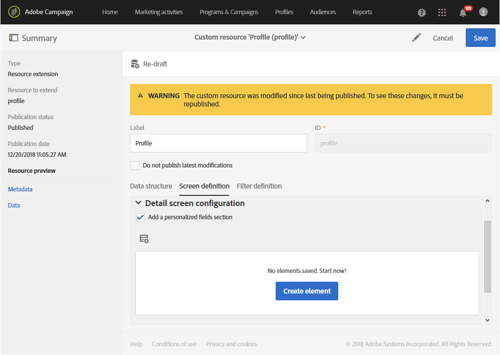

1. Select a **[!UICONTROL Type]**. Here we want to add an input field. Then, select your previously created field and click **[!UICONTROL Add]**.

   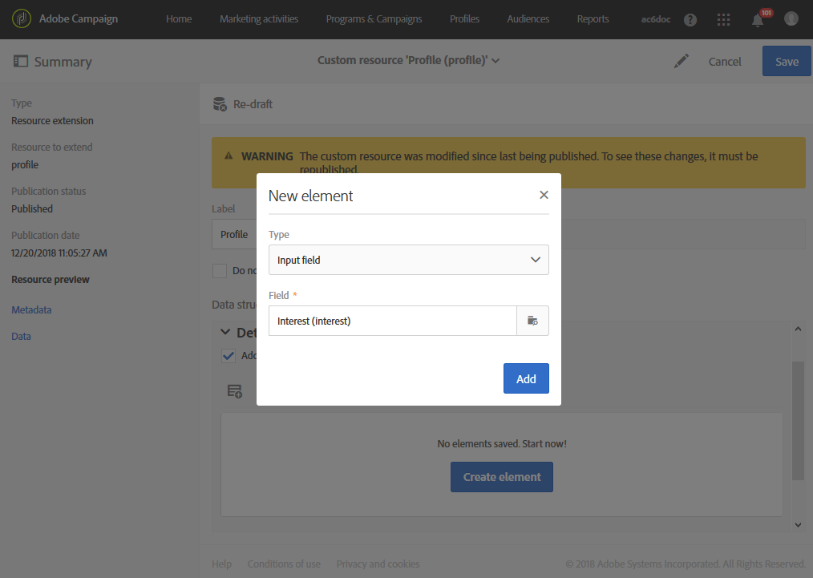

1. To add a separator to better organize your profile window, click **[!UICONTROL Create an element]** and select **[!UICONTROL Separator]** from the **[!UICONTROL Type]** drop-down.

   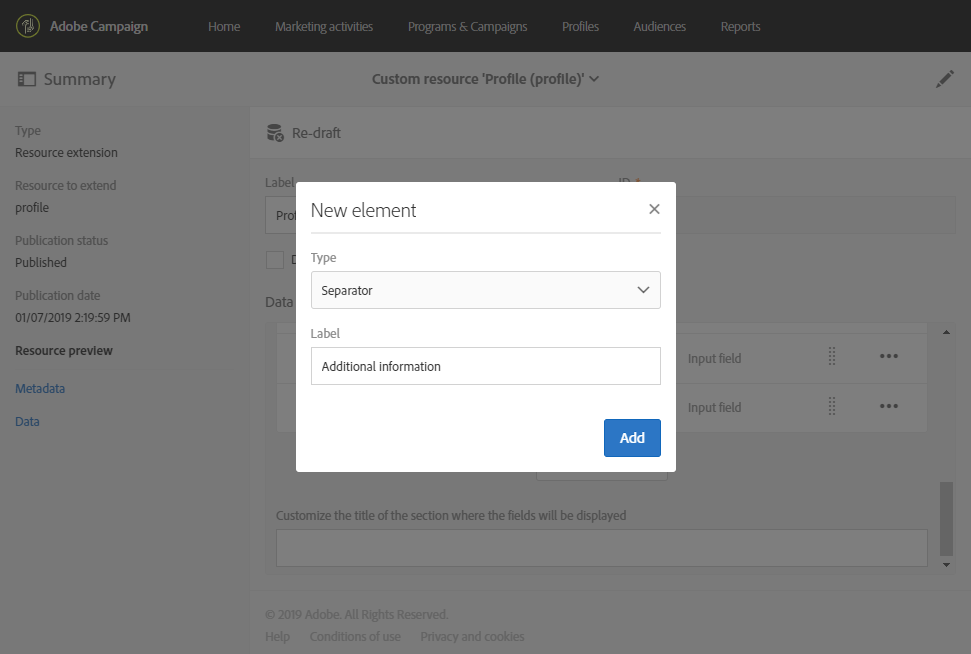

Your field is now configured. We now need to extend it to the test profile.

>[!NOTE]
>
>If you don't need to extend the test profile resource, you can jump to the Publishing step.

## Step 2: Extend the test profile {#step-2--extend-the-test-profile}

To test if the new created field is correctly configured, you can test it by sending your delivery to your test profiles. First, the new field also needs to be carried out to the test profiles.

1. From the advanced menu, via the Adobe Campaign logo, select **[!UICONTROL Administration]** > **[!UICONTROL Development]**, then **[!UICONTROL Custom resources]**.
1. If you have not extended the **[!UICONTROL Profiles]** resource yet, click **[!UICONTROL Create]**.
1. Choose the **[!UICONTROL Extend an existing resource]** option.
1. Select the **[!UICONTROL Test profile (seedMember)]** resource.
1. Click **[!UICONTROL Create]**.

   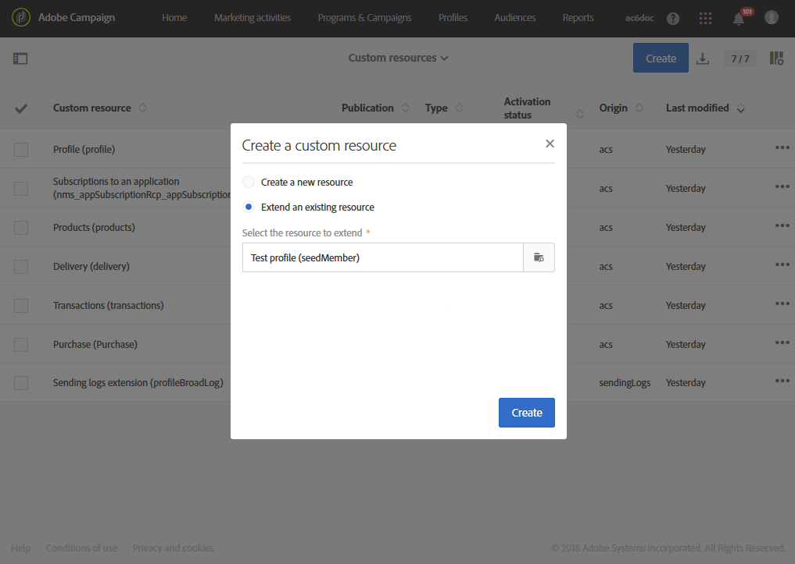

1. In the **[!UICONTROL Data structure]** tab, click **[!UICONTROL Create element]**.

   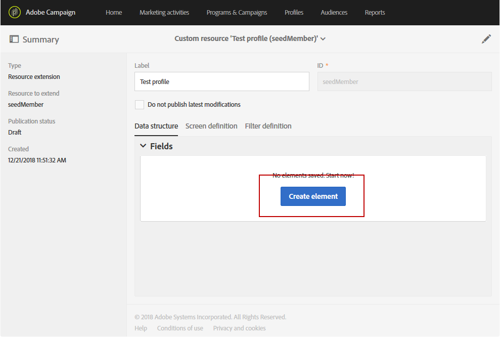

1. Select your previously created resource field and click **[!UICONTROL Add]**.

   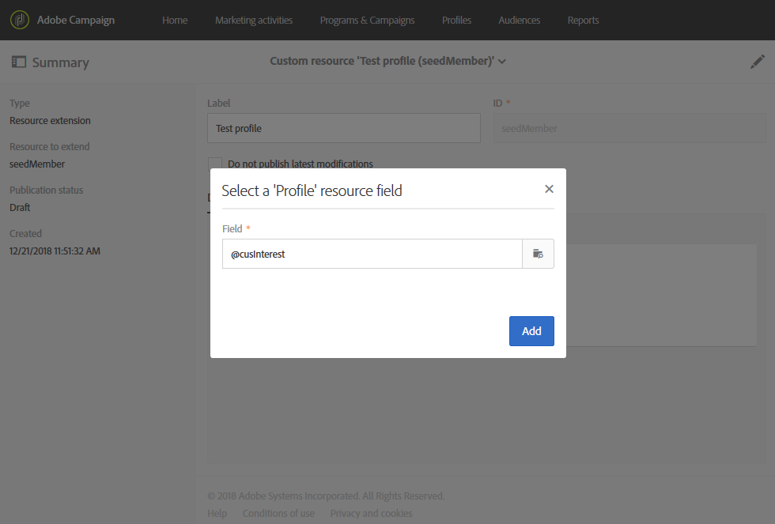

1. Carry out the same steps from step 11 to 13 as the extend profile walkthrough above to add this field in the **[!UICONTROL Test profile]** screen.
1. Click **[!UICONTROL Save]**.

Both profiles and test profiles will now have your new field available. For it to be correctly configured, you need to publish your custom resource.

## Step 3: Publish your custom resource {#step-3--publish-your-custom-resource}

To apply the changes carried out on the resources and be able to use it, you must perform a database update.

1. From the advanced menu, select **Administration** > **Development**, then **Publishing**.
1. By default, the option **[!UICONTROL Determine modifications since the last publication]** is checked, which means that only the changes carried out since the last update will be applied.

   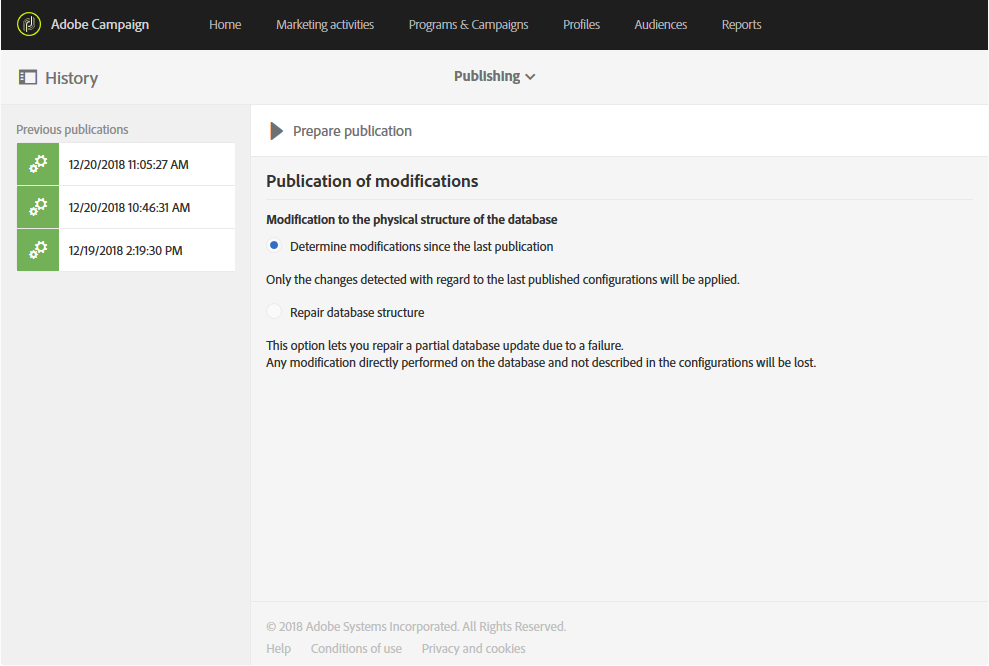

1. Click **[!UICONTROL Prepare publication]** to start the analysis which will update your database.
1. Once the publication has been carried out, click the **Publish** button to apply your new configurations.

   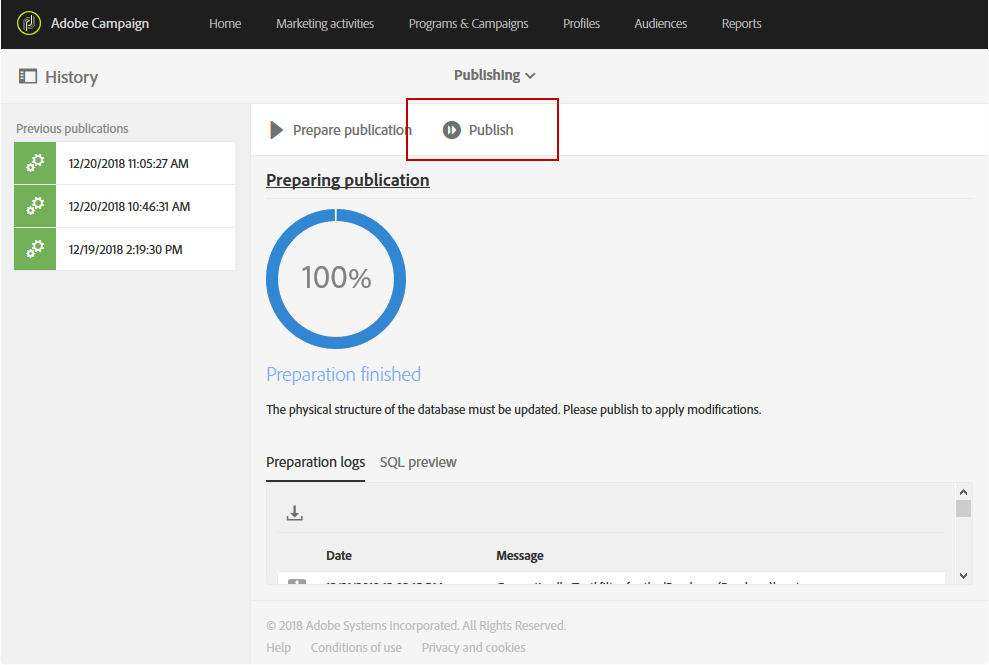

1. Once published, the **Summary** pane of each resource indicates that the status is now **Published** and specifies the date of the last publication.

   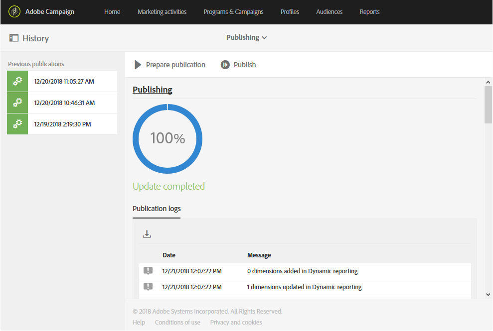

1. Select the **[!UICONTROL Profiles]** tab and click **[!UICONTROL New]** to see if your changes have been correctly implemented.

   

Your new resource field is now ready to be used and targeted in a delivery for example.

## Step 4: Update and target profiles with a workflow {#step-4--update-and-target-profiles-with-a-workflow}

To update profiles with data for the new custom field, you can create a landing page using the **[!UICONTROL Profile acquisition]** template. For more information on landing pages, refer to this [page](../../channels/using/getting-started-with-landing-pages.md).

Here, we want to target in a workflow profiles that didn't fill this field. They will receive an email asking them to update their profiles to receive personalized newsletters and offers. Each profile will then receive a personalized newsletter depending on their chosen interests.

First, we need to create a landing page that will update the **Interest** fields of the targeted profiles:

1. From the **[!UICONTROL Marketing activities]**, click **[!UICONTROL Create]** then select **[!UICONTROL Landing page]**.
1. Select a landing page type. Here, since we want to update our profiles, select **[!UICONTROL Profile acquisition]**.
1. Click **[!UICONTROL Create]**.
1. Click the **[!UICONTROL Content]** block to start editing the content of your landing page.

   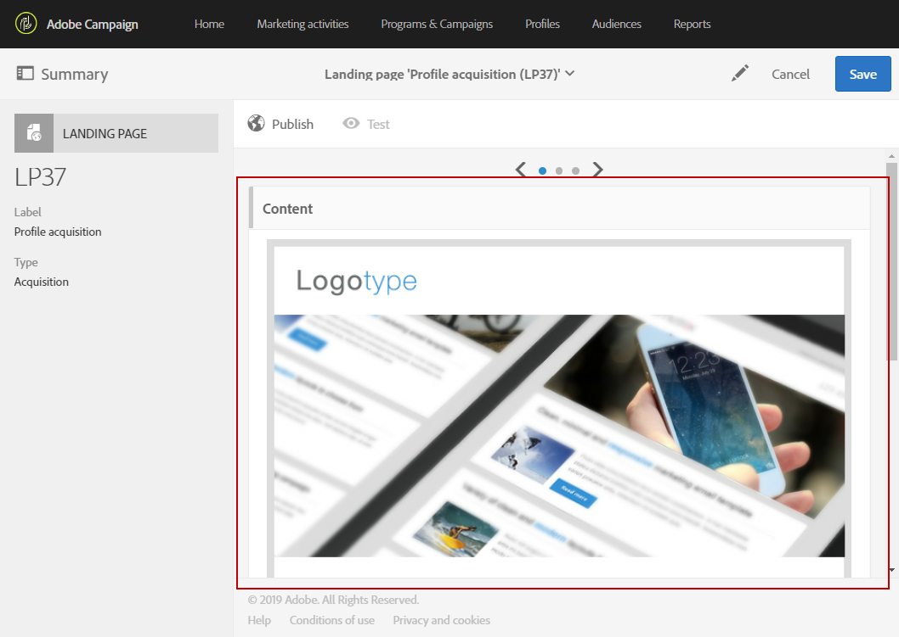

1. Customize your landing page as needed.
1. Click the field configured for your profiles to choose between the selection of Interests. In the left pane, select your previously created **Interest** custom resource.

   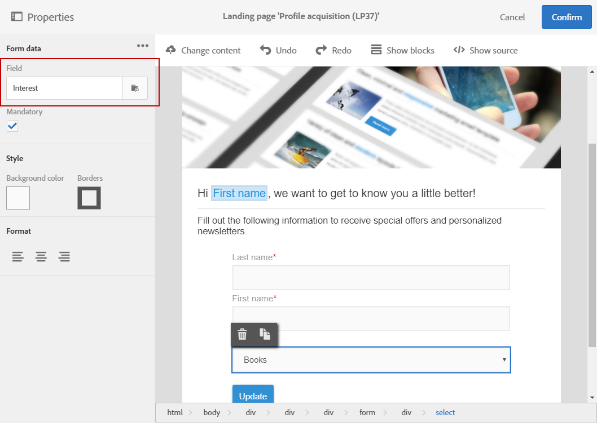

1. Save your landing page and test it to check that your fields are correctly configured.
1. Click **[!UICONTROL Publish]** when your landing page is ready.

Your landing page is now ready. To update the profiles, you can create a workflow that will then send a special offer depending on the chosen Interest.

1. From the **[!UICONTROL Marketing activities]** tab, click **[!UICONTROL Create]** then select **[!UICONTROL Workflow]**.
1. Drag and drop a **[!UICONTROL Query]** activity to target the profiles or audiences you need.
1. Drag and drop an **[!UICONTROL Email delivery]** activity to start configuring your email which will contain a link to the landing page. Select the **[!UICONTROL Add an outbound transition with the population]**.

   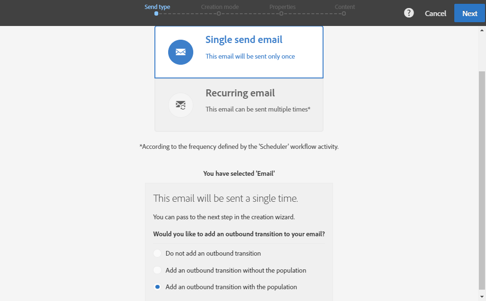

1. Create and design your email as needed. For more information on email personalization, refer to this [page](../../designing/using/quick-start.md).
1. Add a button to your email that will redirect profiles to your landing page.
1. Select the added button and click  in the **[!UICONTROL Link]** section in the left pane.

   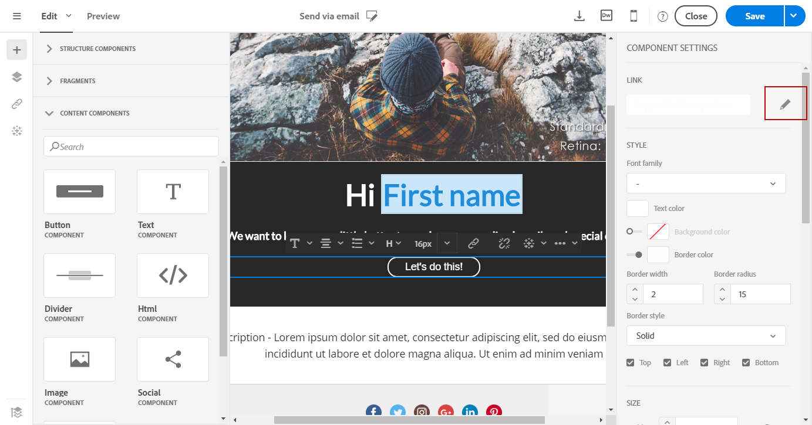

1. In the **[!UICONTROL Insert link]** window, select **[!UICONTROL Landing page]** from the **[!UICONTROL Link type]** drop-down then select the previously created landing page.

   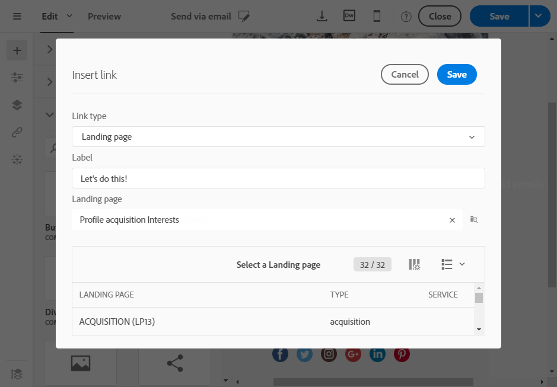

1. Click **[!UICONTROL Save]**. Your email is now ready, you can come back to your workflow.
1. Add a **[!UICONTROL Wait]** activity to let some time for your profiles to fill the landing page.
1. Add a **[!UICONTROL Segmentation]** activity to split the outbound transition depending on their **Interests**.
1. Create an outbound segment for each **Interest**.

   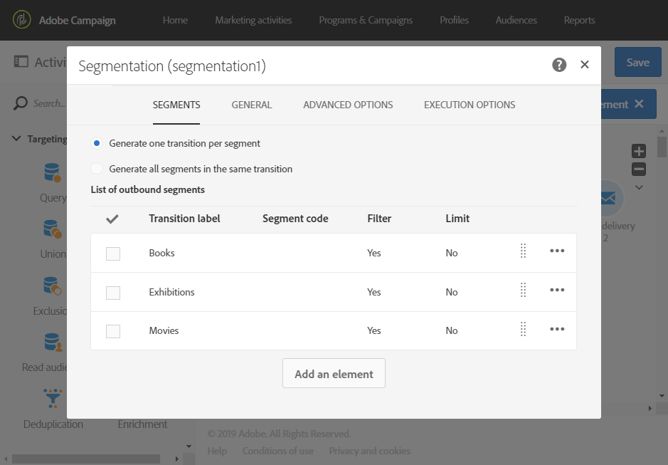

1. Add an **[!UICONTROL Email delivery]** activity after each transition and create a personalized email depending on the chosen **Interest**.
1. Start the workflow when the configuration is done.

   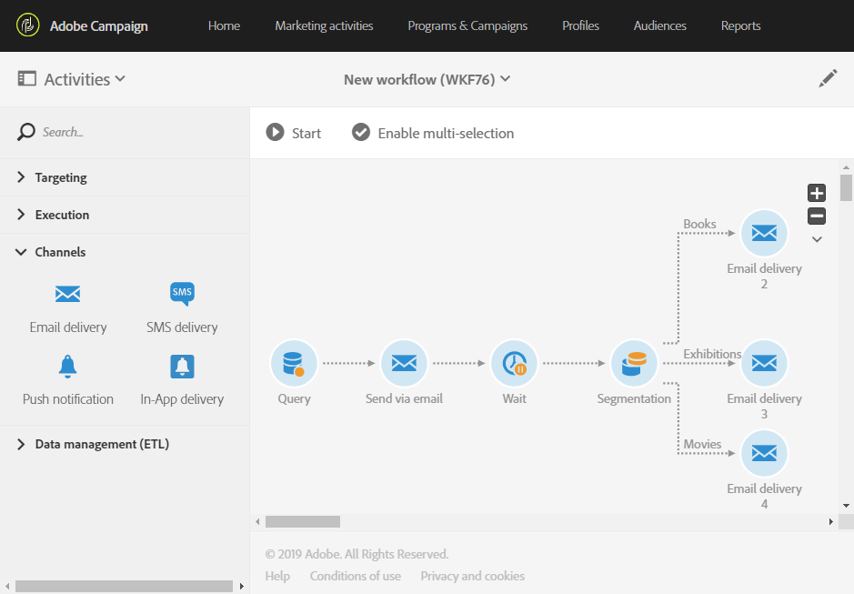

Profiles will now receive the email asking them to fill out this Interest field followed by a personalized email depending on the chosen value.
