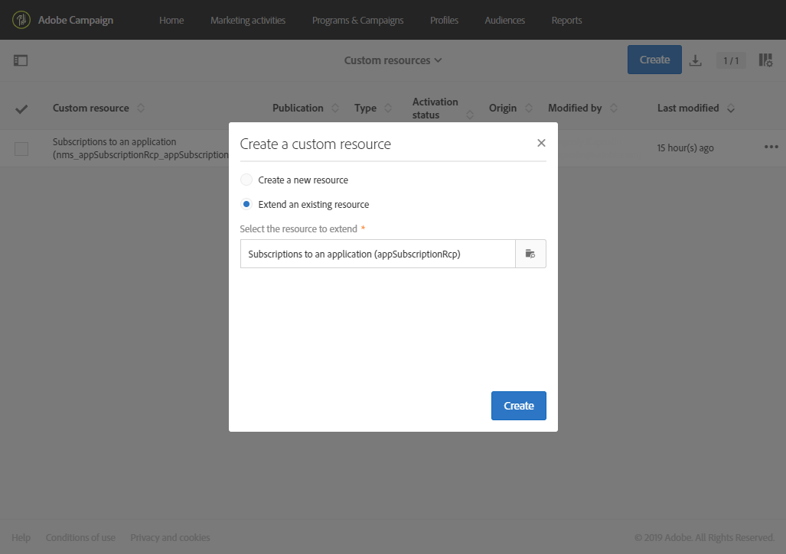
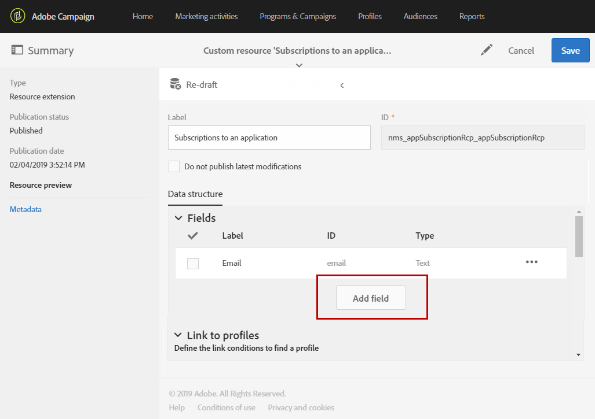

# Extending the subscriptions to an application resource{#extending-the-subscriptions-to-an-application-resource}

In Adobe Campaign, mobile profile attributes data sent from mobile device are stored in **[!UICONTROL Subscriptions to an application (appSubscriptionRcp)]** resource which allows you to define the data that you want to collect from your applications' subscribers. For more information on custom resources, refer to [this page](../../developing/using/key-steps-to-add-a-resource.md).

This resource can be extended to collect data you intend to send from the mobile device to Adobe Campaign.

1. From the advanced menu, via the Adobe Campaign logo, select **[!UICONTROL Administration]** > **[!UICONTROL Development]**, then **[!UICONTROL Custom resources]**.
1. Click **[!UICONTROL Create]** and choose the **[!UICONTROL Extend an existing resource]** option.
1. Select the **[!UICONTROL Subscriptions to an application (appSubscriptionRcp)]** resource and click **[!UICONTROL Create]**.

   

1. In the **[!UICONTROL Fields]** category of the **[!UICONTROL Data structure]** tab, define the customer data that you want to retrieve from your mobile application by clicking the **[!UICONTROL Add field]** button.

   >[!NOTE]
   >
   >If you are managing several mobile applications, all fields used by all of your applications must be listed. The iOS or Android collect PII call defines which fields are captured by each application.

   

1. Add a **[!UICONTROL Label]** and an **[!UICONTROL ID]** to your new field. Select your field's **[!UICONTROL Type]**.

   

1. In the **[!UICONTROL Link to profiles]** category, configure the reconciliation key used to link the profiles from the Adobe Campaign database to your applications' subscribers, such as the email.

   Note that for your In-App messages you can only define one reconciliation key for all of your mobile applications.

   

1. **[!UICONTROL Save]** and publish your custom resource. For more information on custom resource publication, refer to this [page](../../developing/using/updating-the-database-structure.md#publishing-a-custom-resource).

