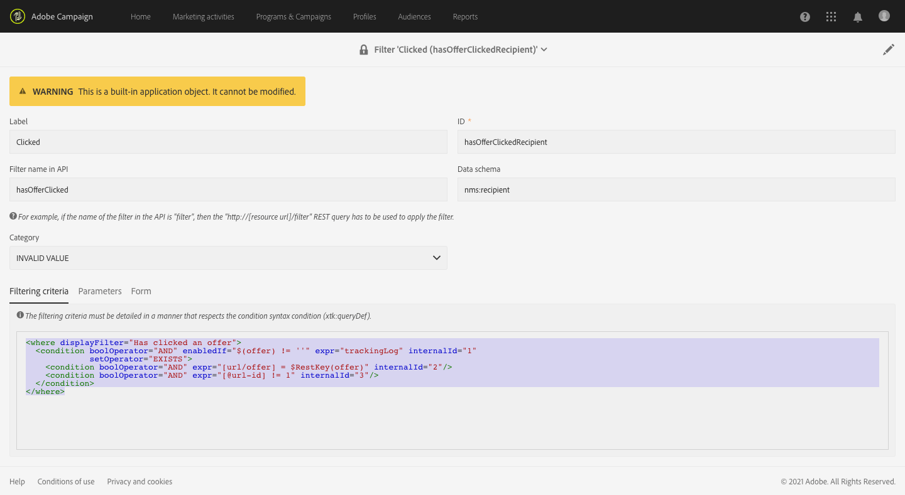

# Monitoring data model changes{#monitoring-data-model-changes}

From the **[!UICONTROL Diagnosis]** menu, you can view the technical objects generated by the application, in order to analyze them.

>[!NOTE]
>
>The screens in this menu are read-only.


You can view the following types of objects:

* Data schemas
* Web pages
* Filters
* Navigation
* Components
* Batch jobs

You can change the list configuration:

* You can add and remove columns.
* You can define column names.
* You can define the display order of columns in the list.
* You can choose the sort order of values in the list.

You can filter the list:

* You can include or exclude native data schemas, web pages, filters, and navigation objects.
* You can search objects by their name.
* You can filter batch jobs on their status, their start date, and their end date.

You can download the displayed list in a file in TXT format with comma-separated values.

You can view the details of the selected object.

For example, you can use this feature to view the filtering criteria of out-of-the-box filters. This example shows the code that is displayed for the filtering criteria of an out-of-the-box filter:

```xml
<where displayFilter="Has clicked an offer">
  <condition boolOperator="AND" enabledIf="$(offer) != ''" expr="trackingLog" internalId="1" setOperator="EXISTS">
    <condition boolOperator="AND" expr="[url/offer] = $RestKey(offer)" internalId="2"/>
    <condition boolOperator="AND" expr="[@url-id] != 1" internalId="3"/>
  </condition>
</where>
```

