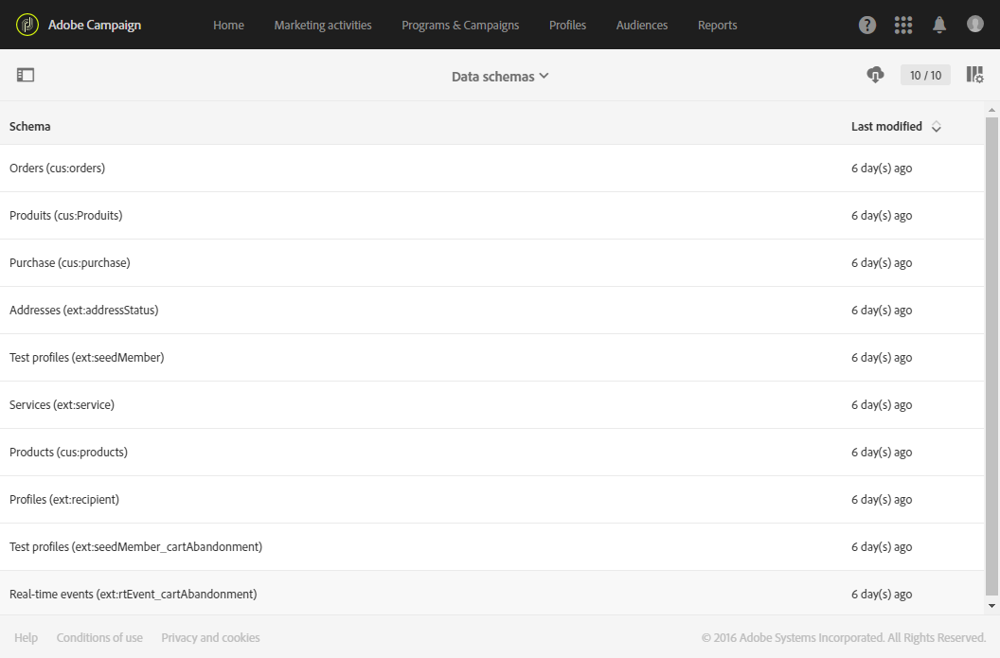

# Monitoring data model changes{#monitoring-data-model-changes}

Monitoring data model changes

The **[!UICONTROL Diagnosis]** menu allows you to consult the different technical objects generated by the application, in order to analyze them.

>[!NOTE]
>
>The screens in this menu are read-only.

You can view the following types of objects:

* Data schemas
* Web pages
* Filters
* Navigation
* Batch jobs

