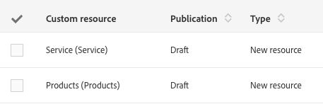

# Resource statuses{#resource-statuses}

Resources can have different statuses according to their publication or activation status.

There are two columns dedicated to displaying these statuses in the **[!UICONTROL Custom resources]** screen.

**Publication statuses**

* **Draft**: the resource has just been created or re-drafted. To create the database tables as well as the corresponding APIs the resource must be republished. If a resource is being re-drafted, it is automatically rendered inactive following the publication step.
* **Pending re-draft**: the resource was re-drafted. The re-draft process will occur during the next publication. Re-drafting is irreversible. Several warning messages warn the user of this fact both when re-drafting, then when preparing to publish.

  For more on re-drafting, see [Deleting a resource](../../developing/using/deleting-a-resource.md).

  >[!NOTE]
  >
  >The **[!UICONTROL Cancel re-draft]** option is available when the resource that you want to re-draft still contains links through other resources with the "Published" status. This option allows you to revert the "re-draft" process. The custom resources will then go back to their original statuses.

* **Published**: the resource has been published. If the resource is modified after the last modified date, then a message appears asking the user to republish in order to take into account the latest modifications.

The **[!UICONTROL Do not publish latest modifications]** field prevents modifications from being taken into account during future publications.

This field can be configured in the custom resource definition.
