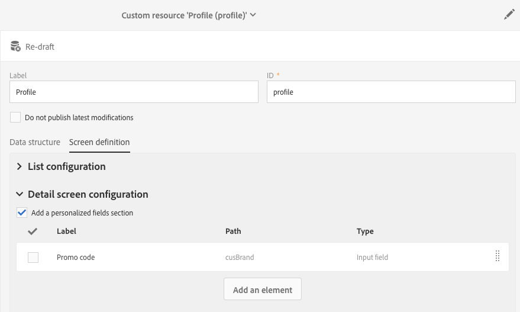

# Step 1: Extend the profile resource

Step 1: Extend the profile resource

1. From the advanced menu, via the Adobe Campaign logo, select **Administration** > **Development**, then **Custom resources**.
1. Click the **Create** icon to create a new custom resource.
1. Choose the **Extend an existing resource** option.
1. Select the **Profile** resource.
1. Click **Create**.
1. Add the **Text** type **Promo code** field with the **Brand** ID in the resource fields.
1. Add this field into the definition of a detail screen (**Screen definition** tab).

   

1. Publish the resource.

