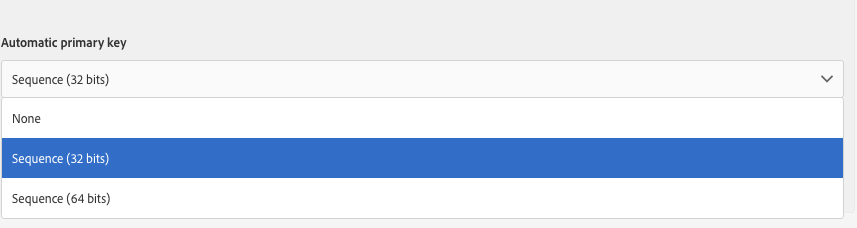

# Step 2: Configure the resource data structure{#step-configure-the-resource-data-structure}

Step 2: Configure the resource data structure

After creating a new custom resource, you must configure the data structure.

When editing the resource, in the **[!UICONTROL Data structure]** tab, you can add:

* Fields
* Identification keys
* Indexes
* Links

## Adding Fields to a Resource {#adding-fields-to-a-resource}

You can add new fields to a resource to store data that are not part of the out of the box data model.

1. Use the **[!UICONTROL Create element]** button to create a field.
1. Specify a label, an ID, a field type, and define the maximum length authorized for this field.

   The **[!UICONTROL ID]** field is mandatory and must be unique for each field added.

   >[!NOTE]
   >
   >If you leave the **[!UICONTROL Label]** field empty, it will automatically be completed from the ID.

   

1. To modify one of the fields, check the corresponding box and use the **[!UICONTROL Show detail of the element selected]** button.

   

1. In the **[!UICONTROL Field definition]** screen, you can define a category that will be used for the audience and targeting, or even add a description.

   Check the **[!UICONTROL Specify a list of authorized values]** option to define the values that will be offered to the user (enumeration values).

   

1. Once you have added your fields, check the **[!UICONTROL Add audit fields]** box to include fields detailing the creation date, the user that created the resource, the date, and the author of the last modification.
1. Check the **[!UICONTROL Add access authorization management fields]** box to include the fields stating who has access rights to that particular resource.

   These fields appear in the data and metadata that can be displayed once the database update has been carried out. For more on this, refer to the [Step 5: Update the database structure](../../developing/using/step-5--update-the-database-structure.md) section.

1. To modify the way in which the name of the resource elements will appear in the lists and creation steps, check the **[!UICONTROL Personalize the resource title]** box. Select a field from those you created for this resource.

   

The fields of your resource are now defined.

## Defining identification keys {#defining-identification-keys}

Each resource must have at least one unique key. For example, you can specify a key so that two products cannot have the same ID in a purchase table.

1. Use the **[!UICONTROL Create element]** button to create a key.

   The **[!UICONTROL Label]** and **[!UICONTROL ID]** fields are completed by default, but you can edit them.

1. To define the elements making up this key, select the fields from those that you created for this resource.

   

   Created keys are displayed in the **[!UICONTROL Personalized keys]** section.

1. If you would like to have a technical key, which will be automatically and incrementally generated, specify it in the **[!UICONTROL Automatic primary key]** section by providing the size for the storage.

   

Your identification keys for the resource are now created.

## Defining indexes {#defining-indexes}

An index can reference one or several resource fields. Indexes allow the database to sort records in order to recover them more easily. They optimize the performances of SQL queries.

Defining indexes is recommended but not mandatory.

1. Use the **[!UICONTROL Create element]** button to create an index.

   The **[!UICONTROL Label]** and **[!UICONTROL ID]** fields are completed by default, but you can edit them.

1. To define the elements making up this index, select the fields from those that you created for this resource.

The indexes that were created appear in the list in the **[!UICONTROL Index]** section.

## Defining links with other resources {#defining-links-with-other-resources}

A link details the association that one table has with other tables.

1. Use the **[!UICONTROL Create element]** button to create a link to a target resource.
1. Resources are shown in alphabetical order and can be filtered by name. Their technical name is displayed in brackets. Select an element from the list and confirm.

   

1. Select the **[!UICONTROL Link type]** according to cardinality. Depending on the cardinality type selected, the behavior if the records are deleted or duplicated may vary.
1. In the **[!UICONTROL New link]** screen, the **[!UICONTROL Label]** and **[!UICONTROL ID]** fields are completed by default, but you can edit them.

   >[!CAUTION]
   >
   >It is not possible to rename a link after creation. To rename a link, you must delete it and create it again.

1. The **[!UICONTROL Category for the audience and targeting]** list allows you to select a category from the query editor tool.
1. The **[!UICONTROL Reverse link definition]** section allows you to display the label and ID of the resource from which you defined the link.
1. Define all of the records referenced by the link in the **[!UICONTROL Behavior in case of deletion/duplication]** section.

   

1. In the **[!UICONTROL Join definition]** section, you can choose to use the primary keys. Otherwise, specify new criteria: select a source field from the fields that you created for this resource and select an expression for the destination field or link a constant value to a field of the linked resource.

   

The links created are displayed in the list in the **[!UICONTROL Links]** section.

**Example: Links to the 'Profiles' resource**

When you have added a link from a new resource to the **Profiles** resource, a new tab is automatically added in the profiles' detail view.

For example, in a new **Products (Products)** custom resource, a link to the profiles is added:

By adding this link, a **Products** tab, named after the **[!UICONTROL Label]** of the new resource, is added to the profiles detail screen. The result is immediately visible after publishing the custom resource from the **[!UICONTROL Profiles & audiences]** > **[!UICONTROL Profiles]** menu. By clicking on a profile, the information from the **[!UICONTROL Products]** custom resource appears in a new tab.

## Defining sending logs extension {#defining-sending-logs-extension}

The sending log extension allows you:

* to extend dynamic report capabilites by **adding profile custom fields**
* to extend the sending logs data with **segment code and profile data**

**Extend with a segment code**

For more information on segment code, refer to the [Segmentation](../../automating/using/segmentation.md) section.

The user can extend the logs with the segment code coming from the workflow engine.

The segment code must be defined into the workflow.

To activate this extension, check the option **[!UICONTROL Add segment code]** .

**Extend with a profile field**

>[!NOTE]
>
>The administrator should have extended the Profile resource with a custom field.

Click **[!UICONTROL Add field]** and select any custom field from the profile resource.

In order to generate a new sub-dimension linked to the Profile dimension, check the **[!UICONTROL Add this field in Dynamic reporting as a new dimension]** option.

From Dynamic Reporting, you can drag and drop the custom field dimension into a freeform table.

For more information on Dynamic Reporting, refer to the [List of components](../../reporting/using/list-of-components-.md).

>[!CAUTION]
>
>The number of fields sent to Dynamic Reporting is limited to 20.

