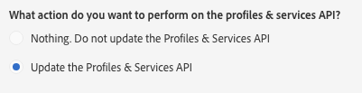

# Step 2: Publish the extension{#step-publish-the-extension}

Step 2: Publish the extension

1. From the advanced menu, via the Adobe Campaign logo, select **Administration** > **Development**, then **Publication**.
1. Click on the **Prepare Publication** button.
1. Select the **Update the Profiles & Services API** option.

   

   >[!CAUTION]
   >
   >The API definition needs to be updated to match changes in the data model. Before publishing, make sure that the changes will not cause any errors with the integration. Otherwise, update the client code before updating the API.

1. Click the **Profiles & Services API Preview** tab.

   This will show you the changes that the publication of the API will apply to the current version of the profilesAndServicesExt API.

   Here, the Promo Code field (ID: cusBrand) will be inserted into the API.

   

1. Click the **Publish** button.

