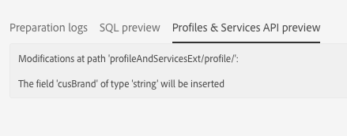

# Step 2: Publish the extension{#step-publish-the-extension}

1. From the advanced menu, via the Adobe Campaign logo, select **[!UICONTROL Administration]** > **[!UICONTROL Development]**, then **[!UICONTROL Publication]**.
1. Click the **[!UICONTROL Prepare Publication]** button.
1. Select the **[!UICONTROL Create the Profiles & Services Ext API]** option.

   

   >[!NOTE]
   >
   >If the API has already been published (meaning if you have already checked this option once, for this resource or another resource), the API update is forced.

1. Click the **[!UICONTROL Profiles & Services API Preview]** tab.

   This will show you the changes that the publication of the API will apply to the current version of the profilesAndServicesExt API.

   Here, the Promo Code field (ID: cusBrand) will be inserted into the API.

   

1. Click the **[!UICONTROL Publish]** button.
