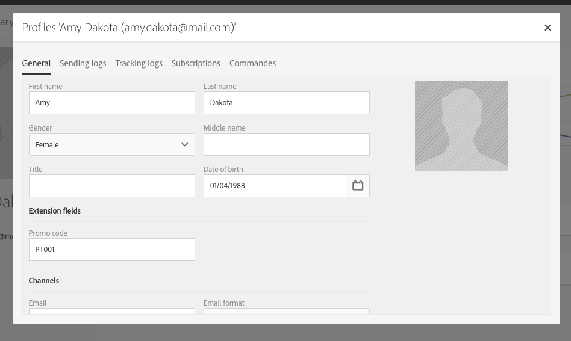
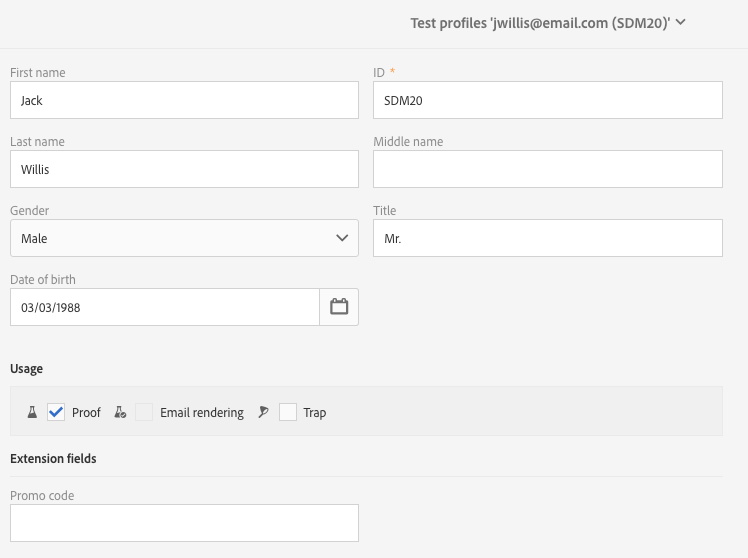

# Step 3: Update profiles and prepare an email{#step-update-profiles-and-prepare-an-email}

Step 3: Update profiles and prepare an email

1. From the advanced menu, via the Adobe Campaign logo, select **Profiles & audiences > Profiles**.
1. Complete or create profiles, then complete the new **Promo code** field.

   

1. Select **Profiles & Audiences > Test profiles** in the navigation pane.
1. Complete or create a new test profile, then complete the new **Promo code** field.

   

1. Create a **new email** in a marketing campaign.
1. Create an **Audience** from a **simple rule**: **Promo code is not empty**. This rule is valid for the main target as well as for the test profiles.
1. Insert the **Promo code** field into the email content. 
1. Send the email to the test profiles selected by the audience.
1. Send the email to the profiles selected by the audience.

The values of the **Promo code** personalized field are contextualized by profile type when the email is sent.
