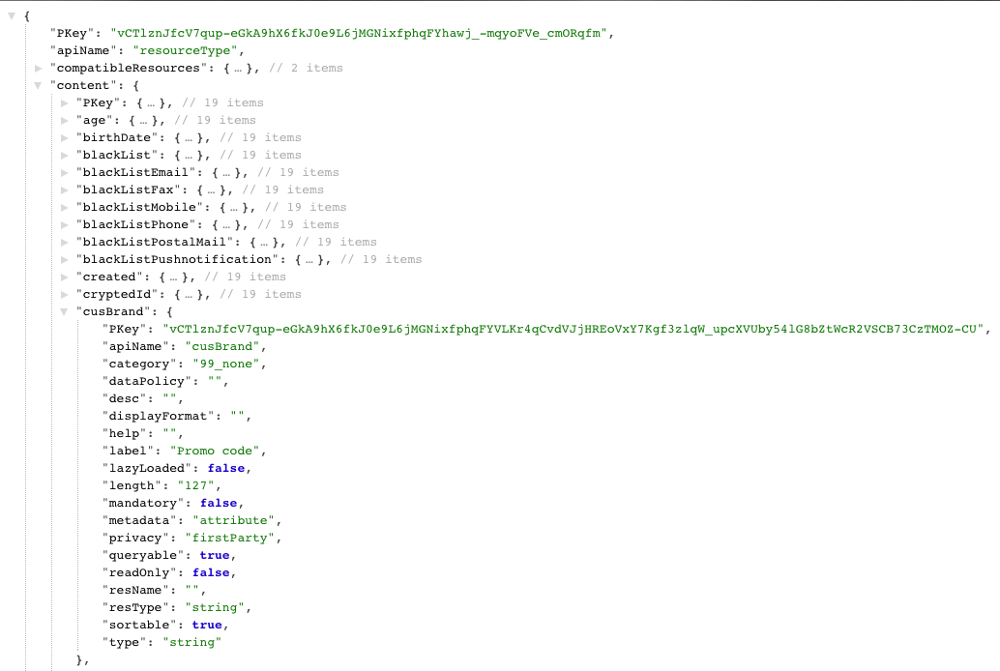

# Step 3: Verify the extension{#step-verify-the-extension}

1. Make a GET operation on the metadata of the Profiles & Services Extension API to check if the field added in the Profiles custom resource is now available.

   ```
   GET profileAndServicesExt/resourceType/profile
   ```

1. It returns:

   

   The field is now available for further developments and integrations.
